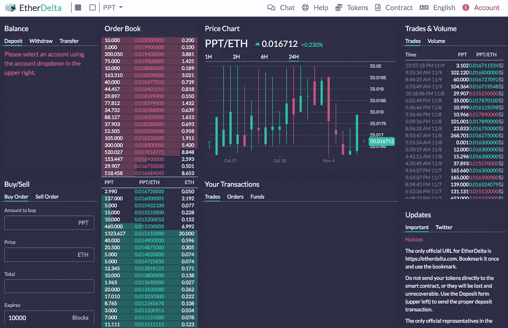

# 证券交易委员会反对权力下放:第一轮

> 原文：<https://medium.com/hackernoon/the-sec-fights-decentralization-round-1-369f9acd0372>

这是注定要发生的。

今年 3 月初，美国证券交易委员会(SEC)首先对 ICOs(ICOs)进行了调查，ICOs 在没有注册或寻求注册豁免的情况下向投资者发行了公用事业代币(如经常提到的《就业法案》豁免:监管众筹、监管 A、监管 D506(c))。对于那些熟悉证券法的人来说，这种结果是意料之中的。下一个问题是，美国证券交易委员会何时会对交易所有这些代币的交易所采取行动。

大约在今年 3 月的同一时间，美国证券交易委员会宣布，现有的数字资产交易所和在线交易平台是“[潜在非法的](https://www.sec.gov/news/public-statement/enforcement-tm-statement-potentially-unlawful-online-platforms-trading)公开声明继续说，

许多这样的平台提供了一种交易资产的机制，这种机制符合联邦证券法中“证券”的定义。如果一个平台提供作为证券的数字资产的交易，并按照联邦证券法的定义作为“交易所”运营，那么该平台必须在 SEC 注册为国家证券交易所，否则可以免于注册。”

证交会实质上表示，这些交易所中有许多违反了联邦法律，它们是欺诈性企业。他们没有指名道姓，但事实就在墙上。美国证券交易委员会的授权很明确:如果交易所想要交易 ERC-20 公用令牌，它们需要注册或寻求豁免。

为什么？事实证明，这些出售给投资者的公用事业代币在大多数情况下是有价证券。当 ERC-20 代币除了能够交易获利(或亏损)之外，没有任何其他用途时，很难证明它们是实用工具。投资者购买这些代币作为投机投资。这种行为是安全的典型标志。[豪威试验](https://www.investopedia.com/terms/h/howey-test.asp)通常被作为这种分类的法律先例。

对于加密交易所来说，这是一个问题，因为交易证券需要在替代交易系统(ATS，美国只有大约 50 家)或交易所注册(只有大约 20 家)进行经纪交易商注册。

**输入以太增量**

A screenshot of EtherDelta’s web portal, still active, though its trade volume has been dropping

这个分散式交易所是美国第一个因经营未注册交易所而受到制裁的交易所。这是一件大事，原因有二:

*   这是第一家因在没有经纪自营商或交易所注册的情况下交易证券而受到 SEC 制裁的“交易所”。
*   EtherDelta 是第一个在 SEC 和解中命名的分散式应用

在 SEC 的声明中，他们指出“在 18 个月的时间里，EtherDelta 的用户执行了超过 360 万笔 ERC20 令牌订单，其中包括根据联邦证券法属于证券的令牌。几乎所有通过 EtherDelta 平台下的订单都是在委员会发布 2017 年 DAO 报告后交易的，该报告得出结论认为，某些数字资产，如 DAO 令牌，是证券，提供这些数字资产证券交易的平台将受到 SEC 的要求，即交易所根据豁免进行注册或运营。”

EtherDelta 的创始人扎卡里·科伯恩同意支付罚款，但没有承认或否认指控。这对他来说其实是一个积极的发展。据美国证券交易委员会称，科伯恩已经合作，他得到了一记耳光的奖励。

诚然，科本不得不支付的 40 万美元可能是一大笔钱。然而，这总比完全被禁止销售证券或在金融行业工作要好。这是一个如何最好地与 SEC 合作的案例。有人告诉埃隆·马斯克。

证券交易委员会和权力下放之间的第二轮斗争不会很精彩。根据纽约总检察长办公室的说法，13 家接受调查的“交易所”没有遵守任何证券交易规则。

除非美国证券交易委员会出面，否则除了比特币、其衍生品和以太之外的任何东西都可能是证券。因此，如果这些“交易所”交易的硬币超过特定的一小撮，它们就违反了联邦法规。证交会的下一份公告将是严厉的。这 13 家交易所中的一家将被命名，这些交易所的运营规模比 EtherDelta 大得多。无论谁进入 SEC 的视线，都将被处以巨额罚款。首席执行官和执行官将承担个人责任。

不幸的是，有传言称，数十家公司正在竞争成为经纪自营商和 ATS，但这些公司被漫长的注册过程所阻止。这是 SEC 发出的信号，表明遵守规则非常重要。他们在这里小心翼翼，但如果我们开始看到这些新平台真正交易安全令牌，那就太好了。

StartEngine 是一个领先的股权众筹平台，已经帮助 250 多家公司筹集了超过 8000 万美元。我们目前也在筹集资金。加入已经投资我们的近 3500 名 StartEngine 所有者。 [*这里投资 start engine*](https://www.startengine.com/own?utm_source=Medium)*。*

*欲了解更多信息，请查看我们的* [*发行通告*](https://www.sec.gov/Archives/edgar/data/1661779/000114420419013344/tv515967_253g2.htm) *。*