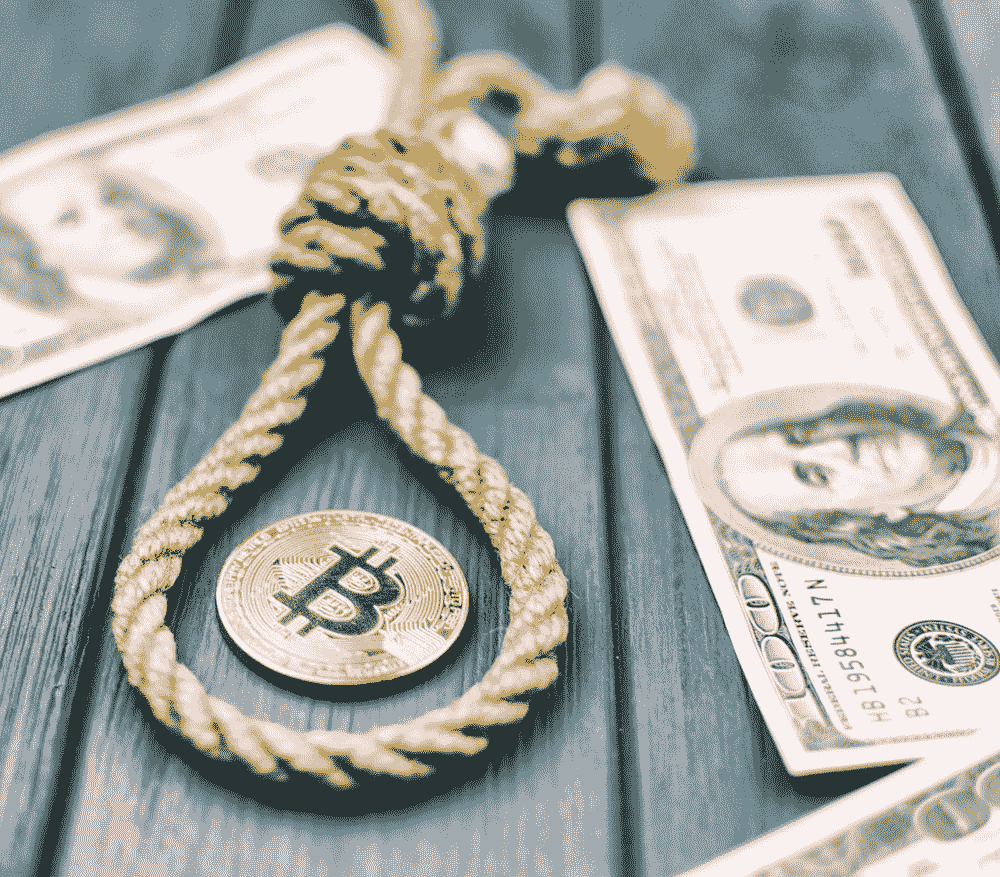

# 美国证券交易委员会扼杀加密交易

> 原文：<https://medium.com/hackernoon/the-sec-kills-crypto-exchanges-3dc9e3e87651>

这只是时间问题。当美国证券交易委员会(SEC)追查已倒闭的“交易所”比特币基金时，显然已经有迹象表明这种情况将会发生。今天，美国证券交易委员会发布了迄今为止最大的公告:所有的加密交换都是非法的，除非他们在美国证券交易委员会注册。为什么这很重要？原来，整个价值 4000 亿美元的加密货币生态系统是基于交易替代硬币或公用代币。

## 代用币简史

比特币在 2009 年发布后，唯一的交易方式是在咖啡店见一个朋友，打开笔记本电脑，从钱包里拿出现金。这种交易是有效的，但显然缓慢且不方便。其他人也有同感，企业家们意识到需要一个更好的解决方案。

交易比特币最著名的地方之一是 Mt. Gox，它最初被命名为 Magic The Gathering Online Exchange，用于交易稀有扑克牌。这种交易所演变成专门交易比特币。它由杰德·麦卡勒创建，然后卖给了马克·卡佩斯，后者将交易所搬到了日本。Mt Gox 于 2014 年 2 月在[遭到黑客攻击](https://www.wired.com/2014/03/bitcoin-exchange/)，数千名投资者损失了 4 . 6 亿美元。

2017 年 9 月，日本决定[规范交易所](https://www.cnbc.com/2017/09/29/bitcoin-exchanges-officially-recognized-by-japan.html)，并清理了 11 家公司作为加密交易所的注册运营商。中国做出了不同的决定，命令所有国内交易所在同一个月的 15 号关闭。

在美国，最大的交易所是比特币基地旗下的 Gdax。最近，比特币基地因向一群投资者泄露他们将允许在比特币基地购买比特币现金的公告而遭到集体诉讼。Gdax 做出了真正的努力，通过发布一份关于他们如何选择在 Gdax 上交易的替代硬币的白皮书[来表明他们遵守了一套自制的规则。](https://www.gdax.com/static/digital-asset-framework-2017-11.pdf)

这一努力当时没有遭到监管机构的抵制。然而，这表明了这些所谓的交易所对监管者的蔑视，它们创建了自己的一套弱化规则。接下来是比特币现金内幕工作。自我监管不起作用，因为没有现实生活中的后果，如刑事处罚。

## 那么，这些“交易所”的下一步是什么？

显然，大多数位于美国或在其他国家运营的交易所在允许美国人使用他们的服务时会忽略该通知。公司在通过首次发行硬币出售公用事业代币时忽视了 SEC，现在可能后悔了。

全能的 SEC 无法通过发布公告来影响未注册交易所的运营商。最近，SEC [向大量发行公用事业代币的公司、帮助出售代币的推广者和帮助构建代币的专业人士发出了 80 多张传票。这对于交易所来说会是一样的吗？如果历史有任何教训，答案是响亮的是。](http://fortune.com/2018/03/01/sec-ico-cryptocurrency-subpoenas/)

## ICO 2.0 和 ATS

美国证券交易委员会(SEC)已经明确告诉那些希望向投资者提供交易服务的公司，将他们的交易系统注册为交易所，或者使用替代交易系统(ATS)等豁免。许多行业领导者已经谈论这个问题有一段时间了，现在像 [StartEngine 的 ICO 2.0 春季峰会](https://goo.gl/DvjuFi)这样的会议致力于通过监管和安全令牌的流动性途径来讨论加密市场。然而，[注册一个交易所](https://www.sec.gov/fast-answers/divisionsmarketregmrexchangesshtml.html)可能需要很多年，坦率地说，整个国家只有 20 多家。另一方面，通过将公司注册为经纪交易商，然后向 SEC 申请 ATS，可以在短时间内建立 ATS。

这显然是交易的未来。今天，经营 ATS 的 tZERO(start engine 客户)宣布，他们通过 ICO 筹集了超过 1 亿美元的资金。其他人也宣布他们正在研究一种交易密码的自动交易系统；然而，今天没有人活着。这种差距是严重的，因为如果 SEC 关闭大多数美国交易所，投资者将没有地方交易他们的硬币。正如 CFTC 所宣称的那样，比特币等一些硬币可能不被视为证券，而是一种商品。这可能允许投资者继续交易比特币，但在 2.0 交易市场推出之前，绝大多数硬币不会有这种好处。