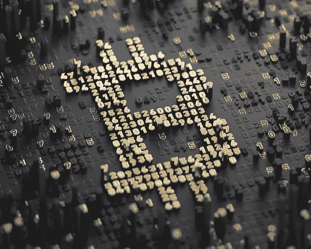

# 美国证券交易委员会成立了一个金融科技办公室，负责审查 ico，高盛向加密托管提供商 BitGo 投资了数百万美元

> 原文：<https://medium.com/hackernoon/the-sec-launches-a-fintech-office-tasked-with-vetting-icos-and-goldman-sachs-invests-millions-into-161a4108e444>

**市场状况—2018 年 10 月 19 日** [**【BTC】**](https://berminal.com/coins/Bitcoin-BTC)**:6452.84 美元(-1.31%)** [**ETH**](https://berminal.com/coins/Ethereum-ETH)**:203.68 美元(-0.83%)** [**【USDT**](https://berminal.com/coins/Tether-USDT)**:0.983 美元(+0.85%)【参考答案】**

昨天，比特币出现熊市，跌破 6500 美元，以太坊全天交易价格低于 200 美元。泰瑟(USDT)仍处于恢复过程中，今天早些时候交易时段稳定在 0.9991 美元。USDT 和美元加密货币交易所之间的套利活动仍在继续，但随着交易所更接近重新调整资产定价，BTC 和瑞士联邦交易所之间的价格差异正在缩小。

其他消息，高盛和迈克·诺沃格拉茨的银河数码投资了加密托管公司 BitGo。就在几天前，富达宣布推出面向机构投资者的[数字资产服务](https://berminal.com/news/99957/Fidelity-Launches-Digital-Asset-Service-for-Institutional-Investors)，要求提供加密货币托管解决方案。恰好 Novogratz 的 [Galaxy Digital 也是富达托管解决方案](https://berminal.com/news/101219/Mike-Novogratz-Galaxy-Digital-is-Fidelitys-First-Custodian-Client)的第一个官方客户。自 10 月初以来，超过 6 亿美元的 USDT 被回收，泰瑟(USDT)继续制造新闻。分析师和交易员已经注意到了 Tether 的暴跌，本周早些时候，stablecoins 跌至 0.85 美元，推动了 Bitfinex 上相当可观的比特币热潮。

**1)美国证券交易委员会已经向加密技术迈出了又一步，但它还没有为该行业引入监管框架。**华尔街监管机构推出了一个名为 FinHub 的金融科技中心，这将简化区块链初创公司与监管机构沟通的流程。参与者可以使用 FinHub 向监管机构提问或安排会议。区块链初创公司和监管机构预计将探索 DLT 等领域以及市场的监管方面。据《福布斯》报道，新的门户网站可能会产生更多符合监管要求的平台。这个新中心将由 SEC 的 Valerie A. Szczepanik 领导，并不仅限于区块链公司，还将支持人工智能等领域的其他金融科技相关创业公司。([阅读更多](https://berminal.com/news/101835/US-SEC-Unveils-a-Fintech-Hub-to-Communicate-with-Blockchain-Startups))

**2)今天，BitGo 宣布他们“很自豪有高盛和银河数码站在我们这边。”**亿万富翁投资者、银河数码创始人迈克·诺沃格拉茨在推特上回应道“更多的制度架构”。#theherdiscoming“今天，BitGo 还发布了一份新闻稿，宣布其 B 轮融资阶段结束。加密货币托管人筹集了 5850 万美元，这笔资金将用于进一步发展公司。BitGo 获得了向希望涉足加密货币的机构投资者提供存储和托管解决方案的许可，BitGo 首席执行官 Mike Belshe 表示，“没有人比 BitGo 更适合为希望交易加密货币和数字资产的机构投资者服务。这就是为什么我们专注于弄清楚如何确保 1 万亿美元的安全。”([阅读更多](https://berminal.com/news/101708/Goldman-Sachs-and-Mike-Novogratz-Galaxy-Digital-are-Investing-in-Crypto-Custodian-BitGo))

比特币对冲基金 Gelfman Blueprint，Inc. (GBI)及其首席执行官 Nicholas Gelfman 被纽约州一家联邦法院下令支付 250 多万美元的庞氏骗局费用。 GBI 在 2014 年至 2016 年期间操作了这个庞氏骗局，声称他们创造了一种计算机算法，使投资者能够通过商品基金获得可观的回报。这个计划被证明是一个骗局。GBI 和格尔夫曼从至少 80 名顾客那里募集了 60 多万美元。CFTC 执法局局长 James McDonald 表示，这一案件标志着 CFTC 在努力消除加密货币领域不良行为者方面的又一次胜利。([阅读更多](https://berminal.com/news/102038/Bitcoin-Hedge-Fund-and-CEO-Fined-25-M-for-Operating-a-Ponzi-Scheme))

[***订阅百慕大简讯***](https://visitor.r20.constantcontact.com/d.jsp?llr=myyhdl6ab&p=oi&m=1131022639884&sit=9ar6aztmb&f=776989ec-8460-43a4-b86a-bcf8f2f1bca7)

[***免费下载百慕大 App***](https://berminal.app.link/medium-post)

*[***百慕大官方电报***](https://t.me/berminal)*

*[***伯明纳尔推特***](https://twitter.com/berminalapp)*

**