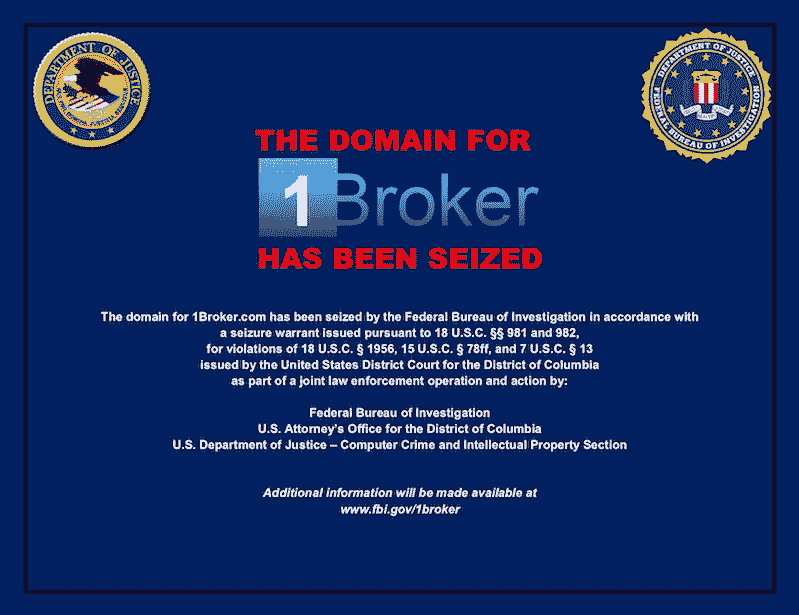
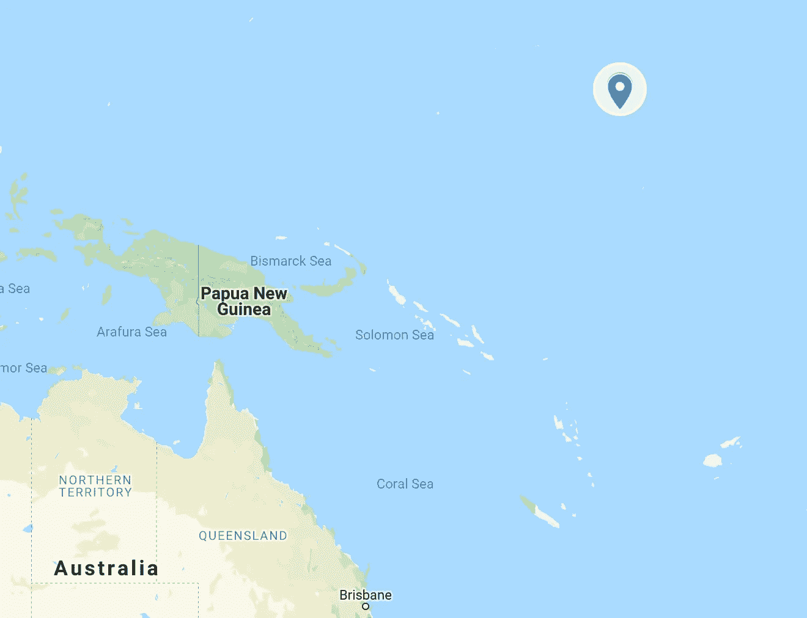

# 美国证券交易委员会在全球范围内强制执行

> 原文：<https://medium.com/hackernoon/the-sec-takes-enforcement-worldwide-931511052c95>

A screenshot of 1Broker.com in its current form

9 月 27 日星期四，美国证券交易委员会发现一家总部位于马绍尔群岛的公司没有遵守美国证券交易委员会和美国财政部为美国投资者制定的规定。有问题的公司是 1Broker，也称为 1Pool。1Broker 是一个在线交易平台，投资者可以在其中使用比特币交易大宗商品、股票和指数中的 fiat forex 对和 CFD。

在 [SEC 的声明](https://www.sec.gov/news/press-release/2018-218)中，他们指控 1Broker“在基于证券的掉期交易方面违反了联邦证券法”, 1Pool 和首席执行官 Patrick Brunner“向美国和世界各地的投资者招揽”在其平台上进行交易。

在深入探讨该平台的问题之前，让我们后退一步:1Broker 并不位于美国。它位于马绍尔群岛共和国，太平洋中的一个小岛群。一点也不靠近美国领土。然而，美国证券交易委员会找到了这家公司，并立即将其分拆。怎么会？

美国证券交易委员会的执法人员找到了获得该公司域名的方法，并要求[联邦调查局查封它](https://www.fbi.gov/investigate/cyber/information-on-1broker-com-seizure)。因此，试图登录自己账户的投资者无法登录，而是看到了上面的图片。

作为对扣押的回应，1 经纪商[宣布，客户的账户是安全的](https://1pool.ltd/)，并将退款。用他们的话说，“2018 年 9 月 28 日，我们的域名 1broker.com 被美国证券交易委员会(SEC)关闭。这意味着无法再访问交易面板——基金、服务器和数据库不受影响。目前，我们的首要任务是允许客户提款。当然，公司有足够的资金来满足所有的提款要求。”

当然了。

没那么快。他们的帖子继续写道，“在我们采取必要措施(允许客户取款)之前，我们必须获得当局的许可。”此时，1Broker 正在接受 SEC 的调查。在 SEC 查明 1Broker 平台的真实情况之前，资金不太可能退还给任何人。也许他们会找到已知的坏演员或洗钱者的账户。也许有毒贩的账户，或者更糟，恐怖分子的账户。

如果你读了他们的 FAQ，很明显公司不知道发生了什么。1Pool 写道，1Broker(记住他们是同一个)“没有对投资者构成威胁，自 2012 年推出以来，我们在交易者中建立了非常好的声誉。”他们指出了他们的服务条款，其中告诉客户检查使用 1Broker 是否违反了他们居住国家的规定，如果是，就不要使用它。

在一年前指责 1Broker 是一个骗局的 Reddit 帖子中，一位名为 brutfce 的用户写道:“他们服务的许多国家也存在合法性问题。他们服务于美国(我是美国居民，能够注册和存款)，我认为根据我的理解，向美国人提供差价合约是非法的。由于经营 1broker 的帕特里克为人所知，这可能会给他和他的公司带来问题。

帕特里克本人在 Reddit 上相当活跃，他通过自己的账户 Patrick-1Broker 回复 brutfce 说:“事实上，在一些国家，比特币计价的合同存在公开的法律问题，根据我们的条款，如果你生活在这样的国家，你是禁止在 1Broker 上交易的。”

辩护是站不住脚的。如果没有强制执行,“禁止”某人做某事毫无意义。在证交会的报告中，他们指控一名联邦调查局特工能够在该平台上成功完成交易。显然，没有人阅读他们的服务条款，1Broker 也没有人强制执行这些条款。

1 经纪商违反了一系列法律，包括未注册为经纪交易商、未验证客户身份(KYC)或防止洗钱(反洗钱或 AML)。这样的例子不胜枚举。

A handy screenshot of Google Maps. There are the Marshall Islands, Northeast of Australia in the Pacific Ocean.

那么，一个美国政府机构是如何关闭马绍尔群岛的一个平台的呢？在那里，他们没有明显的管辖权。事实上，每个国家都有主权，但有些国家比其他国家拥有更多主权。向域名注册商申请禁令可以很好地解决这个问题。

既然美国证券交易委员会已经发现了他们最强大的武器之一，如果一家公司在一个美国投资者的董事会中，那么无论是在开曼群岛、吉尔伯托、马绍尔群岛、巴哈马群岛还是马耳他成立一家公司都毫无意义。只有一个。如果这些公司的网站在没有任何警告的情况下突然关闭，他们的账户和资金被冻结，他们怎么做生意？

美国证交会能够也将会追踪拥有美国客户的公司。其他国家呢？它们也不是翻车。他们有自己的一套投资者保护措施，这就是为什么上述大多数地方都是小岛。其他国家将会采取行动，不管它们是否受到 SEC 的启发。这是必然的。

证交会才刚刚起步，他们并不觉得有趣。他们将防止任何系统性风险，他们将修复这个免费的加密货币市场。他们将强制执行这些规则。

StartEngine 是一个领先的股权众筹平台，已经帮助 250 多家公司筹集了超过 8000 万美元。我们目前也在筹集资金。加入已经投资我们的近 3500 名 StartEngine 所有者。 [*这里投资 start engine*](https://www.startengine.com/own?utm_source=Medium)*。*

*欲了解更多信息，请查看我们的* [*发行通告*](https://www.sec.gov/Archives/edgar/data/1661779/000114420419013344/tv515967_253g2.htm) *。*