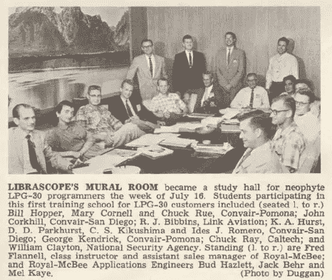

# Real 程序员:1960 年至 1970 年(第 2 页，共 2 页)

> 原文：<https://medium.com/hackernoon/the-second-decade-of-programming-all-about-real-programmers-2556758b5e51>

## 个人编程史第二章的第二部分

在本系列的最后一篇文章中，我写了在编程历史的前二十年里，这个领域的大多数程序员，那些编写在现实生活中使用的程序的人，是如何自学成才的。没有程序员学校，没有正式的实践，没有知识体系，没有可言的纪律。程序员要么从导师那里学习，要么追求自己的个人本能和直觉。

艾德·纳特于 1983 年在[新闻组](https://en.wikipedia.org/wiki/Usenet)上发表的*梅尔的故事，是一个真正令人愉快的故事。梅尔是一名*裸机*程序员。事实上，术语文件条目“裸机”指的就是这个故事。*

如果你不理解下面故事中的每个单词或技术细节，不要担心，你仍然会喜欢它，并且我相信你会得到要点。这是对一封写给 *Datamation* 杂志编辑的有点严肃的信的幽默半开玩笑的回应，这封信重复了 20 世纪 80 年代的*真正的男人不吃乳蛋饼*的比喻，标题是 [*真正的程序员不使用 PASCAL*](http://www.ee.ryerson.ca/~elf/hack/realmen.html) ，作者在信中声称 FORTRAN 是“真正的程序员”会使用的唯一语言。Pascal 是一种非常结构化的语言，可能是所有语言中最结构化的。我会在故事结束后解释这一点。

> [梅尔的故事](#The_Story_of_Mel)
> 
> 最近一篇致力于编程“大男子主义”一面的文章做了一个直率而不加掩饰的陈述:
> 
> 真正的程序员用 Fortran 写。
> 
> 也许现在他们知道了，在这个充斥着淡啤酒、计算器和“用户友好”软件的颓废时代，但回到过去的好时光，当“软件”这个词听起来很有趣，真正的计算机是由鼓和真空管组成的，真正的程序员用机器代码编写。不是 Fortran。不是拉特福。甚至不是汇编语言。机器代码。原始的，未经修饰的，难以理解的十六进制数字。直接。
> 
> 为了避免新一代的程序员在对这段辉煌历史的无知中成长，我觉得有责任尽我所能通过代沟来描述一个真正的程序员是如何写代码的。我会叫他梅尔，因为那是他的名字。
> 
> 我第一次见到梅尔是在我为皇家麦克比计算机公司工作的时候，该公司是打字机公司的一个现已解散的子公司。该公司生产了 LGP-30，一种小型、廉价(以当时的标准来看)的鼓式内存计算机，并且刚刚开始生产 RPC-4000，一种改进很多的、更大、更好、更快的鼓式内存计算机。内核成本太高，而且也不是长久之计。(这就是为什么你没听说过公司，或者电脑。)
> 
> 我受雇为这个新奇迹编写一个 Fortran 编译器，梅尔是我的向导。梅尔不赞成编译器。
> 
> “如果一个程序不能重写自己的代码，”他问道，“那它有什么用？”
> 
> 梅尔用十六进制写了公司最流行的计算机程序。它运行在 LGP-30 上，并在电脑展上与潜在客户玩 21 点。它的效果总是引人注目。每次展会上 LGP-30 的展位都挤满了人，IBM 的销售人员站在一起互相交谈。这是否真的能卖出电脑是我们从未讨论过的问题。
> 
> 梅尔的工作是为 RPC-4000 重新编写 21 点程序。(港口？那是什么意思？)新计算机有一个 1 加 1 的寻址方案，其中每条机器指令除了操作码和所需操作数的地址之外，还有第二个地址，表明下一条指令在转鼓上的位置。用现代的说法，每一个指令后面都有一个 GO TO！把那个放进帕斯卡的烟斗里，然后抽。
> 
> 梅尔喜欢 RPC-4000，因为他可以优化他的代码:也就是说，在鼓上定位指令，以便当一个指令完成它的工作时，下一个指令将到达“读取头”并可立即执行。有一个程序来做这项工作，一个“优化汇编程序”，但梅尔拒绝使用它。
> 
> “你永远不知道它会把东西放在哪里”，他解释道，“所以你必须使用不同的常数”。
> 
> 过了很久我才明白那句话。由于 Mel 知道每个操作码的数值，并且分配了自己的鼓地址，所以他写的每个指令也可以被认为是一个数值常数。比如说，他可以选择一个更早的“加法”指令，然后乘以它，如果它有正确的数值的话。其他人不容易修改他的代码。
> 
> 我将 Mel 的手工优化程序与优化汇编程序处理过的相同代码进行了比较，Mel 的程序总是运行得更快。那是因为“自顶向下”的程序设计方法还没有被发明出来，而且梅尔也不会使用它。他首先编写程序循环的最里面的部分，这样他们就可以优先选择磁鼓上的最佳地址位置。优化汇编器不够聪明，不能那样做。
> 
> Mel 也从未编写过时间延迟循环，即使当这个笨拙的 Flexowriter 需要输出字符之间的延迟才能正常工作时。他只是把指令放在鼓上，这样当需要的时候，每一个连续的指令都刚好经过读头；为了找到下一条指令，磁鼓必须再转一整圈。他为这一过程创造了一个令人难忘的术语。虽然“最佳”是一个绝对的术语，就像“独特的”一样，但它成为了一种常见的口头惯例，使其成为相对的:“不太最佳”或“不太最佳”或“不太最佳”。梅尔称最大时间延迟位置为“最讨厌的”。
> 
> 在他完成 21 点程序并让它运行之后，(他自豪地说，“甚至连初始化器都优化了”)他收到了销售部门的更改请求。该程序使用一个优雅的(优化的)随机数发生器来洗牌和发牌，一些销售人员认为这太公平了，因为有时顾客会输。他们希望梅尔修改程序，这样，在控制台上设置一个感应开关，他们就可以改变赔率，让顾客赢。
> 
> 梅尔犹豫了。他觉得这显然是不诚实的，事实也的确如此，这侵犯了他作为程序员的个人尊严，事实也的确如此，所以他拒绝这么做。首席销售员和梅尔谈了谈，大老板也谈了谈，在老板的敦促下，还有几个程序员同事。梅尔最终让步并写了代码，但他把测试弄反了，而且，当感觉开关打开时，程序会作弊，每次都赢。梅尔对此很高兴，声称他的潜意识是不受控制的道德，并坚决拒绝修复它。
> 
> 在梅尔为了更环保的薪水离开公司后，大老板让我看一下代码，看看能不能找到测试并反转它。我有点不情愿地同意去看看。追踪梅尔的代码是一次真正的冒险。
> 
> 我经常觉得编程是一种艺术形式，它的真正价值只有精通同样神秘艺术的人才能欣赏；有可爱的宝石和辉煌的政变隐藏从人类的观点和钦佩，有时永远，由过程的本质。你可以通过阅读一个人的代码，甚至是十六进制代码，来了解他的很多信息。我认为梅尔是一个无名的天才。
> 
> 也许最让我震惊的是，我发现了一个没有经过测试的无辜循环。没有测试。*无*。常识告诉我们，这必须是一个封闭的循环，程序将永远无休止地循环。然而，程序控制正好穿过它，安全地从另一边出来了。我花了两周时间才弄明白。
> 
> RPC-4000 计算机有一个真正现代化的设备，叫做索引寄存器。它允许程序员编写一个内部使用索引指令的程序循环；每次通过时，变址寄存器中的数字被加到该指令的地址上，因此它将指向一系列数据中的下一个数据。他只需要在每次通过时增加索引寄存器。梅尔从来没用过。
> 
> 相反，他会将指令放入机器寄存器，在它的地址上加 1，然后存储回来。然后，他将直接从寄存器执行修改后的指令。编写循环时考虑了额外的执行时间——就在这条指令完成时，下一条指令就在磁鼓的读取头下，准备就绪。但是这个循环中没有测试。
> 
> 当我注意到索引寄存器位(位于指令字中的地址和操作码之间的位)被打开时，重要的线索出现了——然而 Mel 从未使用过索引寄存器，一直让它为零。灯一亮，我就几乎看不见了。
> 
> 他将正在处理的数据放在内存顶部附近，这是指令可以寻址的最大位置，因此，在处理完最后一个数据后，增加指令地址会使其溢出。进位会给操作码加一，把它变成指令集中的下一条指令:跳转指令。果然，下一个程序指令在地址位置零，程序愉快地继续前进。
> 
> 我没有和 Mel 保持联系，所以我不知道他是否曾经屈服于那些逝去的日子以来淹没编程技术的变革浪潮。我倾向于认为他没有。无论如何，我被深深地打动了，以至于我放弃了寻找令人不快的测试，告诉大老板我找不到它。他似乎并不惊讶。
> 
> 当我离开公司的时候，如果你打开正确的感应开关，21 点程序仍然会作弊，我认为应该是这样。我对破解真正的程序员的代码感到不舒服。



Mel Kaye, standing, far right.

正如这个故事精彩地展示的那样，最初几代程序员非常习惯于随心所欲，使用特殊的方法和高度个人化的编程风格。有时他们对学者和他们促进结构化编程的努力有怨恨。

为了方便非程序员的读者，结构化编程的概念与编程语言紧密联系在一起，因此人们称之为“结构化编程语言”，有时简称为“结构化语言”。在非结构化语言中，代码的格式不会给我们任何关于*控制流*(语句或指令执行的顺序)的线索。下面是用*伪代码*(不是用任何特定计算机语言编写的程序描述)写的内容:

```
1 START PROGRAM
2 GET list_of_names from user
3 COUNT = number of items in list_of_names
4 READ first item from list_of_names
5 DO thing a
6 DO thing b
7 IF result of thing b is TRUE GOTO line 11
8 DO thing c
9 DO thing d
10 END IF
11 DELETE first item from list_of_names
12 SUBTRACT 1 from COUNT
13 IF COUNT = 0
14 EXIT
15 END IF
16 GOTO LINE 4
17 END IF
18 END PROGRAM
```

只要列表中有要处理的名字，这段代码就会循环，如果第 7 行的结果“评估”为真，它就会跳过第 8 & 9 行。只需浏览一下，这段代码的结构中没有任何东西可以告诉你。你得一行一行的读才知道。即使这样，也没有线索告诉你第 8 行和第 9 行是*的特例，并且“b 的结果”通常是真的。*

“结构化语言”不提供 GOTO 指令(上面的第 7 行和第 16 行),而是提供更高级的概念，如 WHILE 和 FUNCTION，如下例所示:

```
START PROGRAM
GET list_of_names from userWHILE list_of_names is not empty
    READ first item from list_of_names
    DO thing a
    DO thing bIF result of thing b is TRUE
        DO somethingSpecial
    END IFDELETE first item from list_of_names
END WHILEFUNCTION somethingSpecial
    DO thing c
    DO thing d
END FUNCTIONEND PROGRAM
```

这两个例子做同样的事情；然而，结构化编程的支持者认为第二种方法可读性更好，不容易出错，写起来更容易/更快，因此提高了生产率。可读性尤其重要，因为事实上，程序员花在阅读已经写好的代码(即使是他们自己的代码)上的时间比他们写代码的时间要多得多。

六十年代，Dijkstra 发表了七篇论文。在 1996 年对 1000 多名计算机科学教授的调查中，其中四篇论文被选为有史以来 38 篇最有影响力的计算机科学论文之一。但是到目前为止，他最著名的贡献是 1968 年寄给计算机械协会杂志*编辑的一封为结构化编程辩护的五页短信，该杂志是当时计算机科学的主要出版物。Dijkstra 用一个平淡无奇的标题发送了这封信:*一个反对 Goto 声明的案例*，但是编辑尼古拉斯·沃斯(他在 1970 年创造了 Pascal)有点恶作剧地修改了标题，用了一个时代流行的新闻陈词滥调，将*改成了被认为有害的声明*。*

这封写给编辑的信引发了至少 20 年的争论，并且仍然是(可能是)有史以来最容易辨认的(也可能是最少阅读的)计算机科学文章。人们不必去寻找当代的引文和讨论。该出版物在许多方面都具有重要意义，尤其是它引发了最早的(也许是第一次)圣战、⁴宗教战争，其中真正的程序员不使用 PASCAL 语言，梅尔的故事只是一些小例子。从 1970 年开始，程序设计的进步会被狂热的宣传和极权主义者对竞争概念模型至高无上的主张打断。

编程，也许比任何其他应用科学更能激发对完美和纯粹的狂热追求。弗雷德·布鲁克斯认为，这可能是因为“程序员和诗人一样，他们的工作与纯粹的思想活动只有一点点的距离。他通过发挥想象力，从空中建造空中楼阁。很少有创作媒介如此灵活，如此容易润色和修改，如此容易实现宏大的概念结构”。⁹

来自 2015⁵*business insider*的一篇[文章](http://www.businessinsider.com/why-coders-get-into-religious-wars-over-programming-languages-2015-6)对“*为什么程序员会卷入关于编程语言*的‘宗教战争’”给出了这种不太浪漫的解释，他说，“ *…每一种编程语言都像代表一种产品一样代表一种哲学”。*

自从被认为有害的声明首次发表以来，发动战争的理由并不缺乏。在它出版之前，只有 200 种语言被创造出来，但从那以后，又出现了几千种语言。

有许多重要的语言我不会在这一系列文章中讨论，因为我特别关注企业 IT 和 IT 项目失败。例如，我喜欢 Python 和 Ruby 语言，但是它们在公司 IT 和项目失败中并没有扮演重要的角色。相反，你会发现 Python 正被研究人员用于数据挖掘和人工智能。此外，Python 和 Ruby 经常出现在像谷歌、Dropbox 或优步这样的互联网公司以及大量的初创公司中。

## 照明和旁注

我认为 1949 年后的前二十年是编程的黑暗时代。对于*编程*来说，从这个时候起没有多少历史文件保留下来。计算机本身的历史文献比比皆是。正如我之前写的，硬件工程是非常受尊重和认可的。电气工程这个职业被很好地组织起来，很好地记录下来，并且被认为是非常重要的。然而程序员们默默无闻地工作着。


典型的程序员是自学的，并且有很强的内在动力。除了少数年轻的天才之外，程序员更有可能已经受过高等教育，通常拥有硕士或博士学位，这也是他们开始接近计算机的原因。他们往往是非常聪明的一群人。

没有程序员的学校或课程，当计算机花费数百万美元时，也没有临时的程序员。仅仅因为在那个时候成为一名程序员是多么的困难，他们就成为了人类中最闪亮的灯。

对于我们所知道的每一个迪克斯特拉或克努特或沃思，都有一千个融合在一起，创造出纯粹的天才、优雅和罕见的美丽的作品，这些作品将永远消失，因为保存着这个隐藏的一代最深刻思想的磁带和穿孔卡片变得过时了，被随意地扔进垃圾箱，不见了。“程序员的问题在于，你永远无法知道一个程序员在做什么，直到为时已晚。”

> ~西摩·克雷
> 克雷超级计算机的发明者

## [<——上一章](https://hackernoon.com/https-medium-com-it-explained-for-normal-people-big-iron-6aee4e32ed51)

## [下一章->](https://hackernoon.com/the-winds-of-change-1970-1980-c1baa1c07872)

[1] *波斯特，编(1983 年 7 月)。* [*“真正的程序员不用 Pascal”*](http://www.ee.ryerson.ca/~elf/hack/realmen.html)*。* [*数据化*](https://en.wikipedia.org/wiki/Datamation) *。*[](http://www.webcitation.org/659yh1oSh)**转存自原于 2012 年 2 月 2 日。**“…真正的程序员用 FORTRAN。吃乳蛋饼的人用帕斯卡……”**

*[2]马丁、罗伯特·c 和韩雷。干净的代码。电子工业出版社，2012*

*[http://www.catb.org/jargon/html/H/holy-wars.html](http://www.catb.org/jargon/html/H/holy-wars.html)*

*[4] Brooks，Frederick P. *神话中的人月和其他关于软件工程的论文*。教堂山，计算机科学系，北卡罗来纳大学教堂山分校，1974 年，第 21 页*

*[5][http://www . business insider . com/why-coders-get-into-religious-wars-over-programming-languages-2015-6](http://www.businessinsider.com/why-coders-get-into-religious-wars-over-programming-languages-2015-6)*

*这篇文章摘自我即将出版的书*混乱工厂*，它解释了为什么大多数公司和政府不能编写“正常工作”的软件，以及如何解决这个问题。*