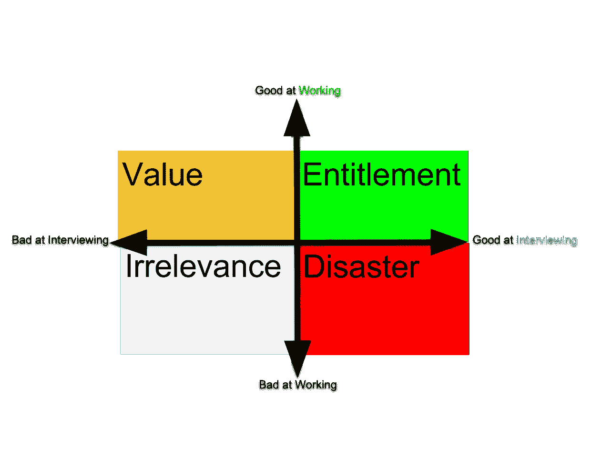

# 雇用世界级人才的秘密秘诀

> 原文：<https://medium.com/hackernoon/the-secret-hack-for-hiring-world-class-talent-3f3a5cb5cd0a>

## 如何运用你的面试技巧来击败谷歌和亚马逊

My own Drawing (Please excuse limited graphics)

科技行业创始人和经理之间 95%的对话都围绕着他们吸引和留住顶尖人才有多难。同情人才争夺战是一种时尚。此外，客观上很难雇佣 10 倍的员工并让他们长期愉快地工作。

但并非所有的希望都破灭了。我在谷歌、脸书、Intuit & Aleph 等大公司任职期间，进行了数百次面试。我在这里告诉你一个[技巧](https://hackernoon.com/tagged/hack)，它会给你一个不公平的优势，帮助你比你的对手更快更好地雇佣高产出的人。

诀窍在于你要非常擅长面试，以至于你比亚马逊和脸书的傻瓜们招的人都多。但为了充分解释，我将不得不要求你与你的内在 MBA 联系起来，想象一个 2 乘 2 的画面:X 轴是一个人在面试中有多好(这是一种技能，也是一种可以游戏的技能)。Y 轴表示他们在*实际工作中的表现有多好，*做你[雇佣](https://hackernoon.com/tagged/hiring)他们做的任何事情。我在上面为你画了这个 2 乘 2 的图。

为了确保我们理解——这个象限的右上方是那些既擅长工作又擅长面试的人(当然他们在不同程度上擅长工作——那里可能会有一些小点)。

现在我们已经了解了情况，让我们来看看四个象限。如果你面试的次数足够多，这四种类型你肯定都会遇到。⁴

## 灾难象限(擅长采访，不擅长工作)

擅长面试但不擅长实际工作的人是彻头彻尾的灾难。谷歌有能力雇佣他们，并在以后解雇他们。你不能。你必须保持高度警惕，让他们远离你。你让面试变得越实际、越动手，解决一个代表候选人必须擅长的实际工作的微观问题，就越好。我也很喜欢试用期和推荐信。这些方法的组合可以帮助你避免灾难，这是你必须做的。

下一组:

## 不相关象限(两者都不好)

现在这个简单了。这些是你将会缩短的面试，直接去为那个候选人做筛选的人的隔间。他们真的不应该一开始就接受采访。

从好的方面来说，你雇用他们的可能性很小，所以你所失去的只是你花了多长时间把这个人放在左下象限。

## 价值象限(不擅长面试，擅长工作)

这个组是整个练习的重点。

在这里，你会发现一个非凡的软件工程师只是不擅长回答情境问题，或者只是没有花时间以一种非常系统的方式准备。

雇佣他们！

现在你可能会忍不住提出各种反对意见:难道我们不应该担心他们没有准备吗？或者他们在面试中糟糕的沟通技巧会妨碍他们在我们团队中鼓励的协作环境中工作吗？诸如此类。

是的。好的。也许吧。这不是重点。这些候选人可以胜任这个角色。你可以把它们看作价值股。不是找他们的毛病。这是你能在他们身上发现的核心能力。他们可能没有一切，但这不是一件坏事。如果他们拥有一切——他们会在下一个象限。

## 权利象限(两者都擅长)

在这里，我们发现超级巨星拥有高超的技术。他们非常擅长自己的工作，而且他们非常善于就工作进行交流，并回答以“告诉我一个……的时候”开头的问题。

你想雇佣他们。但其他人也一样。他们在收到两三家战略性高价公司的邀请时，抽空与你面谈。如果你能得到他们并留住他们，就说因为他们爱上了你惊天动地的使命——太好了！但如果没有，他们会接受你不可能提供的条件。

现在你明白了为什么你最好在价值象限中寻找人才，如果可以的话。让我们来谈谈你是如何做到的。

## 如何进行价值面试

为了破解这个系统，你必须变得非常擅长面试，足以分辨出面试很差的人和不够好的人。有几个技巧可以做到这一点:问更聪明的问题。击败“告诉我你曾经”的人群。第一次回答不满意就好好跟进。引出内向的人。找到一种方法，以他们的方式和他们交谈。

不幸的是，要成为一个足够敏锐的面试官并能够说出答案，并没有什么魔术。但是你无论如何需要过滤灾难象限候选者的相同技术，在这里也会派上用场。让他们做一个练习，并在他们做的时候和他们坐在一起。审判他们。作为承包商给他们一个项目。看看会发生什么。

最重要的是，当你结束面试时，想象一下 2 乘 2 的场景。试着把候选人放在正确的象限，如果他们在价值象限，就赶紧雇用他们。十有八九你会为自己赢得一个长期的高绩效者。

脚注:

1.  此外，95%的自信报价统计都是现场编造的。
2.  大部分是产品经理，但也有许多工程师、技术主管、经理、数据科学家，甚至一些商业开发人员
3.  他们当然不是傻瓜。他们不需要像你一样忙碌
4.  尽管数量不等，但任何像样的筛选过程都会从左下方过滤掉大多数人。