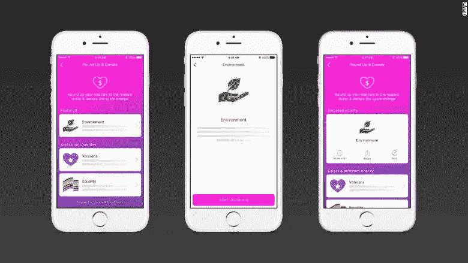
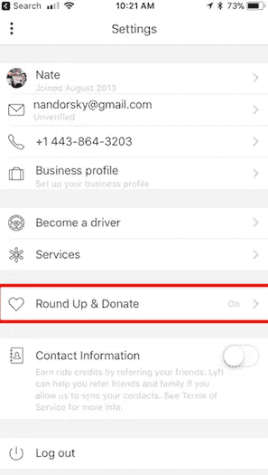
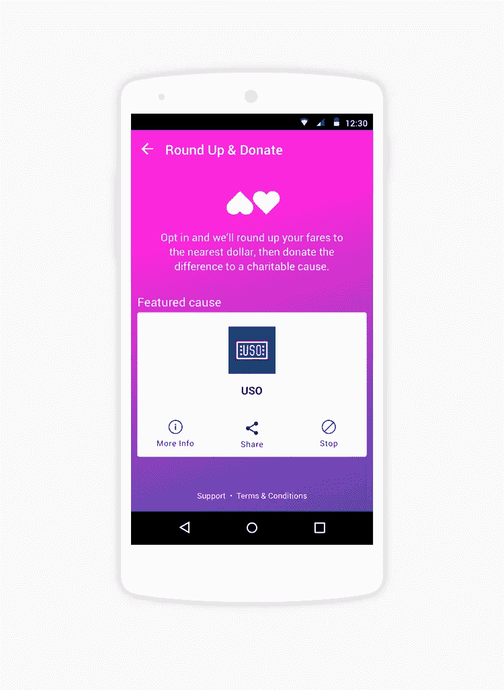
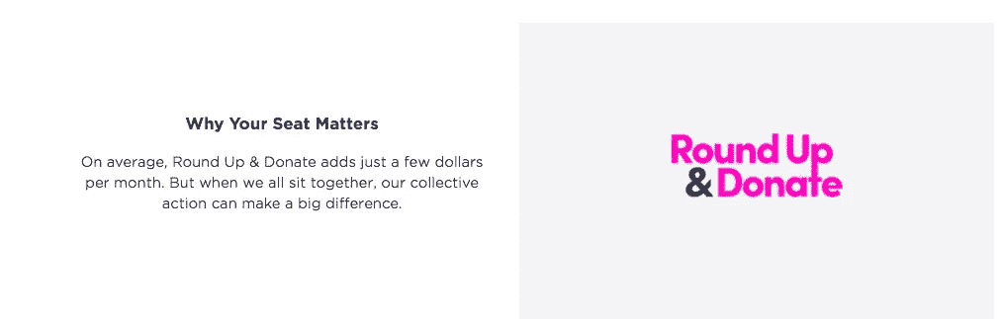

# Lyft 的围捕计划如何筹集到 300 多万美元的秘密

> 原文：<https://medium.com/hackernoon/the-secret-to-how-lyfts-round-up-program-raised-over-3-million-86666c86eaf3>

2017 年 5 月 1 日，Lyft 宣布了其[围捕&捐赠](https://blog.lyft.com/posts/roundup-donate-uso)计划。旨在加强 Lyft 建立的社区，并支持各种非营利组织的[计划](https://hackernoon.com/tagged/program)允许乘客“选择加入”，并将票价四舍五入到最接近的美元，以便零钱可以捐赠给慈善事业。

自成立以来，Round Up & [捐赠](https://hackernoon.com/tagged/donate)项目取得了巨大的成功。仅在 7 个月内，该项目就筹集了 300 多万美元。虽然骑手们显然想要参与这样一个有益健康的项目，但是募集捐款的成功让许多人感到惊讶。

虽然这看起来很神奇，但 Lyft 的 Round Up 项目创造性地利用了一些行为经济学理论，使捐赠无痛苦且无缝。

# Lyft 新项目成功的原因:根植于行为经济学的 3 个理由

Lyft 的围捕计划不是偶然的，它的巨大成功也不是随机的。相反，Lyft 的工程师利用了行为经济学的三个基本组成部分，并围绕它建立了这个程序——不管他们是否知道。综上所述，这三个想法使得“围捕”的概念对客户来说更有吸引力、更简单、更令人兴奋，减少了意图和行动之间的摩擦。

# 1.默认效果

在行为经济学的世界里，[默认效应](https://www.behavioraleconomics.com/mini-encyclopedia-of-be/default-optionsetting/)是当决策者没有制定任何规范时发生的行动过程。

因为使用默认设置更容易，如果人们不想捐款，他们往往不会取消订阅或选择退出。Lyft 通过其围捕计划利用了默认效应。

Lyft 不是要求用户在每次乘坐*后捐款到最近的美元，而是要求你将其设置为默认，然后在每次乘坐后自动捐款。该程序在 Lyft 应用程序的后台运行，骑行者几乎忘记了它的存在。*

# *2.锚定*

**

*锚定是行为经济学的另一个租户。它指的是一个人在做财务决策时，对第一条信息的认知偏差。*

*换句话说，人类倾向于根据现有的其他选项来评估一个选项。在 Lyft 的案例中，它是这样工作的:*

*假设一个骑手已经为一次骑行花费了 8.20 美元。到那时，再多 0.80 美元又算什么呢？大多数人选择加入，甚至没有给它太多的想法。*

*就像追加销售一样，围捕计划之所以奏效，是因为最难的部分总是让人们花掉 ***任何钱*** 。一旦他们花了一些钱，就很容易让他们额外增加几分钱。*

# *3.框架*

*[框架](https://www.behavioraleconomics.com/mini-encyclopedia-of-be/framing-effect/)指的是一个组织表述一个选择的方式，使它看起来或多或少对顾客有吸引力。Lyft 在其网站上表示，选择加入的客户平均“每个月只捐几美元”。*

**

*正如你所注意到的，Lyft 并没有要求骑手承诺每个月直接捐款，这也不会那么成功。相反，通过使用“凑齐捐款”这一措辞，该公司让这一要求看起来简单明了，从而使其更具吸引力。*

# *Lyft 继续推进该计划*

*Round Up & Donate 计划继续蓬勃发展，Lyft 最近向该系统添加了三个新的合作伙伴。据 TechCrunch 报道，合作伙伴包括编程女孩、人类家园和世界野生动物基金会(WWF)。过去，Lyft 也曾通过 Apple Pay 提供匹配捐款，从而获得了更多捐款和出色的项目表现。*

*直到下一次，*

*内特*