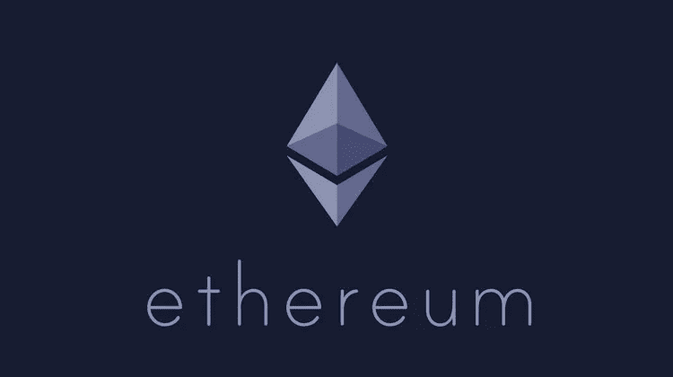

# 以太坊和康赛斯成功背后的秘密

> 原文：<https://medium.com/hackernoon/the-secrets-behind-the-success-of-ethereum-consensys-5c6997d95e76>

与联合创始人约瑟夫·卢宾！

我们有幸采访了 Joseph Lubin，以太坊的联合创始人，Consensys 的创始人，作为 Consensys 特拉维夫社区和投资者活动的一部分。

你经营着一个非常了不起的组织，在如何以分散的方式大规模管理它方面，你有着前瞻性的思维。它通常被称为康森斯网，你能告诉我们关于它的一切吗？

我们认为自己是一家与众不同的公司。我们在大约三年半前成立，大约是以太坊项目开始的一年。我们一开始是一个风险制作工作室，我们的想法是建立 MVP，围绕他们包装公司，让他们接受外部投资并成长。我们很早就引起了公司、政府和中央银行的兴趣，我们需要在我们的生态系统中教育人们。我们结束了不同轮的资本市场活动，所以我们基本上已经演变成一个形状非常奇怪的组织。我们一起做了很多你在一个组织中找不到的事情。我们还提出了一个论点，即商业的本质是不断发展的，因此，试图建立一个像微软一样的大型层级、自上而下的命令和控制整体是没有意义的，只是因为信息传递如此容易和迅速，专业知识是共享的，企业家很普遍，他们是在这些公司内部形成的。看看谷歌，他们是如此多的企业家，他们甚至做自己的事情，他们仍然是校友的一部分。

所以我们觉得商业的本质正在改变，我们应该接受这一点，并创造一个环境，让企业家和连续企业家被 Consensys 吸引，世界上没有比这更好的地方让他们做他们想做的事情。因此，我们已经发展成为不同产品项目、服务圈和区域办事处的网络。我们试图尽可能地去中心化，利用我们的技术去中心化。事实是，我们目前在 13 个国家开展业务，同时尽最大努力保持组织的扁平化和流动性。严格的等级制度对不同的事情来说是很好的，它们对很多事情来说是有效的，但是对决策来说就不那么好了。因此，你通常拥有丰富的数据和处于层级底部的情境意识，并在尽可能远离决策者的地方做出决策。我们尽最大努力让决策者参与不同的项目，并给他们预算，所以他们真的非常自主。然而，我们正在建立一个由 Consensys 产品和服务组成的生态系统，我们正在以太坊生态系统的基础上建立，我们做了大量的基础设施工作，开发工具等。我们正在构建去中心化的生态系统，本质上是 web 3.0。当你这样做的时候，你需要在我们努力工作的不同项目之间进行大量的沟通、协作和互动，即使是在我们试图创建这个自治项目和公司的网络的时候。

我们并没有真的打算建立一个奇怪形状的公司，它肯定是有机形成的，我认为在这个星球上有数百万人理解区块链技术的价值主张。他们中的许多人被像 Consensys 这样的组织所吸引，被吸引到区块链空间工作，在一个一切基本上都是实验的公司，他们愿意迭代，并且发展得相当快。

我想知道在这种分散的组织中，你个人如何保持了解和区分优先次序，因为你有这么多的项目正在进行，这么多不同的部门，你个人如何保持在事情的顶端？

公司的增长是指数级的，带来的兴趣是指数级的，机会也是指数级的。不仅仅是我有这样的经历，实际上公司里的每个人都有。所以我们都要重新优先考虑我们能关注的东西。我们都在建立，系统流程，更大的团队，以便我们更好地处理决策和信息收集。我们确实会见面，我们在世界各地有大约 850 人，我们经常在不同的活动中见面。我们有很多机会一起度过美好时光，一起工作，建立联系，并建立一种共享的理解语言，这样当我们使用电子邮件和 Slack 等交流工具时，我们就有希望更好地理解彼此。

***我爸总说，在一个公司的文化里，请求原谅比请求允许好。在 Consensys，这也是你的方法吗，因为你在谈论人们探索新想法的实验环境？***

在康赛斯，有很多请求原谅的机会。有许多直言不讳、充满激情的人，我们练习施蒂格姆。这是一种现象，如果集体智慧集体确定了某种目标，它就会在某种意义上被包含到物种 DNA 中，就像蚂蚁四处移动沙子，并为了集体利益四处推动小块糖一样。在组织中，我们看到工作的片段，我们以不同的方式推动它们，人们被鼓励采取行动，如果他们看到应该做的事情，他们就会去做。然而，如果他们想做的事情可能会影响其他人或其他潜在的目标，他们应该尝试将那些可能受到影响的人带入某种讨论，寻求帮助或只是让某人知道正在发生的事情。

这家公司名为 Consensys，因此我们确实试图在任何会受到某个事件或某个决策影响的人之间形成共识，而其中一些决策会影响整个组织。正如我之前说过的，有很多机会去请求原谅。我们试图将自己视为一个有机体，我们试图在这个有机体中建立免疫系统，因此我们有一个团队来帮助我们制定沟通协议，如非暴力沟通技术、情商和不同类型的程序，以提高我们作为 Consensys 环境中的操作员的能力。

***你们也有一种叫做传统管理作废工具的东西，请问这是什么意思？***

TMNT 是一个非常酷的项目。组织哲学家和理论家肯·威尔伯定义了人类为了集体行动而组织自己的不同方式。他用从红色到蓝绿色的颜色给它们贴上标签。所以狼群有红色的标识，军队和机器，家庭和有机体是进化的下一个层次，我们作为一个集体智慧会变得越来越好。在康赛斯，我们试图把自己塑造成一个有机体，所以所有的人都构成了器官的元素。我们有产品团队、服务圈和区域办事处，它们是各种不同的机构。我们内部有反馈循环，我们试图弄清楚我们如何衡量，以及我们如何应用任务和目标设置。它本质上是为了在细胞水平上保持健康，在细胞水平上所有的人都是健康的，在器官水平上是健康的，在有机体上是理想的紧急健康。

你可以把 Consensys 看作是这些有机体中的一员，我们已经分离出了一批公司，它们仍然是 Consensys 网络的一部分，其中一些公司凭借自己的能力正在成为中心。我们有一个所谓的中心辐射式系统，其中我们不同的产品团队是 Consensys 中心的辐射。我们有一个名为 Labs 的团队，该团队与所有不同的产品团队合作，将它们包装在 API 中，然后为这些 API 分配服务级别协议，以便您知道团队提供什么，以及您可以在哪些条款下获得这些服务。我们还将我们的营销团队、人力资源团队和财务团队，也许还有我们的法律团队视为潜在的代言人，他们可能凭借自己的能力将 it 发展成一项业务，因为我们编写的软件使他们能够在这种新的分散化环境中完成自己的工作。

我们有一种叫做开放法律的技术，我们刚刚开始在我们的组织内部应用。它使您能够使用这些基于区块链的具有法律效力的混合文档来撰写雇佣合同、NDA 和服务水平协议。这些机制使协议得以形成和签署，您可以对不同的操作进行排序，您可以将资金投入合同，在合同中托管资金，从协议中支付资金，并将数据投入服务级别协议，根据数据和特定团队的表现获得支付。使用这些机制，理解我们已经开始和分离的不同公司正在创建他们自己的中心，你可以开始看到这个网。

Consensys 在任何时候都运行着 40 多个项目，甚至更多。有没有一些支柱或特定的主题，你可以归类，并说这些是你认为在现阶段对区块链科技最有影响的东西？

这仍然是一个不成熟的领域，我们有许多项目正在迅速成熟，世界上有成千上万个项目正在迅速成熟，所以它们是更多的构件。有自我主权的认同，这将是极其重要的。这将是我们在去中心化的万维网(Web 3.0)上基于协议的开放平台上访问服务的方式。声誉系统、奖金系统、治理工具、会计系统都是重要的组成部分。它们本身确实很有用，但它们将构成更复杂解决方案的组件，其他元素包括可替代令牌和不可替代令牌的标准、原子互换机制、分散式交易所以及消除交易对手风险。

将同样的想法应用到保险行业或贷款，而不是建立一个提供产品的保险公司，我们和其他人，正试图建立基于协议的开放网络，这样任何人都可以将参数化的保险产品放在这个协议上，任何人都可以将参数化的贷款产品放在这个协议上。并试图在以太坊上建立尽可能多的这些标准，并将它们放在堆栈中，以创建这种共享的基础设施，我们可以在其上进行合作，使人们能够免费获得大量标准，并为不同的消费者和企业构建有用的产品。

从本质上说，我们正在从一个君主或君主制定规则、做出判断、主观治理的世界转向一个越来越多地基于规则治理的世界。然而，基于规则的治理，在适用的国家，通常是主观决定、定义、应用和执行的。如果我们能够采取这种基于规则的方式来组织我们的社会，我们能够从主观的手动应用信任转移到这些基于规则的系统的自动保证应用信任，那么我们将有一个更好的基础来奠定我们几千年来建立的所有技术，并希望有一个更公平，更分散的政府，和一个更好的社会。

***先说令牌生成事件。2017 年，实用令牌是流行语，现在 2018 年，我们都在谈论安全令牌。我想知道你的观点是什么？因为在每个项目中，你们都有一个代币，你们有代币铸造，你们在建立新的经济模式，所以你们如何看待这一切的演变？***

Token Foundry 团队已经帮助了我们的一些项目，以及 Token 推出自己的第三方外部项目。我们发行了投资者代币，一个很好的例子是一个叫做 Brade 的项目。这是一部进入翠贝卡的电影，它在翠贝卡电影节上放映，所以这是一个非常令人兴奋的项目，我们实际上众筹了一部电影。人们为此得到了代币，我们筹集了 170 万美元，这是一种证券，它使人们能够获得 15%的本金回报，他们永久获得 30%的利润，所以这是一个很酷的系统和实验。

我们有许多不同的项目是消费者公用事业代币，不会被视为证券，即使在这种情况下，在这个时间点上，世界各地的监管机构都提出了许多恐惧、不确定性和怀疑。美国证券交易委员会已经就消费代币或公用代币做出了某些声明，早期声明的大意是，所有这些代币都可能是证券。

世界各地的监管机构都有一个两难的问题，问题是那里有许多伟大的项目，许多欺诈性的项目，许多项目都在出售可以而且应该是良好的，构造良好的消费者公用事业令牌，但他们向投资者出售的数量巨大，远远超过他们实际可以使用的数量，所以他们真的是把它们作为投资来出售。因此，根据我们的观察，证交会认为这些东西构成了证券。

因此，我们有一个框架，使我们能够销售消费者公用事业令牌，不是大量销售，不是对大投资者打折，不是对投资者销售。你基本上必须是一个技术上认可的令牌购买者，你必须回答问题，你必须证明你将在这些平台上使用这些令牌，所以这是一个很好的清洁方式来销售代表某种资源的访问或消费的令牌。

几千年来，一直有邪恶的行为者利用信息不对称来欺骗消费者，这种情况在我们的领域仍在继续。我认为我们会有办法让情况变得更好。不幸的是，这种技术的全球背景和运行令牌发射的低门槛加剧了信息不对称。但是，我们可以利用这些特点进行自我监管，并建立更好地保护消费者的系统。在过去的情况下，你可以注册股票，然后通过电话，在一家股票交易所把它们卖给天真的老奶奶们。在这个世界上，这是一个很难发现的阴谋。

为了成功推出代币，你必须发布一份白皮书，你必须收到一封电报或建立一个网站，我们可以很容易地找到这些东西，无论它们在世界的哪个角落。我们正在创建一个名为 True Set 的项目，这是一个用于令牌发布的类似 EDGAR 的数据库。理想情况下，如果你要进行合法的令牌发射，你必须在这个数据库中注册重要的数据，这样我们都能够在数据库中指向它。如果可能的话，我们可以让人们仔细检查数据库，并确定披露的信息是准确的，这样我们就可以让大众的智慧致力于识别这些项目并对其进行分析。

我们有一个名为 Frontier 的项目，激励专业分析师分享他们的工作。如果你看看像 Reddit 这样的平台，人们只是撕毁白皮书，有很多精力可以用来清理这个空间。我们当然需要像 SEC 这样的机构来吓退许多项目，并创造一个关注的环境，以便许多不同的项目在发布令牌之前三思而行并做好法律准备。

在以色列，我们被认为是传统创业场景中的创业国家，最近我们被认为是加密或区块链国家。你即将在特拉维夫开设一家办事处，我想知道你的愿景或战略是什么，当你在世界某个地方开设新的分支机构时，你会怎么看？

在过去的三年半时间里，我们去了那些需要我们的地方，和那些想了解我们在做什么的人交谈。我们很高兴与任何想听这些东西的人交谈，现在我们被需求淹没了，我们现在已经在世界各地不同的国家，与不同的中央银行和政府做了各种不同的项目。

但是世界上有两个地方和我有点相似——一个是以色列，因为创业文化，因为世界一流的网络安全、密码学和数学专业知识。另一个地方是硅谷，那里的技术专家正在构建他们认为能有效构建世界的系统。这两个地方，尤其是硅谷，接受区块链的速度很慢，因为他们知道如何在脸书、谷歌和其他技术的基础上运行世界。它们是 web 2.0 世界的顶峰。但一些早期采用者进入了比特币领域，他们在该领域迭代了一段时间，我认为他们现在已经意识到一些非常狭窄的技术。它只是您可以在区块链上构建的无数应用程序中的一个。因此，在这两个地区，我们觉得那里的人们有着非凡的天赋，但也非常成熟，我们应该在以太坊平台和理事会层面提升我们的游戏，这样我们就可以进入那些地方，回答所有的问题，并在那些特定的情况下有值得尊敬的事情要说。

所以一年前，我们在旧金山成立了一个办公室，现在已经发展到大约 50 人。我们将拥有一个更大的办公室，并真正成为一个催化剂。以太坊在那里开始火了。它得到了 GDPR 的帮助，得到了剑桥分析公司的帮助，许多工程师只是想知道他们在做什么。这种利用人们个人信息的商业模式可能不会持续太久，它应该不断发展。

以色列真的让我们很兴奋，因为这里的人才济济。我们想像许多公司一样在这里建立一个 R&D 实验室，但我们真的想建立一个全栈中心。比特币领域最早的一些技术，早期的彩币，以及 Mastercoin 项目都是在这里进行的。以太坊在这里获得了相当大的吸引力，因为人们意识到它是一项非常强大的技术，一个去中心化的应用平台。对我们来说，全栈意味着我们建立一个专注于教育的办公室，通过 Consensys Academy，我们雇用许多工程师，他们可以做咨询工作，我们将项目引入网络并孵化它们，我们投资生态系统中的项目。人类社会的所有元素都被邀请进来，加入我们去中心化的未来。

*原载于 2018 年 6 月 8 日*[*【cryptopotato.com】*](https://cryptopotato.com/joseph-lubin-the-secrets-behind-ethereum-consensys/)*。*