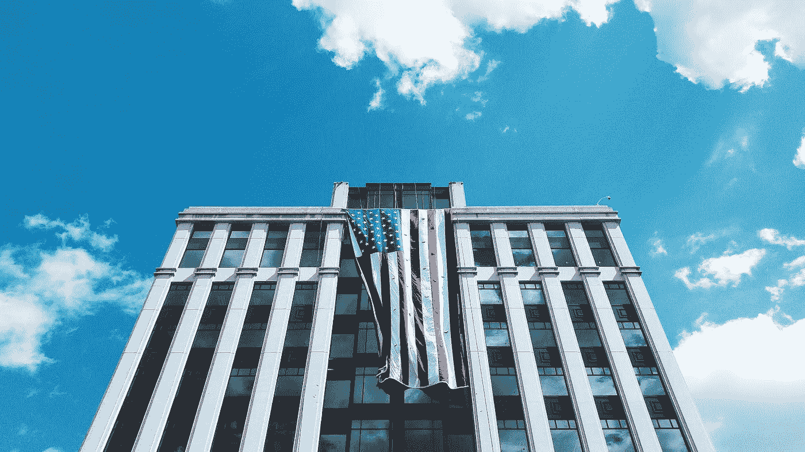
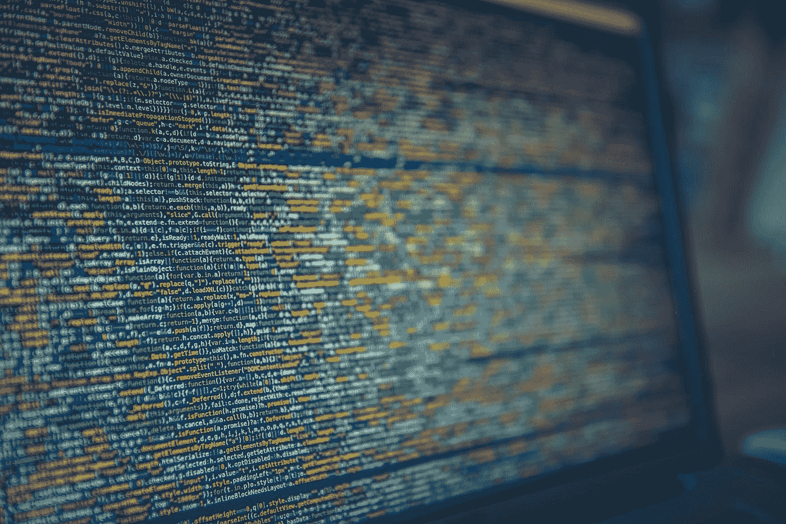

# 证券交易委员会的指导之手

> 原文：<https://medium.com/hackernoon/the-secs-guiding-hand-8c23f95849b8>

今天，证券交易委员会在佐治亚州亚特兰大的一个名为[投资美国](https://www.sec.gov/investing-america)的市政厅发表讲话。虽然这一事件不是专门针对加密的，但加密货币和 ico 在幕后若隐若现。事实上，区块链和 ICOs 是在小组讨论结束时的问答环节中出现的第一个问题。

**关于 ICOs**

Blockchain as architecture

在回答一个听不见的问题时，我们可以假设这位观众问了 SEC 对 ico 和新兴加密空间的看法，SEC 主席 Jay Clayton 说:“我认为我们都同意[区块链的承诺]。我首先想到的是，区块链大大降低了交易成本，包括验证成本。”

他接着描述了区块链是如何被采纳为筹款行为的，但“我在 ICO 领域看到的大部分都是证券发行。”Clayton 接着描述了大多数 ico 的三个核心要素:

1.  为项目筹集资金
2.  投资者为项目提供资金
3.  并获得反映项目回报的某种权利或资产。

在美国证券交易委员会看来，这是一种证券发行(这基本上符合豪威测试的组成部分)。“我不知道我能更清楚，”克莱顿说。“遵循这些规则，我们已经建立了一个 19 万亿美元的经济体，一个令世界羡慕的经济体。我希望人们会追随他们。”

**游戏名称**

The SEC encourages investors to take their research online to Edgar and Investor.org

在 SEC 概述投资者需要寻找什么来保护自己免受不良行为者和不良投资的影响时，专家小组的主要观点是“做好你的研究”。专员小罗伯特·杰克逊给投资者的第一条建议是，“如果你投资一家公司，你应该问的问题是你如何赚钱？关你什么事？”克莱顿主席的讲话围绕着概述投资者在选择金融专业人士时需要问的四个问题:

1.  这位专业人士是在证券交易委员会还是在州政府注册的？如果没有，仍然有很好的机会，但它们更难找到，也更容易被利用。
2.  你和什么类型的投资专家一起工作？经纪人或投资顾问？他们每个人得到不同的报酬，提供不同的服务。确定你需要什么，然后从那里开始。
3.  他们有不良历史吗？当然，人是会变的，糟糕的演员可以转危为安，成为好人，但作为一条经验法则，在与金融专业人士合作之前，先了解他们的历史。如果他们有可疑的过去，还有其他专业人士有类似的技能和价位。毕竟，我们生活在一个竞争激烈的市场中。
4.  你投资的资金中有多少进入了实际投资，又有多少流向了专业人士？这是你在进行任何交易之前应该掌握的信息。

该小组还警告高压销售策略。克莱顿说，“我做这一行已经很长时间了，我从来没有见过一项伟大的投资是在时间不多的情况下进行的。”这是对任何在其网站上使用公开倒计时来表明销售特定部分结束的 ICO 的毫不隐晦的抨击。

重复的信息是一个帮助。SEC 希望支持和帮助投资者，而不是限制他们或过度惩罚公司。用杰克逊的话说，“投资有能力改变个人生活，将一个家庭从一个地方和一个计划带到另一个地方，或者帮助实现一个新的职业或新的目标……我们在这里的原因是因为我们想告诉你可以帮助你做到这一点的工具。”

**未来正在发生**

The future of trading is digital, maybe even decentralized

卡拉·斯坦委员谈到了技术的话题，特别是金融科技如何改变金融市场。证券交易委员会本身从处理纸质文件转变为让公司在 T2 Edgar 上以电子方式提交他们自己的文件。Stein 讨论了数据的增长如何改变人们对待技术的方式。

“数据和技术为我们带来了巨大的收益机会，但它们也为一些新的极其复杂的风险打开了大门，”斯坦说，并指出随着投资过程变得更加容易，抽水和倾倒计划和庞氏骗局变得越来越常见。

斯坦指出，即使是证交会也有需要学习的地方；对新技术的适应不是完美的或立即发生的。“在如何拥抱创新并确保其得到有效利用方面，我们面临挑战，我们和其他人一样受到干扰。”她继续说道:

“我们都想促进创新，但这不能以放松投资者保护或丧失市场诚信为代价。我们的市场不仅是为投资者建立的，也是为试图获得资本的公司建立的。这些基础不会改变，市场会自然地发展以适应新产品和新的沟通方式，但最终，我们必须确保市场是可靠的、值得信赖的、公平的、有竞争力的。”

SEC 并没有试图终结这场派对以及流入区块链公司的资金。它希望规范市场，清除不良行为者，保护投资者，并帮助市场发展，公司和投资者繁荣。他们做这项工作已经 80 年了，而且做得相当好。不管是不是密码，美国证券交易委员会(SEC)都会伸出援手，引导行业走向财务成熟。

*如果你喜欢你所读的，请鼓掌并跟我来！感谢阅读。*