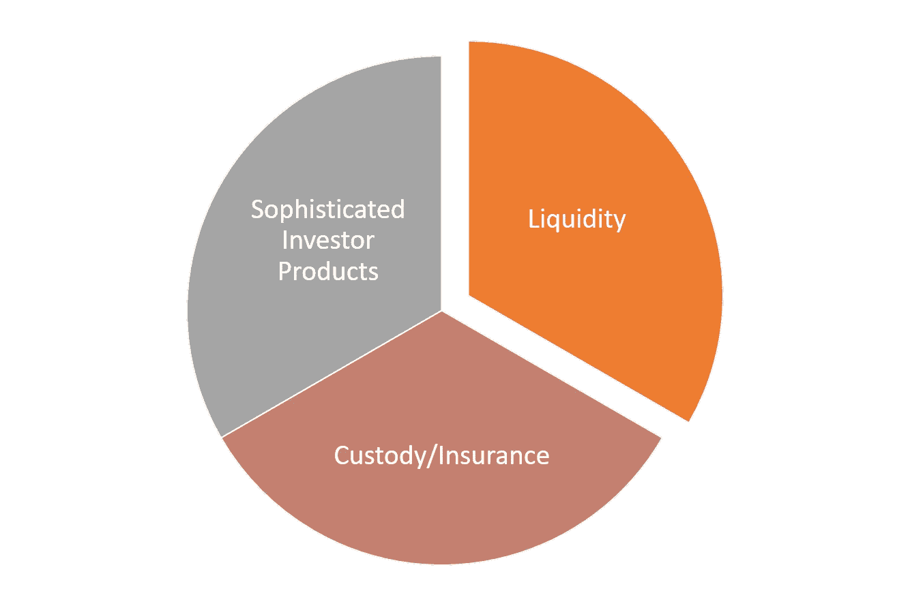
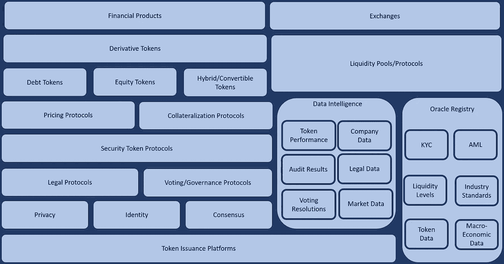

# 安全令牌 2.0 堆栈

> 原文：<https://medium.com/hackernoon/the-security-token-2-0-stack-206b305f5dcd>

上周，我写了一些关于区块链协议的想法，我认为这些想法可以作为下一代安全令牌平台的灵感。今天，我想将安全令牌 2.0 的理念更进一步，并介绍一个技术堆栈的第一次迭代，以推动安全令牌平台的下一阶段。我的目标既不是提供一份详尽的技术清单，也不是一份受限的架构指南，而是总结我与该领域一些思想领袖分享的关于安全令牌平台未来的一些观察。

# 今天的安全令牌

当前一代安全令牌平台专注于两个主要领域:

**Toke 发行**

**安全令牌交换**

让我们客观地看待事物，整个安全令牌空间只有大约一年的历史，无论它发展得多快，在技术上仍然非常不成熟。尽管有些人似乎喜欢不断宣称安全令牌将成为下一个华尔街；这些说法大多没有任何技术、经济或金融工程严谨性的支持。事实是，为了使安全令牌成为可行的金融资产类别，平台需要发展并结合最新一波区块链技术中的协议/功能。

从战略上讲，安全代币运动需要解决的最大问题是变得对老练的机构投资者有吸引力。要做到这一点，需要清除三个主要障碍:

1) **流动性:**机构投资者获得大量资金。

2) **托管/保险:**令牌化资产的托管和保险模式。

3) **成熟的投资者产品:**与证券化产品的金融成熟度相匹配的令牌化产品。

安全令牌 2.0 平台将从根本上专注于实现列表中的第三项，最终实现复杂的令牌化产品的创建。然而，事实证明第 3 点也是第 1-2 点的要求。从这个角度来看，当前一代安全令牌平台向安全令牌 2.0 堆栈的发展对于

# 安全令牌 2.0 技术堆栈

当我们刚刚开始这场金融运动的第一阶段时，安全令牌 2.0 听起来像是一个糟糕的营销术语。安全令牌 2.0 的概念只是提供一个保护伞，在这个保护伞下，我们可以将与安全令牌的主流采用相关的许多相关技术构建块分组。我首先整理了一个图表，将许多 security token 2.0 技术组件进行了分组。最有可能的是，这个图表在某些方面是不完整和不准确的，但希望它可以作为概念化安全令牌平台的下一阶段的良好的第一步。

上图中的大多数组件都是不言自明的，但是我想强调一些关于一些构建模块的有趣观察

**令牌发行平台:**该组包括当前的令牌化平台，如 Securitize、Polymath 或 Harbor。

**隐私协议:**如今，安全令牌交易的隐私依赖于基本的以太坊智能合约。在未来，zk_SNARKS 或多环签名等协议对于在安全令牌中实现不同级别的隐私将变得非常重要。

**身份:**代表发行者、投资者和实体的一致身份协议对复杂的安全令牌工作流建模至关重要。像 [Civic](https://www.civic.com/) 这样的技术在这个领域带来了一些非常有趣的想法。

**共识协议:**共识协议是在安全令牌中实现投票和治理动态的关键。像 [DFINITY](https://dfinity.org/) 这样的委托共识模型在这方面可能是相关的。

**法律协议:**安全令牌的挑战之一是许多链上的活动需要被翻译成链外的法律工件。为此，我们需要像 [OpenLaw](https://openlaw.io/) 这样的法律协议来加入安全令牌平台

**投票/治理协议:** Security token 2.0 平台应该提供一种简单的方法来对公司或证券化产品中存在的许多投票/治理机制进行建模。

**定价协议:**并非所有安全令牌都可以同等定价。作为 security token 2.0 平台的一部分，我们需要统计定价模型，该模型将风险、股息支付、市场条件和每个令牌特有的其他元素考虑在内。我在这里写了这个话题[……](https://hackernoon.com/how-to-value-a-security-token-part-i-factors-to-consider-5a5a79b3e5d9)

**抵押协议:**安全令牌的发行需要开始考虑不同的抵押模型可以准确地对安全令牌的金融行为进行建模。

**令牌模型:**不同的金融工具应该被翻译成不同类型的安全令牌。至少我们应该考虑三种类型的安全令牌

—**债务代币:代表房地产租赁或现金贷款等债务工具。[达摩协议](https://dharma.io/)在这个领域是一项超级有趣的技术。**

****—股权代币:**代表公司或特殊目的载体股份的代币。**

****—混合代币:**可以将债务转换为股权的代币，反之亦然。**

****衍生令牌:**安全令牌衍生工具很可能成为该领域最相关的趋势之一。我在这里写了它们的重要性…像[{ Set }协议](https://setprotocol.com/)和 [dYdX](https://dydx.exchange/) 这样的技术正在这个领域建立一个强大的基础。**

****Oracle Registry:** 如今，令牌化平台主要致力于实现 KYC/反洗钱合规性。但是，要使安全令牌在特定地区或行业可交易，还需要遵循数百种其他监管模式。为了实现这一点，security token 2.0 平台需要针对不同的数据费用或合规性模型整合丰富的 Oracles 目录，这些数据费用或合规性模型需要由令牌化资产来遵循。像 [ChainLink](https://www.smartcontract.com/link) 或 [RLay](https://rlay.com/) 这样的协议在这个领域非常有趣。**

****数据智能:**为了让安全代币对大型机构投资者变得有吸引力，它们需要展现出与金融证券相当的分析和智能水平。如果我投资于一个象征性的房地产租赁池，我想知道该资产与市场上的房地产投资信托基金或房地产交易所交易基金相比表现如何。可靠的数据智能层应该是 security token 2.0 平台的关键组件。**

****流动性池:**接触大量投资者是当今证券代币面临的主要挑战之一。像 [Bancor](https://www.bancor.network/) 、[bnktothefourt](https://bnktothefuture.com/)或 [SwarmFund](https://swarm.fund/) 这样的技术给这个领域带来了有趣的想法。**

****交易所:**证券代币交易所发展非常迅速，我们应该会在不久的将来看到更多复杂金融产品的出现。像 [OpenFinance](https://www.openfinance.io/) 和 [tZero](https://www.tzero.com/) 这样的技术在这个领域处于领先地位。**

****投资者产品:**最终，security token 2.0 平台应该提供吸引大型机构投资者的令牌化产品。这些产品将模仿现有的金融工具，如 ETF、指数基金、共同基金等。**

**我希望这是一个很好的起点，让您了解下一代安全令牌平台的架构。我计划在以后的文章中深入探讨这些领域。**