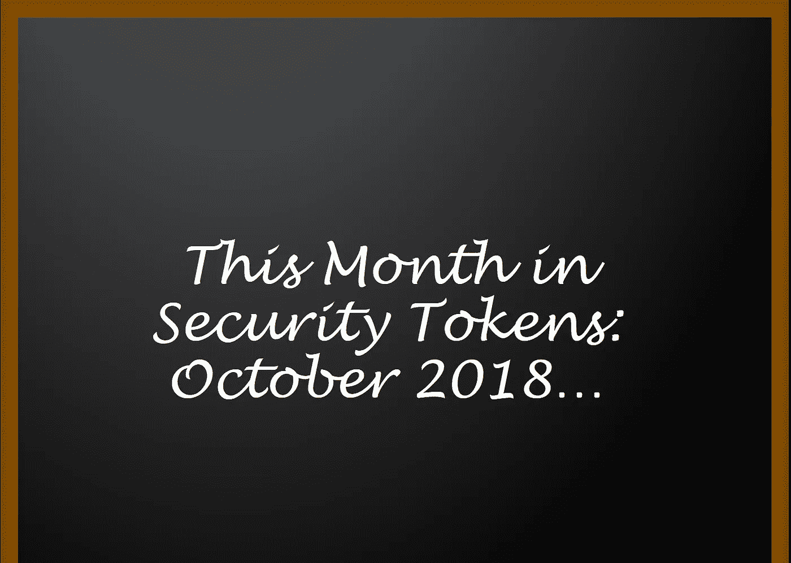

# 安全令牌选集:十月版

> 原文：<https://medium.com/hackernoon/the-security-token-anthology-october-edition-ed6919e3723a>

另一个月和更多关于安全令牌的文章。下面你会发现我上个月的作品汇编。它包括关于治理、隐私的新讨论，甚至开始了关于安全令牌是否需要新区块链的新部分。全部精选多达 34 篇文章，涵盖了安全令牌生态系统的大多数重要方面。

快乐阅读。

# **关于一个安全令牌区块链:**

**安全令牌需要新的区块链吗？利益与挑战第二部分(2018 年 10 月):**[https://hacker noon . com/do-security-tokens-need-a-new-区块链-利益与挑战-part-ii-de480e54c12a](https://hackernoon.com/do-security-tokens-need-a-new-blockchain-benefits-and-challenges-part-ii-de480e54c12a)

**安全令牌需要新的区块链吗？好处和挑战[第一部分](2018 年 10 月):**[https://hacker noon . com/do-security-tokens-need-a-new-区块链-好处-挑战-part-i-48f281f5101e](https://hackernoon.com/do-security-tokens-need-a-new-blockchain-benefits-challenges-part-i-48f281f5101e)

# **关于安全令牌市场动态:**

**安全令牌的未来:神话与现实(2018 年 10 月):**[https://hacker noon . com/The-Future-of-Security-Tokens-神话与现实-d3371cee9c65](https://hackernoon.com/the-future-of-security-tokens-myths-and-realities-d3371cee9c65)

**大多数人不同意的关于安全令牌的 20 个想法第二部分(2018 年 9 月):**[https://hacker noon . com/20-Ideas-About-Security-Tokens-That-the-Most-People-Disagree-Part-II-44 DBC 44 ea 456](https://hackernoon.com/20-ideas-about-security-tokens-that-most-people-disagree-with-part-ii-44dbc44ea456)

**大多数人不同意的关于安全令牌的 20 个想法第一部分(2018 年 9 月):【https://hackernoon.com/20】[-关于安全令牌的想法-大多数人不同意-第一部分-df86650fe55b](https://hackernoon.com/20%20-ideas-about-security-tokens-that-most-people-disagree-with-part-i-df86650fe55b)**

**想了解安全令牌？看看这个市场分类(2018 年 7 月):**[https://hacker noon . com/want-to-understand-security-tokens-look-at-this-Market-Taxonomy-aa 70 fed fb1 aa](https://hackernoon.com/want-to-understand-security-tokens-look-at-this-market-taxonomy-aa70fedfb1aa)

**开放金融和当日安全令牌的推出成为现实(2018 年 7 月):**[https://medium . com/coin monks/The-Launch-of-Open-Finance-and-The-Day-Security-Tokens-because-Real-6bb 48767 D5 b5](/coinmonks/the-launch-of-open-finance-and-the-day-security-tokens-became-real-6bb48767d5b5)

**启用安全令牌论文需要什么(2018 年 5 月):**[https://medium . com/coin monks/What-We-Need-Enable-The-Security-Token-Thesis-2 eade 6 ee 96 f 2](/coinmonks/what-we-need-to-enable-the-security-token-thesis-2eade6ee96f2)

**安全令牌 vs. Fat 协议(2018 年 5 月):**[https://medium . com/coin monks/Security-Tokens-vs-Fat-Protocols-9c4 e 247d 889 c](/coinmonks/security-tokens-vs-fat-protocols-9c4e247d889c)

**理解标记化非流动资产和安全令牌的分类法(2018 年 5 月):**[https://medium . com/datadriveninvestor/A-Taxonomy-for-Understanding-token 化非流动资产和安全令牌-271f0576f9ec](/datadriveninvestor/a-taxonomy-for-understanding-tokenized-illiquid-assets-and-security-tokens-271f0576f9ec)

# **关于安全令牌平台**

**下一代安全令牌平台需要考虑的一些很酷的协议(2018 年 10 月):**[https://hacker noon . com/Some-Cool-Protocols-to-Consider-for-the-Next-Generation-of-Security-Token-Platforms-98697 f0c 55 e 6](https://hackernoon.com/some-cool-protocols-to-consider-for-the-next-generation-of-security-token-platforms-98697f0c55e6)

**安全令牌平台的区块(2018 年 6 月):**[https://hacker noon . com/The-Blocks-of-a-Security-Token-Platform-CD 8 aada 4 af 43](https://hackernoon.com/the-blocks-of-a-security-token-platform-cd8aada4af43)

# **关于安全令牌的类型**

**安全令牌衍生品来了(2018 年 6 月):**[https://medium . com/coin monks/Security-Token-Derivatives-are-Coming-8439555 e7e5a](/coinmonks/security-token-derivatives-are-coming-8439555e7e5a)

如何评估安全令牌的价值？第一部分:需要考虑的因素(2018 年 7 月):[https://hacker noon . com/how-to-value-a-security-token-part-I-Factors-to-Consider-5a 5a 79 B3 e5d 9](https://hackernoon.com/how-to-value-a-security-token-part-i-factors-to-consider-5a5a79b3e5d9)

**可以改善当前一代安全令牌平台的五个简单特征(2018 年 9 月):**[https://medium . com/coin monks/Five-Simple-Features-than-Improve-the-Current-Generation-of-Security-Token-Platforms-1868 c 41 dad BD](/coinmonks/five-simple-features-that-can-improve-the-current-generation-of-security-token-platforms-1868c41dadbd)

**以太坊安全令牌案(2018 年 9 月):**[https://hacker noon . com/The-Case-Against-Security-Tokens-in-ether eum-cc 08 e 0b 00 c 2f](https://hackernoon.com/the-case-against-security-tokens-in-ethereum-cc08e0b00c2f)

# **关于投票和治理**

**安全令牌 2.0:关于链上治理【第二部分】(2018 年 10 月):**[https://hacker noon . com/Security-Tokens-2-0-About-On-Chain-Governance-Part-II-ca 9378 CEA 172](https://hackernoon.com/security-tokens-2-0-about-on-chain-governance-part-ii-ca9378cea172)

**安全令牌 2.0:一些想法链外 vs 链上治理(2018 年 10 月):**[https://hacker noon . com/Security-token-2-0-Some-Thoughts-Off-Chain-Governance-2cba 087389 ab](https://hackernoon.com/security-token-2-0-some-thoughts-off-chain-vs-on-chain-governance-2cba087389ab)

**自由激进主义和安全令牌:作为治理协议的二次投票(2018 年 9 月):**[https://hacker noon . com/Liberal-radical ism-and-Security-Tokens-part-I-Quadratic-Voting-as-a-Governance-Protocol-10705 af 3697 a](https://hackernoon.com/liberal-radicalism-and-security-tokens-part-i-quadratic-voting-as-a-governance-protocol-10705af3697a)

**区块链技术人员应该了解的投票理论(2018 年 8 月):**[https://hacker noon . com/What-区块链-技术人员-应该了解的投票理论-f9bac8e5a1c9](https://hackernoon.com/what-blockchain-technologists-should-know-about-voting-theory-f9bac8e5a1c9)

**思考安全令牌的不同方式:可编程监管(2018 年 7 月):**[https://medium . com/coin monks/A-Different-Way-to-Think-on-Security-Tokens-Programmable-Regulation-78f 785 FBD 21 A](/coinmonks/a-different-way-to-think-about-security-tokens-programmable-regulation-78f785fbd21a)

**博弈论中的这三个新趋势可能是下一个大区块链的一部分(2018 年 7 月):**[https://medium . com/coin monks/These-Three-New-Trends-in-Game-Theory-Be-Part-of-the-Next-Big-区块链-6fe961bd81db](/coinmonks/these-three-new-trends-in-game-theory-could-be-part-of-the-next-big-blockchain-6fe961bd81db)

**安全令牌中的投票和治理(2018 年 6 月):**[https://medium . com/coin monks/Voting-and-Governance-in-Security-Tokens-1e3d 041 dabb 8](/coinmonks/voting-and-governance-in-security-tokens-1e3d041dabb8)

# **关于神谕**

**信任的中间人:Oracle Paradox 和五个可以将外部数据带入区块链的协议(2018 年 7 月):**[https://hacker noon . com/The-Middleman-of-Trust-The-Oracle-Paradox-and-Five-Protocols-that-can-Bring-The-The-External-Data-in-The-df 39 b 63 e 92 AE](https://hackernoon.com/the-middleman-of-trust-the-oracle-paradox-and-five-protocols-that-can-bring-external-data-into-the-df39b63e92ae)

# **关于安全&隐私**

**Bulletproofs:区块链安全领域的新小子(2018 年 10 月):**[https://hacker noon . com/bullet proofs-The-New-Kid-in-区块链-Security-Land-e 730 fc 0 EFE 14](https://hackernoon.com/bulletproofs-the-new-kid-in-blockchain-security-land-e730fc0efe14)

**房间里的大象:安全令牌中的安全和隐私协议(2018 年 10 月):**[https://hackernoon . com/The-Elephant-in-The-The-The-Elephant-The-The-Room-Security-and-Privacy-Protocols-in-Security-Tokens-a 6687 af 8d 1d 6](https://hackernoon.com/the-elephant-in-the-room-security-and-privacy-protocols-in-security-tokens-a6687af8d1d6)

**从以太坊到英格玛:理解区块链中的隐私协议(2018 年 7 月):**[https://hacker noon . com/From-以太坊-to-英格玛-理解-隐私-协议-区块链-ef0b0b76a1a8](https://hackernoon.com/from-ethereum-to-enigma-understanding-privacy-protocols-in-the-blockchain-ef0b0b76a1a8)

# **关于安全令牌 2.0 的论文**

**安全令牌 2.0(2018 年 8 月):**能够推动下一波令牌化证券的四个协议:[https://hacker noon . com/Security-Tokens-2-0-Four-Protocols-that-can-Power-the-Next-Wave-of-token 化证券-92e9eda8887f](https://hackernoon.com/security-tokens-2-0-four-protocols-that-can-power-the-next-wave-of-tokenized-securities-92e9eda8887f)

**安全令牌 2.0 协议第三部分:基金和衍生品** **令牌(2018 年 9 月):**[https://hacker noon . com/Security-Token-2-0-Protocols-Part-III-基金和衍生品-tokens-68f594cbb438](https://hackernoon.com/security-token-2-0-protocols-part-iii-fund-and-derivative-tokens-68f594cbb438)

**安全令牌 2.0 协议第二部分(2018 年 9 月):混合令牌(2018 年 8 月):**[https://hacker noon . com/Security-Token-2-0-Protocols-Part-II-Hybrid-Tokens-c 66 BD 151 b 049](https://hackernoon.com/security-token-2-0-protocols-part-ii-hybrid-tokens-c66bd151b049)

**安全令牌 2.0 协议:债务令牌(2018 年 8 月):**[https://hacker noon . com/Security-Token-2-0-Protocols-Debt-Tokens-af 17 D5 c 91 a 25](https://hackernoon.com/security-token-2-0-protocols-debt-tokens-af17d5c91a25)

**安全令牌 2.0 栈(2018 年 8 月):**[https://hacker noon . com/The-Security-Token-2-0-Stack-206 b 305 F5 DCD](https://hackernoon.com/the-security-token-2-0-stack-206b305f5dcd)

# **关于安全令牌共识**

**为什么安全令牌需要不同类型的共识？(2018 年 9 月):**[https://medium . com/@ jrod thoughts/why-security-token-need-a-different-type-of-consensus-9a 952 ff 321 b 4](/@jrodthoughts/why-security-token-need-a-different-type-of-consensus-9a952ff321b4)

**关于安全令牌共识协议的一些想法:第一部分:**[https://hacker noon . com/Some-Ideas-About-a-Consensus-Protocol-for-Security-token-Part-I-BDA 1 f 0 fac 54 f](https://hackernoon.com/some-ideas-about-a-consensus-protocol-for-security-tokens-part-i-bda1f0fac54f)