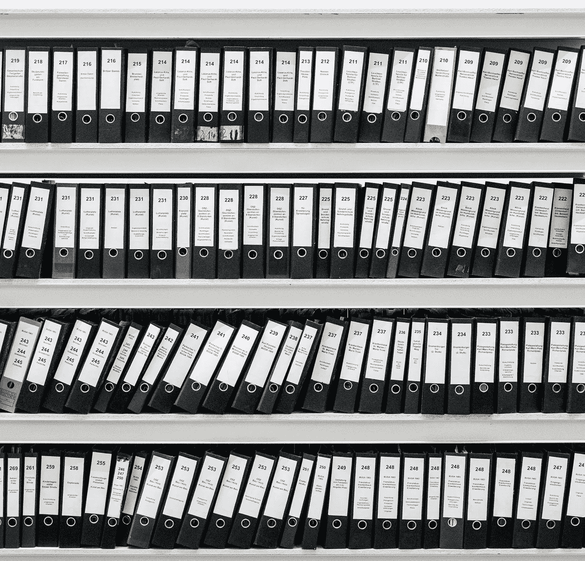

# 安全令牌标准

> 原文：<https://medium.com/hackernoon/the-security-token-standard-bc07409947ae>

There’s a lot of standards on the market. Where do we go from here?

现在很明显，寻求资本的加密公司不会使用公用代币来筹集资本——除非他们更愿意避免违反证券法的后果。企业家出售没有稀释效应或公司没有支付义务的代币的日子已经一去不复返了。那是过去的美好时光。

企业家可以筹集数百万美元，而无需对投资者负责。然而，在数以千计的人向公众提供公用事业代币，并筹集了数十亿美元之后，今天出售的大多数公用事业代币要么没有价值，要么没有流动性。发生了什么事？

**ICO 热**

这一切都始于 2013 年 7 月的第一个 ICO——master coin。接下来是 2014 年的以太坊，在预售的前 12 个小时内[筹集了大约 3700 BTC](https://cointelegraph.com/news/ethereum-raises-3700-btc-in-first-12-hours-of-ether-presale)。当时，3700 个比特币价值 230 万美元。到 ICO 结束时，以太坊将筹集超过 1800 万美元。

然后是 2017 年及其 ico 的泛滥，因为企业家们意识到他们可以通过以太坊区块链和 ERC-20 代币的销售来进行 ico。随着以太坊和比特币价格飙升，筹集了数十亿美元，创造了数千名新晋百万富翁，他们将一些新获得的资本再投资于新的 ico。2017 年的许多 ico 都是纯粹的欺诈，由无意创业的创始人发起，大多数不是彻头彻尾的欺诈都违反了美国证券法。当然，证券交易委员会分析了形势，并最终介入，停止了音乐。

实际情况是这样的:企业家们相信，他们可以在不放弃任何股权或不承担债务的情况下获得资本。ico 是一个释放金钱的途径，为什么不利用它呢？进行这些 ico 的企业家现在声称，SEC 的规则不清楚，但 SEC 在 2017 年 7 月发布了关于 ico 的第一份[公告](https://www.sec.gov/oiea/investor-alerts-and-bulletins/ib_coinofferings)。更多的人紧随其后。

对于那些在去年 7 月之前进行 ICO 的人来说，他们可能有一条逻辑可以隐藏，但对于那些在 2017 年底或 2018 年通过 ICO 筹集资金的人来说呢？这种辩护开始变得站不住脚，他们意识到法律，但不想遵守法律的可能性变得更大。

隧道尽头的一盏灯

然而，任何悲剧总有一线希望，包括这次。散户投资者损失了数十亿。那又怎样？好消息是，通过这次亏损，以及催生亏损的泡沫市场，我们发现了企业家筹集资金的新途径。

事实上，企业家可以使用加密货币合法地筹集资金，进而为投资者的资金提供保护。这意味着企业家可以避免美国证券交易委员会起诉他们或要求完全撤销，在这种情况下，所有的资本必须退还给投资者。ICO 的这一新阶段是在我曾称之为 ICO 2.0 的证券法范围内进行的，但术语正在发生变化。这种融资模式现在在市场上被称为 STO，或证券代币发行。

这一次不同的是，STO 将会留在这里。这种模式类似于过去的融资，但有一个新的加密扭曲。投资者以智能合约或代币的形式收到他们的证券，但证券本身与投资者在加密技术出现之前收到的是一样的。股权或债务，可转换票据或收入份额，或许多其他。

证券采用这种新的令牌化皮肤有很多好处，没有坏处。大多数公司一直在利用 D (a)或(b)条例筹集资金，并以簿记格式发行股票，这意味着投资者从未收到股票证书。让我们来看看与这种形式相比，证券令牌化的优势:

*   **资本表的公共视图**——每个股东都将有一个区块链地址，无论是在以太坊还是不同的连锁店。每个地址包含许多证券。在链上，这些代币不是实际的所有权，只是它的代表(即，如果你丢失了代币，你可以重新颁发给你，就像你可以获得新的房契一样)。称这种链上表示为仪式展示。投资者喜欢知道有多少股东真正存在以及有多少证券存在的想法。证券令牌领域的人经常会提到[都乐食品案](https://www.bloomberg.com/opinion/articles/2017-02-17/dole-food-had-too-many-shares)，在该案中，人们发现都乐食品的投资者比资本限额表所计算的要多，这是为什么这是有益的一个原因。
*   **获得流动性** —目前，购买私营企业或有限合伙企业证券的大多数投资者在公司被出售、上市或合伙企业解散之前都没有流动性。这对富有的投资者来说可能很好，但 7-10 年的资金锁定期是普通大众所不能接受的。通过令牌化，证券可以在替代交易系统(ATS)上进行小额交易，而不需要为每笔交易聘请律师。ATS 可以处理这些交易，前提是每个投资者都有相同的协议，并且他们持有的股票除了美国证券交易委员会规定的转让限制之外，没有其他转让限制。
*   **更大的股东群体**——根据《就业法案》,象征性的股票可以出售给公众——也就是参与 ico 的那些人。ICO 的参与者现在有了加密技术，但他们中的大多数仍是未经认证的投资者(这意味着他们的网络不包括他们的主要居住地，价值不到 100 万美元，或者他们在过去两年的年收入不到 20 万美元)。未经认可的投资者可以在监管众筹或监管 A+发行中购买安全令牌。如果你想向全体公众出售，上面提到的另一个豁免条例 D 将不起作用。
*   **自动化和降价**——机器人杀死了经纪人、场内交易员、助理、律师和许多其他人。使用令牌化证券，发行和交易证券的成本将会降低。想想 ATM 机，它使银行成本下降了 95%以上。
*   **更低成本的股息分配**——想象一下:你可以从一家公司获得 100 美元的股息，但收取 15 美元的手续费。对于加密货币，收费可能是 50 美分！这是一个显著的进步。该公司将以稳定的货币支付给投资者，这些投资者可以决定何时将其转换为法定货币。

Who are building the security token standards?

安全令牌的下一个大挑战是如何协调市场上提供的几十种不同的标准。一些主要的参与者如下:

*   [**R-Token**](https://harbor.com/rtokenwhitepaper.pdf)—Harbor 开发的专注于房地产和合格投资者的标准。Harbor 为合作伙伴和大型企业建立了一个智能合同，在令牌级别根据白名单检查用户。虽然 Harbor 团队正在将合规性融入他们的 R-Token，但智能合同仍然规定与“监管服务”进行通信，这意味着所有权存储在链外，目前对于 R-Token 来说，这意味着在合规性平台 Harbor 本身上。
*   [**ERC-1400**](https://blog.polymath.network/erc-1400-evolution-of-a-security-token-standard-1e25d12b9261)**—Polymath 开发的标准，原名 ST-20。Polymath 正致力于将任何一种只提供给合格投资者的资产令牌化。他们将发行代币和交易代币所需的服务自动化。ERC-1400 作为一把保护伞，与其他几种令牌标准进行互操作，以处理可替代和不可替代的交易限制。他们承诺链上所有权，但没有说明为什么这是有法律约束力的。**
*   **[**ERC-1450**](https://hackernoon.com/introducing-a-new-standard-for-digital-stock-certificates-erc-1450-c7ec917258c)**—start engine 开发的标准(完全披露:这是我的公司)。提议的标准 ERC-1450 与其说是一个聪明的合同，不如说是一个愚蠢的合同。它只是一个数字股票证书。投资者可以占有他们的令牌化证书，但不能转让它。所有权也存储在注册转让代理的链外。在经纪交易商在 ATS 上完成交易后，注册的转让代理将启动转让。这个过程确保交易遵循法规众筹和法规 a 的规则。****
*   ****[**src 20**](https://docs.swarm.fund/swarm-whitepaper-eng.pdf)**—Swarm Fund 开发的标准。Swarm 是一个运行在效用令牌(SWM)上的资产令牌化平台，Swarm 用户可以在 Stellar 的冷叉上购买 Swarm 的私有区块链上的安全令牌(SRC20)。SRC20 令牌的交易也在私有区块链上进行，以确保 Swarm 可以监控交易并确保合规性。这些令牌还被设计为与其他兼容平台进行互操作。******
*   ******[**DS Token**](https://securitize.sfo2.digitaloceanspaces.com/whitepapers/DS-Protocolv1.0.pdf)**—由 Securitize 开发的标准，Securitize 是一家专注于证券初级发行的公司，因此他们的标准可以处理发行、支付股息和投票权。然而，证券化知道二级交易也必须合规，所以他们的 ds 协议打破了 ERC-20 的点对点传输功能，所有交易都必须得到他们的“合规服务”的批准，这是一个链上控制单元，在执行交易前参考链上注册表来验证投资者的状态。要买卖 DS 令牌，您必须首先加入 DS 协议，并在注册表中拥有一个标识哈希。********
*   ******[**ERC-884**](/coinmonks/tokenising-shares-introducing-erc-884-cc491258e413) —由大卫·萨格开发的标准，其中每个 ERC-884 令牌代表一家特拉华州公司的一股股票。该标准是为股权销售设计的，令牌的所有者必须被列入白名单，这是写入智能合同本身的过程。然而，为了遵守证券法，ERC-884 的发行者必须维护一个离线的私有数据库。******
*   ****[**ERC-1404**](/erc1404/erc-1404-simple-restricted-token-standard-f71290a48faa)—token soft 开发的标准。ERC-1404 用几行代码为 ERC-20 令牌添加了一个简单的函数。有了 ERC-1404，代币发行者可以根据发行的需要和他们管辖区的法规来限制这些代币的转让。****

****安全令牌的未来是光明的。然而，随着上面列出的 7 个标准(以及我在这里没有描述的更多标准)从提议转变为在发行和交易基础设施中的实施，将会有一个转变的过程。一旦开始采用，一些安全令牌标准将开始成为市场领导者，其余的将随着平台重新成为取得成功的标准而成为过去。这就是资本市场的本质。****

****罗马不是一天建成的，安全令牌也是如此。****

*****StartEngine 是一个领先的股权众筹平台，已经帮助 250 多家公司筹集了超过 8000 万美元。我们目前也在筹集资金。加入已经投资我们的近 3500 名 StartEngine 所有者。* [*这里投资 start engine*](https://www.startengine.com/own?utm_source=Medium)*。*****

*****更多信息，查看我们的* [*发售通函*](https://www.sec.gov/Archives/edgar/data/1661779/000114420419013344/tv515967_253g2.htm) *。*****