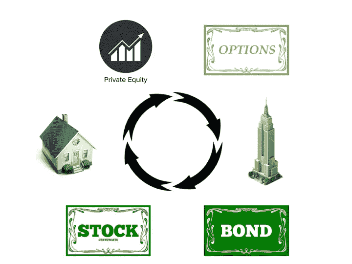
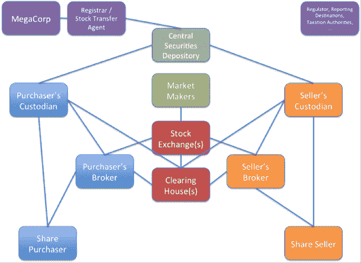
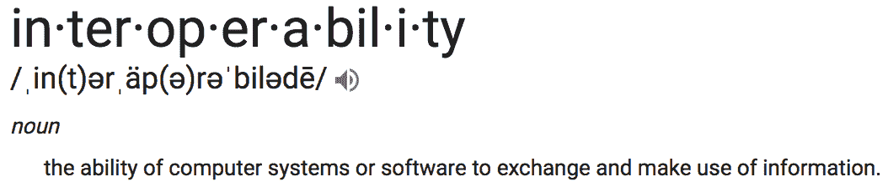

# 安全令牌理论

> 原文：<https://medium.com/hackernoon/the-security-token-thesis-4c5904761063>

去年夏天，我写了[传统资产令牌化](https://hackernoon.com/traditional-asset-tokenization-b8a59585a7e0)，其中我假设大量资产将转移到区块链所有权记录(以令牌表示)，从而改变社会持有和转移投资的方式。自去年夏天以来发生了很多事情。简而言之，它正在发生——支持安全令牌的基础架构正在构建之中。

我将证券代币定义为受证券法监管的任何基于区块链的价值表示。这包括代表股权、债务、衍生品和房地产等传统资产的代币，还包括被 SEC 视为证券的上市前公用事业代币。在本文中，我将重点关注传统资产部分，并阐述为什么安全令牌在记录和交易所有权声明的其他方法中占主导地位。综上所述，下面列出的特性构成了安全令牌将在未来几年在众多资产类别中被广泛采用这一论点的基础。

*   全天候市场
*   部分所有权
*   快速结算
*   直接成本的减少
*   增加流动性和市场深度
*   自动化合规
*   资产互操作性
*   扩大安保合同的设计空间

前四个非常直接，我已经在其他帖子中写过关于流动性和自动化合规性的文章，所以我将只简要回顾这六个主题。我将预先声明，这些特性中的一些可以通过关系数据库交付，然而，它们还没有。为什么不呢？我在**互操作性**部分提供了一些初步想法。我以一个关于安全设计创新潜力的部分作为结束，这是整篇论文中最有趣的部分。

# ***24/7 市场***

美国主要股票市场交易所每个工作日东部时间上午 9:30 开市，下午 4:00 收市，节假日除外。周五收盘后，你不能在 65 小时内再次在主要交易所交易你的股票。假日周末是 89 小时。在这些休息时间里，任何数量的信息事件都会发生。事实上，公司经常*故意* [在下午 4:00 后发布信息](https://www.auditanalytics.com/blog/tgif-4pm-news-dump/)

然而，专注于美国股市过于狭隘，因为这不仅仅是美国的现象。世界各地的团队都在致力于将资产令牌化，一些观察家认为这将加速全球市场的整合。24 小时交易时间将适应所有时区。这里值得注意的是，延长交易时间是有代价的。先前的研究发现，正常时间之外的交易的特点是[较低的流动性和较高的价差](https://onlinelibrary.wiley.com/doi/full/10.1111/j.1540-6261.2004.00646.x)。

我们需要一个全天候交易的*区块链*吗？当然不是，但这是计划的一部分。区块链生态系统是一个技术栈，其中“永远开放”是加密货币交易所事实上的标准，时间将证明安全令牌交易所是否采取类似的政策。

# ***分数所有权***

部分所有权不是区块链独有的，事实上，也不是本世纪独有的。联合所有权可以追溯到罗马共和国，或者更现代的荷兰东印度公司。然而，一些资产类别，如商业房地产和艺术品，继续以高单位成本为特征。

一个典型的散户投资者无法驾驭购买曼哈顿高层建筑所需的资源。投资者有两种选择:(1)放弃投资组合中的曼哈顿商业房地产风险敞口，或(2)通过中介机构(例如公开交易的房地产投资信托基金(REIT ))获得风险敞口，在这种情况下，风险敞口通常与不同质量和特征的其他建筑组合捆绑在一起。安全令牌提供了细分单个高价值资产的有效途径。随着更多的资产被细分，我们可以在零售层面实现更优化的资产配置。它让我们更接近于能够构建一个真正的“[市场组合](https://www.investopedia.com/terms/m/market-portfolio.asp)”

从规模上看，这也开启了新的投资策略。多空策略已在股票市场使用多年，并将扩展到任何所有权细分的资产类别。想象一下，你可以做多布鲁克林，做空曼哈顿，从而创建一个“纽约市场中性”的实际资产投资组合。诚然，这些策略需要证券代币借贷市场或合成衍生产品的发展来促进卖空。

随着部分所有权交易活动的增加，价格发现将得到加强，对于历史上由于单位成本高而不常交易的资产，市场将变得更加有效。

# ***快速结算***

首先要理解的区别是执行和结算的区别。交易执行是指记录买方和卖方之间以特定价格交换特定数量资产的协议。结算是指围绕所有权从卖方转移到买方(以及从买方支付给卖方)的文件记录完整。结算是指资产所有权的实际易手。

像纳斯达克和纽约证券交易所这样的交易所可以非常迅速地执行交易，但是 T2 结算资产转移需要时间。美国证券交易委员会[最近采用了](https://www.sec.gov/news/press-release/2017-68-0)，将大多数经纪自营交易的结算周期缩短至 T+2。“2”是天数，意味着交易执行后的两天内所有权不会易手。解决有限合伙人和有限责任公司权益的转让可能需要更长的时间。

理查德·布朗(Richard Brown)2014 年关于证券结算的文章[中的一个数字说明了结算公开股权交易的复杂性:](https://gendal.me/2014/01/05/a-simple-explanation-of-how-shares-move-around-the-securities-settlement-system/)

比特币或以太网的交易在几分钟内结算，而不是几天，但证券交易中涉及的各方要多得多——超过了大多数投资者的预期。存在卖空和融资融券等复杂情况。区块链有可能提高证券的结算速度，但它比加密货币更复杂。通过可互操作的智能合约，这些流程的自动化程度将决定结算速度的提高。

# ***降低成本***

围绕证券发行的咨询服务成本很高，这在短期内不会改变。然而，发行过程的几个部分最终将实现自动化，从长远来看，这将降低成本。

发行后，围绕所有权对账存在大量管理成本。当新创公司被收购时，将资本化表与潜在的购买协议和期权授予相协调是非常昂贵的。随着公司的成长，这个问题会变得更加严重。都乐食品公司的故事很有启发性:2015 年的一项法庭裁决要求向所有股东支付一笔费用。发行在外的股票有 3600 万股，但对 4900 万股提出了付款要求。有些事情显然不合情理。该决议归结为一项和解工作，以确定谁在何时拥有什么。上面链接的文章深入探讨了区块链能解决和不能解决这个问题的哪些方面，但结论是，当前的系统“开始显示出它的年龄”

当所有所有权声明都被标记化时，cap 表将通过代码实时进行协调。所有的合约特征，如清算优先权、棘轮和拖带权，都将融入到证券中，使经理们能够轻松地进行情景分析，以计算不同假设下的收益。

直接成本的降低并不是安全令牌最令人感兴趣的好处，但如果它减少了足够的管理成本，这本身就可能是诱导份额到令牌转换的充分条件，如目前正在执行的一个 [Anexio](http://fortune.com/2018/05/18/ico-coin-cryptocurrency-tokenization/) 。

# ***流动性和市场深度***

大多数私人资产相对缺乏流动性，这意味着所有权利益的交易成本很高。对于私人资产，如风险资本或私募股权基金中的 LP 权益，在基金清算前退出头寸通常会涉及大幅折扣，并且通常需要 GP 批准。

Harbor 首席执行官乔希·斯坦(Josh Stein)简洁地阐述了令牌化的好处:“锁定资本，而不锁定投资者。”令牌化基金允许基金经理投资于流动性差的资产，而不用担心赎回，同时基金投资者可以在二级市场获得流动性。所有者权益市场的深化和投资者流动性的增加预计将伴随着价值的增加。这就是经济学家所说的流动性溢价。除了风险投资，所有类型的私人证券通常流动性都很差。证券代币承诺为房地产和早期股权等资产类别带来类似的流动性收益。

高单位成本的可分性将这些资产置于更广阔的市场范围内，但市场深度也将通过其他几个渠道增加:(1)加密资产价格的上涨创造了数十亿的加密财富，其中一些人喜欢分散到更稳定的资产中，而无需回到菲亚特。(Bancor 等算法做市商展示了一些增加市场深度的前景。(3)证券代币可以缓解市场分割，让一个国家的买家更容易获得另一个国家的资产。正如我在下一节中所讨论的，安全令牌允许许多法规遵从性功能实现自动化，这可能会缓解一些监管摩擦，并促进全球市场的整合。

# ***自动合规***

当 [Harbor](https://harbor.com/) 在二月份退出潜行时，我提到了这个话题，但为了完整起见，我将在这里简单总结一下。(披露:我是 Harbor 的顾问)

令牌化证券的案例通常围绕着缓解交易摩擦，而最复杂的摩擦之一是遵守监管。它之所以复杂，至少有两个原因:

(1)法规可以沿着多个维度变化，例如资产类型、投资者类型、买方管辖地、卖方管辖地和发行人管辖地。这些维度中的每一个都有无数的监管排列和多个管理贸易的监管机构。

(2)监管合规性通常通过一系列单独的分类账来记录，每个分类账由促进发行和/或二级市场交易的实体构建。只有通过这些分类账的对账，所有权和合规性才在法律上有效。在这种环境下，保持合规性增加了交易的延迟和成本，分割了市场，并降低了流动性。

安全令牌的一个关键特征是它们是可编程的。订约环境的许多元素可以被硬连线到安全体系结构中。

当证券被令牌化时，合规可以自动化，这意味着受监管的交易将不再局限于围墙花园。安全令牌将可以在任何地方交易，包括分散的交易所。此外，将合规性融入代币可以帮助市场参与者驾驭跨境出售证券这一极其复杂的[任务。](http://www.europarl.europa.eu/document/activities/cont/201106/20110606ATT20781/20110606ATT20781EN.pdf)

安全令牌可能会使合规变得无摩擦，以至于监管者开始*要求*证券进行令牌化，这是我第一次从 Anthony Pompliano 那里听到的想法。这并不像看起来那么遥不可及——美国证券交易委员会对技术采用的强制要求是有先例的。早在 1996 年，SEC 就要求通过 EDGAR 对财务报表进行[电子存档](https://www.sec.gov/info/edgar/regoverview.htm)，后来又采用了 XML 技术。回想一下，公众对互联网的采用在 1996 年才刚刚开始，所以 SEC 在这方面走在了前面。1996 年只有 3600 万互联网用户，占世界人口的 0.9%。这与今天区块链的采用率相差不远。在撰写本文时，仅比特币基地就有超过 2000 万个账户。

# ***资产互操作***

互操作性是技术中最重要的概念之一。互联网本身本质上是一个协议栈，允许许多不同类型的软件交换和利用信息(即 TCP/IP、SMTP、FTP、SSH、HTTP)。这就是为什么我可以用 Outlook 撰写电子邮件，从我的。edu 地址发给一个地址为. com 的朋友，然后他通过谷歌浏览器阅读这封邮件。

技术发展的弧线向互操作性弯曲，而互操作性是由标准推动的。根据定义，标准必须有广泛的支持才能有效，这使得集中式解决方案更难吸引市场采用标准。区块链为我们提供了协议标准，每个人都可以在此基础上构建，这也是为什么这是重建当今金融管道的正确技术的重要原因。几乎可以肯定，它不会永远是正确的技术。要么区块链将变得更具可扩展性、资源密集性更低、互操作性更强，要么它们将被具有这些特性的新技术所取代。

不管我们怎么称呼它，重要的是“共识体系”仍然存在，为(理性的)经济行为者提供了一种去中心化的方式来调和真相。引导行动者在没有中央协调者的情况下履行这一职能的经济激励是真正的创新。(本文作者克里斯·伯尼斯克)

让我们花点时间来回答每个区块链怀疑论者都喜欢问的问题:“我们需要一个区块链吗？这难道不能用数据库来完成吗？”答案是肯定的，有些事情*可以*用集中式数据库来完成，但是它回避了一个问题“为什么还没有完成呢？”答案是，目前电子价值转移的集中式解决方案缺乏兼容性——它们彼此不对话。我无法从 PayPal 向 Venmo 或从 E*Trade 向 RealtyShares 发送价值。这些层不能互操作。

以太坊协议内的互操作性是由 ERC-20 令牌标准促进的，该标准允许钱包保存符合该标准的任何令牌。它使发行变得容易。例如，假设我拥有一些 ERC 20 代币，代表一栋公寓楼的所有权。每个月，租户支付的租金都会被大楼管理人员兑换成 ERC 20 稳定币，并按相应的比例打入所有业主的钱包。无论拥有者使用哪一个 ERC 20 钱包，它都可以保存所有权和分发令牌。

标准化所有权主张的想法并不新鲜，这就是你的经纪公司可以持有许多不同公司股票的原因。创新之处在于，ERC-20 是一个标准的例子，它允许我在同一个钱包中持有代表许多不同类型资产的安全令牌。这并不是说 [ERC-20 是唯一的解决方案](https://cointelegraph.com/news/top-ethereum-token-protocols-which-may-replace-erc20)或者以太坊是唯一具有这些特性的协议。可伸缩性仍然是一个主要问题。如果跨链互操作性成为现实，我们将有可能超越 ERC-20。许多团队目前正在[制作这个](https://www.youtube.com/watch?v=wq1fXPLktUQ)。

一些所有权要求，比如我房子的契约，实际上是在纸上，但这一点比数字和纸张更重要。大多数资产所有权已经数字化了。我没有自己持有的公共股票的任何纸质证书，坦率地说，我的经纪人也没有，尽管他们可以在被要求时出示它们。我没有我是其中一员的许多有限责任公司和有限合伙企业的文件。这些所有权声明记录在 pdf 文件中，并以电子方式签名。问题是，尽管所有这些权利主张都以数字形式表示，但数字系统并不都相互兼容，这阻碍了合规交易。

支撑一切都将被令牌化的观点的论点是基于一切都将是可互操作的愿望。如果全球资产的生态系统变得可互操作，这意味着我们可以在同一个平台上拥有商业建筑、早期股权、公司债券、短期国库券、单个家庭住宅和分散网络的所有权。此外，如果需要，我们可以在一个硬件钱包中自行保管这些类型的所有权声明。这意味着这些资产能够以契约的方式相互引用，并以自动化的方式进行交互。这可能意味着通过一个单一的界面，全球汇集所有资产类别的流动性。或许，这甚至意味着我们将持有更少的现金作为营运资本。令牌化的大部分主要好处取决于计算机系统和软件交换和利用信息的能力，或者用一句话来说:互操作性。

如果我们实现了资产的完全互操作性，将价值无摩擦地移入和移出多样化投资组合的能力将对我们如何管理短期流动性需求产生影响。图沙尔·贾恩在这里探讨了这个想法…

# ***设计空间扩展***

最近，卢·肯纳让我想起了一则关于电视历史的轶事，NYU 的斯蒂文斯教授在[这里](https://www.nyu.edu/classes/stephens/History%20of%20Television%20page.htm)总结道:

*“许多早期的节目，如《阿莫斯·安迪》(1951)或《杰克·本尼秀》(1950-65)，都是从早期电视的老大哥:网络电台借来的。新节目的新闻广播、情景喜剧、综艺节目和戏剧的大部分形式也是从广播中借来的*

技术的发展通常是为了改进我们已经知道和理解的东西。在电视出现之初，可能不太明显的是，视频内容将从几个主要网络的广播节目的视觉再现演变为 YouTube 上数百万用户生成的视频。

安全令牌的当前阶段类似于在电视上广播无线电节目。我们刚刚开始挖掘它所促进的证券设计的扩展空间，我们只是不知道它将如何从我们今天所处的位置发展。对于那些参与安全创造的人来说，这可能是未来十年创造力的巨大画布。

安全令牌允许我们构建以前无法执行的契约特性。它让我们更接近经济概念中的[完全契约](https://en.wikipedia.org/wiki/Complete_contract)。

这绝不是一个详尽的列表，但这里有一些想法来说明这一点…

***>所有权特征***

参照所有权持续时间的特征可能有助于塑造公司治理和缓解管理短视。Eric Ries 和其他人目前提出的一个例子是终身投票权。一句话的解释是，你持有股票的时间越长，你得到的票数就越多。这相当于创始人在上市前后创建一类拥有 10 倍投票权的股票时试图实现的目标，但这是一种生硬的手段。这是一个很有意思的例子，说明契约特性很容易转化为令牌。现金流权(股息)也可以根据所有权特征进行调整，以激励特定的所有权结构。在这些模型中有很多东西需要解开和思考，但关键是可编程证券将引发公司治理的创新。

***>访问权限***

访问权的价值没有得到足够的重视。例如，红杉资本(Sequoia Capital)的许多风险基金都是出了名的难以获得，甚至对一些机构投资者来说也是如此。红杉非常成功，有证据表明风险投资资产类别的表现是持续的，也许是因为网络效应。这表明，获得红杉的后续资金是一笔宝贵的资产。如果你已经是红杉的投资者，你通常会获得后续资金的分配，但这不一定是合同义务，而是基于关系。这意味着它不是直接货币化。

如果红杉基金的令牌化所有权要求根据合同授予持有人后续基金的参与权，则由于访问权的价值，令牌的交易价格可能会高于净资产值(NAV)。让我们更进一步，整合跨基金参考。红杉印度(Sequoia India)表示，或许一只需求较低的基金会在下一只旗舰基金中包含一笔未来配置。一旦资金被令牌化，历史上基于关系的访问将转向基于权利的访问，以释放价值。

访问权限有很多种。除了对金融资产分配的访问，安全令牌可以明确地赋予对房地产的物理访问，或者对专有事件的准入。餐馆的少数股东将获得优先座位或菜单外的项目。它可以促进研究的早期访问，或者提前访问软件版本。接入权将整合产品市场和资本市场，融合“所有者”和“用户”的概念，不仅仅是在分散的网络中，而是在现实世界中。获得折扣的条件可以是持有一组特定的资产，即发行者已经加入了公司伙伴关系。总之，访问权限是有价值的，当它们被嵌入到安全令牌中时，将被货币化。

***>解绑值***

通过吉姆·巴克斯代尔(Jim Barksdale)的渠道，我将有责任提供捆绑销售的例子，比如将访问权附加到所有权上，而不承认围绕分拆的设计空间。

考虑所有可以在证券中分解的价值来源。投票权可以被拆分出售给活动家。分红权可以像国库券一样分拆。公司可以分解特定的收入流并独立融资。在这种环境下，复杂的收入共享和支付瀑布协议变得简单多了。在这一类别中，有许多想法值得探索。

***>跨资产参照***

一旦资产类别在同一个沙盒中博弈，我们将看到跨市场收缩的创新。我对流动性紧缩期间交叉引用债务和股票特别感兴趣。本质上，我是在建议一个自动化的重构特性。例如，假设你的房子有抵押贷款，有一些资产净值，但是失去了工作。缺乏收入意味着你将无法获得房屋净值贷款来获取价值和支付你的款项。在这种情况下，你可能会拖欠贷款，导致丧失抵押品赎回权。

如果股权和债务都被令牌化，则可以设计一个合同特征，其中只要财产的价值超过贷款余额，抵押令牌持有者就开始接收股权令牌来代替付款。毫无疑问，会有一个惩罚函数，因为抵押贷款持有人不一定想要股权，并希望阻止借款人利用系统。然而，对于贷款人来说，取消抵押品赎回权的成本非常高，以股权形式获得价值，同时让自住业主留在原地，因为他们试图解决流动性紧缩，这可能是最佳解决方案。在这个模型中有许多事情需要考虑，但这是一个令人着迷的概念。降低止赎率有可能释放出大量的价值，包括金融价值和社会价值。

除了房屋净值，交叉抵押还有很大的空间。贷款将由各种我们没有考虑到的东西担保，这将导致多方面的信贷扩张。

# ***结论***

还有大量的工作要做，但安全令牌运动在这一点上有很大的势头。围绕区块链的大肆宣传将为这一势头推波助澜，但只有实现真正的利益才能长期维持这一势头。

我正在组织一场[会议](http://securitytokensummit.io)，会议将于 6 月 11 日在曼哈顿与[安全令牌学院](https://www.securitytokenacademy.com/)举行，我是那里的首席战略顾问。我们将探讨为应对仍然存在的巨大挑战而建立的交易所和交易平台的现状。如果这些挑战能够得到解决，总有一天将会有一个强有力的案例来创造大部分证券作为代币。

在规模上，我们不会称它们为安全代币，我们只会称它们为证券。

— -

延伸阅读:

[传统资产令牌化](https://hackernoon.com/traditional-asset-tokenization-b8a59585a7e0) (McKeon)

[流动性关乎市场深度，而非魔力](https://hackernoon.com/liquidity-is-about-market-depth-not-magic-345d9f12f40b)(麦肯)

自动化合规的承诺

[令牌化证券官方指南](/@apompliano/the-official-guide-to-tokenized-securities-44e8342bb24f)

[安全令牌生态系统官方指南](/@tatianakoffman/your-official-guide-to-the-security-token-ecosystem-61a805673db7)

美国证券的未来将被标记化

在过去的几个月里，通过与许多人讨论这些想法，本文受益匪浅。我感谢 Ryan Alfred、斯潘塞·鲍嘉、安迪·布罗姆伯格、克里斯·伯恩斯克、亚历克斯·埃文斯、马特·黄、图沙尔·贾恩、Nikhil Kalghatgi、卢·肯纳、迈克尔·科岗、丹·麦基翁、本·奥尼尔、亚历克斯·帕克、安东尼·蓬皮亚诺、鲍勃·雷梅卡、大卫·萨克斯、德里克·施洛斯、达什·辛格和乔希·斯坦提供的有益意见。我会不时更新这个帖子，以纳入更多的反馈。所有的错误都是我自己的。