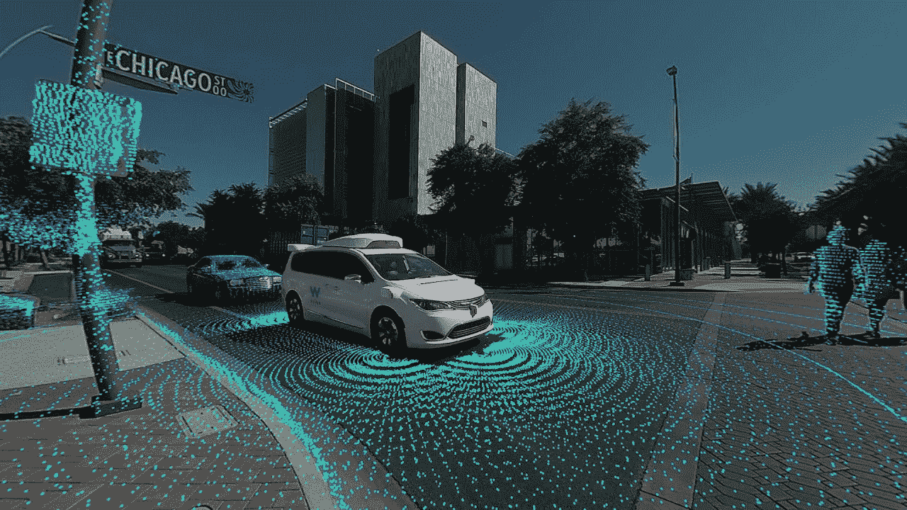
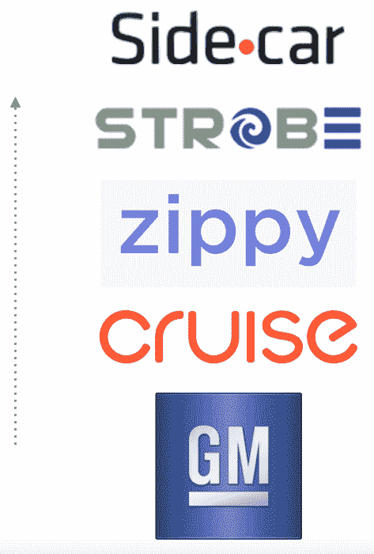
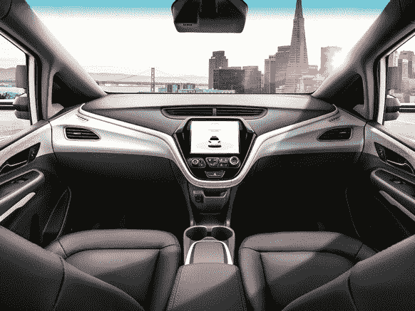
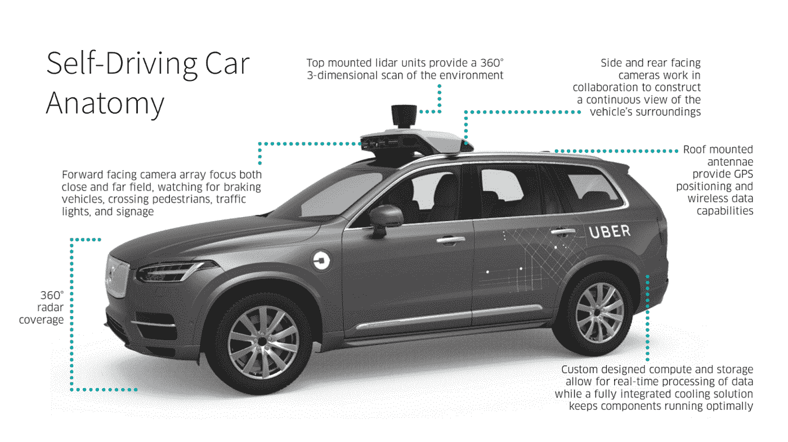
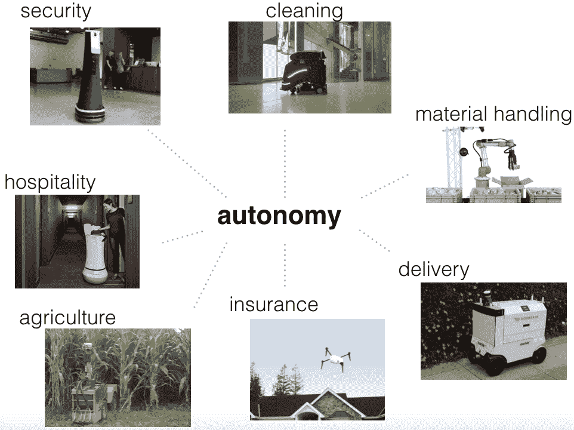

# 自动驾驶比赛

> 原文：<https://medium.com/hackernoon/the-self-driving-race-fceeebe455ae>

杰森·科斯塔

目前还不清楚自动驾驶汽车何时会大规模上路，但这需要一些时间。但有一点是明确的，那就是自动驾驶汽车竞赛将是我们这个时代最激动人心的商业竞争之一，它将在未来十年甚至更久的时间里继续展开。我认为，世界正在慢慢从汽车拥有模式转向“移动即服务”模式。在这个世界里，人们可以走出家门或办公室，走向一辆等待的自动驾驶汽车，准备带他们前往下一个目的地。赢得这条价值链的赌注将是巨大的——已经有很多玩家在这里争夺胜利。

## 重量级人物

# **Waymo**

谷歌在这一领域的意图耐人寻味。虽然优步的野心，使单位经济每次乘坐的工作是明确的，在我看来，谷歌的计划是关于分配。普通美国人每天花在汽车上的 [~1 小时](https://www.washingtonpost.com/news/wonk/wp/2016/02/25/how-much-of-your-life-youre-wasting-on-your-commute/?utm_term=.973f81478c31)是软件服务“时间可用性”的最后一个重要领域。如果一个人在汽车自动驾驶时有一个小时的空闲时间专注于驾驶舱内的其他任务，这就为谷歌赚钱开辟了更多搜索的可能性。更重要的是，汽车的驾驶舱(很像家)将是谷歌助手、YouTube 和整个 G 系列产品在用户日常生活中占据一席之地的关键战场。汽车将成为一种分发机制，就像手机一样，当用户需要一个数字礼宾时，谷歌可以保持其优势。

如果我猜的话，谷歌的这种叫车服务的发射台会在谷歌地图里面。当人们打开该应用程序来计划他们的下一次旅行时，他们将能够在地图中自然地招呼 Waymo 车辆。这将使 Waymo 服务一开始就拥有超过 10 亿用户。

# **通用汽车**

在所有关注 autonomy 的原始设备制造商中，通用汽车似乎是采用垂直整合方法最积极的。在过去的几年里，他们收购了几个层次的公司:Cruise(软件控制)，Strobe(激光雷达/感知)，Sidecar(车队协调)，Zippy (SLAM，计算机视觉)。其他原始设备制造商也在这方面下了大赌注，例如福特公司在阿尔戈的~美元 1B“投资”;但是通用汽车是最激进的。与更前沿的技术垂直集成的好处是显而易见的:通过不必处理模块化合作关系中固有的外部依赖性，团队可以通过一起“在帐篷中”来加快其走向市场的步伐。因此，在中短期内，虽然这种新生技术具有如此高度的发展相互依赖性，但我相信很可能会看到许多原始设备制造商试图垂直整合许多核心技术资产。

令人兴奋的是，传统的原始设备制造商并没有停滞不前。他们是非常精明的玩家，其中许多人已经存在了一个世纪甚至更久。作为行业的现任者，原始设备制造商正在玩一场与他们之前的唱片公司或手机制造商不同的游戏。他们不愿意被商品化。原始设备制造商希望拥有端到端的品牌体验，他们中没有人希望将驾驶舱让给谷歌。大规模制造汽车将是他们这样做的主要杠杆点，因为这可以说是价值链中最难的部分——看看现在特斯拉的情况就知道了。预计未来几年将会看到原始设备制造商的整合浪潮。

GM’s Cruise AV is a modified Chevy Bolt, planned for a 2019 release.

# **优步**

早在 2015 年，当优步从卡耐基梅隆大学挖走了一大批研究人员和机器人专家时，这套装备就说明了他们是多么专注于建设自己的自动驾驶汽车技术。如果说对于优步是否认真维护自己的由 ATG 提供动力的 av 车队还存在任何困惑的话，那么随着[订购价值约 14 亿美元的 24k 沃尔沃](https://www.bloomberg.com/news/articles/2017-11-20/uber-steps-up-driverless-cars-push-with-deal-for-24-000-volvos),这场争论已经结束了

降低游乐设施的成本曲线对于优步寻求盈利是必不可少的。从某种意义上来说，对于打车服务来说，让 AV 发挥作用更像是一个生存问题。他们必须到这里来掌握自己的命运。自动驾驶汽车非常昂贵，但随着交通从汽车所有权过渡到移动即服务，通过最大化使用来摊销资产的能力将成为现实。优步将让这些汽车每年尽可能多的行驶里程——每年超过 10 万英里。当他们将每英里的成本推近 1 美元/英里时，单位经济学突然变得非常有趣。

# **特斯拉**

考虑一下特斯拉在自动驾驶汽车领域的计划是很有趣的。这个玩家最感兴趣的部分是他们迄今为止收集的数据。他们有相当数量的汽车在路上行驶，即使这些汽车行驶的总里程中只有一小部分使用了自动驾驶辅助软件，这仍然是大量的数据。启用影子模式后，特斯拉能够捕捉更多数据以进行验证和确认(即自动驾驶汽车*应该*做什么，而不是它*会*做什么)。

不清楚的是特斯拉对自主的渴望。我的感觉是，特斯拉真的专注于打造一款美观的*电动*汽车，以适应成为一家能源公司(太阳能电池板、电池组等)。)，驾驶员辅助系统作为车辆的一部分，是追加销售的一个很好的补充。该公司今天仍然没有使用激光雷达，我怀疑这与 BOM 成本关系不大，更多的是因为它破坏了汽车当前外形的美观。不过，在我看来，这是一个信号，表明 L4 能力对特斯拉来说根本不那么重要。

# **第 1 层**

去年年底，当公司[以 4 . 5 亿美元收购](https://www.theverge.com/2017/10/24/16533534/delphi-nutonomy-acquisition-450-million-self-driving) NuTonomy 时，德尔福引起了轩然大波。这是一个强烈的信息，即在自动驾驶主导地位的竞争中，一级市场不会落后。很有可能这些玩家(大陆，麦格纳等。)考虑软件控制、映射、验证等元素。成为一级供应商自己生产并销售给原始设备制造商的汽车部件。

自主堆栈中有许多层可能会很快转移到更模块化的服务。无论是谁解决了这些问题，都将从中获益，这些玩家最终可能凭借自己的能力成为新的一流玩家。更快模块化的一些潜在机会领域包括:

*   车辆安全
*   标签和注释工具
*   远程操作
*   网络完整性
*   验证和确认
*   传感器/激光雷达
*   高清映射
*   模拟服务
*   车内体验

# **自主系统&其他垂直行业**

如上所述，自治系统即将到来。他们进入其他领域的速度比进入公路领域要快。最终，让 L4 系统上路将是一个较长的时间范围，因为故障案例非常高。如果自动驾驶车辆在高速行驶时出现问题，死亡率是一个非常现实的可能性。

随着技术变得越来越便宜(激光雷达成本减半，等等。)和更高的性能(图像分类快速改进等)。)，自动驾驶汽车的许多工程创新，如传感器、运动规划和控制，正在溢出到其他垂直领域。我猜想，我们将很快看到自动化在其他行业的大规模加速发展。

这些市场将更快实现，因为这里的失败案例要安全得多:如果送货机器人在以大约 3 英里/小时的速度行驶时意外撞到了什么东西，一包眼镜可能会破碎，但人受重伤的可能性极低。事实上，如果今天追求 L4 的许多软件控制玩家进入最后一英里交付的自动化货物运输市场，我不会感到惊讶，因为该市场很可能在自动化人员运输之前实现。

不管是哪种情况，在接下来的十年甚至更长的时间里，观看自动驾驶比赛都将会非常有趣。赌注很高，但无数其他行业类别将从自主系统中受益匪浅。希望我们能在这个过程中看到一系列伟大的新公司的诞生。如果你现在正在建立这样的公司，我们 GGV 很乐意与你交谈。

*杰森·柯斯达目前是* [*GGV 资本*](http://www.ggvc.com/companies) *的风险合伙人。这篇文章是正在进行的系列文章的一部分，旨在探索消费产品开发、平台分析和策略等主题。*