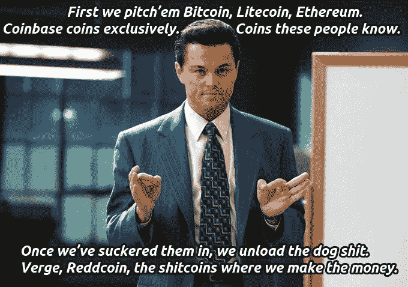
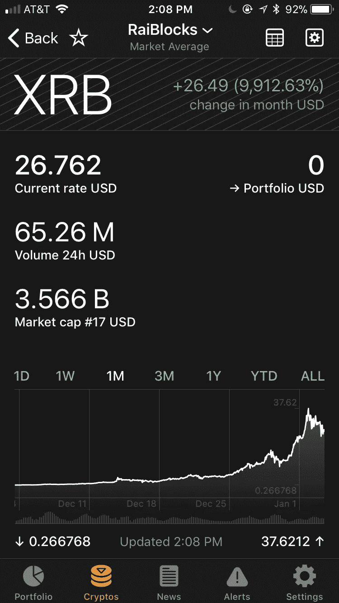
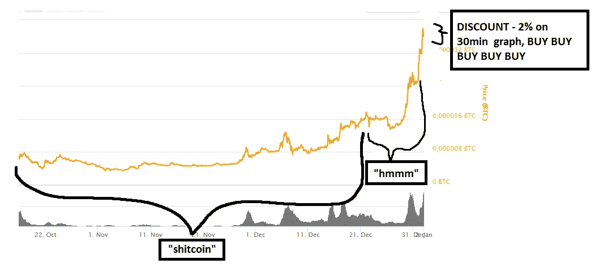

# r/加密货币炒作币的自我实现预言

> 原文：<https://medium.com/hackernoon/the-self-fulfilling-prophecy-of-r-cryptocurrency-hype-coins-ddd77332e50e>

## 投资者没有尽职调查的 FOMO 现象

credit: [u/Icecream52](https://www.reddit.com/r/CryptoCurrency/comments/7mj9hh/game_of_shills/?utm_content=title&utm_medium=user&utm_source=reddit&utm_name=frontpage)

你已经花了几天时间研究区块链和加密货币。你的[谷歌](https://hackernoon.com/tagged/google)搜索历史可能看起来像这样:

> *《像我 10 岁一样解释区块链》*
> 
> *“像我 5 岁一样解释区块链”*
> 
> *《解释歌舞中的区块链》*

你终于觉得自己消息灵通，可以认为自己是区块链社区的一员了。

**我认为目前互联网上最好的通用加密货币社区存在于**[**reddit.com/r/cryptocurrency**](http://reddit.com/r/cryptocurrency)**。**在这里，超过 375，000 名用户发布和评论区块链和加密货币领域的新兴技术、突发新闻和可投资项目。版主对无先令、FUD(恐惧、不确定、怀疑)和其他市场操纵策略制定了严格的规则，以保留一个进行建设性讨论的论坛。

然而，到底什么构成了先令，或者促进一个没有深思熟虑的讨论余地的项目，却没有定义。

理想情况下，人们会投资于他们真正相信并且已经做了彻底研究的项目。他们将对团队、白皮书和项目旨在评估的市场需求进行尽职调查。这些敬业的人通常会存在于项目特定的子编辑上，比如 r/stellar、r/ethereum、r/requestnetwork 等。

当有关于一个项目的突发新闻时，无论是企业合作还是主网发布，帖子都会出现在 r/cryptocurrency 的首页，375，000+人将能够查看它。这些帖子可能有利于辩论和讨论，而 shill 的帖子则漫无边际地谈论“为什么‘x’硬币被严重低估。”

先令一枚硬币是有道理的。如果人们了解到一个项目，并看到它的价格飙升，这就开始了一个 FOMO-FUD 循环，Bobby Azarian 的伟大文章[对此进行了进一步阐述。](https://www.psychologytoday.com/blog/mind-in-the-machine/201712/how-fear-is-being-used-manipulate-cryptocurrency-markets)

> 根据 Azarian 的说法，“这些人并不是想在他们的促销中不诚实；他们被硬币的潜力和创造者的承诺所诱惑。许多投资者成为他们所选择的硬币的传播者，因为一个人的财务成功取决于硬币的持续增长。”

人们会看到 r/cryptocurrency 上的 shill 帖子对本月的新口味进行了投票，并会在没有对该项目进行任何必要的尽职调查的情况下进行恐慌购买。如果项目是可靠的，那么他们可能会走运，不知不觉地投资到一个赢家身上。如果项目不稳固，并且有严重的内部问题，那么投资者就会受到因害怕错过项目而导致的抽水和倾倒的支配。

RaiBlocks、Verge、Icon 和 VeChain 是 12 月份 r/cryptocurrency 上的月度热门产品，看看它们的 1 个月图表，可以很惊讶地看到由于 reddit 页面上开始的大肆宣传，这些硬币的表现如何。

XRB corrected down to a 9,912.63% December increase after hitting $37.62 briefly.

追逐一个大泵是非常诱人的，尤其是当传统逻辑并不总是适用的时候。当一枚硬币在一天内涨满 100%时，你通常会期望它在再次上涨之前呼气并修正一点。然而，正如您可能已经看到的 Raiblocks，它每天持续增长 30%以上。

在“月亮说话”猖獗的硬币的子漩涡的回声室里，这尤其诱人。

XRB has rendered traditional panic buyer logic useless. credit: [u/Squid2g](https://www.reddit.com/r/CryptoCurrency/comments/7nivdb/crypto_trading_logic/)

**R/Cryptocurrency 是一个令人难以置信的社区，**但对一个项目保持健康的怀疑态度并进行尽职调查对于保护你的投资至关重要，尤其是在这个人人都像天才的牛市期间。

# 即使这意味着失去 5-10%的收益，也要理解这个项目，以及它是否真的有存在的必要。如果公司走向广泛采用，你放弃的小收益在未来将是微不足道的。

愉快的研究和投资。