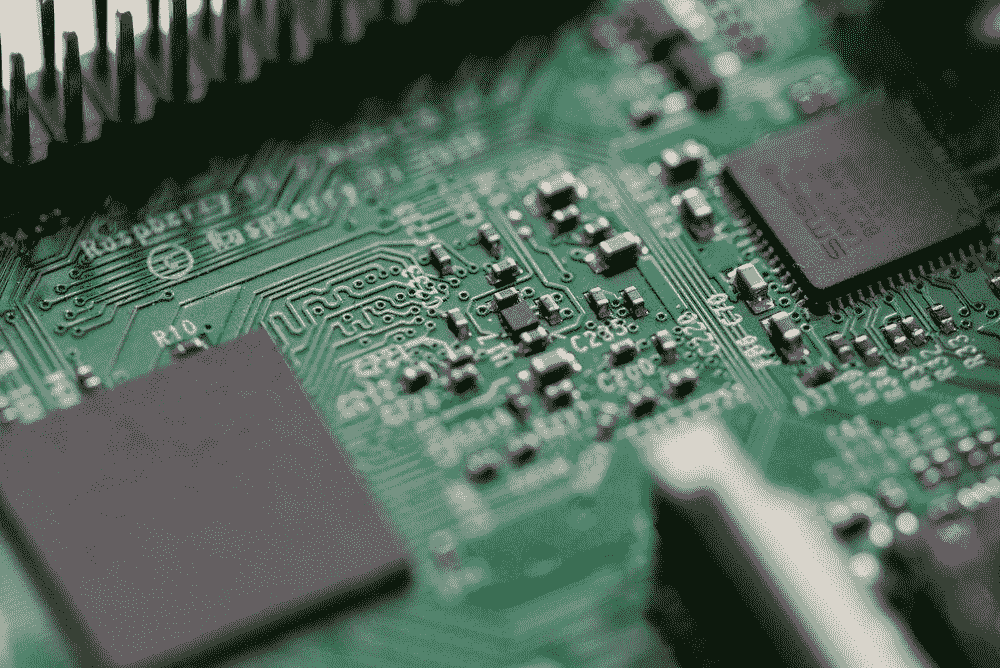

# 信号

> 原文：<https://medium.com/hackernoon/the-signal-e1686be6f749>

## *50 多家高增长公司与*一起开启您的职业生涯


成长过程中最具挑战性的一个方面是弄清楚如何以及在哪里度过你的时间。“职业建议”的世界异常嘈杂。教授、朋友、父母、不相干的媒体作者——每个人都在告诉你，在你的生活中，你应该做什么，不应该做什么。

好消息→ **这是你的生活！你可以决定如何以及在哪里度过你的时间。另一个好消息是，世界变得越来越大…你可以做很多令人兴奋的事情…你可以去无数的地方学习…**

> *但是为什么我们大学毕业后却满足于传统的工作，而这些工作并不能释放我们真正的潜力呢？——* [StartupSift](https://medium.com/u/c080acd50ca9#/) & [分组讨论列表](https://breakoutlist.com/)。
> 
> *   你会注意到，这些公司中的许多可能会也可能不会为你的“特定角色”而招聘。其他学校有成千上万饥饿的申请者。没关系。你可能需要发电子邮件，创造一个职位，或者寻找其他独特的方式来脱颖而出。你能做到的！

```
**have thoughts? need help? i'd love to chat :)****message me on** [**twitter**](https://twitter.com/jrdngonen) **or** [**here**](https://jordangonen.com/) **-** [**jordan gonen**](https://twitter.com/jrdngonen) **🌊**
```

*事不宜迟……这是……*

# *信号:50+家高成长公司启动你的职业生涯*

# *🚀(2018 年末)*

# ***金融***


## [*Blend*](https://blend.com/) *(声明:我在 Blend 实习过)*

> *Blend 的技术使顶级抵押贷款机构变得更加高效、合规和对借款人友好。*

## [*Brex*](https://brex.com/)

> 创业公司的公司卡。在线申请，无需个人担保，无需保证金，专为现代企业打造。由 Visa 网络提供支持。

## [卡塔 ](https://carta.com/)

> *Carta 帮助私营公司、上市公司、投资者和员工管理他们的资本表、估值、组合投资和股权计划。*

## [*现金*](https://cash.app/)

> *Square 是一家商业服务聚合和移动支付公司，旨在通过技术简化商务。Square Cash 是他们的移动应用程序(Venmo 的竞争对手)……“最简单的即时收发资金的方式。”*

## [比特币基地](https://www.coinbase.com/)

> *比特币基地是一个在线平台，允许商家、消费者和交易者使用数字货币进行交易。它允许其用户创建自己的比特币钱包，并通过连接他们的银行账户开始购买或出售比特币。*

## [*甚至*](https://even.com/)

> *“忙碌的人如何掌握自己的金钱。”我们与雇主合作提供福利，这样员工可以按需获得报酬。*

## [](https://paystack.com/)

> **面向非洲的现代在线和离线支付。**

## *[*幕府将军*](http://www.shoguninc.com/)*

> **幕府企业是一家家装金融科技平台。**

## *[*条纹*](https://stripe.com/)*

> *Stripe 是运营互联网业务的最佳软件平台。他们每年为全球有远见的企业处理数十亿美元的资金。*

## *[*泰坦*](https://www.titanvest.com/)*

> **这家现代投资公司致力于通过积极管理的投资组合获得非凡的回报和咨询。**

> *生活不是一次彩排——也许就是这样。让它有价值。时间极其有限，而且过得很快。做让你快乐和满足的事情——很少有人在死后几百年还能被人记得。*
> 
> **—山姆·奥特曼**

# ****保险/法律****

**

## *[*心房*](https://www.atrium.co/)*

> **Atrium 构建产品和服务来帮助自动化法律工作流程、创新新流程，并帮助公司识别新客户。**

## *[*透明封面*](https://clearcover.com/)*

> **Clearcover 是更明智的汽车保险选择，以更少的钱提供更好的保障。**

## *[*捐款*](http://donotpay.com)*

> *DoNotPay 是一个在线机器人律师，允许任何人免费自动申请美国、英国和加拿大的庇护。*

## *[*柠檬水*](https://www.lemonade.com/)*

> *柠檬水为房主和租房者提供由人工智能和行为经济学驱动的保险。*

## *[*新前沿*](https://www.newfrontinsurance.com/)*

> *Newfront 是现代商业保险经纪公司。没有长达 20 页的申请，没有令人困惑的保单条款，也没有痛苦的续保周期。Newfront 的经验丰富的经纪人和技术消除了商业保险的头痛。*

## *[根*根*根](https://www.joinroot.com/)*

> **Root 是一家移动优先的保险公司，它使用一个应用程序主要根据司机实际驾驶的方式而不是他们的身份来对他们进行评级。**

> **“把激情和贡献结合起来，才是极致的奢华。这也是一条通往幸福的清晰之路。”**
> 
> **—雪莉·桑德伯格**

# ****HR****

## *[*兴致勃勃*](https://gusto.com/)*

> **Gusto 为企业提供基于云的薪资、福利和人力资源管理解决方案。**

## *[*虎木*](http://humu.com/)*

> **Humu 是一家人力资源公司，通过科学和机器学习让工作变得更好。**

## *[*荡漾着*](https://www.rippling.com/)*

> *Rippling 提供基于云的员工管理解决方案，从 HR(工资、福利、合规)到 IT(计算机、软件、安全)。*

## *[*Truework*](https://truework.com/)*

> **Truework 是一款人力资源工具，可以自动响应贷款人、房东和其他需要核实雇佣关系的人。**

> *抓住任何机会，或者任何看起来像机会的事情。它们很稀有，比你想象的要稀有得多。*
> 
> **—塔勒布**

# ****医疗保健/生物****

**

## *[*依据*](https://www.mybasis.com/)*

> **Basis 是一款允许人们处理和应对心理健康问题的应用程序，并提供与训练有素的专家的当天联系。**

## *[*辅因子基因组学*](https://cofactorgenomics.com/)*

> **RNA 中的领导者。利用多维基因表达模型的力量更有效地治疗癌症。**

## *[前进*前进*前进](https://goforward.com/)*

> **Forward 为您提供个性化的初级保健，结合世界一流的医生和先进的医疗技术，包括遗传学、癌症筛查&健康跟踪。**

## *[*陀螺仪*](https://gyrosco.pe/app/)*

> **Gyroscope 是人体的新操作系统，有一个应用程序和网站可供人们查看他们的健康分析。**

## *[Hims](https://www.forhims.com/)*

> **Hims 是一个电子商务健康品牌，专为男性打造，提供护肤、勃起功能障碍和脱发产品。他们与医生合作，通过应用程序或网站开出非那雄胺和西地那非(伟哥的活性成分)。**

## *[*MDAcne*](https://www.mdacne.com/)*

> **MDacne 是一个使用人工智能和计算机视觉来帮助患有痤疮的人的移动平台。**

## *[*Ro*](https://ro.co/)*

> **Ro 是一家使命驱动的医疗保健技术公司，处理从在线诊断到药物交付的一切事务。**

## *[*合成*](https://techcrunch.com/2018/10/23/synthego-raises-110-million-to-make-gene-editing-technologies-more-accessible/)*

> *Synthego 由前 SpaceX 工程师创立，是基因组工程解决方案的领先提供商。他们的旗舰产品 CRISPRevolution 是一个合成 RNA 组合，旨在用于 CRISPR 基因组编辑和研究。*

## *[*滑索*](http://www.flyzipline.com/)*

> **Zipline 生产改善医疗保健和拯救生命的产品。**

> *我总是做一些我还没准备好去做的事情。我想这就是你成长的方式。当有“哇，我真的不确定我能做到这一点”的时候，你度过了这些时刻，那就是你有突破的时候。—玛丽莎·梅耶*

# ****食物****

**

## *[*云厨*](https://www.cloudkitchens.com/)*

> **推动按需食品经济。他们提供基础设施和软件，使食品经营者能够以最少的资本支出和时间开设只送货的场所。**

## *[*全面收获*](https://fullharvest.com/)*

> *全面收获帮助种植者获得最大收获，食品公司通过将农场剩余产品推向市场来节省资金。它们是一个 B2B 平台，将大型农场和食品企业连接起来，出售折扣明显、但非常好的剩余产品和形状不完美的产品，否则这些产品就会被浪费掉。*

## *[*不可能*](https://impossiblefoods.com/food/)*

> **不可能的食物开发了新一代完全由植物制成的肉类和奶酪。他们从绿色植物、种子和谷物中选择特定的蛋白质和营养物质，重新创造肉类和奶制品的体验。**

## *[*妖孽吃*](https://www.ubereats.com/en-US/) *(声明:本人在优步实习)**

> **Uber Eats 是一个送餐平台，让你从最喜欢的当地餐馆获得美食就像要求搭车一样简单。**

## *[*唤醒*](https://sensei.com/)*

> **老师在这里指引你走向更大的幸福。他们的产品和体验生态系统的设计只有一个目的:让你成长得更好。**

> *人生成功的两种方式:做一些值得写的事情或者写一些值得读的东西—*
> 
> *本·富兰克林*

# ****政府****

**

## *[*和*](https://www.anduril.com/)*

> *安度瑞将顶尖的技术人才投入到解决最复杂的国家安全挑战中。他们正在建设下一代技术，这将帮助和保护那些在前线保卫国家和国家利益的人。*

## *[*市民*](http://citizen.com/)*

> **对告知和保护公众的技术的需求从未如此之大。公民应用程序为人们提供信息，帮助他们保护家庭、社区和城市的安全。每当附近发生犯罪或其他重大事件时，用户都会收到即时通知。**

## *[](https://coord.co/)*

> ***Coord 是一家移动公司，通过深度集成创造无缝移动和自驾车体验。他们提供自行车共享 API，路边 API，通行费 API，路线 API 等。***

## **[*人行道实验室*](https://www.sidewalklabs.com/)**

> ***Sidewalk Labs 是一家新型公司，与城市合作开发解决大城市问题的产品。他们正在建立一个平台和一套城市应用程序，以加速世界各地城市的创新。***

> ***无论何时你* [*找到一桶*](https://firstround.com/review/Keith-Rabois-on-the-role-of-a-COO-how-to-hire-and-why-transparency-matters/) *，你都应该立刻雇佣他们，不管你有没有钱给他们，有没有角色给他们。闭上眼睛。—* [*凯斯拉布瓦*](https://medium.com/u/4f50d3e8ae9e?source=post_page-----e1686be6f749--------------------------------)**

# *****物流*****

****

## **[*护航*](https://convoy.com/)**

> ***车队是一个由技术支持的卡车运输公司组成的网络，为卡车司机和托运人改造 8000 亿美元的卡车运输行业和物流生态系统。使用技术，车队匹配可靠的卡车(“承运人”)与需要运送货物的公司。***

## **[*Flexport*](http://flexport.com/)**

> ***在 Flexport，他们相信合作经营的世界会更美好。这叫做全球贸易。货运代理是价值 1 万亿美元的行业，是全球贸易的循环系统——没有货运代理，全球贸易根本就不存在。***

## **[*纳比斯*](https://www.getnabis.com/)**

> ***Nabis 为大麻企业提供最可靠、一致和安全的物流解决方案。无论你是一个品牌，耕耘者，中间加工商，或最终产品制造商，纳比斯为您提供了一个企业规模的分销网络。***

## **[Nuro](https://nuro.ai/)**

> **NURO 是一家科技公司，旨在加速机器人技术为日常生活带来的好处。他们是一个由企业家、工程师、设计师和科学家组成的团队，相信他们今天在机器人和机器学习方面取得的进步将极大地改善他们明天的生活方式。**

## **[](https://www.rubiconglobal.com/)**

> ****Rubicon Global 是一家技术公司，为全球企业和政府提供废物、回收和智能城市解决方案。他们开发和部署了一整套基于云的解决方案，以帮助其客户和独立废物运输商网络实现更可持续的废物和回收实践，发现成本节约，并通过数据分析改善运营。****

## ***[](https://www.uber.com/business/)**(声明:我在优步实习)*****

> ***获得一体化解决方案，简化企业出行方式。它是你公司所有地面运输的数字“总部”。清楚了解您的所有旅行活动，并自动计费、支出和报告。轻松为对您的业务至关重要的任何人提供乘车服务，甚至同时提供多项乘车服务。***

## **[*优步货运*](https://www.uberfreight.com/) *(声明:本人在优步实习)***

> **优步货运是一款为承运商和托运商牵线搭桥的应用。承运人只需点击一个按钮，立即预订货物，你看到的价格就是你得到的价格——不再需要来回谈判。**

> **在网上和对你感兴趣的事情很在行的人交朋友。互联网是你比前几代人拥有的最大优势之一。利用它。——[*帕特里克·科利森*](https://medium.com/u/a9394d623fd6?source=post_page-----e1686be6f749--------------------------------)**

# *****房地产/建筑*****

****

## **[*Buildzoom*](https://www.buildzoom.com/)**

> **BuildZoom 有一个简单的目的:帮助你找到任何工作的完美承包商——商业或住宅。使用 BuildZoom 就像向邻居征求建议一样——除了不仅仅是向一个人征求建议，你是在调查你社区中的每一个邻居，分析他们的反馈，详尽地研究工作历史和证书，然后才做出最终决定。**

## **[*平房*](https://bungalow.com/)**

> ***平房是一个住宅房地产平台，为租房者提供更方便、灵活和公共的居住解决方案。它通过与房主签订长期租约来利用现有的住房供应，并在美国各城市一些最理想的社区提供多卧室住宅。***

## **[*开门*](https://www.opendoor.com/)**

> ***Opendoor 可以让你只需点击几下鼠标就能收到房屋报价，并在几天内售出，消除交易中所有令人头疼的问题、不确定性和风险。他们的总部位于加利福尼亚州的三藩市，已经从科斯拉风险投资公司、GGV 资本公司和 Access…* 获得了总计 6 . 45 亿美元的风险投资**

## **[*感受性*](https://www.qualia.com/)**

> ***Qualia 是一个基于云的交易平台，可为参与房地产交易流程的所有人提供无缝、安全的协调。***

## **[*游山玩水*](https://www.wanderjaunt.com/)**

> ***WanderJaunt 为来自世界各地的旅行者、房主和住宿者提供技术支持的物业管理解决方案。***

> ***然后最后一块其实是最难的，就是具体知识。特定知识是你所拥有的知识，它让你做一些其他人不知道如何去做，也不能被训练去做的事情。—*[](https://medium.com/u/67f5049293c7?source=post_page-----e1686be6f749--------------------------------)**

# ******教育/生活/人才******

****

## **[](https://www.holloway.com/)**

> ***经过数百小时的研究、写作和编辑，他们的综合指南可以帮助你做出更好的决定。***

## ***[*孵化婴儿*](https://www.hatchbaby.com/)***

> **他们的使命是为父母带来一系列智能产品，这些产品利用科技和以用户为中心的设计，让照顾婴儿变得更容易。**

## **[*λ学校*](https://lambdaschool.com/)**

> ***Lambda School 免费培养人做软件工程师，换取未来收入分成。***

## **[*先锋*](https://pioneer.app/)**

> **雄心勃勃的外来者的家。他们正在建立一个由有创造力的年轻人组成的社区，在全球范围内从事有趣的项目。**

## **[*三字节*](https://triplebyte.com/)**

> **Triplebyte 认为，目前的技术招聘流程不足以帮助工程师展示他们的优势。他们致力于建立更好的流程。你可以在他们的宣言中读到更多关于他们对招聘的看法。**

## **[*7000 万个工作岗位*](https://www.70millionjobs.com/)**

> **7000 万份工作是第一个为有犯罪记录的人设立的营利性就业委员会。**

> ***“每个人都是从非常非常卑微的起点开始的”——*[*丹尼尔·格罗斯*](https://medium.com/u/a733435b5e93?source=post_page-----e1686be6f749--------------------------------)**

# *****社交/消费*****

****

## **[](https://brandless.com/)**

> ****Brandless 是一家提供无品牌和基本产品的电子商务公司。****

## ***[*跳绳*](https://jumprope.com/)***

> ***创建并分享食谱操作指南。导出到 Instagram Stories、IGTV、YouTube、您的个人网站等。***

## **[*大师级*](http://masterclass.com/)**

> ***MasterClass 是一个顶级的在线教育平台，通过尖端的技术平台为全球学生带来世界级的专家和知名讲师，旨在通过在线视频提取知识和创造有意义的体验，从而重新定义数字学习体验。***

## **[*沙盒 VR*](https://sandboxvr.com/)**

> ***沙盒 VR 结合了最新的 VR 硬件、电影质量的实时动作捕捉和 AAA 级的内容体验，打造地球上最好的 VR 体验。句号。这是团队建设、公司活动和聚会的完美活动。***

> **人们总是说，你应该把生命的每一天都当成最后一天来过。我认为你应该过你的生活，好像它会永远继续下去；每一天都如此美好以至于你不想让它结束。—彼得·泰尔**

# ****Dev****

****

## **[*占卜*](https://www.augur.net/)**

> ***Augur 建立在以太坊之上，以太坊是一个类似于比特币网络的去中心化区块链网络。利用这项技术，他们的市场可以有效地消除交易对手风险和集中式服务器，同时通过采用比特币等加密货币创建一个全球市场。***

## **[*清零位*](https://clearbit.com/)**

> **Clearbit 开发商业智能应用编程接口。Clearbit 的使命是建立商业数据的新标准。简而言之，Clearbit 正在改变现代企业作为其销售、营销和产品工作流程的一部分获取和操作数据的方式。**

## **[*深图*](https://www.deepgram.com/)**

> **Deepgram 通过构建定制的语音识别模型来增加收入和最大限度地提高生产力，从而为企业节省时间和金钱。**

## **[*握手*](https://handshake.org/)**

> ***分散的证书授权和命名。***

## **[*向量破折号*](https://vectordash.com/)**

> ***Vectordash 让你以极低的成本使用速度惊人的云 GPU。你可以在几秒钟内启动一个强大的 GPU 实例。***

> **这个世界极其复杂，一切都在不断变化。你无法规划你的职业生涯，因为你不知道未来会发生什么。你不知道你将进入什么行业，你将为什么公司工作，你将扮演什么角色，你将住在哪里，或者你最终将对这个世界做出什么贡献。你将会改变，行业将会改变，世界将会改变，而这些你都无法预测。**
> 
> ***—马克·安德森***

# *****SaaS 工具*****

****

## **[密度*密度*密度](https://www.density.io/)**

> ***Density 是匿名统计人数的现代基础设施。***

## **[*前方*](https://frontapp.com/)**

> **Front 通过首个团队共享收件箱重新定义了工作交流。通过在一个平台上统一您的电子邮件、客户沟通渠道和应用程序，Front 可帮助团队高效协作，并为每次对话提供更多背景信息和可见性，从而更快、更好地合作。**

## **[full story](https://www.fullstory.com/)**

> **FullStory 采用了一种完全不同的方法来理解您的客户体验。一个小小的脚本就能开启像素级完美回放、自动洞察、漏斗分析以及强大的搜索和细分——所有这些都不需要手动标记您的网站代码。**

## **[*Openphone*](https://www.openphone.co/)**

> ***OpenPhone 在现有移动设备的基础上增加了第二个电话号码，功能强大，有助于业务脱颖而出。***

## **[*Mixmax*](https://mixmax.com/)**

> **Mixmax 提供的软件可以帮助用户提高工作效率。它使用户能够准确跟踪电子邮件，即时安排会议，使用电子邮件模板节省时间，并安排以后发送电子邮件。**

## **[*观念*](https://www.notion.so/)**

> ***多功能一体工作空间。写作、计划、协作和组织。一个工具就能满足您的所有需求。***

## **[*超人*](https://superhuman.com/)**

> **超人不仅仅是另一个电子邮件客户端。他们从头开始重建收件箱，让你在工作中表现出色。他们专门为那些想要最好的人设计的。**

# *****杂项*****

## **[*100 个小偷*](https://www.100thieves.com/)**

## **[*368*](http://368.nyc/)**

## **[*航空*](https://aero.com/)**

## **[天使名单](https://angel.co/)**

## **[苹果健康](https://www.apple.com/healthcare/)**

## **[*原子*](https://wearatoms.com/)**

## **[b8ta](https://b8ta.com/)**

## **[*卡尔德萨克*](https://www.culdesac.life/)**

## **[Deos](https://www.deos.org/)**

## **[家庭聚会](https://houseparty.com/)**

## **[霓虹](https://www.neon.fyi/)**

## **[*熊猫*](https://panda.af/)**

## **[*Saildrone*](https://www.saildrone.com/)**

## **[*社会建构*](http://socialconstruct.co/)**

## **[*子栈*](https://www.substack.com/)**

## **[变速器*变速器*变速器](https://www.transmissionapp.com/)**

## **[*Ttyl*](http://www.ttyl.social/)**

## **[Urbit](https://urbit.org/)**

```
****have thoughts? need help? i'd love to chat :)****message me on** [**twitter**](https://twitter.com/jrdngonen) **or** [**here**](https://jordangonen.com/) **-** [**jordan gonen**](https://twitter.com/jrdngonen) **🌊****
```

## **希望这是有价值的！**

## **如果你喜欢，请分享并点击推荐💙**

**公司描述来自[Crunchbase.com](https://www.crunchbase.com/)。**

***感谢* [*乔纳森 z .怀特*](https://medium.com/u/1bb0136d50f5?source=post_page-----e1686be6f749--------------------------------)*&*[*【李尚义*](https://twitter.com/davidjhlee) *的反馈/编辑。***