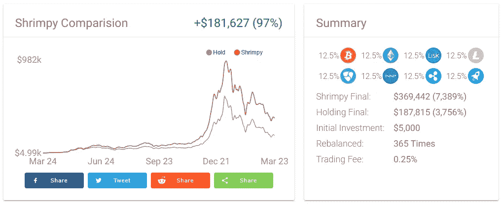

# 重新平衡加密组合的简单回溯测试

> 原文：<https://medium.com/hackernoon/the-simple-backtest-for-rebalancing-a-portfolio-3289bc8ee618>

我们都有定义我们一部分的信念。其中一些信念很简单，比如相信热狗是三明治，或者相信猫比狗好。虽然这两种信念都可能是错误的，但我们没有定量的方法来定义它们为什么是错误的。

当我们第一次倡导再平衡时，我们认为再平衡比霍德林更好。在开始的时候，我们没有可以明确指出哪个更好的量化值，我们只是有这种信念。今天，我们可以正式宣布，再平衡比霍德林更好，我们有数据证明这一点。

你可以从我们这里的其他帖子中了解更多关于再平衡的信息:

 [## 加密货币的投资组合再平衡

### 投资组合再平衡是投资者使用了几十年的策略。首先，投资者必须确定如何…

medium.com](/@ShrimpyApp/portfolio-rebalancing-for-cryptocurrency-7a129a968ff4)  [## 再平衡与 HODL:技术分析

### 这项研究的目的是描绘一幅公平的画面，说明再平衡作为一种策略如何符合霍德林。为了…

medium.com](/@ShrimpyApp/rebalance-vs-hodl-a-technical-analysis-6f341b0db9cd) 

我们收集了一整年的交易数据。这些都是在真实交易所进行的真实交易。这意味着数据是精确的，因此不涉及任何估计。然后，我们组织所有这些数据，以便进行简单的回溯测试。回溯测试本质上是对历史数据的模拟，以观察策略在此期间的表现。结果是压倒性的。再平衡的表现远远超过霍德林。

# 试一试

我们决定不把这个工具留给我们自己，我们希望与每个人分享，所以你也可以尝试不同的投资组合。这个简单的工具将允许你选择不同的硬币和再平衡周期来分析不同投资组合在过去一年的表现。

在这里试试这个工具:[https://www.shrimpy.io/backtest](https://www.shrimpy.io/backtest)

既然你已经见证了再平衡的力量，[报名参加 Shrimpy](https://www.shrimpy.io/) ，这样你就可以利用这个重要的策略。设置简单，无需维护。你会说，“我不敢相信这不是霍德林。”

别忘了查看一下 [Shrimpy 网站](https://www.shrimpy.io/)，在 [Twitter](https://twitter.com/ShrimpyApp) 和[脸书](https://www.facebook.com/ShrimpyApp)上关注我们的更新，并在[Telegram](https://t.me/ShrimpyGroup)&[Discord](https://discord.gg/gXyy95y)上向我们令人惊叹的活跃社区提问。

留下你的评论，让我们知道你的平衡经验！

*捕虾队*