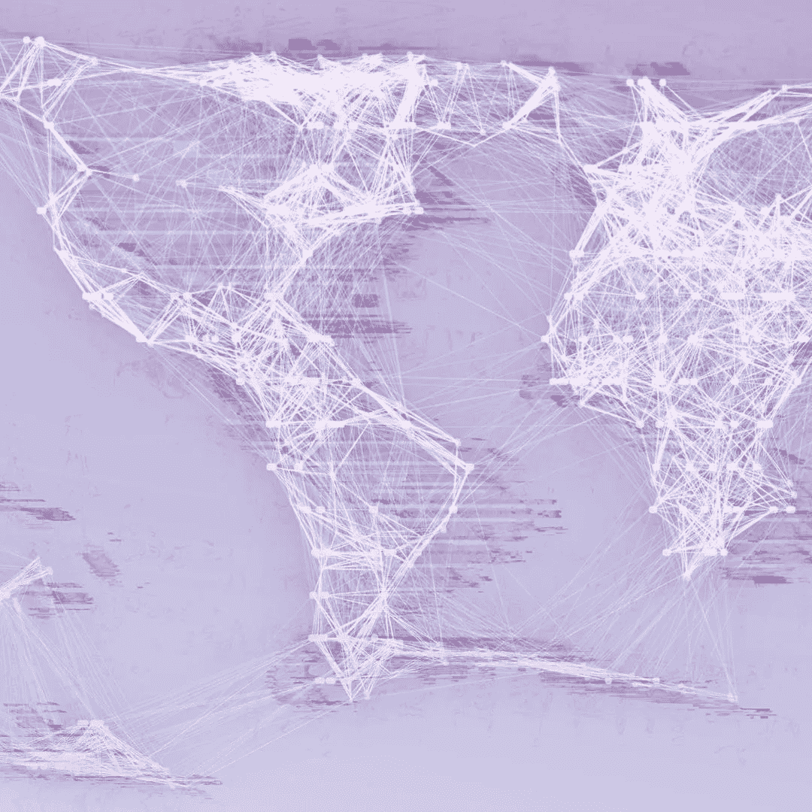

# 脸书广告更有效的原因很简单

> 原文：<https://medium.com/hackernoon/the-simple-reason-why-facebook-ads-will-always-be-more-valuable-3af51a332678>

脸书和 Instagram 广告特别有效的原因可能很简单。我们在使用它的时候很容易受到广告的影响。

我们使用社交媒体越多，我们可能会感觉越糟糕？journalCode=jscp )因为同龄人比较和外化的自尊。但是我们不断地从所有关于我们社区的人的浓缩的新信息中获得短期刺激。与此同时，潜意识中的同伴比较产生的社会自卑感在增长，我们想上传照片并得到认可。这是阻力最小的路径；心理用户流。

当我们浏览新闻提要时，来自潜意识同伴比较的社会不安全感增加了我们对广告的脆弱性:点击广告，然后购买营销的东西，以减少不安全感。这些产品和服务可以作为减少社会不安全感的解决方案来销售，就像衣服一样。这就是为什么许多人可能会在脸书或 Instagram 上看到服装广告。就像上传图片和接受外部验证一样，购买新衣服可能会让我们减少在脸书或 Instagram 上因同行比较而产生的社会不安全感。

因为人们是如此的脆弱，而他们身上的广告又是如此的有效，所以脸书可以比其他竞争广告公司收取更多的费用。脸书可以对他们的广告效果收费，因为脸书不仅跟踪广告点击，还在人们点击广告后很长时间内购买广告。即使你几周后购买了一家公司的产品，脸书仍然可以把它和广告联系起来。该广告在潜意识里影响了处于脆弱状态的你，并帮助引导了网上购物的选择。

我们使用脸书和 Instagram，可能会在社交上感到自卑，然后用广告和购买营销的东西来减少社交上的自卑。脸书和 Instagram 赚钱，有些可能会顺应消费，满足心理需求。

因为用户体验，脸书和 Instagram 广告总是更有效。存货会更有价值。

我写了一本关于数字成瘾的书。现在购买从 [*巴诺*](https://www.barnesandnoble.com/w/trapped-in-the-web-an-turner/1129986845) *或*[*indie bound*](https://www.indiebound.org/book/9781732182196)*。*

 [## 超感黑客正午

### 阅读黑客正午中精神论者的作品。我参与并思考了很多新的数字技术。我的…

hackernoon.com](https://hackernoon.com/@thementalist)