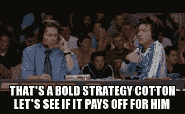
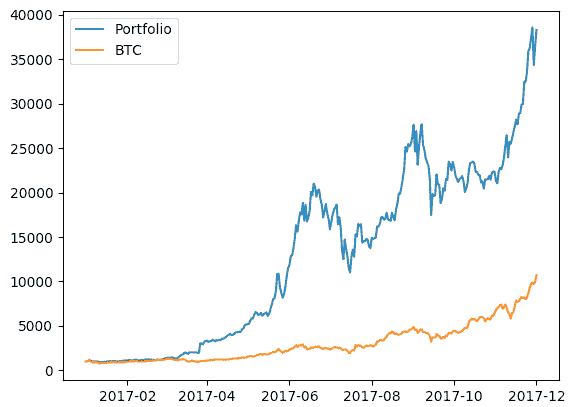

# 这个简单的策略将帮助你击败今年的加密市场

> 原文：<https://medium.com/hackernoon/the-simple-strategy-that-will-help-you-beat-the-crypto-market-this-year-5eecdfa7d6e7>

任何认真的加密货币投资者都将热衷于让 2018 年有价值，因为这可能是他们从加密“泡沫”中疯狂获利的最后机会。至少我是这么觉得的。如果我们将在 2018 年重复 2017 年的情况(就总市值增长而言)，那么这样的增长在 2019 年是无法预期的。

# **失败的日内交易者**

我的故事是这样开始的。我决定为 2018 年建立一个个人投资组合，并防止我去年进行的大部分徒劳的日间交易和令牌跳跃练习。实际上，去年，我为了战胜市场损失了一半的投资。我犯了所有的新手错误。不了解市场周期或图表是如何工作的。我通常在长时间进入亏损头寸后就从一个硬币跳到另一个硬币。你知道当你目前持有的是红色，没有恢复的希望，然后你看到另一个硬币，你一直喜欢绿色的日子。

你通常认为，通过卖出你的亏损头寸，加入牛市行列，你将能够用看涨硬币产生的收益来弥补你的亏损。然后，因为你不理解简单的想法，如阻力、修正、过度买入股票和历史高点，你用市价单买入(这样你可以尽快进场)。就在你享受新的旅程时，价格突然停止以通常的速度上涨，接着是一点点振荡，几分钟后你有一根长长的红烛——你再次处于亏损状态！无法管理自己“遭受损失”的情绪，你会失去信心，并迅速卖出，以防止“上次发生的事情”。从而给你的账户增加更多的损失。

意识到你已经损失了多少，市场在大多数地方仍然是绿色的，你立即开始追逐你的损失。所以你再去一次，登录交易所，你首先看到的是你刚刚留下的硬币。它又开始变绿了！现在你痛骂自己是个疯子，因为你临阵退缩得太快了。这一次，你更有信心买进；相信在牛市结束之前，你仍然可以获得 20%的收益，因为看起来仍然有很多需求。作为一个聪明人，你把你的限价单设置为新买入价格的 10%利润，并决定在硬币上涨时冷静下来。十分钟后，你回到市场，看看你的硬币怎么样了。哎呀，你已经下降了 15%。

市场刚刚测试了新的价格阻力，但失败了。厌倦了四处奔波和赔钱，你决定只是等待，看看接下来会发生什么。在接下来的两个小时里，你发现自己正看着心爱硬币的价格震荡下跌，你的钱包损失更大。仅仅一天，你一夜暴富的梦想就消失得无影无踪了。这正是我最初几个月在没有受过教育的情况下试图战胜市场的原因。当然，我开始学习日内交易的复杂性，到去年年底，我能够再次实现盈亏平衡并获得一些利润(这要感谢市场的牛市)。但是回顾这一年，日内交易显然是我不想再次参与的事情之一。压力太大了，而且[对](https://hackernoon.com/tagged/demanding)的要求很高，以至于有几天非常没有效率。因此，我开始寻找一种新的策略，从这个或多或少有些被动的高增长市场中获取巨大收益。

# **精制贸易商**

根据我的经验，最明显的第一步是建立一个投资组合。以一种非战略性的方式从一个硬币跳到另一个硬币，已经证明了这是一种累人且低收益的活动。因此，我一直在宣传的简单策略的第一步是创建一个可靠的投资组合。你的投资组合有多复杂，取决于你愿意投入多少时间来研究投资组合、管理投资组合以及你的风险承受能力。对于哪些硬币或代币应该在你的投资组合中占有一席之地，我不会给出任何意见，自己做研究会让你更加自信。相反，我将把重点放在这个简单策略的关键部分。这是所有专业投资组合经理的工作。叫做**再平衡**。对于那些不熟悉这个术语的人来说，它仅仅意味着根据预先定义的权重系统不时地调整你的投资组合的价值。

# **再平衡如何工作**

通常，你通过挑选一些你真正喜欢的资产(硬币和代币)建立一个投资组合，然后购买每种资产的特定数量。所以，假设你选择了十个你真正看好的硬币，你总共有 1000 美元可以投资，你可以决定在这十个硬币上各投资 100 美元。在这种情况下，权重相等，每枚硬币的权重为 10%或 0.1。根据你的风险承受能力，你可以决定像 BTC 和瑞士法郎这样的基础货币各占 20%，而其余的各占 7.5%。这两个例子都是所谓的加权系统。

现在，在你根据一个选定的权重系统购买硬币后，通常会发生的事情是，市场会开始扭曲你的权重。一些硬币的价格会大幅上涨，因此它们在投资组合中的比重会高于最初指定的比重。其他的会降价。随着时间的推移，这些分配的变化可能会导致不良的影响，例如将你暴露在一个你无法承受的更高的风险水平。为了解决这个问题，定期重新平衡你的投资组合是很重要的。你需要通过卖出盈利头寸和巩固亏损头寸来重置权重。然而，重要的是要注意到，在智慧和以太的世界里，再平衡不是一项无足轻重的任务。确保你读到文章的最后。**我有个礼物给你**。

# **再平衡最大化你的投资回报**

在资金管理领域，这不是秘密。即使在熊市，定期重新平衡投资组合几乎总能比完全被动的投资组合产生更好的回报。原因如下:

再平衡是一种系统的低买高卖的方式。别忘了，日内交易者的目标是根据硬币价格的每日波动，低买高卖。然而，这项任务非常艰巨。它涉及到市场时机和猜测工作，就像我上面描述的那样。你必须天生就能预测低点和高点。如果你不使用机器人进行这种活动，情绪和非理性会很快成为你的毁灭，导致得不偿失。然而，有了再平衡，你就不必为每日硬币价格而紧张了。你不在乎哪枚硬币“还能涨得更高”，也不在乎哪枚硬币“跌得快”。当重新平衡的时机到来时，你只需用你有利可图或更强的头寸的利润，以折扣价买入更多亏损的头寸。低买高卖的简单类比。另一个非常有见地的观点是，再平衡帮助你以缩微形式实现流行的美元成本平均技术。你可以在这里阅读关于平均成本的[。](https://en.wikipedia.org/wiki/Dollar_cost_averaging)

**实施该战略的实际结果**

为了说明上一节中提出的观点，我向您展示了 Sebastian patio-Lang 在 [this](https://github.com/perelin/crypto-portfolio-rebalancing-test/) GitHub repo 中进行的一些实验。实际上，他在 2017 年初构建了一个价格最高的前 20 个硬币的投资组合，并模拟了截至 2017 年 12 月 1 日的投资组合的投资回报率，初始投资总额为 1000 美元，所有硬币的权重相等。他对两种情况进行了回溯测试——没有再平衡和每天再平衡(计入费用)。你可以在下面看到自己回报的巨大差异:

*   橙色线显示，在没有重新平衡的情况下，投资组合获得了 2，385%的投资回报率(是投资的 24 倍)
*   蓝线显示，通过重新平衡(计入费用)，投资组合获得了 6，400%的投资回报率(是投资的 65 倍)

在像加密市场这样一个非常不稳定的市场中，我在这篇文章中介绍的简单策略会大放异彩。这是我今年在投资组合中采用的策略，我已经看到了回报。

**这里有一个问题**——记得我说过重新平衡加密组合不是一项简单的任务吗？我很高兴地向大家宣布，我与 Sebastian(上面 Github repo 的作者)合作创建了一个软件服务，让它变得微不足道！我们将很快推出这项服务，我们承诺您将再也不用为重新平衡您的投资组合而流汗了。

> **更新:**我们已经在[***https://coinpulley.com***](https://coinpulley.com)推出服务

如果你想看到其他用户已经分享的好结果，

> **从这里开始:** [加入我们的电报组](https://t.me/joinchat/F8XT3EqcpM_83Hq9Lmdi1Q)

如果你发现这篇文章内容丰富， ***请把它拍起来*** (多达 50 次)并分享。另外，欢迎在 Medium 或 Twitter 上关注我，了解我的更多信息。请注意，我不会回避这篇文章是一种投资建议的事实。然而，本文没有任何部分要求您执行我的建议。谢谢你。祝你玩得愉快。

> 本文不是招股说明书，也不是投资征集，它与任何司法管辖区的证券发行都没有任何关系。
> 
> 这篇文章不能被理解为投资建议。