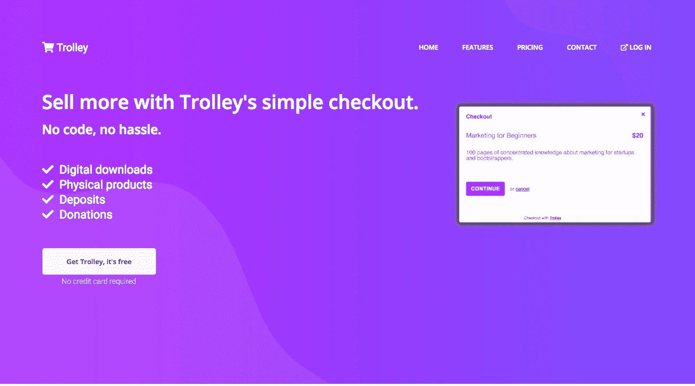

# 最简单的静态站点生成器

> 原文：<https://medium.com/hackernoon/the-simplest-static-site-generator-c775ed88d15a>


静态站点生成器是制作一个简单、安全、超快的网站的最好方法。

但是发生器本身并不那么简单，从众多发生器中选择一个、学习它并开始使用会很乏味。

这里有一个快速的方法，除了你在 1999 年作为一个网站管理员学到的基本技能之外，什么都不用。

## 我们在这里想做什么？

你想吗

*   拥有丰富的主题选择、外观和感觉、可定制性…
*   能够有某种模板系统，所以你可以在一个地方改变东西，它们在整个网站生效。
*   很容易找到可以从事这项工作的人
*   可以选择托管，而不会被特定的供应商所束缚
*   不用担心安全，修补 PHP，服务器，俄罗斯黑客

女士们先生们，我给你们…PHP。

# 什么？

我知道，我们刚刚说过不想运行 PHP。

但是我们*不会*在服务器上运行它。我们将使用它来建立一个静态网站，然后可以部署在任何你喜欢的地方(HostGator，S3，Netlify，你朋友的备用服务器…没关系)。

以下是方法。

# 基本设置

你所需要的只是基本的、通用的网页设计工具；PHP 和一个网络服务器。大多数系统都已经配备了这些功能，但是不同操作系统版本之间的设置会有所不同，所以这里有一个快速、简单的指南，应该可以在 Mac 上运行，而不会影响您的操作系统配置。

跟着做，你将在几分钟内开始运行。

> 如果你在 Linux 机器上，你已经很明智地设置了 PHP 和 Apache 看看这些文档，你可以跳过这一部分，直接使用它们。

你需要`Homebrew`，Mac 开源包管理器——如果你有，跳过这一步。

如果没有，打开一个终端并粘贴进去

```
/usr/bin/ruby -e "$(curl -fsSL https://raw.githubusercontent.com/Homebrew/install/master/install)"
```

现在用自制软件安装我们需要的东西:

```
brew tap homebrew/services; brew tap homebrew/dupes
brew install php72 --with-fpm --without-apache; php -v; php-fpm -v
brew services start php
brew install caddymkdir -p $HOME/Sitescat > /usr/local/etc/Caddyfile << EOF
localhost:2015
root $HOME/Sitesfastcgi / 127.0.0.1:9000 php {
  ext .html
  index index.html
  split .html
}
log /usr/local/var/log/caddy.log
errors /usr/local/var/log/caddy_errors.log
EOF
brew services restart caddy
```

这给了我们 PHP 和 [Caddy](http://caddyserver.com) (一个只需最少配置就能工作的 quick-n-easy web 服务器)。您将把 HTML 文件放在主目录的`Sites`目录中。

现在我们需要一个网站。

# 创建您的网站

## 第 1 页

我将从一个简单的 HTML 模板开始，这样你就可以看到我在做什么。在现实世界中，我会从[模板](http://templated.co)或类似的地方抓取一个引导模板，然后花一些时间调整样式。

打开你最喜欢的文本编辑器，编辑文件`~/Sites/index.html`

让它看起来像这样:

```
<html>
<head>
    <title>My first site</title>
</head>
<body> <header>    
        <h1>Welcome to Page 1</h1>
    </header> <p>Some paragraph text with <a href="page2.html">a link to a second page</a></p> <footer>Copyright me, 2018</footer>
</body>
</html>
```

省省吧。

打开网络浏览器到`http://localhost:2015`，你应该会看到你可爱的新网页。

## 第 2 页

将`index.html`复制到`page2.html`并编辑。将`h1`标签更改为“欢迎来到第 2 页”，保存，刷新浏览器并点击链接`a link to a second page` —您应该会看到“欢迎来到第 2 页”。

现在，很明显，如果您要对`title`进行更改，那么您必须在两个文件中进行更改以保持一致性。

让我们通过添加一些模板来解决这个问题。

更改`index.html`,如下所示(在第二行和倒数第三行添加`<?php … ?>`位)

```
<html>
<?php include '_head.html' ?>
<body><header>    
    <h1>Welcome to Page 1</h1>
</header><p>Some paragraph text with <a href="page2.html">a link to a second page</a></p><?php include '_footer.html' ?>

</body>
</html>
```

对`page2.html`进行同样的修改。

现在在编辑器中创建一个新文件`_head.html`，并粘贴到:

```
<head>
    <title>My first statically generated site</title>
</head>
```

并将以下内容放入`_footer.html:`

```
<footer>Copyright you, 2018</footer>
```

刷新你的浏览器，让我们看看你得到了什么(注意动态替换的页脚信息！):


## “构建”

好了，现在我们有了一个 1990 年代水平的 PHP 网站，但是有了模板，在 web 服务器后面用 PHP 本地运行。

“那不是静态站点！”，我听到你喊。

神奇的是。

回到终端…

```
mkdir dist
cd dist
wget -r http://localhost:2015
```

看看`dist`目录的内容。

那是你的静态站点！

是的——这看起来非常简单——但是很有效。

没有编译，没有构建，没有花哨的包装。只是最基本的。

## 部署

将`dist`中的文件复制到您选择的主机上。

像以前一样，我将使用 [Netlify](https://www.netlify.com) ，但亚马逊 S3 或`<insert $3/month hosting company here>`也一样好。

首先确保你有一个(免费的)虚拟主机账户——如果你还没有的话，你可以在这里得到一个。

[https://www.netlify.com/docs/manual-deploys/](https://www.netlify.com/docs/manual-deploys/)

登录后，您可以使用拖放操作来激活它；只需将解压后的整个目录拖到浏览器的 Netlify“部署”框中。卡住了就看视频！

一旦完成，打开他们给你的自动生成的网址，看到你的网站在互联网上直播！

# 更进一步

关于静态站点的另一件棘手的事情是，它们是静态的。当你只有 HTML 时，很难构建像电子商务这样的动态功能。

这就是[拉杆箱](https://trolley.link)的用武之地【无耻的为我公司插一脚】。这是一个轻量级的弹出式购物车，在静态网站上非常好用。如果你需要销售产品(包括数字下载)，接受存款，捐赠或一次性付款，请查看。开始是免费的——只收佣金，所以如果你没有卖出任何东西，你就不用支付任何费用。



看看[我之前的博客文章](https://hackernoon.com/startup-validation-sell-products-take-payments-from-a-simple-landing-page-in-10-minutes-eed9f66e22f)如何将 Trolley 插入你全新的静态网站，并利用它从客户那里赚钱。