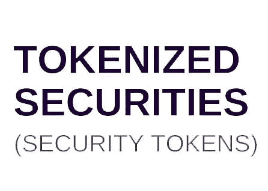
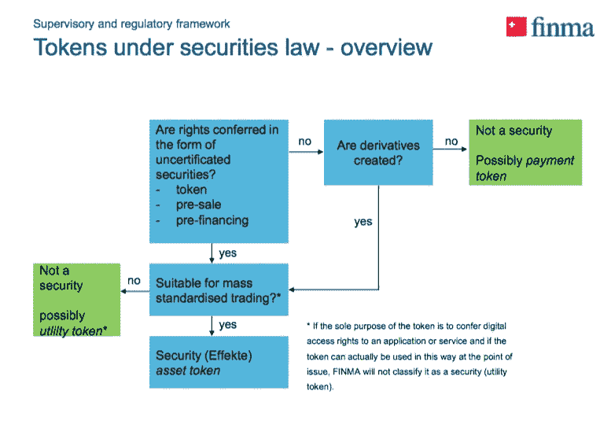
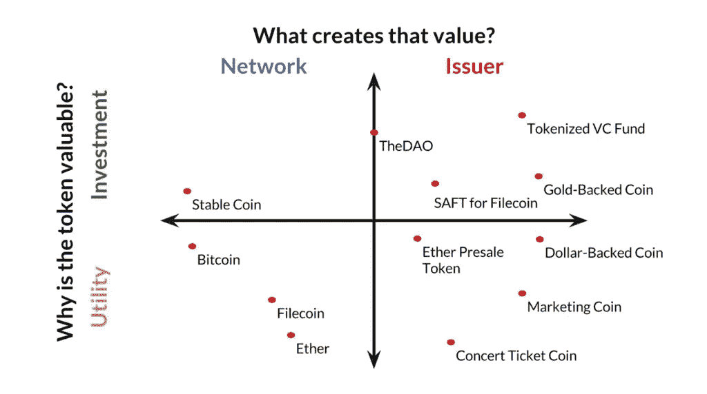
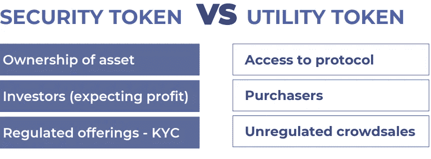

# 理解安全令牌的傻瓜指南。

> 原文：<https://medium.com/hackernoon/the-simpletons-guide-to-understanding-security-tokens-d9d5023b810e>

## **区块链。ICO。令牌生成。**

如果在过去的几个月里，你在网上闲逛的时候**看到过**这些单词中的任何一个或全部，那么恭喜你，你是个傻瓜！

缺心眼，就整个[区块链](https://hackernoon.com/tagged/blockchain)的场面而言，不是一般的场面，放心吧。

区块链是新的、最新的、最伟大的[技术](https://hackernoon.com/tagged/technology)，被誉为互联网 2.0。换句话说，它已经开始颠覆每一个可能的行业，企业家正在寻求充分利用它。由于区块链，从法定货币到加密货币的转变成为可能，今天的企业家更喜欢用加密货币筹集资金。

ico 是新的风险投资基金，在过去的两年里已经成功筹集了数十亿美元。作为投资回报，ico 通常会提供与投资金额等值的“代币”。通常有两种类型的令牌，实用令牌和安全令牌。

这是我们今天要讲的第二种类型。系好安全带，因为这将是一次疯狂的加密飞行。

## **安全令牌概念**

到底什么是安全令牌？忘了吧，什么是安全？

想想股票。想想股票。想想这种类型的其他资产。

用电子包装包裹这些资产。给你，一个安全令牌。

从技术上讲，如果 ICOs 提供加密令牌作为未来投资，并希望其增值，那么它就有资格作为安全令牌。有资格成为证券代币意味着它受管理证券的联邦法律和法规的管辖。人们可以将安全代币视为试图在 ico 和它们的 fiat 对应物 IPOs 之间找到完美的平衡。现在，你一定在想，为什么会有这么多规定？

很简单，真的。从长远来看，任何能给人们带来财富的东西都注定会被政府叫停。股票和权益也是如此，证券代币肯定也是如此。我们将在本文的稍后部分讨论法规。

## **安全令牌是如何产生的？**

在安全令牌出现之前，就有了 SAFT。

未来令牌的简单协议是我们今天都知道的安全令牌的前身。这是由美国初创公司制定的，基本上是为了确保他们遵守美国联邦证券法律。SAFT 基本上是一份合同，允许投资者一旦能够设计出有效的代币模型，就可以获得公司代币的奖励。

由于代币只有在特定的触发事件发生时才发行，或者在它们被积极使用时才发行，因此在这些合同中有利润可赚。因此，它们可以归类为证券。在区块链工作的数据存储平台 Filecoin 在其 ICO 期间向投资者出售了首批 SAFT 合约。他们能够筹集超过 2.57 亿美元，所以可以肯定地说，他们做对了。

随着 SAFT 的概念广为人知，美国证券交易委员会对 ico 和企业家进行了打击。美国证券交易委员会表示，ico 发行的代币可以归类为安全代币，因此属于证券监管法规的管辖范围。是什么迫使证交会采取了这一举措？

是创业者和 ico 们自己。很多时候，他们会以实用令牌的名义发布安全令牌，希望不会被迫遵守所有的规则和条例。这些公用事业代币在大多数情况下没有实际用途，导致投资者亏损。因此，为了制止这种不公正，SEC 采取了自己的行动。

> **在这里阅读安全令牌论文:** [安全令牌论文](https://sodio.tech/blog/the-security-token-thesis/)

## **流动性追逐**

流动性是资产的一种状态，可以很容易地出售以获得现金或其他形式的价值。很容易理解为什么每个人都在追逐流动性；双鸟在林不如一鸟在手。基本上，非流动性资产是不受欢迎的，人们希望手中有现金。

这与我们在本文中讨论的任何内容有什么关系？

进入区块链。它允许几乎任何非流动资产被标记为数字账本，然后变成流动资产。众所周知，私募股权提供了最大的流动性。代币代表区块链和 ICO 世界的流动性。

将两者融合在一起。你得到了什么？

没错。安全令牌。由于数十亿美元的资产可以被令牌化，因此安全令牌能够为人们带来流动性。等等，我认为我们低估了我在前面一行中陈述的数字。

嗯，事实证明，我们错了一大截。据报道，约 500 万亿美元被卡在非流动性资产中，安全令牌在其中有什么？解冻这些资产的可能性。你现在明白为什么这些代币被大肆宣传了吧？

> **阅读更多:** [安全令牌和实用令牌的区别](https://sodio.tech/Blog/the-security-token-thesis/)

## **安全令牌将如何转变实用令牌 ico**

尽管实用令牌被完全根除的可能性极小，但安全令牌仍将蚕食大量市场份额。持有安全令牌 ico 的一个缺点是会产生开销。由于各种各样的法规遵从性和法律，安全令牌的发行变得很困难，但是它的优点肯定会超过缺点。

据报道，要么公用事业代币发行将在法律更宽松的国家运营，要么屈服于监管，以合规的方式发行代币，就像它们是证券一样。最终，从货币和法律的角度来看，发行安全代币有望变得更加容易。不管发生与否，都是有目共睹的。

## **监管概述**

只要涉及巨额资金，政府就一定会插手。由于整个区块链行业缺乏监管，监管机构将目光投向了他们认为可能的领域:证券。由于管理证券的现有法律，以及真实世界和加密证券之间的相似性，组织(即 SEC)已经介入并决定将事情掌握在自己手中。由于 ICO 遵守这些规定需要大量的管理费用，他们决定放弃这些规定，在公用事业 ICO 标签下运营。

他们没有意识到的是，他们应该更喜欢安全令牌标记。诚然，有大量的信息技术要接受，也有大量的金钱要花费，但是一旦一切都说了，做了，安全令牌提供的好处是无与伦比的。让你的政府知道你正在做一些与 ico 和安全令牌相关的事情是帮助你远离监狱的一个重要提示。流动性和其他好处已在本文中提到。

## **那么，最后的召唤是什么？**

安全令牌已经存在，这是毋庸置疑的。他们需要多长时间才能进入主流市场，他们有什么影响，嗯，我们将不得不等待和观察。区块链对共同基金和股票的回答当然很有趣，我们希望我们帮助了你们这些傻瓜更好地理解它。

再见！