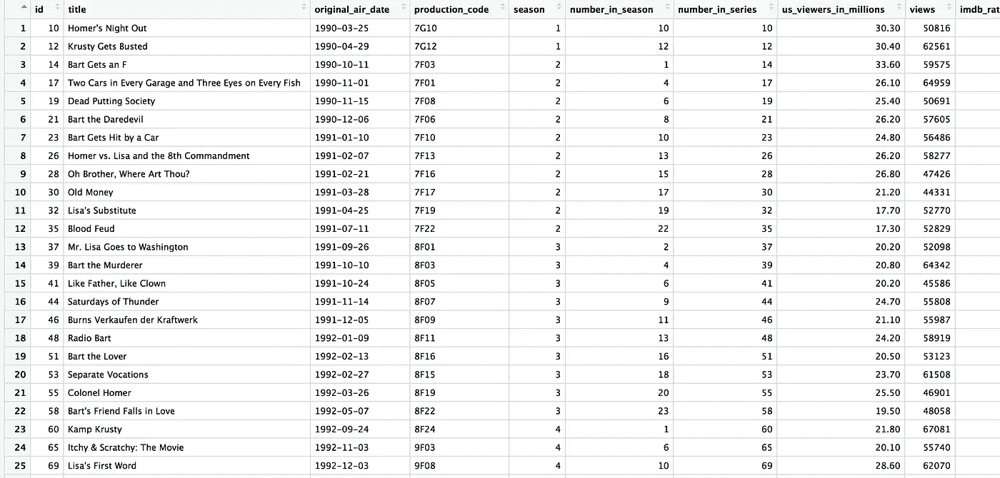

# 辛普森一家从头到尾的数据分析和可视化

> 原文：<https://medium.com/hackernoon/the-simpsons-seasons-ratings-d516d748b1f5>

到目前为止，我只发布了我已经创建的可视化，其中大部分是在工作中。这一次，我为博客创作了一些特别的东西，因为我想看看我是否能做一个整个过程的视频——数据分析、基本情节、最终和编辑过的情节。我警告读者，视频录制和编辑对我来说完全是实验性的，超出了我的常规技能。感谢您的任何反馈，我会确保在继续发表这些帖子的同时不断改进。

在考虑录制这个视频时，我浏览了 kaggle.com，寻找一个有趣的数据集来工作。我偶然发现了《辛普森一家》中的几个数据集，最终选择了一个名为[“数据中的辛普森”](https://www.kaggle.com/wcukierski/the-simpsons-by-the-data)的数据集。它包含 4。csv 文件:simpsons_characters.csv、simpsons_episodes.csv、simpsons_locations.csv 和 simpsons_script_lines.csv。

在这篇文章中，我只分析了 simpsons_episodes.csv 文件，该文件包含以下变量: *id* 、*标题*、*原创 _ 播出 _ 日期*、*制作 _ 代码*、*季节*、*编号 _ 季中 _ 季节*、*编号 _ 系列*、*美国 _ 观众 _ 百万次*、*观看次数*

part of the simpsons_episodes.csv in an R dataframe

视频中缺少的一点是，我第一次将文件加载到 R 中时，我注意到 dataframe 有 298 行，而不是它应该有的 600 行。当在 RStudio 中查看 dataframe 时，我注意到有一行有一个引号没有关闭，这使得数据无法正确加载。我用手去掉了这个引号，因为它只有一个，但通常情况下，数据清理应该通过编程来完成，以便容易重复。

该视频展示了对一些变量的基本分析，一个情节的构建，以及在 Adobe Illustrator 上的情节增强。在视频中我也解释了我的思路以及为什么我选择了如此确定的事情。看看吧！

下面是在 R 上创建，在 Adobe Illustrator 上编辑的剧情(前后)。

IMDB rating of The Simpsons seasons (before and after editing)

正如开始提到的，这是一个全新的东西。让我知道你是否喜欢它，你想看到我谈论什么话题或做什么视频，我会努力做更多的内容！

*编辑*:视频中使用的代码链接-[https://gist . github . com/anabambosa/3d CCB 842 C1 d 0 a3 CFD 547 ee 90 b 508 a 19 a](https://gist.github.com/anabarbosa/3dccb842c1d0a3cfd547ee90b508a19a)