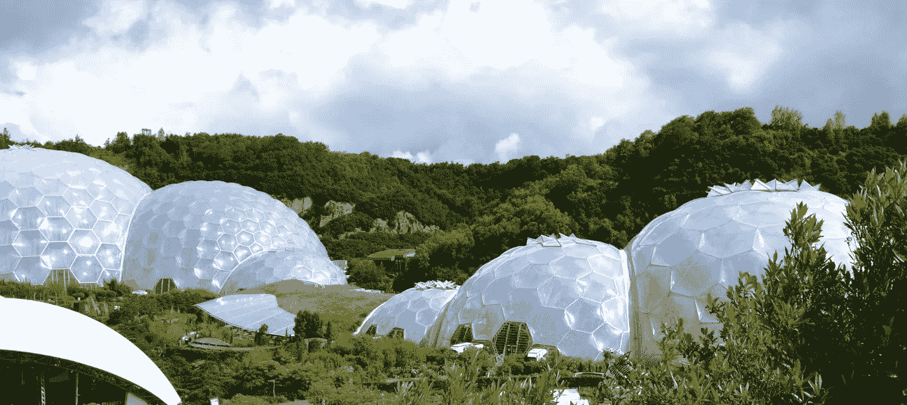
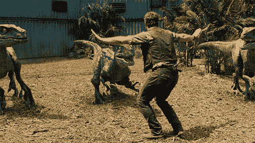
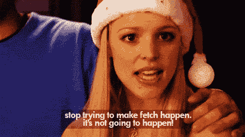

# 天要塌了！又名…脸书再次更新

> 原文：<https://medium.com/hackernoon/the-sky-is-falling-aka-facebook-makes-another-update-6cfb14f27a27>

我们 **都生活在马克·扎克伯格的生物穹顶里。**这是我们知道的事情，但算法的每一次转变都是一个突然的提醒。

昨天，扎克伯格在[发表了一个相当大的声明](https://newsroom.fb.com/news/2018/01/news-feed-fyi-bringing-people-closer-together/)，让营销人员和社交媒体大师们争相回应。总而言之，[脸书](https://hackernoon.com/tagged/facebook)正在转向“家庭第一”的 feed，我们将**更多地从我们的家人和朋友那里看到，而不是从我们的 feed 页面中看到**。

正如所有脸书的巨大变化一样，我喜欢坐下来观察发生了什么。

我们还不完全知道会有什么影响，但预计**页面到达会比**下降得更快。这可能会增加投入广告的页面数量。对于较小的品牌和个人博客和营销人员来说，这可能意味着完全放弃网页或脸书。

我有一些想法留到最后说，但现在，我想谈谈马克·扎克伯格的生物穹顶。

# 生活找到了出路

当你在线上或线下创建一个社区时，它就像一个生态系统。生物和它们的栖息地之间有一种微妙的平衡。微小的变化会产生巨大的影响。

而且，正如我们从*侏罗纪公园***中所了解到的(希望如此)，我们无法控制其他生物**。甚至在我们自己的岛上，网络社区，或者社交媒体平台。

几个月前，一位有影响力的大人物宣布她将关闭她的脸书团队。我被这种反应迷住了。许多成员坚持说这个组合不再是她的了。公平地说，影响者很少出现在那里。这些成员坚持说他们建立了这个社区。这是他们的。

她还是关了群。

因为，毕竟，它字面上的*是*她的群体。然而……这个想法有一定道理，一个**社区脱离了它的创造者**而呈现出它自己的生活。

影响者可能已经创建了这个团体，并使它就位，但是没有她，社区和交流有它自己的生活。在她的生态系统中形成的关系与她无关…除了它们发生在她的空间之内。

跟我一起缩小。

我们在马克·Z 的生物穹顶里。他拥有它，可以用它做任何他想做的事。但是因为是一个生态系统，有一个生命孕育了脱离他。他拥有它，但不拥有我们。他对脸书做什么做最后的决定，但是我们作为用户也塑造了它的成长和运动。

# 不要试图让订婚发生

作为 **的用户，我对这个声明并不感到兴奋。**我不喜欢别人告诉我我想看什么，或者我怎样才能享受更多的东西。(据格雷琴·鲁宾[所说，这可能是因为我是一个反叛者](https://gretchenrubin.com/2017/08/four-tendencies-rebels-habits/)。)

> **扎克伯格表示，他希望帮助消除导致“被动体验”的内容**

如果我喜欢脸书是一种被动的体验呢？？

> 他说他想引发“有意义的社会互动”

如果我们不在脸书进行有意义的互动会怎样？

> **他的目标是建立一个“有益于我们福祉”的平台**

如果我们完全远离社交媒体，我们的幸福不是会更好吗？？

大概吧。奇怪的是，他预测这些变化之后会发生什么。我们在脸书会更开心，所以我们会少去那里玩？嗯，好吧。

**我个人从来没有在任何社交平台上作为用户享受过一次算法更新。去年换班后，我甚至不喜欢访问 Instagram 或 Pinterest。算法不能完全预测我想看的东西，不管它有多复杂。**

因此，我质疑，在我的新闻订阅中，创造更多参与度和“主动”观看的转变意味着什么。

许多人喜欢潜伏在脸书，看视频而不喜欢或评论或分享(至少直到烦人的广告出现在中间，我们继续滚动)。**不是每个人都在社交媒体上社交。我怀疑脸书更像是人们的一个逃避之地，而不是我们进行有意义的互动和引人入胜的对话的地方。**

马克·扎克伯格想要改变这种状况。但是你不能让我订婚。停止使用算法来实现互动。

# 入侵物种

T21:人类不会从我们的错误中吸取教训。我会指出夏威夷引入猫鼬和澳大利亚引入疯狂数量的外来入侵物种来解决问题。

马克·扎克伯格看到了脸书内部的问题。(他也看到了美元符号。让我们记住这一点。他想出了解决那个问题的办法。这导致了其他问题。

当他更新算法的一个方面来阻止垃圾邮件、假新闻和参与诱饵时，生活找到了一种方式。我说的生活，指的是营销人员，好的和坏的。他引入了一种入侵物种来平息假新闻问题，而这种入侵物种引发了一个新问题。这个系统总是可玩的。

那么……对于我们生态系统中的这个新成员，我们能期待什么呢？

# 个人资料、信使和群组-天啊！

下面是我对这一变化可能意味着什么的预测，以及你(作为一个页面所有者)可以做的一些最佳实践。

1.  小品牌将不再尝试使用网页，而是在他们的个人资料中充斥与商业相关的内容。

2.信使机器人会变得超级烦人。

3.团体会越来越多。

## 页面->个人资料

许多较小的品牌*(想想:作家、博客和直接或多层次营销的人)*已经像使用商业页面一样使用他们的个人资料。这违反了服务条款，但我从未见过有人因此失去账户。在脸书打击这类帖子之前，许多人将继续使用他们的个人资料作为页面。

除了不惩罚这种行为(至少不经常)，脸书还通过允许人们“关注”个人资料，在很多方面鼓励这种做法。我认识一些非常有影响力的人，他们已经刷爆了他们的好友限制，并鼓励他们的粉丝关注他们的个人资料，在那里他们谈论生活…和生意。*(咳*马克·扎克伯格*咳)*

对于普通的页面所有者来说，我认为这是我们将看到的第一个变化。这与扎克伯格想要的完全相反。

## 机器人流行病

我以前写过关于僵尸程序的危险的文章，我认为这次更新只会鼓励网页将他们的营销转变为脸书信使。

有了像 Manychat 这样的工具，pages 可以把你对一篇文章的简单评论变成一条直达你收件箱的直线。你甚至不知道是什么击中了你。

扼杀页面延伸意味着营销人员和品牌将寻找另一种方式来获得你。聊天机器人和信使营销现在在脸书的生物圆顶区是一种蛮荒的西部，所以除非引入另一种入侵物种来驯服它，否则机器人会泛滥成灾。

*(我个人怀疑，messenger* *中的* [*bot 营销有可能令人难以置信地讨厌，以至于它会耗尽精力。如果扎克伯格真的关心用户体验，他会实施更多的限制。)*](https://createifwriting.com/facebook-messenger-bots-vs-email/)

## 群组>页面

脸书今年将注意力转向团体，这有好有坏。在我的群中作为我的页面(不是我的个人资料)发布时，我看到 reach 下降。有时，我的订阅源中也会弹出在我的群中增加帖子的选项，这一功能并不普遍。

但也引入了一些很酷的新功能，如洞察力、审查潜在成员的问题以及按主题发布标签(到目前为止，我只在我的一个小组中看到过)。

**在 2013 年的有机食品发展启示录之前，佩奇有着广阔的潜力**。这使他们成为一个相对安全的空间，可以投入时间，建立品牌参与度。

暂时如此。

这种新的转变可能会导致**群体的繁荣，就像淘金热**——每个人都放弃自己的页面努力，通过群体致富。*(直到那也改变。)*

# 这不是我们的穹顶

随着用户和企业等着看这种转变意味着什么，这是一个记住脸书不是我们的生物穹顶的好时机。

无论生态系统发展到何种程度，无论我们作为用户如何塑造脸书的发展方式，扎克伯格总能切断电源。

另一个选择是，如果有人来建造一个闪亮的新圆顶，我们都可以搬到那里去。

多年来，我一直听到人们满怀憧憬地谈论对新平台的需求。**也许这种转变最终会打开大门，让一个新的平台崛起**。大概不会。但是 MySpace 也没有预见到它的到来。

# 给页面所有者的提示

如果你在用页面，不要慌！我们不完全知道这将如何解决。无论如何，长期以来，有机食品一直很难做到。你会没事的。

以下是一些你可以做的事情:

*   在你的努力中尽可能多地使用参与。
*   请考虑创建一个小组。([见我做好这件事的小技巧](https://createifwriting.com/best-practices-for-facebook-groups/))。)
*   一定要投资你的[邮件列表](http://createifwriting.com/list-building-tips)。
*   千万不要把一切都给了别人的平台。

虽然我对这一切并不感到兴奋，但我也不感到惊讶。或者担心。穹顶会继续调节温度，引进新物种，不管我喜不喜欢。

**如果你需要我，我会在我的** [**脸书组**](http://createifwriting.com/community) **里。**

(目前来说。)

## 作为用户或页面所有者，你对这次更新有什么想法吗？？我很想听听。