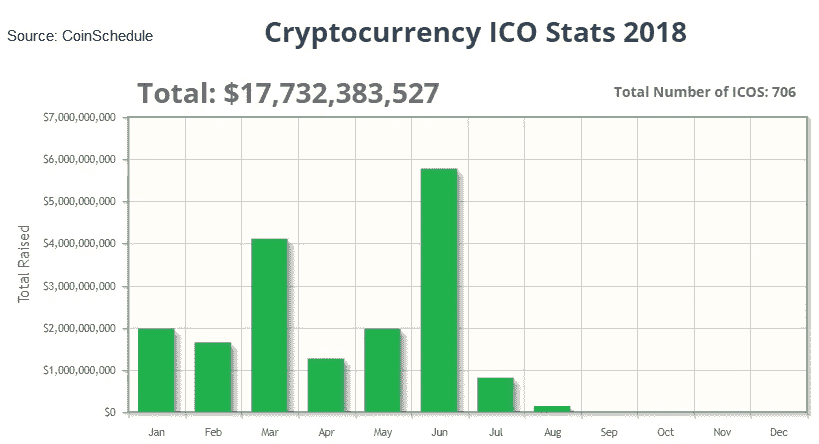

# 下滑的 ICO 市场并没有阻止热切的投资者和创业公司

> 原文：<https://medium.com/hackernoon/the-slumping-ico-market-does-not-deter-eager-investors-and-startups-ee1c914f6fe0>

## **动物精神与现实:**

有很多方法可以跟上任何金融市场。一种方法是例行检查可用信息，仔细检查不同的报告，不断修改你的观点，并明白你可能仍然不完全知道发生了什么。但是话又说回来，当你可以放下所有的艰苦工作，仅仅跟随一群“[动物精神](https://www.investopedia.com/terms/a/animal-spirits.asp)”时，除了剪切直觉和高速度之外，为什么还要为现实而烦恼呢？

后者正是大多数投资者现在选择解释 ICO ( [首次发行硬币](https://www.investopedia.com/terms/i/initial-coin-offering-ico.asp))行业的方式，这是“动物精神”在起作用的一个完美例证——这个术语是被抛弃的英国经济学家约翰·梅纳德·凯恩斯创造的，用来解释我们在不确定的时间和环境下做出的金融决策。

你可以把这种观点称为愤世嫉俗，但事实表明，2018 年 7 月对 ICO 行业来说并不太好。除了在[马耳他](https://www.ccn.com/worlds-first-initial-convertible-coin-offering-icco-launches-in-malta/)和[菲律宾](https://cointelegraph.com/news/philippines-securities-regulator-issues-draft-of-ico-rules-requests-feedback-from-public)的加密活动有所加强之外， [Coinspeaker](https://www.coinspeaker.com/2018/08/07/monthly-ico-market-analysis-july-2018/) 和 [Coinschedule](https://www.coinschedule.com/stats.html?year=2018) 都报告称，就进行首次硬币发行的公司募集的资金而言，7 月是今年最糟糕的一个月。此外，实现 100%融资目标的公司数量也有所下降，更不用说选择开始 ICO 的公司数量整体下降了。

尽管如此，许多投资者似乎并不担心。毕竟，情绪决定市场:6 月份很棒，这意味着信心很高，而且(按照我们乐观观点的逻辑)纯粹的乐观情绪将在今年 8 月给市场带来增长。当然，尽管最初的硬币发行行业存在基本面波动和不确定性(见上图)。

**精神食粮**

不要在意风雨飘摇的时代，公司继续召集投资者，他们愿意众筹他们的项目。尽管这篇文章的总体观点是愤世嫉俗的，但你的记者不得不承认，还是有一些进步的希望。如果你决定把你的钱投入这个飞速发展的市场，就赌这些马吧。

**DxChain**
首先， [DxChain](https://dxchain.com) ，世界上第一个去中心化的大数据和机器学习网络，刚刚在 8 月 6 日结束了它的代币销售，募集了超过 2000 万美元——是它最初目标的 95%。

它结合了一些已经在使用的好想法。区块链的一个分散小组允许用户使用[网络](https://hackernoon.com/tagged/network)作为数据交换平台来交易他们的信息，并作为商业智能平台来分析数据以获得[商业](https://hackernoon.com/tagged/business)洞察力。该系统由一个对等网络和 [Hadoop HDFS](http://www.aosabook.org/en/hdfs.html) 文件系统组成。

为了公正地对待这个项目，我邀请你在提议的[白皮书](https://docsend.com/view/8w3fman)中阅读更多关于它的潜力的内容。

**“不要花你输不起的钱”通常是 ICO 市场的一条好规则。**

**Ubex**

其次，[全球去中心化广告交易所 Ubex](https://icodrops.com/ubex/) ，已经非常接近实现 100%的既定目标。在我写这篇文章的时候，Ubex 已经筹集了超过 810 万美元的资金，只差 80 万美元了。还有 5 天的代币销售，所以他们可能会更加幸运。

他们的想法也值得一听。它已经着手解决困扰广告业的问题。借助编程技术、神经网络和智能合约，它认为自己有能力应对广告定位效率低、交易对手关系不透明以及客户对广告质量不满意的问题。

这是一个不小的成就，但是如果他们成功了，他们将会收到许多来自广告商、出版商甚至顾客的感谢信。

**虎鲸**

最后， [ORCA](https://orcaalliance.eu/en/) ，一个个人财务管理的一体化平台，是 ICO 行业的新人之一，刚刚于 8 月 6 日开始其代币销售。然而，这看起来很有希望——ORCA 已经在 50 小时内达到了 150 万美元的首轮上限。第二轮应该在 8 月 27 日开始，届时奥卡将尝试尝试硬帽。当熊市吞噬市场时，虎鲸似乎有了机会。

他们项目的目标是创建一个人工智能驱动的平台，代币购买者可以在一个界面上管理他们所有的财务(包括加密)。这意味着用户将可以使用不同的银行账户和支付卡，加密钱包和交易服务，交易所，贷款服务和其他金融服务提供商。

简而言之，它们提供了一个用户界面，你可以通过这个界面管理你所有的现金流。他们的应用程序可能正是我们大多数人在一个混乱的世界中肯定需要的，这个世界有多张信用卡、银行账户和无数的加密钱包和交易所。

**总之**

当谈到 ICO 市场时，“不要花你输不起的钱”通常是一个很好的规则。人们很容易沉浸在乐观的泡沫中，想象自己是未来白手起家的成功故事，但这是一个脱离现实的完美例子。

六月很棒。7 月份对许多急于尝试的新贵来说很难熬。八月也可能不是在公园散步。所以，小心行事，但是如果你不能控制住自己，就把最有希望的一匹马退回去。