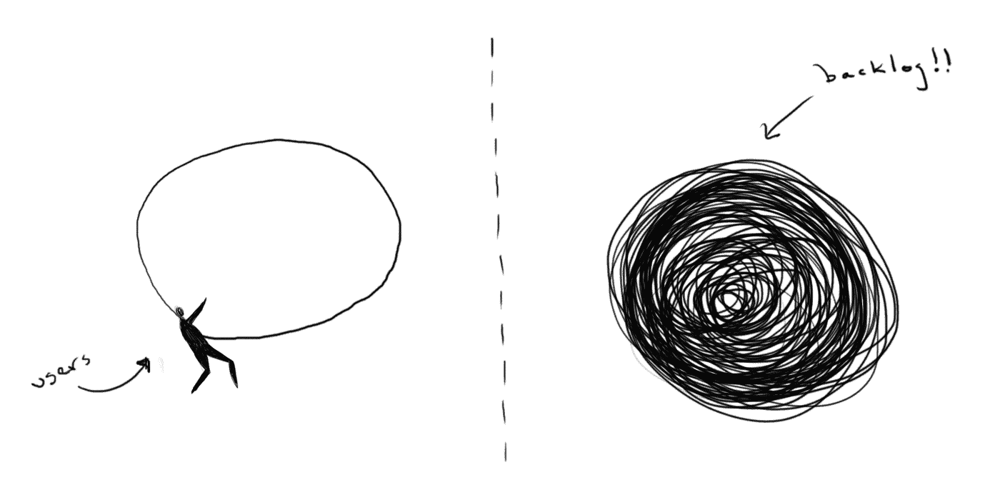
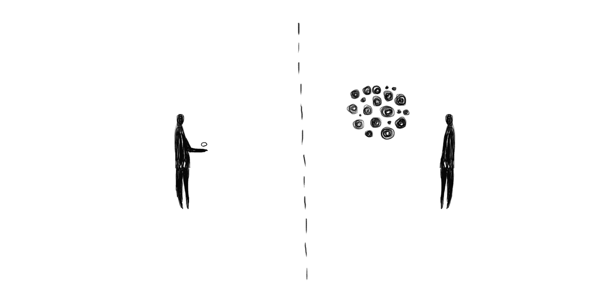
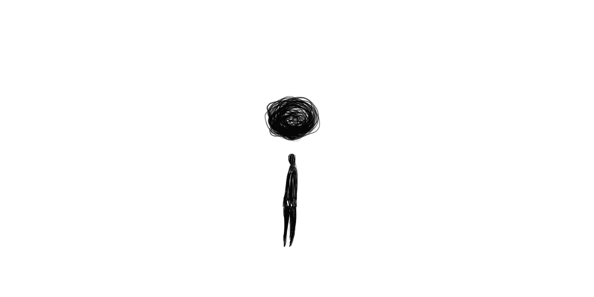

# 小美人和讨厌的野兽

> 原文：<https://medium.com/hackernoon/the-small-beauty-and-the-nasty-beast-f9f13cbd3371>

## 小规模推出你的产品，让它成长

任何产品开发都面临一个共同的问题:产品本身的性质。有两条路径来描述发展时间线:

1.  隆重推出
2.  小型发射

当推出一个大的产品时，许多公司犯了积累这么多技术债务的错误。就像一个大房子，有一个肮脏的后院，所有的垃圾都堆在那里。当人们搬到这所房子时，垃圾的数量并没有减少。它增加了。

The big house and its messy backyard

推出 big 的另一个错误是，它需要更多的时间来验证关于产品的第一个假设。在发布产品之前对一些用户进行测试，有助于了解当产品面向更大的受众时，会对产品产生什么样的影响。

但是要确保你验证了你的假设，并且和你的客户一起为大规模发布而制造产品。)

如果您不能定期测试，任何启动 big 的场景都会存在风险。如果产品是在短时间内完成的，那么这个烂摊子会在后院堆积得更快。

如果开发产品需要更长的时间，同时注意不要堆积技术债务，当未经测试的假设开始创建计划外的工作时，垃圾将开始在您的垃圾中增长。

**两种场景都变得混乱**

产品中的任何一个迭代或特性都必须为业务和客户创造价值。它应该增加房子的美观和功能。它可以保持后院的清洁。任何时候，假设没有得到证实，更多的坏家具被添加到债务山。

Intercom 有一篇关于这个话题的优秀文章，有一个准确的比喻:[从一个纸杯蛋糕](https://blog.intercom.com/start-with-a-cupcake/)开始。

盖尔斯定律说:

> 一个有效的复杂系统总是被发现是从一个有效的简单系统进化而来的。反命题似乎也是正确的:从零开始设计的复杂系统永远不会起作用，也不可能让它起作用。你必须从头开始，从一个简单的工作系统开始。

所以，大胆尝试，冒着假设没有得到验证而失败的风险。

# 小型发射

通过推出小的，你建立什么是需要的。你保持它[瘦](https://en.wikipedia.org/wiki/Lean_software_development)。一只丑陋的鸭子总能变成美丽的天鹅。如果你启动小规模项目，那么你就有机会正确验证你的假设，并创造适当的反馈循环，从而可以很容易地做出决定。

应用反馈循环，将你的产品视为一个系统(系统思维的概念)将帮助你轻松地迭代你的产品，分而治之，解决你的技术债务，保持房子和后院的整洁。

Small launches make everything easier

如果你小规模推出并获得成功，产品将会突然开始增长。除了启动大项目，另一个选择是启动许多倍的小项目来满足大项目。通过启动 big，没有时间去思考哪里出了问题，它将创建一堆不应该存在的讨厌的任务。

Your unplanned work and you

这取决于你。你可以住在一个脏兮兮的后院，快散架的大房子里，忙着修理东西，或者只是保持一切整洁有序。

*感谢阅读！如果你喜欢这个故事，让我们讨论一下，在你去* ***之前点击*** 👏 ***按钮*** ***分享*** *帮助别人找到！也可以随意留下评论*💬*下图。
这里是我的* [*推特*](https://twitter.com/NoCountry4Old) *。*