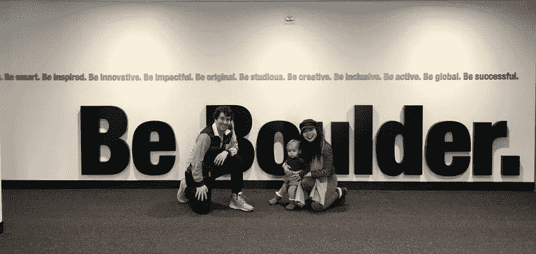

# 斯穆克夫妇在科罗拉多大学的颠覆性创业课上发言

> 原文：<https://medium.com/hackernoon/the-smookes-speak-at-university-of-colorados-disruptive-entrepreneurship-class-a59285bdd64b>

## 黑客正午播客:博尔德现场直播

Photo Credit, [StartEngine.com/HackerNoon](https://www.startengine.com/hackernoon)

 [## 博尔德大学现场版:Linh & David Smooke 在颠覆性创业课堂上发言

### 黑客诺恩首席执行官大卫·斯穆克和首席运营官·林·道·斯穆克最近在科罗拉多大学博尔德分校的破坏性…

podcast.hackernoon.com](https://podcast.hackernoon.com/e/university-of-boulder-live-edition-linh-david-smooke-speak-at-disruptive-entrepreneurship-class/) 

Hacker Noon 的首席执行官大卫·斯穆克(David Smooke)最近在科罗拉多大学博尔德分校的颠覆性创业课上发言，授课老师是 Hacker Noon 的特约撰稿人 T4·内森·施耐德(Nathan Schneider)。

一些著名的引言:

> “在现在的互联网上，集权和分权之间正在进行一场大规模的斗争。”—大卫
> 
> “这是我们每天的动力:我们知道人们想要读更多，写更多，当我们受到外部威胁时，人们会支持我们。”—林
> 
> *“要知道障碍只是一天，明天将是新的一天，障碍不会那么糟糕，或者可能会更糟，一天又一天会更好。”大卫*
> 
> *“是社区决定了我们的形象，因此我们认为这是互联网的最佳写照。”——林*
> 
> *“我们是用迭代建立公司的人，我们并不打算做一个最受欢迎的科技博客。”—大卫*
> 
> *“怎样才能体现互联网？功德应该是故事和故事本身。”—林*

另请查阅大卫在科罗拉多大学利兹商学院关于股权众筹的演讲:

进一步了解 [Hacker Noon 的股权众筹活动](https://www.startengine.com/hackernoon)。