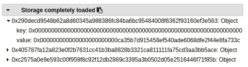

# 有史以来最狡猾的以太坊“骗局”(蜜罐)

> 原文：<https://medium.com/hackernoon/the-sneakiest-ethereum-scam-ever-6dc138061235>

我最近看到一条关于一个卑鄙骗局的推文，有人会泄露拥有一些代币并需要汽油来提取它们的账户的私钥。它有一个智能合同，可以将任何发送到它的地址的 eth 传送到另一个合同。我觉得这很不错，这让我想起了几个月前我看到的另一个“骗局”，在我看来，这个骗局甚至更狡猾。共同点是，这两种骗局都试图从一开始就怀有不良意图的人那里获得金钱。

人们已经写了一些关于以太坊蜜罐的文章，但是我在这篇文章中要介绍的是其中最隐秘的一个。如果你不知道什么是蜜罐，在以太坊的例子中，它是一个智能合同，希望让阅读代码的人认为他可以破解它，并从合同中撤回以太。但是为了破解它，你将不得不发送以太网，你将永远得不到他们回来。所以基本上就是“黑了黑客”。

我已经监视以太坊链好几个月了，我的眼睛变得非常善于发现蜜罐。通常它们都不是那么原创。但在这件事上，我有一个严重的疑问。我甚至找了一个我认为比自己扎实的黑客朋友来看看。他的第一反应是告诉我，这不是一个蜜罐，你可以很容易地从合同中撤销乙醚。因此，他继续发送 1 eth 到合同，并丢失了它…从这一点上，我知道蜜罐是在另一个水平=D。

这是合同的代码:

看起来很简单也很脆弱，对吧？`shuffle()`函数将生成一个“随机”数，该函数首先在构造函数中被调用。

在这一点上每个人都知道

```
uint8(sha3(now, block.blockhash(block.number-1))) % 20 + 1;
```

不是生成随机数的好方法。这是我们的诱饵。如果你是一个想成为黑客的人，当你打开你的以太钱包希望成为第一个从这个合同中抢夺以太的人时，你看到这条线，你的心跳开始跳动。要获得“秘密”数字，只需查询契约的存储，因为它是在构造函数中创建的。但是当然你也可以预测每一个新的`shuffle()`将会产生的“秘密”数字。我们不打算在这里讨论这个问题，因为我想这个问题以前已经讨论过很多次了。

所以我们想成为黑客的人现在上当了，他打开钱包，拿到号码，用正确的号码和一些以太 AAA 和…调用`play()`函数


但是到底发生了什么？

为了理解它，我用正确的数字调用了`play()`函数，并观察了 Remix 调试器中发生的情况。在这种情况下，我们的秘密数字是 17(十六进制 0x11)。因为`secretNumber`变量是契约中声明的第一个变量，所以它位于地址 0:


随着函数的进展，我可以看到该地址的值被覆盖了:



我在代码中添加了两个事件，以清晰的方式输出发生的事情:


在 Solidity 中，struct 默认为`storage`(另一个选项是`memory`)，因为我们的 struct 未初始化，所以它实际上指向地址 0。所以在这个契约的第 37 行，我们写到地址 0，因为它是`secretNumber`的存储地址，所以它改变了它的值。因此`secretNumber`永远不会等于你的号码，你也拿不到钱……之后，对`shuffle()`的新呼叫被发出，一切又看起来很好，\_(ツ)_/

这是我在二月份发现的第一份合同:

[](https://etherscan.io/address/0x6f952d7acaa2dffaecfe34d064ed5b46fcc59664) [## 以太坊账户、地址和合同

### 以太坊区块链浏览器、API 和分析平台

etherscan.io](https://etherscan.io/address/0x6f952d7acaa2dffaecfe34d064ed5b46fcc59664) 

我也有一个 Github repo，在那里我跟踪已知的蜜罐:

[](https://github.com/misterch0c/Solidlity-Vulnerable/tree/master/honeypots) [## 易混淆/易混淆

### 稳固-脆弱-脆弱智能合约

github.com](https://github.com/misterch0c/Solidlity-Vulnerable/tree/master/honeypots)