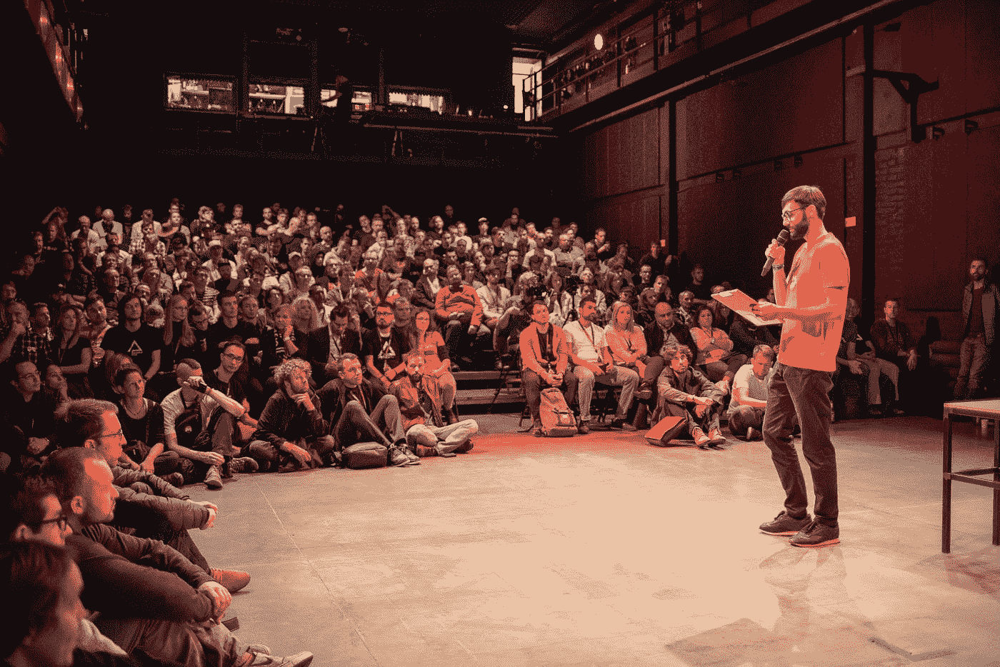
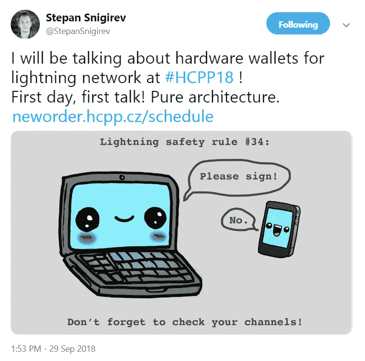
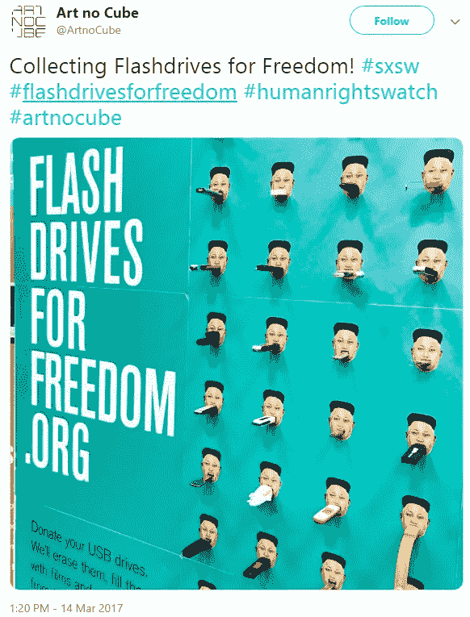
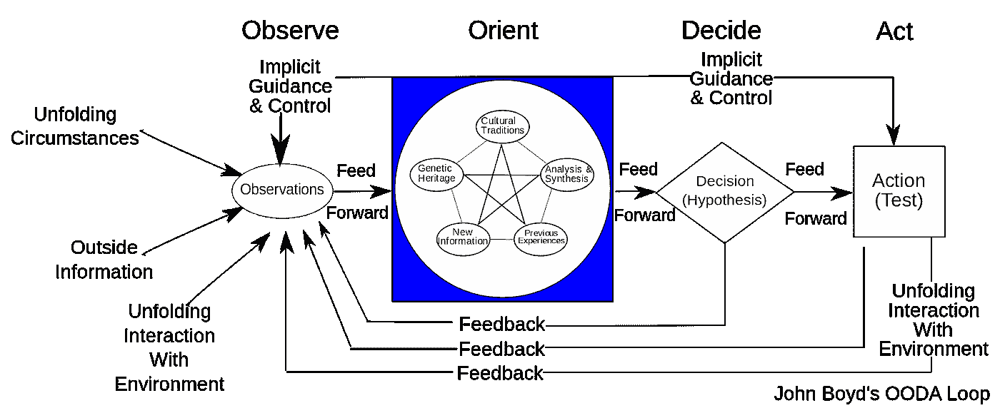
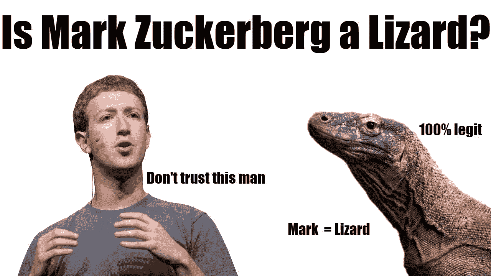
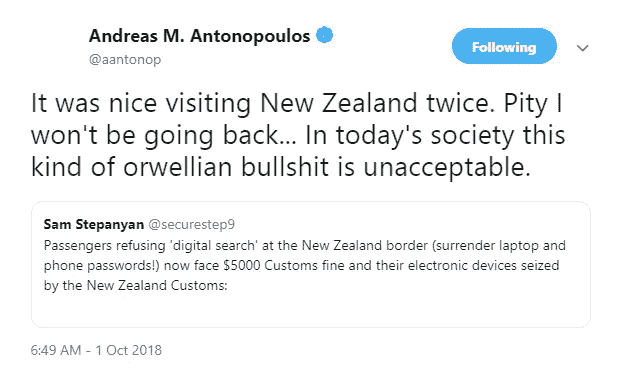
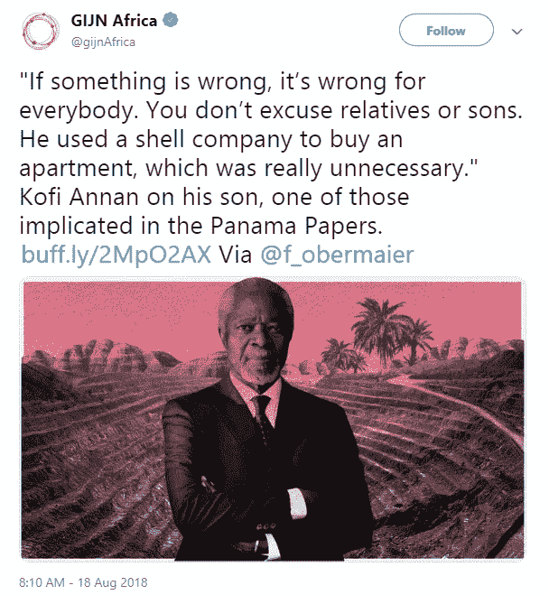
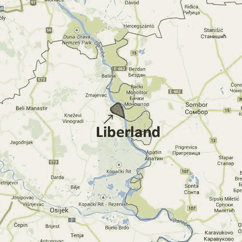

# 权力下放的软实力

> 原文：<https://medium.com/hackernoon/the-soft-power-of-decentralization-b3163fccaeec>

T **he 第五届黑客大会 paralelníPolis(**[**hcpp 18**](https://neworder.hcpp.cz/#about)**)于 2018 年 10 月 5 日在捷克布拉格开幕。为期三天的活动欢迎开发商，艺术家，政治家和活动家融合到一个神秘的中心位置，讨论今年的主题:新秩序。**

[*BTC manager*](https://btcmanager.com/)*最初发布的是始乱终弃的混合内容* [*这里*](https://btcmanager.com/the-hackers-congress-paralelni-polis-2018-hcpp18/)*[*这里*](https://btcmanager.com/hackers-congress-paralelni-polis-2018-2/) *，还有* [*这里*](https://btcmanager.com/hackers-congress-paralelni-polis-2018-hccp18/) *。**

# ***新订单的两面***

*在密码无政府研究所一楼举行的开幕新闻发布会请到了[巴拿马文件](https://www.icij.org/investigations/panama-papers/)律师和自由战士[阿道夫·利纳雷斯](http://www.talial.com/en/attorney/adolfo-e-linares-f-en/)和[达达](https://dada.nyc/home)T42【Beatriz Ramos】的创始人。两人帮助组织者抓住新兴技术的主题问题，以及他们提供新方法来反思当前系统的方式。诚然，这是一个滑坡，但在捷克选举与会议同时进行的情况下，语义讨论再及时不过了。*

*作为巴拿马公民和该国法律和货币社区的积极成员，利纳雷斯描述了“超国家管理机构”的侵蚀性危险。他特别提到了经济合作与发展组织(OECD)以及他们试图对这个没有中央银行的岛国实施的“法西斯”国家控制。“他们无法忍受像巴拿马这样‘不受监管’的国家，”利纳雷斯说。“他们希望整个世界看起来像一个地方，每个地方都受到完全相同的对待。”*

**

**Alfonso Linares and Beatriz Ramos at HCPP 2018.**

*Beatriz Ramos 解释了她在[艺术](https://btcmanager.com/art-masterworks-ethereum-blockchain-technology/)领域的新秩序，以及她的平台如何让人们在文字之外相互交流。DADA 是一个社交媒体平台，在这个平台上，视觉创意人员按照一种与当前标准截然不同的模式获得报酬。Beatriz 解释说，目前，“如果只有一两个，或者三个艺术家从他们的作品中赚了很多钱，那么还有很多人甚至不能从他们的艺术中谋生，”为了解决这个问题，达达建议在他或她的作品超过第一个卖点时向艺术家支付版税。*

# ***用于闪电和黑市闪存驱动器的硬件***

*多达三项活动同时进行，因此以下内容远非今年 HCPP 所有活动的完美代表。分为三个主要阶段，会议的主要组织者解释说，他和他的团队试图扩大到一个更大的场地。“然而，在这些更大的活动中，我们觉得参与者失去了小场地的亲密和交流，”他说。这似乎也有助于解决门票稀缺的问题，因为门票在公布后的几周内就销售一空。*

**

*Studio 1 还主持了对硬件钱包潜力的深入研究，以对抗[闪电网络](https://btcmanager.com/tag/lightning-network/)的易错性。首先，[斯捷潘·斯尼吉雷夫](https://www.quantum-munich.de/people/person-details/pers/129/)博士，一位现在致力于[比特币](https://bitcoin.org/)开发的量子物理学家，问观众，“你们中有多少人在主网上操作闪电节点？”一半以上的观众急切地举起了手。“这让我很害怕。这基本上就像对网络大喊，‘嘿，伙计们，这是我的 IP 地址，这是我存放比特币的地方，’”Snigirev 回应道。*

**

*(Source: [Twitter](https://twitter.com/StepanSnigirev/status/1046140911657390080))*

*闪电网络与久经战斗考验的主链相去甚远。恶意代理、错误广播的状态信道和简单的人为错误仍然困扰着快速的第二层的操作。然而，在像特雷佐、[莱杰](https://www.ledger.com/)或斯尼吉列夫在德国慕尼黑的项目[CryptoAdvance](https://cryptoadvance.io/)这样的硬件钱包的帮助下，这些问题中的许多都可以得到解决。然而，棘手的部分是开发一种设备，不断宣布最新的承诺，并减少在多方之间路由支付时的蜜罐风险。“像这样的硬件已经有了 Trezor 或 Ledger 所拥有的东西，但它还能够不断地询问新块的状态，这样坏演员就无法恶意关闭频道，”Snigirev 解释道。*

*在加密的世界之外，但离技术的政治影响不远，是一个关于自由的闪存驱动器的简短介绍。人权基金会的吉姆·沃诺克解释说，前提是将文学作品、电影、杂志以及几乎所有可以装进闪存盘的外部媒体偷运到朝鲜。“一开始我们用气球从韩国边境飘过去，但这是非常偶然的，”他解释道。*

> ***“直到我们开始沿着 880 英里长的中朝边境偷偷携带闪存驱动器，我们才看到了更大的增长。”***

*“闪存驱动器促进自由”组织呼吁人们捐赠任何未使用的闪存驱动器，然后在韩国进行专业擦除，然后再进行内容策划。通常，该组织与移居韩国的朝鲜叛逃者合作；他们也是决定每个驱动器将被填充什么类型的电影和电视节目的人。*

**

*(Source: [Twitter](https://twitter.com/ArtnoCube/status/841745876997541888))*

# ***真正走私者的生活***

*当天的最后一场演讲在 1 号演播室结束，解释了秘密无政府主义的真正定义。“如今每个人都称自己为秘密无政府主义者，好像这很酷或者是某种品牌，”走私者解释道。然后，他一步一步地进入无政府主义的实际定义，辩证地选择将这个词与任何其他类型的弗兰肯斯坦，SEO-buzz 词(*无政府资本主义*，*加密自由主义*)结合起来，这是一个时髦的博客在 2018 年可以想到的。有着近 15 年管理暗网社区、匿名服务器和真正无法追踪的支付的经验(甚至在 [Monero](https://getmonero.org/) (XMR)和 [Zcash](https://z.cash/index.html) (ZEC)之前)，谁会反对呢？*

*《走私者》为如何最好地理解真正的秘密无政府主义项目提供了一个方便的心理模型。要清楚地理解这一点，需要介绍一种叫做“OODA 循环”的东西，它描述了一种反复循环的动力动力学。另外，它代表观察、定位、决定和行动，由美国空军上校约翰·伯伊德发明。*

**

*(*Source*: [Wikimedia](https://www.google.cz/imgres?imgurl=https://upload.wikimedia.org/wikipedia/commons/thumb/3/3a/OODA.Boyd.svg/2000px-OODA.Boyd.svg.png&imgrefurl=https://en.wikipedia.org/wiki/OODA_loop&h=818&w=2000&tbnid=7UQ-bMCJBT8XnM:&q=fighter+pilot+boyd+OODA+Loop&tbnh=37&tbnw=92&usg=AI4_-kS9An_Rg8soEztrzFuopIrynkOySg&vet=12ahUKEwjV7dXorvDdAhXFWCwKHZUbCbQQ_B0wE3oECAYQEw..i&docid=ZzL-6HkYCpvrWM&itg=1&sa=X&ved=2ahUKEwjV7dXorvDdAhXFWCwKHZUbCbQQ_B0wE3oECAYQEw))*

*“人们通常认为，无政府主义者是不断向一切事物投掷燃烧瓶的人。这些不是无政府主义者，这叫做*失范*，”他解释道。更明确地说，一个真正的秘密无政府主义者很少会首先采取这种行动。真正的方法论来自于忽略 OODA 框架的观察方面。没有肉搏战，无政府状态通过密码术在任何暴力对抗出现之前很久就看不见控制者。围绕这一点，我们花钱的方式、网上生活的方式、匿名分享经济以及我们的穿着方式都有巨大的影响。*

**

*The Real Smuggler.*

*令观众懊恼的是，他还指出，目前比特币在隐藏人们的身份方面做得“相当糟糕”。在众多源于这种哲学的想法中，Smuggler 以一个观众的请求作为结束:“我希望明年我们这次谈话，Monero 和 Zcash 也会变得更好。不是抨击，只是支持。”*

*D **ay 两个**[黑客大会](https://neworder.hcpp.cz/schedule) **继续为去中心化带来的自由战斗技术带来曙光。***

*自然，观察家们认为比特币是自由和创新之王，但还有许多其他方式(和理由)来拆除中央集权结构。从这些介绍中，观众更好地了解了一个节点分散在网络中的无头组织是如何成为抗脆弱性的一个光辉典范的。*

# ***无名氏怎么发音？***

*隐私几乎是所有演讲中的一个主要话题。加密蜜罐和大规模数据中心的兴起给个人和整个社区带来了相当大的问题。现在，随着这些问题进入政治领域，像马克·扎克伯格这样的人在国会蹒跚而行，很明显，对有血有肉的个人来说，真正的解决方案可能不会轻易获得；许多人将不得不接受它。那么问题就来了，应该认真对待哪种解决方案。*

**

**Facts are facts.* (*Source*:[YouTube Shitpost](https://www.youtube.com/watch?v=GaqYYLbfy6s))*

*在小组讨论中，[彼得·托德](https://petertodd.org/)、 [binaryFate](https://twitter.com/binaryfate01?lang=en) 和[阿诺·普费弗林](https://twitter.com/mrceebo?lang=en)就比特币隐私发展的技术现实、 [Monero](https://getmonero.org/) 和 [Horizen/Zencash](https://horizen.global/what-is-horizen/) 进行了发言。作为一个接触点，这三人还被邀请就在监管状态下[可替代性](https://btcmanager.com/blocked-chain-make-work-just-add-fungibility/)的必要性发表演讲，监管状态正在成为世界金融体系的一部分。 [zK-Snarks](https://btcmanager.com/tag/zk-snarks/) 、[环签名](https://btcmanager.com/what-is-kovri-why-is-it-important-for-monero/)以及[mimble](https://btcmanager.com/mimblewimble-lightning-network-steal-spotlight-at-scaling-bitcoin-milan/)在比特币的地平线上的到来，都试图以不同的方式解决极端透明的问题。*

*托德甚至支持闪电网络的隐私功能，尤其是它的非粘性交易方式。最终，开发人员得出结论，程序员建立了“一个无聊的工作硬币，然后在第二层解决隐私问题。”*

*说起来容易做起来难，但也不无道理。由于日本已经向公司施压，要求其将隐私币从交易所和传统服务(如万事达卡和维萨卡)的中剔除，日本仍在恶意收集我们每笔交易的数据，我们可能需要削减脂肪(和 shitcoins？)并开始用隐私对抗透明，就像昨天一样。*

# *乔尔格·普拉茨完成侦察任务回来了*

*德国柏林 77 号房间的主人报告了他从正规机构对加密货币的观察。“事情有好有坏，”普拉茨解释道。“一方面，我知道央行官员拥有比特币，因为他们并不愚蠢，但另一方面，我们看到传统金融中我们不喜欢的东西也出现在比特币中。”*

*他的比较来自于他 2014 年在 HCPP 的一次演讲，在那次演讲中，Platzer 解释了金融当局对这项技术的普遍无能。然而，随着[的叙述发生变化](https://btcmanager.com/lehman-brothers-wall-street-bitcoin/)，加密货币(至少是比特币)正面临被吃掉并被吐出成为 [ETF](https://btcmanager.com/tag/bitcoin-etf/) (或者更糟)的威胁。比特币基地实际上是一家银行。使用托管服务违背了比特币的初衷，”他继续说道。*

*尽管存在批评，但机构投资者可能已经迷上了加密漏洞，开发可能为时已晚，无法按下反转按钮。对这种无条件收养的狂热欢呼更加令人恐惧。观察人士似乎每天都在见证银行当局发布任何与加密相关的公告后的抛售和反弹。对此，普拉茨补充道:*

> ***“大规模收养我的屁股。我宁愿看到比特币在汇率上下跌，也不愿看到它在这种情况下被使用。”***

*最终，真正需要观察的将是那些追随支持中央集权的群体和不支持中央集权的群体。关于坏人的简短名单，看看谁在 2017 年签署了纽约协议。*

# ***超时加密和海星(或蜘蛛)***

*根据新西兰最近的规定，[真正的走私者](https://twitter.com/therealsmuggler?lang=en)回来提出了一个新颖的解决方案。对于外行人来说，这个羊比人多的国家的立法规定，边境巡逻队现在有权搜索、解密和检查旅行者的数字事务(又名“[数字带搜索](https://www.washingtonpost.com/news/morning-mix/wp/2018/10/02/new-zealands-digital-strip-searches-give-border-agents-your-device-passwords-or-risk-a-5000-fine/)”)。否则，进入者必须支付 5000 美元的罚款。幸运的是，还有第三种解决方案:密码锁。*

**

*(Source: [Twitter](https://twitter.com/aantonop/status/1046759119229788160))*

*该软件依赖于甲骨文、[棘轮算法](https://crypto.stackexchange.com/questions/39762/what-is-a-ratchet)和一点独创性。“如果你不知道你的密码是什么，你就不能告诉边境巡逻队，”走私者解释说。密码锁建立了一个秘密的散列秘密(想想加密的开始),它有一个“期满”,在一段时间后销毁秘密。它还具有允许对多个秘密进行加密的特性，以及延长秘密到期时间的能力。但这并不妨碍暴虐的政权仍然利用所有有价值的强制手段(比如拔掉你所有的指甲)。买家当心也许是惯用手法。更好的是，完全忘记那个国际假期。*

*在保护个人免于被人挤压之后，面对压迫者，群体如何维持自己？根据 Austin Craig 的说法，历史上有两种解决方案:集中式与分散式(或[蜘蛛与海星](https://www.amazon.com/Starfish-Spider-Unstoppable-Leaderless-Organizations/dp/1591841836))。读者可能会猜测哪个(至少到目前为止)更成功。*

*一个主要的例子是伊斯兰极端组织的分裂。克雷格引用了一些资料，这些资料概述了 2001 年后中东地区对恐怖主义的正面攻击是如何导致多头暴力的。甚至在奥萨马·本·拉登被象征性地斩首之后，恐怖事件的效力也有所上升。很快，许多加密货币背后的意识形态呈现出前所未有的光芒。*

# ***社群主义意味着兄弟之爱和没有安全网***

*当天活动的最后一位演讲者将高级加密教皇职位带到了它最终服务的人类面前。著名的自由主义思想家和《自由人的视角》一书的作者保罗·罗森博格解释了一个分散的、最小国家经济将如何对待它的病人和残疾人。“人们会像以前一样互相照顾，只是会更好，”罗森博格解释道。*

> ***“政府从我们这里拿走的那笔钱，可以重新用来请承包商修理阁楼。这意味着多了一个房间给奶奶住，或者给丈夫刚刚去世的邻居住。”***

*目前，政府的等级观念使我们疏远了我们的同胞。罗森博格说，它阻碍了促进社区和有益生活的滋养关系。通过消除这些连接个人的线性机制(通常是单向的)，社区形成了，其中每个成员明显地帮助那些有需要的人，并更有效地分配资源。在当地行动，最好是没有老大哥的允许，不可避免地会比目前的权力金字塔更好地服务于团体。*

*根据罗森博格的说法，自由主义者对财富分配的反应在分权原则中找到了一个不完美的、尽管“更好”的家。从远处看，它给人一种温暖模糊的感觉，尤其是对奶奶来说。*

*他在布拉格的最后一天最后一次提醒人们权力下放的范围有多广。*

*如果说前两天解释了如何最好地实现多节点组织战略的更多技术方面，那么 2018 年 10 月 7 日的演示则解释了其中的哲学。自古以来，不同的信任体系定义、摧毁和重建了社会；今年[黑客大会](https://neworder.hcpp.cz/)后的感受，让很多观察家充满了类似的革命渴望。*

# ***透明度与隐私***

*建立在互联网第一个自由控制论世界之上的应用程序也带来了透明的幽灵。起初，它走上红地毯，被当作解决腐败的方法出售。此外，[脸书](https://btcmanager.com/?s=facebook+)和[推特](https://btcmanager.com/?s=twitter)为联系人们提供了一个新颖的解决方案。帖子、评论、赞、推文、分享和活动帖子的受众比想象的要广泛得多。事实上，这些信息块看起来都很相似，这是另一个好处。它成了传播界的麦当劳。蓝色和白色的信息来自你失散已久的堂兄弟、刚刚买了第一台苹果平板电脑的祖父母，甚至是住在隔壁的邻居。所有这些都可以方便地集中在两个平台上。*

*事后看来，这种便利现在受到质疑，甚至被彻底厌恶。这些平台已经成为私有化的数据机器，具有更好地完善其收集机制的巨大动力。透明度最初是作为解决我们线下生活中所有不幸的一种解决方案而提供的，现在却呈现出一种前所未有的形式。然而，我们继续坚持透明度，以显示某些疑虑。*

*其中一个公开小组让来自巴拿马的著名自由主义律师 [Adolfo Linares](https://twitter.com/linaresfulo) 与捷克调查记者 [Pavla Holocova](https://twitter.com/pafak?lang=en) 进行了对抗。后者(与其他记者团队)密切合作，发布了指控许多高层政客参与洗钱活动的文件。诚然，霍洛科娃解释说，这些人中只有少数人最终锒铛入狱。*

**

*(Source: [Twitter](https://twitter.com/gijnAfrica/status/1030834230069264385))*

*当利纳雷斯追问具体身份时，唯一想到的真名是巴基斯坦总理。“好吧，但这与巴拿马文件无关，”利纳雷斯反驳道。*

*大部分的对话较少围绕案件的细节，更多的是关于信息收集的方式。对于[背景](https://www.icij.org/investigations/panama-papers/)，一个特殊的“无名氏”谁的动机尚不清楚，黑客攻击敏感的财务信息，并将其发布给国际调查记者联盟(ICIJ)。在对文件进行冗长的梳理之后，这些信息被整理成了公众现在所理解的巴拿马文件。但是这合乎道德吗？“这就像新的‘盖世太保’，”利纳雷斯说。*

> *有人窃取了公民和公司的私人信息，然后发布出去。这是对隐私的侵犯，也是对基本人权的侵犯。”*

*虽然 Linares 和 Holocova 远非死敌，但他们确实代表了一种更准确的透明度概念。公民的隐私与政府对其行为的清晰性之间的挑挑拣拣在全球范围内造成了双重标准。最重要的是，政府在技术上有责任保护其公民的隐私，但头条新闻指向了一个非常不同的现实。选择阵营是很棘手的，很少有政权能够找到比政府首脑更好的保护公民和地方企业的完美平衡。*

# ***如果你不能打败他们，建立一个新的国家***

*在一个专注于定义“无政府主义”和“隐无政府主义”之间区别的活动中，提出大规模点燃老大哥和他的中央集权组织的篝火并不是牵强附会。一场真正的火灾，然后把这一堆乱七八糟的东西处理掉。虽然这仍在讨论中(这本身可能很有趣)，但[自由国度](https://liberland.org/en/about/)的到来提出了一个非暴力的替代方案。*

*这个自由世界岛的总统解释了一块面积大致相当于直布罗陀的土地将如何重塑一个城市国家的形成。捷克右翼自由主义活动家 vít Jed lika 提出了一项自愿选择税，公民的投票权和政治影响力由他们决定缴纳的税款决定。代替征税的是，公民被激励支付他们的会费，但这些不是强制性的(除非他们也想洗去他们的政治权力)。与 *BTCManager* 更相关的是，这种赌注力量是通过一种叫做“功绩”的加密货币实现的。*

*总统解释说，虽然硬币还没有在任何交易所上市，“许多自由民经营不同的交易所和事物，所以到时候这不会是一个问题。”*

*据报道，政府将是一个“开源”的操作，有许多功能沿着以太坊的 T2 和区块链运行。他们已经开始与[道斯塔克](https://daostack.io/)和[克莱罗斯](https://kleros.io/)合作，重塑社会契约，将过时的政治模式带给“新一代”*

*自 2015 年成立以来，他们已经收到了近 50 万份公民申请。可能不是每个人都能够住在这个岛上(它只能容纳一小部分有希望的应用程序)，但这种兴趣不仅仅是一种时尚。由于这块土地是南斯拉夫解体的产物，克罗地亚和塞尔维亚都分享了他们对这个项目的看法。“下一步意味着克罗地亚不再干涉我们，”耶德利奇卡解释说。因此，当运行一个像创业一样的状态时:快速失败，然后再试一次。*

**

*(*Source*: [Liberland](https://liberland.org/en/about/))*

# ***机械师开车时更关心汽车***

*最后的讨论来自《黑天鹅》的作者纳西姆·尼古拉斯·塔勒布。他向观众讲述了他的最新小说《游戏中的皮肤》的原则，并提醒听众如何正确传递信息。“我所说的准确比喻是在餐饮业，”塔勒布说。*

> *“在纽约，你可以得到所有这些奖项。皇后区最好的汉堡，或者五星旅行顾问，或者类似的。但当你一年后回来时，这些餐馆大多已经倒闭了。”*

*这一点为如何最好地思考一个人与现实的关系提供了一个极好的心智模型。一个企业的会计比一个网络巨魔对你著名的培根汉堡的评论重要得多。它是关于最终产品，你的企业生存能力的现实，而不是关于你的同行如何看待你的企业。记住这一点也有助于确定谁应该引起你的注意。*

*根据塔勒布的说法，这与经验有关:“一个失败的企业主比一百个学者更有价值，因为企业主与利润和损失都有关联。”然而，知识分子、专家和官僚都不会受到损失，因此当涉及到实质性的决策时，他们不会有*的利益。他们可以做出选择，而不必担心他们的决定的负面影响。正是这种区别阻止了许多导致 2008 年金融危机的人获得任何形式的监禁。**

*所以，下一次读者有兴趣知道谁是[交易建议](https://btcmanager.com/guide/trading-strategies/)的跟随者时，他们应该自己动手做。或者从失败者变成成功者中学习。*

# ***包装完毕***

*加密货币构成了一个由技术推动的政治立场的丰富星座。这是一个围绕信任，参与，并授权个人为她的社区创新。[比特币](http://bitcoin.org/)是这一议程的第一推动者，从黑客大会上许多演讲者的评论来看，蜜獾数字资产几乎没有真正的竞争对手。*

*不幸的是，主权货币的哲学含义在围绕它出现的投机方面被忽略了。忽视这些方面也不是没有先例。国家的兴衰可以通过它们的货币政策来理解。*

*如果观察家们将塔勒布的建议放在心上，他们最好在犯下导致全球经济崩溃的同样错误之前认识到最近的历史。至少，这是希望。*