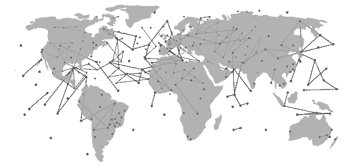

# 普遍获得信贷的解决方案

> 原文：<https://medium.com/hackernoon/the-solution-for-universal-access-to-credit-a443fa5d9a53>

> 革命性的技术进步正以令人眩晕的速度推动着世界向前发展。我们难道不喜欢吗？

我们迫不及待地想让最新的小工具和解决方案上架或进入我们的生活，让它变得更简单、更方便、更好。

但是，不幸的是，并非所有人都是如此。我们星球上几乎三分之一的人被排除在分享快乐之外，仅仅是因为他们不能像我们其他人一样获得财政资源。或者，当他们这样做的时候，往往是歧视性的。

进入 Swapy。请继续阅读，了解 [Swapy Network](https://www.swapy.network/#howitworks) 如何通过其普遍获得信贷的解决方案，为全世界，包括贫困和不发达国家，创造公平的竞争环境。

# **当前的信用体系排斥或惩罚人们**

全世界有 20 亿人无法获得金融服务和信贷服务。这在新兴经济体中是一个特别的问题，因为银行集团通常向最贫困人口或生活在偏远地区的人提供服务。

[**视频**](https://www.youtube.com/watch?v=bAaSeh_au30)

*全球利率差距*

即使在世界上不发达或发展中地区可以获得信贷，利率也非常高。国际货币基金组织(IMF)汇编的数据显示，自 1995 年以来，马达加斯加、巴西和安哥拉等国的年利率高达 39%-80%。

而与此同时，大多数发达国家的利差非常低，例如美国在 3%左右，日本在 1%以下。而且，就实际利率而言，大多数发达国家都是零利率或负利率，也就是说，消费者可以以微不足道的利率借钱，有时甚至是免费的。

# *信息不对称*

信贷提供者——如银行、金融机构和贷款公司——主要根据消费者数据做出贷款决定；比如申请人的信用记录，个人人口统计等等。为使信贷系统有效运作，获得这种信息对贷方来说至关重要。

然而，由于信贷市场中的所有参与者都无法公平地获取数据，这代表了一种信息不对称的情况，阻碍了更广泛的参与，特别是将较贫困的地区排除在外。

现有信息的数量和质量因国家而异，取决于几个因素；例如政府法规、非正式劳动的水平以及该地区的贫困程度。

然而，即使在征信机构掌握高质量消费者数据的国家，获取这些数据的成本也很高；反过来，这增加了信贷成本。

# *资金成本高*

发展中国家基于风险的资本成本非常高。一个恰当的例子是巴西，家庭无担保贷款的平均利息成本为每年 127%，信用卡利率约为 332%，透支利率为 321%。

因此，一个原因是巴西银行市场极度集中，也就是说，这些机构在向客户收取的贷款利率方面拥有全权。贷款机构之间没有太多竞争，因为只有五家银行提供全国 93%的贷款。

# *无法满足所有需求*

20 亿人无法获得金融服务的一个重要原因是，传统银行无法找到经济高效的方式来服务全体民众，特别是那些处于社会经济金字塔底层的人。

通常，潜在客户不得不走很远的路才能到达银行分行。或者，简单地说，因为他们收入较低，银行不把他们当客户看待。

后果是这些个人被排除在全球信贷生态系统之外。例如，在巴西，40%的人口没有银行账户。

*大多数信贷服务仍然是非数字化的*

尽管平板电脑和智能手机越来越多地出现在巴西人民的日常生活中，而且有证据表明，消费者显然更喜欢数字渠道，但大多数信贷服务仍然是面对面提供的。

例如，在巴西，2010 年至 2015 年间，非面对面的信贷交易总数为 2.36 亿笔，而 2010 年为 5.57 亿笔

面对面的渠道。因此，70%的信贷交易仍然是由个人进行的，而不是通过数字渠道。

# **交换溶液**

Swapy Network 是一个分散的全球信贷平台，旨在连接和整合贷款人、借款人、数据机构和保险公司等其他利益相关方。

Swapy 采用基于市场的方法来减轻信贷业务中全球差异的高成本和排他性影响；从而促进全世界每个人普遍和平等地获得信贷。

对于世界各地的个人来说，无论他们身在何处，Swapy 都允许通过一个全球通用的单一金融身份参与信贷市场。此外，由于可以从全球各地获得贷款，借款人可以享受到全球最具竞争力的贷款利率。

因为所有贷款人都可以平等地访问交换数据网络，而且数据总是有效和最新的，所以它消除了信息不对称，并从信贷过程中清除了相应的成本。反过来，较低的系统成本意味着消费者的贷款利率较低。

此外，通过 Swapy，所有申请人都拥有个人数据的权利，并有机会将其货币化。

就贷款人而言，全球互换网络允许所有人平等接触世界各地的潜在借款人，这减轻了垄断的大型贷款人目前享有的不公平优势。

最新的易变信贷数据库进一步允许信贷发放者做出更好的贷款决策，并向优质客户提供更低的利率；这反过来提高了贷方的竞争力。

Swapy 网络为贷款人提供的整体低参与成本，消除了以前进入信贷行业的高壁垒。此外，由于越来越多的贷款人参与进来，世界各地的个人都有可能获得信贷，从而使 Swapy 成为普遍获得信贷的真正可行的解决方案。

# **交换平台**

[视频 ](https://www.youtube.com/watch?v=I3ThcLyi8_E)

Swapy 的分散式全球网络平台由三个完美协调的集成应用程序组成，提供普遍的信贷服务。

*掉期交易*

将精明的资金与新兴经济体联系起来。它将来自利率相对较低的国家的国际投资者介绍给利率相对较高的国家的信贷公司。

*Swapy 连接世界各地的市场*

因此，投资者有机会在全球范围内追求更高的收益。同时，世界各国的信贷公司可以获得低成本的资本，而这些资本又可以通过世界一流的低利率传递给消费者。

*交换财务 ID*

在全球范围内赋予借款人权力。它反映了他们的信用评分等级，这总是最新的和相关的，因此很容易被贷方验证。金融 ID 奖励优秀的借款人，让他们获得即时、低成本的信贷服务。而与此同时，它将鼓励其他国家获得类似的地位，从而在持续的基础上扩大世界范围内有活力的借款人的范围。

*易变数据市场*

因为交换网络的用户拥有并控制他们自己的数据，所以他们能够通过交换令牌来行使控制。

令牌使用户能够持有自己的数据，选择他们收到多少令牌作为交换，以及他们希望与谁共享。

此外，易变的数据市场使得所有有意愿的合作伙伴(而不仅仅是大公司)之间共享信用信息成为可能，这对于全球信用市场的整体竞争力非常有利。

你可以[试试 Alpha 版本！](https://www.swapy.network/download)交换交换。这是一个模拟版本，仅供演示之用。它使用虚拟的以太网——而不是真正的货币——并在以太网 Ropsten Testnet 上进行演示交易。

SWAPY 平台还促进了网络上*循环经济*的建立，新进入者可以在 Swapy 网络上提供产品和服务，并以 Swapy 获得报酬。有关循环经济的更多信息，请参见 Swapy [白皮书](https://s3.us-east-2.amazonaws.com/swapynetwork/SwapyNetwork_TokenSale_Whitepaper-EN-US.pdf)的第 13 页。

**交换令牌& ICO**

交换令牌可以被描述为交换平台网络的官方货币。用户之间以及用户与平台之间的所有网络价值交换都将通过 SWAPY 进行。

*SWAPY 可以用来做什么？*

Swapy 是一种实用令牌，将用于支付平台上个人信息的费用，也用于其他 SWAPY 网络服务，如信用评分，一旦应用程序开发完成，借款人可以进一步使用他们的 SWAPY 作为贷款抵押，通过平台上的贷款人获得信贷。

*如何购买 SWAPY？*

有两个主要阶段，预售和大众销售。我在预售时购买有什么优势吗？在 2018 年 3 月 19 日开始的预售期间，该代币可享受诱人的折扣。更多信息请访问 Swapy [网站](https://www.swapy.network/)。

*有多少代币可用，Swapy 网络将如何使用筹集的资金？*

在 Swapy 网站上可以找到关于 TGE 的全部信息，同样在 Swapy 白皮书第 20-23 页的“代币报价”、“经济学”和“代币销售收入的使用”下。

Swapy 还提供了一个奖金计划，任何人都可以加入奖金圈来获得 SWAPY 代币！

**管理、路线图&里程碑**

Swapy Network 是一个由 Swapy 公司管理的开源项目，由 Credit Dream Inc .全资拥有；一家成立于 2014 年 11 月的特拉华州公司。

该公司由一个技术高超、经验丰富的团队管理，并由一个能干的顾问小组提供适当的协助。

关于[交换团队、合作伙伴&顾问](https://www.swapy.network/team)的更多信息可在网站上获得。同样，在 Swapy [白皮书](https://s3.us-east-2.amazonaws.com/swapynetwork/SwapyNetwork_TokenSale_Whitepaper-EN-US.pdf)的第 21-24 页。

交换之旅始于 2017 年初，可在网站上的[交换路线图](https://www.swapy.network/)中查看。关于 Swapy 的“历史”和“估计的软件开发计划”的更多信息可以分别在白皮书[的第 25 & 19 页找到。](https://s3.us-east-2.amazonaws.com/swapynetwork/SwapyNetwork_TokenSale_Whitepaper-EN-US.pdf)

**结论**

就平等和普遍获得信贷而言，Swapy 网络平台正着手实现一个急需的解决方案，以在全球范围内创造公平的竞争环境。

通过利用分散的区块链网络和加密令牌的尖端优势，Swapy 可以随时随地连接借贷双方。

蒂姆·德雷珀和唐·塔斯考特的证词很好地证明了 Swapy 网络的革命性愿景以及它所要实现的值得称赞的成果。

蒂姆·德雷珀

[“很高兴看到 Swapy Network 追求更便宜的信贷和学生贷款。巧妙的解决方法。”](https://twitter.com/TimDraper/status/924303811975327745)

[唐·塔斯考特](https://twitter.com/dtapscott/status/935249423822569472)

[“区块链将从根本上改变我们获取信贷的方式。很荣幸能够支持 Swapy Network，因为他们让这一愿景成为了现实。”](https://twitter.com/dtapscott/status/935249423822569472)