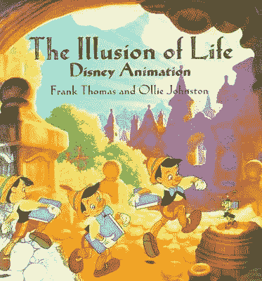
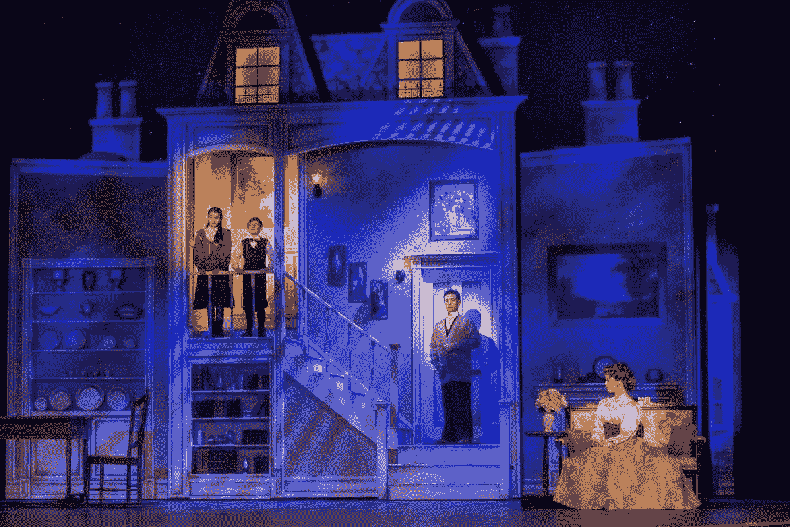
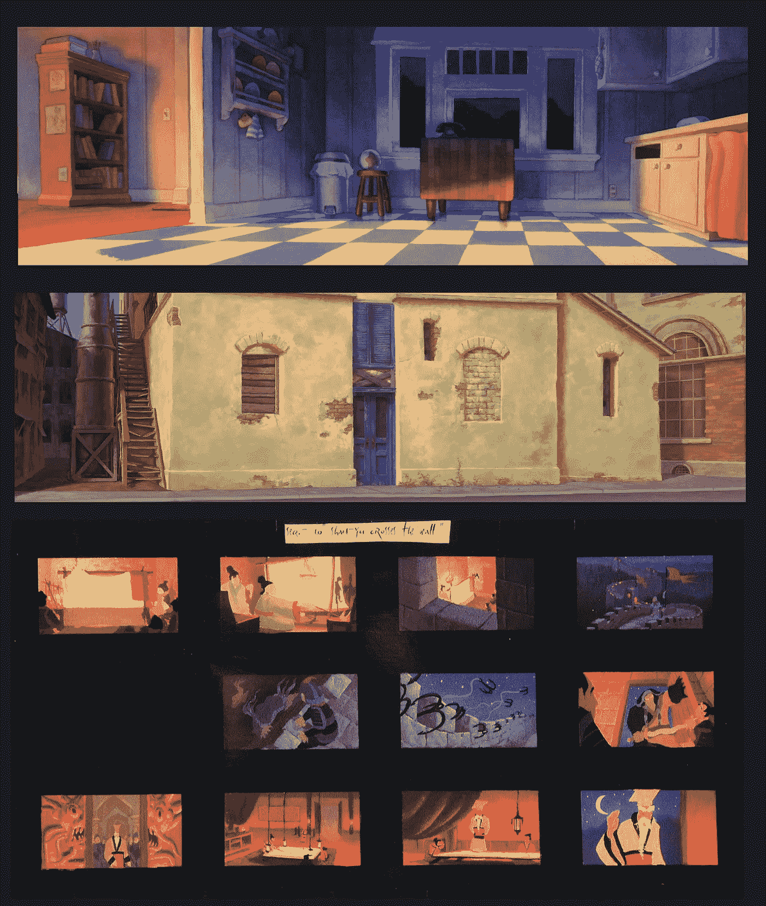
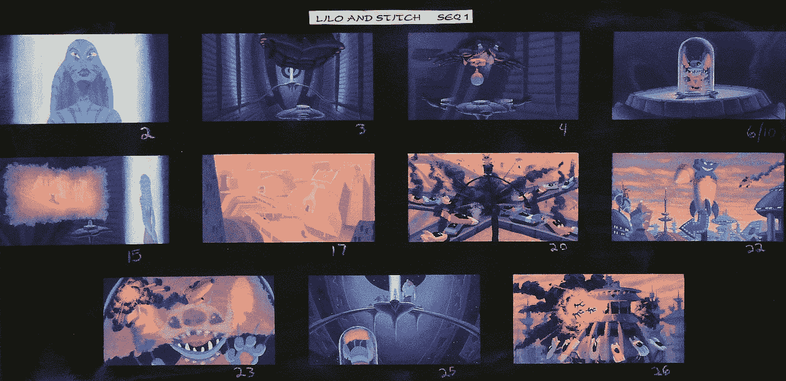
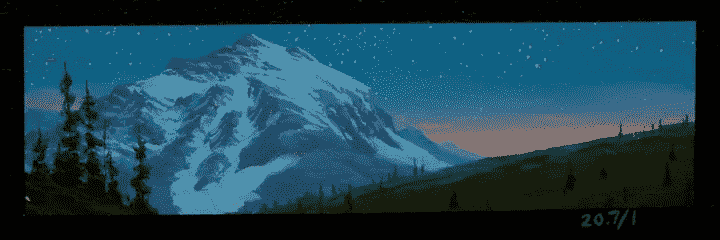
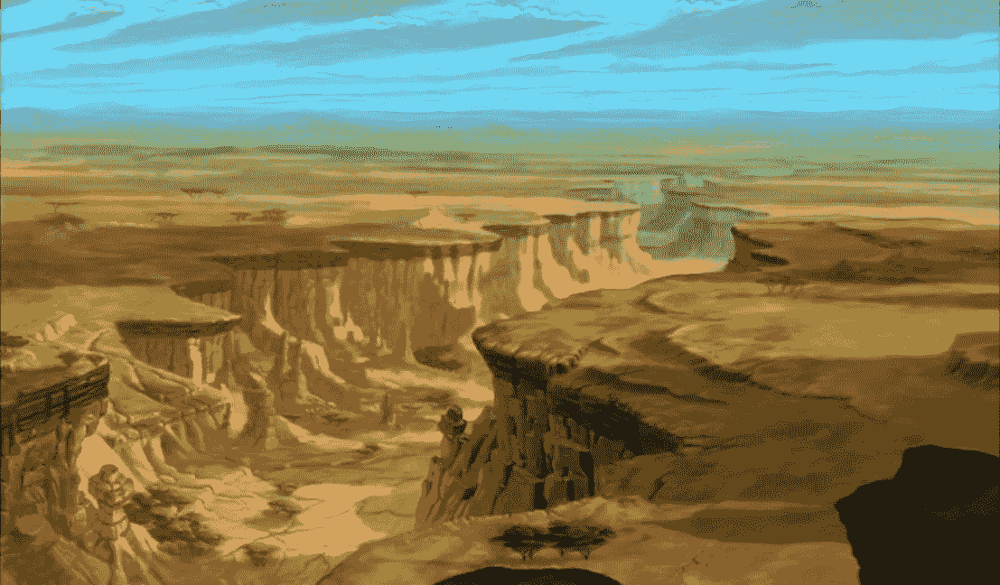
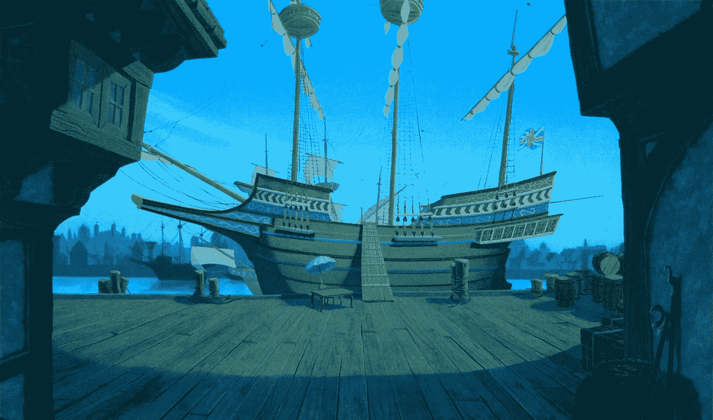
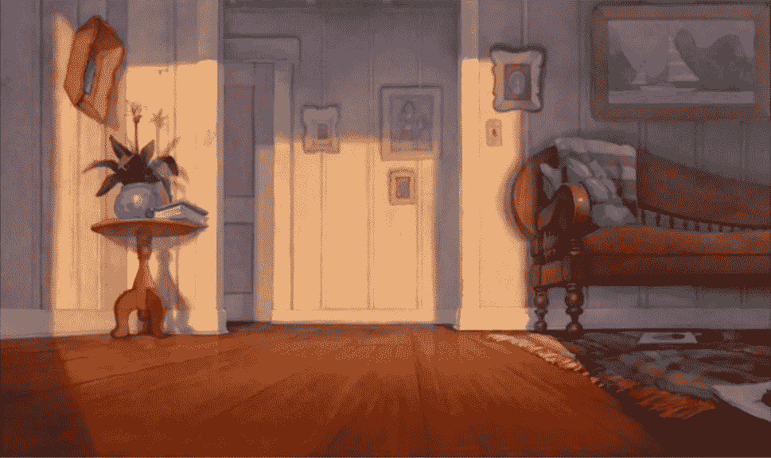
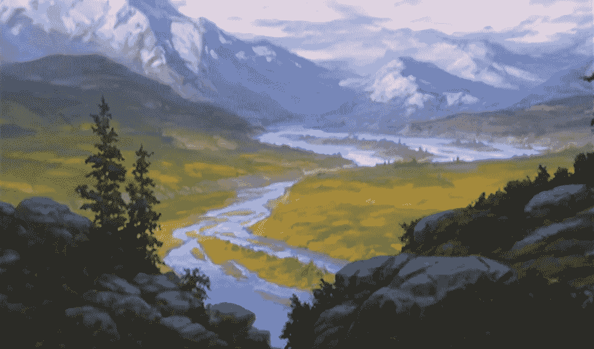

# 我的品种的香料(第一部分)

> 原文：<https://medium.com/hackernoon/the-spice-of-my-variety-part-1-842971b7a0dc>

作为一名专业的艺术家和创意者，我走遍了整个地图:华特·迪士尼动画背景画家。插画师。美术画家。平面设计师。教官。电影制作人。作家。这曾经引起一些关注，因为有一句老话:“万事通，无所不能。”我也听说过其他令人不快的含义；

*“他似乎……心不在焉。”*

*“你应该找份真正的工作。”*

*“你好，小飞侠？”*

从那以后，我不再受这种耻辱。也许你也需要放下？让我告诉你为什么。

我很幸运有许多世界级的专业朋友和家人(艺术家、作家、艺人、电影制作人、演讲者、音乐家、教育家、商人和女性)，他们通常专注于一件事(而且做得很好)。我曾经很羡慕他们，因为我时常感到分散、模糊和格格不入，就像你在家庭聚会上看到的喝醉的叔叔一样，“嘿，过来，我有个主意。”

事实是，我喜欢许多事物。我不能改变这一点。我的个性要求我学习各种各样的东西。我觉得自己像星舰进取号的柯克船长，

*《太空:最后的边疆。这些是星舰……*企业号*的航行。它的五年任务是:探索陌生的新世界。去寻找新的生活...*以此类推。(由威廉·夏特纳之音朗读)。

顺便说一句，我知道这有多无聊。还有夸大其词。

但老实说，这就是生活对我的意义；寻找各种方式来表达我的艺术和创造力，并与他人分享。我承认“文艺复兴时期的人”在我脑海中低语，但这在当今世界似乎并不实际。更简洁地说，我不能做同样的事情，24-7。我会发疯的。我已经接受了这就是我，也注定是我。多才多艺让我更满意。我知道我并不孤单。

“千篇一律是厌恶之母，多样化是治疗之道。”弗朗塞斯科·彼特拉克

*“没有时间进行千篇一律的单调。有时间工作。和时间去爱。那就没有其他时间了。”*——可可·香奈儿

“我宁愿变得古怪一点，也不愿变得无聊。”——丽贝卡·麦肯锡

作为一名专业艺术家，我在 24 岁时开始在华特·迪士尼动画公司工作

# 迪士尼背景艺术家

在工作室工作六个月后，我成为了一名背景艺术家。 [IMDB](https://www.imdb.com/name/nm1074865/)

正如弗兰克·托马斯&奥利·约翰斯顿的精彩著作《生命的幻觉，迪士尼动画》中所说，

*“他(BG 画师)必须把角色搬上舞台，支持动作。这是最重要的。他的作品可能是戏剧性的、令人吃惊的、强有力的或令人激动的，但它仍然必须只是行动的背景。”*

对于演员来说，背景相当于剧院舞台，用视觉队列来设置故事的位置和气氛。

除了一些非常优秀和非常有才华的人，我有幸参与了几部传统动画电影的制作(狮子王-1994，风中奇缘-1995，木兰-1998，Lilo & Stitch-2002，熊哥哥-2003 和公主与青蛙-2009)。[电影作品](https://www.kooserstudios.com/disney-background-art-1)

Above from top: Lilo & Stitch background — watercolor. Middle: Princess & the Frog background — digital. Bottom: Mulan sequence 1.0 thumbnail board — acrylic.

Above: Lilo & Stitch thumbnail board — Acrylic.

缩略图和颜色键是小型绘画研究(邮票大小为 3x5 英寸。)制作迅速，为故事设定了基调、风格和基调。这有助于艺术总监和导演们在确定最终的“屏幕”背景之前，看到给定序列或场景的环境设计和颜色。它还设置一天中的位置和时间。

一个很好的例子是**熊哥哥，**利用育空和阿拉斯加的壮观地理。下面是一个颜色键。从这幅作品中可以看到更大的背景、动画角色、画外音、音乐、特效等等。

Color Key Thumbnail for “Brother Bear” Acrylic 1.5x3.5 in

Final film version of this scene — Finland

从《T4》、《白雪公主》、《七个小矮人》到《T5》，迪士尼的魅力在于每部电影都有不同的风格。这真的把艺术家推向了未知的领域，拓展了工具箱。这不是一件容易的事。实验-失败-学习-重复，直到取得进展。伟大的人生一课。

背景样式:

狮子王的背景被称为卡通现实主义。

风中奇缘非常干净。

Lilo & Stitch 是一种使用水彩的“匹诺曹”风格的复古。

而**熊哥哥**用油滑的丙烯颜料和松散的笔触模仿印象派。

随着年龄的增长，我越来越内省，我开始探究更深层次的含义:为什么我对变化有如此强烈的渴望？有一天，当我在买蛋糕装饰工具时，我戴上了它…你知道，用来画画。(在另一篇文章中会有更多相关内容)。我对自己说，

# “向往变化，就是接受挑战。”

所以当我说我喜欢多样化作为一种创意时，我真正想说的是，“我喜欢挑战。”一些新的东西需要学习，改变，不同，不熟悉，原创，甚至可能不舒服。我想考验一下自己。**我想看看我能不能做到！如果我做不到，我知道这种方式是行不通的——这也是有价值的，因为我不再花时间和精力去追求它，我可能只需要调整我的方法。**

在像迪士尼这样的动画工作室工作迫使你接受挑战。每部电影的人才水平如此之高，人们的期望也是如此之高，以至于你别无选择，只能接受挑战。我很喜欢。然而，是时候进入*变化*故事的另一个篇章了(下一篇博文——敬请期待)。

船长日志:星际日期 12/26/18。学会接受变化和生活中的许多挑战让我摆脱了众所周知的猴子。我不再用“我不应该这样做”来评判自己。

我现在跟随创造性的潮流，为了成长、知识和纯粹的乐趣。你呢？

下次博客见。

[库泽工作室](https://www.kooserstudios.com/)