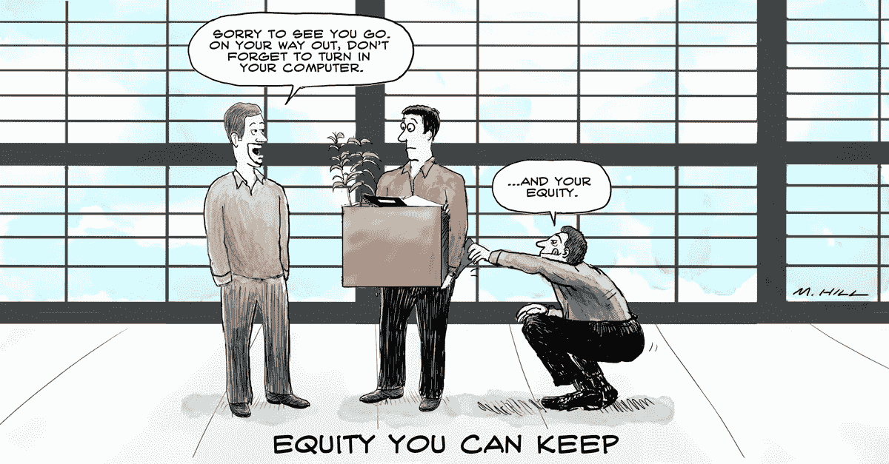

# 硅谷精神

> 原文：<https://medium.com/hackernoon/the-spirit-of-silicon-valley-9ddb1a2a04b0>

一到这里，我几乎立刻就爱上了硅谷和它所代表的一切。我体验过大型企业文化，但并不满意。我不能说我很失望，因为我没有抱很高的期望。在这种文化中，工作年限和你在公司的关系决定了你的级别和职位，而不考虑你的天赋和能力。硅谷不会为个人职业生涯的****成长设置不必要的障碍。我喜欢的另一个方面是向世界传递有价值的东西的动力。硅谷的光环是会传染的。****

****我欣赏的一个方面是，当你为一家** [**初创公司**](https://hackernoon.com/tagged/startup) **工作时，你可以获得你正在帮助创建的公司的期权。这是最重要的概念之一，有助于创造一个创新的环境，以及大量的勇气和努力。当我得知这个梦想的严酷现实时，我的幻想破灭了。现实情况是，鉴于在硅谷工作的平均时间很短，只有大约 40%的期权被员工授予。一旦期权获得授权，就必须在某人离开公司后的 90 天内行使。****

**这就是梦想破灭的地方。在大多数情况下，员工必须开出 5000 至 50000 美元的支票来行使这些股票，而且通常会涉及更高的税收，对大多数人来说，总成本接近 6 位数。事实是，他们为一张彩票支付了 6 位数的费用。这是一张非常昂贵的彩票，不是大多数人能买得起的；很少有人保留他们的选择权。**

**我认为这违背了硅谷赖以建立的精神。加入创业公司的员工付出了他们的鲜血、汗水和泪水。离开创业公司后，他们留下了自己的影响和贡献；他们离开公司时所处的环境比他们加入时更好。他们应该得到他们可以保留的权益。**

**我很高兴地说，在 Ople.ai，我们将在员工离职后给他们 10 年的时间来行使他们的选择权。这确保了员工的财富不会决定他们保持他们所挣得的权益的能力。我创建了这个雷霆一击，要求其他首席执行官做同样的事情，并确保他们给员工他们可以保留的股权。硅谷精神万岁。**

****请支持 https://goo.gl/CW1hDV****

** [## 硅谷精神

### 我刚刚在@ ThunderclapIt/@ Pedro _ Data _ Sci 上支持了硅谷精神

goo.gl](https://goo.gl/CW1hDV)**