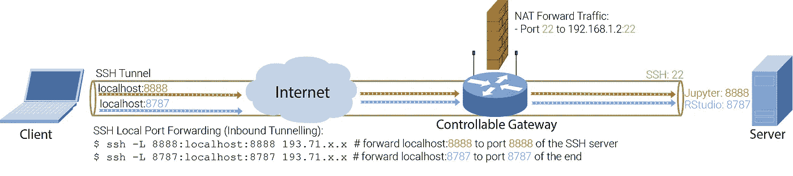

# SSH 隧道——数据科学的魔法

> 原文：<https://medium.com/hackernoon/the-ssh-black-magic-for-data-science-acd6f65e8528>

作为一名数据科学家，在你的生活中，很多时候你会希望 ***向世界*** 公开一个本地服务。这可能是一个 Jupyter 或 RStudio 服务，你可以在那里运行你的实验，或者是一个 Tensorboard 服务，你可以在那里检查训练过程，或者是一个很酷的聊天机器人服务，你刚刚建立。如果你曾经挣扎着配置所有的 NAT、VPN、防火墙来远程访问你的服务，那么你并不孤单。我花了 2 年多的时间才认识了[宋承宪黑魔法](https://vimeo.com/54505525)。神奇的是，无论您的网络设置如何，您都可以从任何地方*连接到本地服务器上的任何服务。*

与 SSH 只是一个安全的 shell(正如它的名字错误地暗示的那样)的普遍看法不同，SSH 远不止于此。除了 shell 之外，SSH 也是一个重要的传输协议，Git、SVN、SFTP、SCP…都是基于它构建的。SSH 也是一个连接转发器，这是这篇文章中所有神奇之处的来源。

在这篇文章中，我假设您有一个**服务器，**在其中运行多个服务，比如端口 8888 上的 Jupyter 和端口 8787 上的 RStudio。现在您想从一个**客户端**访问这些服务，这个客户端可能是一台从未知网络连接到互联网的笔记本电脑。根据您对服务器本地网络的控制，此问题有多种解决方案。如果你不关心 SSH，只想要一个在任何情况下都有效的简单解决方案，我建议你直接进入**场景 3** 。

## 场景 1:您可以控制网关路由器。

在这种情况下，您的**服务器**位于一个**网关路由器**之后，该路由器拥有一个全局(公共)IP，您拥有完全控制权。如果你生活在斯堪的纳维亚国家，这种设置是很常见的，那里每台家用路由器都有一个全球 IP。如果您的服务器是 EC2 虚拟机，这种情况也适用，因为每个 EC2 实例都有公共 IP，您可以控制它的防火墙(即它的安全组)。下图演示了这种情况。


Scenario 1: Server is behind a controllable Gateway with global IP

*   ***一般人会怎么做:*** 假设你的网关有公网 IP 193.71.x.x，你的服务器有本地 IP 192.168.1.2。人们通常会使用网关的 **NAT 表**来设置端口转发，如下图所示。如您所见，流向路由器端口 22、8888、8787 的流量分别被转发到服务器(192.168.1.2)的端口 22、8888 和 8787。几乎所有(无线)路由器都有 NAT 表。如果您的服务器是 EC2 实例，您可以在它的安全组中添加入站流量规则。


Scenario 1 NAT solution: on the router, set up the NAT table to forward external traffic to the server. On the client, you can access Jupyter through the link ‘193.71.x.x:8888'

*   ***您可以做什么:***NAT 解决方案工作正常，直到您厌倦了每次启动新服务时都要修改 NAT 表(或安全组)。使用 SSH 本地端口转发，您需要转发的唯一端口是 SSH 端口。一旦您可以 ssh 到您的服务器，任何其他流量都可以通过这个“SSH 隧道”，如下图所示。



Scenario 1 SSH tunneling solution. From the client, set up SSH Local Port Forwarding. On the client you can access Jupyter through ‘localhost:8888’

假设您已经将 ssh 端口转发到您的服务器，并且从客户端，您可以通过运行$ ssh 193.71.x.x 来 SSH 到服务器，然后您可以在您的客户端上运行下面的神奇命令**来访问您的 Jupyter。**

```
ssh -L 8888:localhost:8888 193.71.x.x
```

该命令基本意思是:“当我访问 localhost:8888 时，请转发到 SSH 服务器的端口 8888”。如果想知道是怎么回事，添加选项 ***-v*** 。如果不需要通常的 SSH shell，可以添加选项- **N** 。现在你可以在你的客户端浏览器上输入 localhost:8888 并访问服务器上的 Jupyter 服务。同样的方法可以用于 RStudio 或任何其他服务。如果你的客户端有 Windows，你可以像这里的解释的那样设置 Putty SSH 隧道。

## 场景 2:您无法控制网关路由器。

在这种情况下，您的服务器位于您无法控制的本地网络中。


Scenario 2: Server is behind an uncontrollable Gateway

*   ***人们通常做什么:*** 如果你的服务器位于一个大机构的内网，你可以要求你的网络管理员为你提供 VPN 接入。然而，当然，你通常不想分享你的 VPN 接入给你的客户，让他尝试你的酷聊天机器人。再者，如果你的服务器在家里，而你又没有认真到自己架设 VPN 怎么办。你们中的一些人可能会考虑 TeamViewer，这是一个不错的选择。然而，长时间在 TeamViewer 上编码是痛苦的，有时是不稳定的。
*   ***您可以做什么:*** 如果您有一个拥有公共 IP 的远程服务器(比如 EC2 实例)，您可以使用 SSH 远程端口转发(反向隧道)。下图演示了发生的情况:


Scenario 2 SSH Remote Port Forwarding : on the target Server, open a SSH Reverse Tunnel to RemoteServer. Traffic to the RemoteServer will be forwarded accordingly to the target Server.

在这种方法中，我们打开一个反向隧道，这样到 RemoteServer 的流量就可以转发到目标服务器。要建立反向隧道，请在目标服务器上运行以下命令:

```
ssh -R 8888:localhost:8888 193.72.x.x
```

该命令基本上是说“当任何人访问远程服务器的端口 8888(本例中为 193.72.x.x)时，请转发到从我的机器(目标服务器)访问的 URL localhost:8888”。现在，在任何客户端上，您都可以在浏览器上打开 [193.72.x.x:8888](http://193.72.x.x:8888) ，访问目标服务器上运行的 Jupyter 服务。当然，您必须能够从您的客户端连接到 RemoteServer 的端口 8888，这可以通过上面场景 1 中提到的方法来实现。请注意，您必须将选项`GatewayPorts yes`添加到远程服务器上的`/etc/ssh/sshd_config` 文件中。你可以在这里查看详情。

如果你觉得这种方法太不可行，那你就对了。幸运的是，有第三方服务为你做所有的艰苦工作，所以你不必知道 SSH 的存在。

## 场景 3:您想向世界公开您的本地服务，现在！

[Ngrok](https://ngrok.com/) 就是你要找的服务。在幕后，ngrok 使用 SSH 远程端口转发将对其远程服务器的请求转发到您的目标服务器。然后它给你一个链接，你可以从任何地方访问它的远程服务器上的服务。


Scenario 3: just use ngrok (or other alternatives)

使用 ngrok 非常简单。您可以从这里下载 ngrok [，然后在您的服务器上运行以下命令:](https://dashboard.ngrok.com/get-started)

```
./ngrok http 8888
```

然后，您会看到类似这样的内容:


A typical ngrok output

您看到链接[https://1fa a4894 . ngrok . io](https://1faa4894.ngrok.io)现在被转发到您的 localhost:8888。现在，您可以从任何地方打开该链接，并访问服务器端口 8888 上的服务(在本例中是 Jupyter)。请注意，默认服务器在美国，所以如果你在其他地区，如欧盟，你应该添加选项`-region eu`。

## 长话短说:

SSH 有一个魔力，可以让您向外界公开本地机器上的服务，而不管您的网络设置如何。然而，如果你不关心魔法，那么去[https://ngrok.com/](https://ngrok.com/)解决你的问题。

注意:这篇文章中的所有可视化都托管在 [github](https://github.com/Nikasa1889/MediumBlogs) 上。