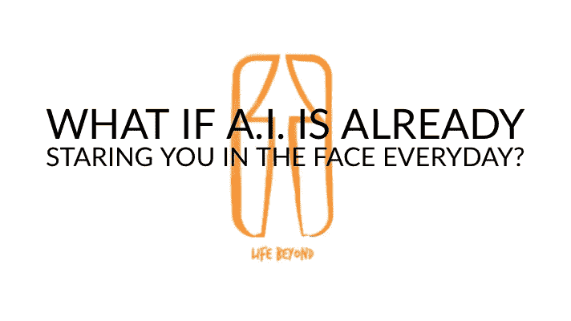

# 人工智能在世界上的现状

> 原文：<https://medium.com/hackernoon/the-state-of-ai-in-the-world-56be75b51887>

## 论中国，论区块链和自由意志

作为一名技术极客和一家 IT 公司的作家，我喜欢和我的门外汉最好的朋友(在公共[安全](https://hackernoon.com/tagged/security)工作)讨论像[区块链](https://hackernoon.com/tagged/blockchain)和人工智能这样的事情——以及它们对我们现在和未来生活的影响。他还在等着有一天我穿着一套完整的钢铁侠式飞行服出现在他家。我仍然相信有一天我会的。

不久前，我们就人工智能和智能系统进行了一次非常有趣的讨论，这提醒了我定期与工作领域之外的人交谈以获得新的见解是多么重要。讨论留给我的主要问题是:

> 如果真正的“智能”系统只有在它们开始做出我们永远无法预测的决定，也无法完全追溯到它们的编程和它们可以访问的数据时，才能被视为智能系统，那会怎样？

我意识到我的朋友直觉地将他对“智力”的定义与一个模糊的概念[自由意志](/life-beyond/free-will-does-not-exist-df5fe5bbda34)相结合，我发现这是一种强烈而有用的直觉。

Me in my future fully operating Iron Man suit — source.

讨论也让我想更好地了解世界上应用人工智能的当前发展，以便能够对其未来做出更好的知情预测。通过人工智能系统已经并将会产生的影响，哪些世界性的影响将会进入你我的生活，以及未来几代人的生活？

下面你会发现人工智能发展的当前和未来趋势的概要。你会看到人工智能的过去似乎在西方，现在在东方，而人工智能的未来可能在中国或区块链上。

也许最重要的是，你会发现一个结论和“对现在的预测”,它与智力和“自由意志”的问题密切相关。

# AI 最后一次震撼世界:

人工智能不是你典型的晚餐话题。我听到或读到的关于它的大部分内容来自我作为一名技术极客和作家的在线和离线经历。人工智能上一次震撼世界并迷住我们更广泛的集体想象力是在谷歌首次推出其个人助理功能时，它在电话中听起来令人难以置信地像人。

# 计算机视觉，深度学习

我们并没有真正看到人工智能的实际应用。这是为什么呢？我们都忽略了一股不断进化的暗流。事实上，在我们的日常生活中，我们已经不知不觉地感受到了机器学习的影响，特别是计算机视觉和深度学习。

这一切何时何地变得如此狂热？

*“…2012 年[…]由 Geoff Hinton 领导的多伦多大学团队训练了一个深度学习模型，在 ImageNet 挑战赛中击败了竞争对手。在* [*2012 比赛*](http://www.image-net.org/challenges/LSVRC/2012/results.html) *中，多伦多团队训练了一个深度学习模型，取得了 16.4%的误差，相比之前最好的 25.8%***(越低越好)！[……]**

*突然之间，系统在视觉上变得足够好，可以自信地应用于许多不同的问题。[……]这些新改进的视觉系统已经为我们一直使用的许多技术提供了动力。[……]…重新激发对深度学习研究的兴趣以及 ***开始当前的人工智能浪潮*** *。**

**自那项重大成就以来，深度学习的原理已经被应用于各种问题，包括***[*语音识别*](https://cloud.google.com/speech-to-text/)*[*翻译*](https://en.wikipedia.org/wiki/Google_Neural_Machine_Translation)*[*唇读*](https://www.newscientist.com/article/2113299-googles-deepmind-ai-can-lip-read-tv-shows-better-than-a-pro/)*[*无人驾驶汽车*“- 经由](https://devblogs.nvidia.com/deep-learning-self-driving-cars/)[米哈伊尔·埃里克](/@mihail_eric/why-all-the-excitement-about-artificial-intelligence-435957ba9ed3)。******

# **我们日常生活中的人工智能**

**计算机视觉显然改善了社交媒体用户体验:例如，Snapchat 用户喜欢在他们的自拍或朋友的图像上覆盖兔子耳朵和仙尘。看起来如此简单的活动实际上依赖于计算机视觉算法。世界各地的银行现在都使用计算机视觉远程存款支票。**

**计算机视觉甚至帮助盲人看清脸书:**

**计算机视觉有助于保护公众— *“根据 IEEE 的数据，仅在美国就有超过 70%的警察部门已经在使用车牌检测器。使用或正在考虑使用计算机视觉来提醒人类注意预防性维护条件的设施不胜枚举[……]。***

***像雪佛龙、壳牌和森科尔能源公司这样的石油和天然气公司使用传感器和摄像机来比较阀门的当前状态，例如，与设备的最佳状态进行比较。[……]人工智能软件会在计算机系统检测到最轻微的不当压力时提醒维护部门采取措施。“—* 来自[iotoforall](https://www.iotforall.com/computer-vision-applications-in-daily-life/)。**

**但是，请不要忘记，当谷歌试图解释你的日常搜索查询时，或者当你在当今任何网站或短信平台上与聊天机器人交谈时，或者当你通过 Alexa、Echo 或 Siri 使用语音搜索时(据报道，超过 25%的 X 一代消费者现在正在这样做)，自然语言处理都会发生。**

> **人工智能已经无处不在。我们只是没有完全意识到这一点。**

# **中国的崛起**

**在许多方面，当谈到技术创新时，目前中国似乎正在超越我们和西方。**

**谈到人工智能，这位经济学家似乎不同意我的观点。在一篇关于人工智能竞赛的文章中——甚至是“通用人工智能”；一个无需专门编程就能完成任何人类任务的人工智能——它概述了“赢得比赛”的竞争者。**

**《经济学人》提出的关于为什么西方，特别是谷歌/Alphabet 在这场竞赛中似乎处于领先地位的最重要的论点是他们努力的开放性。**

**我认为这可能是一个让你的文化参照系影响你判断的严重案例。**

**中国的科技巨头百度、阿里巴巴和腾讯(BAT)正在使用创新技术——通常与某种人工智能相结合——来颠覆从智能城市基础设施到个性化医疗的一切。在这篇博客中，Peter Diamandis 着眼于 BAT 的一些最重要的亮点、战略和国有企业合作，将这三个人工智能巨头推向(全球)主导地位。**

> **正是国有企业的合作对中国/亚洲当下发生的事情如此引人注目、重要和有影响力。**

**例如，就在今年，阿里巴巴支持了基于人工智能的车对车网络开发商 Nexar，并与马来西亚政府合作推出了该国首个城市大脑计划。针对交通，城市大脑可以优化城市交通流量，让紧急车辆以创纪录的速度到达现场。**

**再举个例子？在一条未使用的高速公路上进行测试后，百度已经与雄安新区当地政府签署了协议，建立一座人工智能城市，配备自动驾驶汽车、智能交通系统、面部识别和装有传感器的水泥。**

**李开复和其他人似乎同意迪亚曼蒂斯的观点，即人工智能技术开发的投资金额；这些地区有才华的年轻学生的数量；事实上，中国的 BAT 公司从人类历史上最大的数据库之一中获益；中国不同的政治氛围使得中国在开发越来越聪明的人工智能的竞赛中比西方好得多。以及它们目前的发展状况。**

> **AI 的过去在西方；它的现在在中国。**

**这刺激了一场竞争，这场竞争将确保“人工智能的到来”。**

# **人工智能给我们所有人带来的危险**

**如果 AI 真的“到来”，它将给人类带来严重威胁。而且不是在《黑客帝国》或《终结者》意义上的“杀人灭口”。下面是[李开复](https://www.technologyreview.com/s/610298/tech-companies-should-stop-pretending-ai-wont-destroy-jobs/?lipi=urn%3Ali%3Apage%3Ad_flagship3_profile_view_base_recent_activity_details_all%3BM%2FjwBINdSFmEN%2BOUlOyAyQ%3D%3D):**

> **“很快就会很明显，我们一半的工作任务可以由人工智能和机器人在几乎没有成本的情况下更好地完成。这将是人类经历的最快的转变，而我们还没有准备好。”**

**根据一些人的说法，我们现在看到的零工经济是一种过渡情况，直到所有这些工作都消失。*我们中有多少人还在使用人工旅行社来预订我们的假期？有多少使用人类银行出纳员提取现金？我们中有多少人不再去实体店购买商品？*’—经由[卡洛斯·佩雷斯](/intuitionmachine/ais-symbol-grounding-problem-and-the-future-of-work-7ba7d2db29ec)**

**人工智能大量取代人类工人是对资本主义制度承诺的最终遵守:使生产成本如此之低，以至于最终将价格压低至接近于零。我们面临的真正问题是:我们如何重组我们的经济体系、价值体系和社会，以适应更多的自由时间和更多的失业？**

**公平地说:作为一个物种，机器人和软件的优点导致的失业只是一个问题，如果我们选择继续这样看待它的话。但是当然还有一些其他的人工智能问题需要我们去解决。**

# **AI 人才库浅，数据意识匮乏**

**首先，为了让整个社会能够受益于更广泛使用人工智能可能给我们带来的所有好处，我们必须认真学习人工智能技能:**

***“人工智能专家的人才库很浅。虽然关于今天是否真的存在数据科学家短缺的***争论，但这种争论通常不会扩展到对产品经理、运营团队和商业战略家的需求，他们知道如何以及何时应该利用人工智能来为自己服务。拥有人工智能意识的整个业务功能生态系统是其成功应用的关键，而这种集体意识很难实现。”——*经由[迈克·米歇尔](https://medium.com/u/3f05355c09f9?source=post_page-----56be75b51887--------------------------------)。***

**真正理解统计学和模型局限性的人严重缺乏，更不用说我们全球劳动力中机器学习、计算机视觉、NLP 和深度学习算法的复杂性了。**

> **除此之外，普通公众的“数据意识”更为严重。**

# **人工智能预测和决策的透明度**

**与人工智能合作的另一个相当严重的问题是算法所做决定的透明度或不透明度问题。斯坦福大学计算机科学助理教授珀西·梁(Percy Liang)是与一个团队合作解决这一问题的人员之一:“*从本质上讲，通过理解模型做出决策的原因，梁的团队希望改善模型的功能，发现新的科学，并为最终用户提供影响他们的行为的解释。*”——经由[莎拉·马夸特](https://medium.com/u/8ab835d77e68?source=post_page-----56be75b51887--------------------------------)。**

**一些人提出，类似区块链区块链的解决方案可能是人工智能决策不透明的完美答案。稍后会有更多的内容。**

# **人工智能中的伦理**

**人工智能的最后一个潜在的严重问题是伦理。**

***30 年后，三种不同的无人驾驶汽车正在接近一个十字路口。这种情况几乎再也不会发生了，但是驾驶每辆车的系统已经确定碰撞是不可避免的。***

***被车辆运送的人(阅读、发邮件、听音乐；无论如何)分别是 23 岁、45 岁和 98 岁——98 岁的他仍然是一名非常活跃和健康的心脏外科医生，每天都在拯救生命；一个 17 岁的女孩也将在十字路口被路过的行人伤害——她不知道自己患有一种罕见的癌症，只能活一年多了；汽车的传感器可以检测和分析所有这些。***

**撞车时，汽车应该决定保护谁？**

**(感谢路德·韦尔特纳尔的假设)。**

**这些严肃的问题说明了关于人工智能的使用和应用的一个更大的问题:谁应该决定允许程序做出什么样的伦理选择，以及它们应该做出什么样的选择？**

**这是一系列极其复杂的问题，建立在我们所知的法律和道德的复杂性之上，但又超越了这一复杂性。在人类历史上，我们从未接近于创造一个可以为自己做出决定的自动机——这个决定可能会产生严重的后果，比如无人驾驶汽车、军用无人机(这是真实的)，或者决定将社会福利或工作分配给哪个人的算法(这两者都已经是真实的)。**

**人工智能中的道德或责任问题由于缺乏透明度而变得更加复杂；广大公众缺乏必要的技能和理解；事实上，大多数(如果不是全部的话)关于人工智能和伦理的决策都是在闭门造车的情况下做出的，在公司总部，利润驱动占据了主导地位。**

# **AI 的未来:中国还是去中心化/区块链？**

**我们所有人似乎都直觉地理解，无论人工智能最终是什么:它都可能对我们和后代的未来生活产生深远的影响。因此，不要将这种潜在的极其重要和强大的技术的开发交给受利润驱动的大公司——不管这些公司是美国公司、中国公司还是其他公司——可能是明智的。**

**人工智能开发的去中心化甚至“区块链化”可能是上述两个问题的解决方案:**

**在区块链开发人工智能可以让算法变得更加透明，它们的问责性肯定会得到改善，至少在追溯上是如此；**

**人工智能组件的开源、分散开发可能有助于将上述技术的好处提供给更大一部分普通民众，而不是看到少数技术初创企业所有者和投资者收获大部分利润。**

**这就是为什么我认为我们应该密切关注 OpenAI 的原因之一。OpenAI 是一个专注于人工智能的非营利研究机构，没有任何企业附属关系。它得到了埃隆·马斯克(Elon Musk)等人的支持和资助，正是因为害怕将通用人工智能的开发留在大型科技公司的手中。**

**去中心化的空间发生了什么？根据 [Sebastian Wurst](https://medium.com/u/bc7690fbb441?source=post_page-----56be75b51887--------------------------------) 、*的说法，不断增长的去中心化生态系统将有助于激励人们贡献数据、技术资源和努力:***

*   ***第一代项目一直专注于* ***创建数据基础设施*** *以连接和集成数据，例如*[*IOTA*](https://www.iota.org/)*，* [*物联网链*](https://iotchain.io/) *，或*[*IoTex*](https://iotex.io/)*用于连接物联网设备的数据，或***
*   ***第二代项目一直致力于* ***创建数据集市*** *，例如* [*海洋协议*](https://oceanprotocol.com/)*[*SingularityNet*](https://singularitynet.io/)*，或*[*Fysical*](https://fysical.org/)****和人群数据注释平台*******
*   ****随着涵盖这一数据价值链第一步的解决方案逐渐成熟，一个新团队已经开始致力于* [*Raven 协议*](https://www.ravenprotocol.com/) *，这是第一个第三代项目，将在分析阶段填补一个重要空白:* ***用于人工智能培训的计算资源*** *。****

# **艾:自上而下还是自下而上？**

**随着世界范围内越来越多的民族主义和保护主义情绪和政策的兴起，网络巴尔干化对地球上每个公民的福祉构成了严重威胁。它描述了各种围墙花园的建设；世界各地不同政治集团的不同“互联网”。**

**这是对人工智能发展的威胁，人工智能是为了改善整个人类。**

**人工智能的未来；一个智能系统的崛起，它的能力相当于一个人或整个人类——取决于你使用的奇点的定义；这一切很可能会掌握在一个政治/经济集团的手中，这个集团由一个大国的政府及其附庸——其他国家和企业——组成。在我看来，目前事物发展的方式；大概是中国。**

**除非我们——人民；来自所有国家、大陆和主要方向的人——决定将事情掌握在我们自己手中，非常认真地对待比特币创造所激发的这一波去中心化技术和*去中心化哲学*，并使人工智能的创造更像是自下而上而不是自上而下的冒险。**

> **AI 的未来将在区块链上。但前提是我们集体选择这样做。**

# **真正独立的人工智能的未来**

**结束语:**

**什么让 AI 真的是 AI？在某种程度上，这不就是它在思想上变得独立的时候吗？或者这就是人工智能中的“A”所代表的意思——将这种智能与“真正的”智能区分开来？我的外行朋友直觉好吗？**

**我认为“奇点”并不是人工智能在原始计算能力上超过人类。或者当它变成“自我意识”的时候，不管衡量它的标准有多模糊，都必须内在地考虑到我们对自己意识的有限的科学理解。**

**我提出，真正的 AI 奇点只发生在人工智能开始做一些不能归因于其编程的事情的时候；当它开始做出对我们生活有意义的影响的选择时，我们无法确定，甚至无法追溯其起源。因此，这些选择类似于我们所说的“自由意志”。**

**但是如果，正如我也建议的那样——在看到社交媒体、搜索引擎和应用程序以及它们的集体算法对我们日常生活中的选择产生的巨大影响之后；这些算法对我们的支出甚至投票行为的影响，以及对任何人来说这些算法如何相互作用以产生它们所产生的效果的晦涩——如果*那个*奇点已经在这里了会怎么样？**

**如果人工智能已经在做出我们无法追溯到它们的编程和输入的选择，那会怎样？如果他们现在变得越来越“自由意志”，而我们自己却变得越来越不自由，那该怎么办？**

****来源:****

** [## 谷歌在主导人工智能的竞赛中领先

### 掌控着好莱坞电影的情节，杂志的封面和大量的报纸，之间的竞争…

www.economist.com](https://www.economist.com/business/2017/12/07/google-leads-in-the-race-to-dominate-artificial-intelligence)  [## 中国的 BAT:百度、阿里巴巴和腾讯

### 百度、阿里巴巴和腾讯(BAT)现在的总市值为 1 万亿美元。现在仅阿里巴巴和腾讯一家账户…

www.linkedin.com](https://www.linkedin.com/pulse/chinas-bat-baidu-alibaba-tencent-peter-diamandis/)  [## 区块链蝙蝠侠:通过理解金钱、密码的本质来致富和拯救世界…

### 作为心智结构的金钱和价值

medium.com](/life-beyond/blockchain-batman-getting-rich-and-saving-the-world-by-understanding-the-essence-of-money-crypto-2a301baf61af)  [## 网络巴尔干化和互联网的未来

### 第一部分—全球

medium.com](/@Skycoinproject/cyberbalkanization-and-the-future-of-the-internets-f03f2b590c39)  [## 人工智能、区块链和工作的分散化

### 我以前写过工作的重要性和一个人存在的理由:

medium.com](/intuitionmachine/ais-symbol-grounding-problem-and-the-future-of-work-7ba7d2db29ec)  [## 人工智能、区块链和工作的去泡沫化——第二部分

### 这是“AI，区块链和工作的去中心化”系列的第二部分。在最初的文章中，我…

medium.com](/intuitionmachine/ai-blockchain-and-the-de-bullshitization-of-work-part-2-4eba4f62760d)  [## 科技公司应该停止假装人工智能不会破坏就业

### 最近的一个早上，我开着一辆优步去参加麻省理工学院的人工智能会议，司机问我多久…

www.technologyreview.com](https://www.technologyreview.com/s/610298/tech-companies-should-stop-pretending-ai-wont-destroy-jobs/?lipi=urn%3Ali%3Apage%3Ad_flagship3_profile_view_base_recent_activity_details_all%3BM%2FjwBINdSFmEN%2BOUlOyAyQ%3D%3D)  [## 自由意志不存在

### 论自由意志的起源

medium.com](/life-beyond/free-will-does-not-exist-df5fe5bbda34) 

我非常重视并感谢您的关注。我写的是平衡和有意识地使用数字技术，并关注于**之后的生活。你可以在*[*www . Life Beyond . one*](https://lifebeyond.one/)*买到我最新的书《触摸屏之外的生活》。**

*[https://hackernoon.com/artificial-intelligence/](https://hackernoon.com/artificial-intelligence/home)***