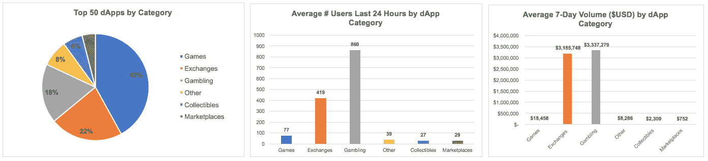
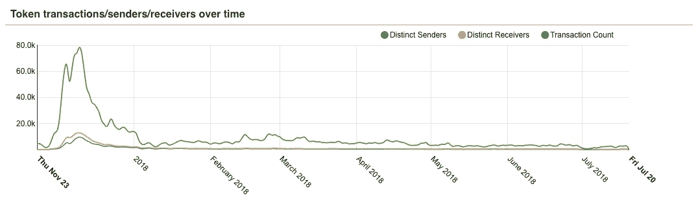
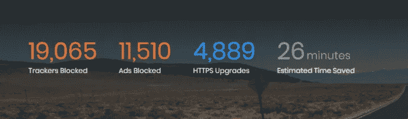
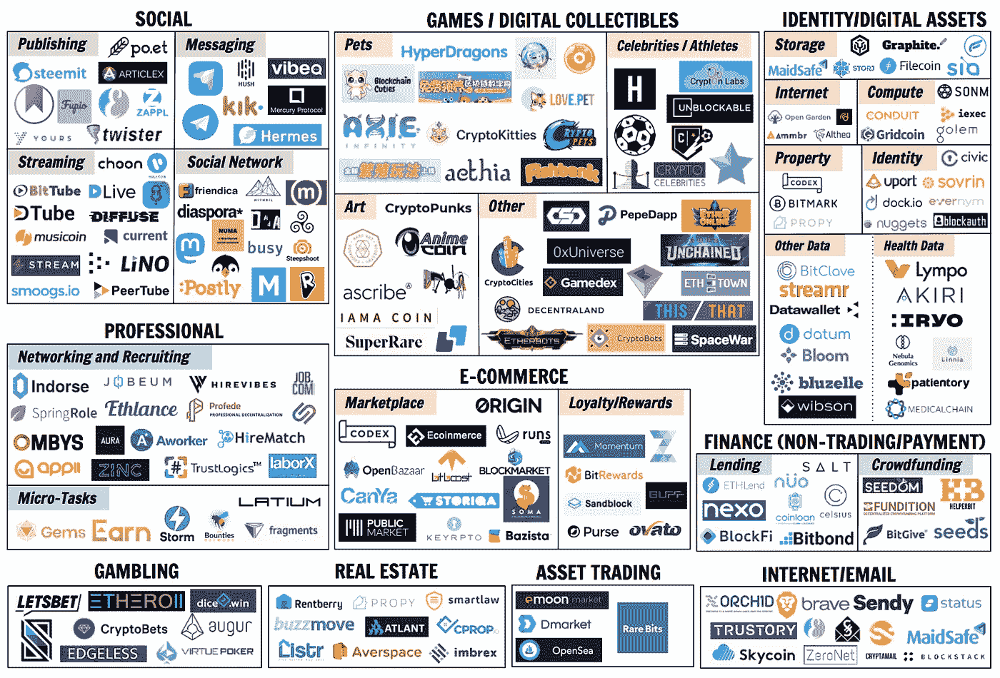

# 消费者区块链的状态从 Cryptokitties 到 Blockstack (+我们的市场地图！)

> 原文：<https://medium.com/hackernoon/the-state-of-consumer-blockchain-from-cryptokitties-to-blockstack-our-market-map-875cac6c172d>

对于加密投资者来说，2018 年上半年很难。2017 年底主导市场的热情已经消退，留下了关于监管不确定性、ICO 治理和市场操纵的问题。甚至投资“大盘股”代币(对一些人来说这似乎是一个稳赚不赔的赌注)也被发现存在相当大的风险——比特币、以太坊和 Ripple 的价格都已跌至不到其高点的三分之一。

虽然这种价格波动导致一些散户投资者退出这个领域，但我们并没有失去对区块链基本面价值的热情。我们认为，加密的真正机会不在于投机交易和“快速致富”计划，而在于硬币的长期发展，硬币可以作为货币使用，并能够改善通信、交易和其他企业和消费者流程。(来自洪水门的迈克·梅普斯在他的伟大文章 [*【慢钱密码*](/@m2jr/slow-money-crypto-274413d64818) *】中对这种心态进行了更多的阐述)。*

话虽如此，区块链的第一个“杀手级应用”无疑是加密货币。最近的波动阻止了大多数硬币被用作真正的货币，但随着价格稳定，我们相信加密有巨大的潜力在货币的三个功能中的两个方面击败法定货币(至少追平第三个):

*   **交易媒介** —加密可以说是一个巨大的进步，因为它可以在全球任何人之间即时、永久、匿名、免费地进行 P2P 或 B2C 交易。
*   **价值储存—** 比特币最初是为了创造一种更稳定的货币，它不会被中央银行或政府操纵(通过利率政策、通货膨胀等)。).随着 crypto 的不断发展，我们相信更多的初始用例将会实现。
*   **记账单位—** 与传统货币一样，每种加密货币都可以用单位来表示，以便设定商品价格和完成交易。如果一些硬币成为全球标准，这可能代表着在全球范围内标准化价格单位的另一个优势。

我们希望随着区块链技术的发展和一些投资热潮的消退，我们将看到加密作为货币被广泛采用。与此同时，我们很兴奋地看到消费区块链的其他地区的生活迹象。11 月下旬，21 Inc. [将](https://www.coindesk.com/meet-earn-com-21-rebrands-social-network-shift-away-bitcoin/)从硬件转向商业社交网络(Earn.com，后被比特币基地收购)，Steemit 发展到[超过 35 万](https://www.wired.com/story/the-social-network-doling-out-millions-in-ephemeral-money/)用户，并向社区成员分发了超过 3000 万美元，Telegram 宣布了一个$2B [ICO](https://hackernoon.com/considering-the-telegram-ico-proceed-with-caution-92c178e2a178) (之前是 Kik 和 YouNow)。

根据[dApp Radar stats](https://dappradar.com/)(7 月 20 日提取的数据)，游戏目前在 Dapp 的使用中占主导地位，在前 50 个 Dapp 中占多数(42%)，其次是交易所(22%)。这是目前仅有的两个类别，其前 50 名 dApps 平均每周交易量超过 10 万 dau 和 10 万美元。(查看[克里斯·麦肯的精彩帖子](/@mccannatron/state-of-the-dapps-5-observations-from-usage-data-april-2018-a3e9da01bc22)获取更多统计数据！)

All data from Dapp Radar as of 7/20 at 5 p.m. We re-categorized all Dapp listings under the “High-Risk” category as “Gambling”, and also re-categorized several apps listed under “Other” that we believe do fit into another category. All data is for the top 50 dApps only. $USD volume is calculated based on Ethereum average price on 7/20 of $503.

虽然没有一个 dApp 成为主流，但这是一个非常有希望的迹象，表明即使是一小部分专门用户也愿意跳过技术障碍参与这些平台(特别是考虑到交易所、托管人和 dApp 本身的交易对手风险，因为这个领域基本上不受监管)。我们很高兴有机会吸引这些早期用户，并正在寻找具有以下特征的 dApps 和平台:

*   **区块链的独特且必要的实施。**我们已经看到许多项目，区块链让平台变得不必要的复杂，并限制了功能。我们认为 Cryptokitties 目前的状态属于这一类。虽然猫的特征、猫的世代和猫的繁殖是有趣的，但是这些都不需要区块链，并且需要为动作付费和等待验证降低了用户体验。由于在区块链上建设的复杂性，开发一直很慢——用户除了交易或繁殖猫之外不能做任何事情，这可能是最初大肆宣传后活动急剧下降的原因。

Data from [Bloxy](https://bloxy.info/token_stat/0x06012c8cf97bead5deae237070f9587f8e7a266d) shows a severe decline in Cryptokitties market activity — with DAUs down to <500 in early July, from 15k+ at peak last November.

*   隐私和/或安全并不是唯一的附加值。虽然一小部分消费者非常关心隐私和安全，但大多数人[更看重便利性](https://www.washingtonpost.com/news/the-switch/wp/2014/10/07/people-care-more-about-convenience-than-privacy-online/?noredirect=on&utm_term=.dd6e6c9690fa)。试图建立脸书或 Twitter 之类的去中心化版本的初创公司将会发现，很难打破现有的网络效应，这些效应在这些平台上吸引用户。普通用户可能看不到从他们所有朋友使用的既定平台转向一个更难使用、只由铁杆区块链粉丝组成的竞争对手的价值，即使后者稍微更安全或提供匿名性。
*   **平易近人的消费体验。**如果你曾经尝试过 dApp 交易，你就会知道这个过程有多痛苦。您需要建立一个帐户来购买硬币，进行购买，创建一个 MetaMask 帐户，将硬币发送到 MetaMask，最后验证交易。这对于主流用户来说是太多的摩擦。比特币基地在通过信用卡/借记卡购买将密码带给大众方面做得非常出色，尽管竞争对手的价格比比特币基地的 8%还要低，但它仍然继续繁荣发展。)交易费。我们认为，对于消费者区块链初创公司来说，建立尽可能无缝的用户体验是值得的，即使最初的实施并没有完全分散。

Even heavy crypto users have trouble with the usability of most dApps, as evidenced by the tweet above referencing Augur’s recent launch.

*   **现有用户群。**我们相信，第一批获得主流关注的消费类区块链应用将专注于满足已经“迷上”非加密用例的大型用户群的需求。例如，我们对像 [Unblockable](https://www.unblockable.com/) 和 [Hashletes](https://www.linkedin.com/company/hashletes/) 这样的平台感到兴奋，这些平台将职业运动员符号化，并为这些数字收藏品创造了一个市场——我们知道体育迷有一个巨大的市场，他们每年已经花费数十亿美元购买与他们喜爱的运动员和球队相关的商品和内容。最终，我们希望看到成功的消费者区块链应用瞄准更多的利基社区(甚至解决人们不知道他们有问题！)，但我们认为这些需要更长的时间才能实现。

消费区块链的一些早期成功案例就属于这些范畴。勇敢浏览器(最近宣布每月活跃用户超过 300 万)除了安全和隐私之外还有许多优势:它速度极快，屏蔽标准广告，让用户对他们看到的广告有更多的控制权，并允许用户从这些替代广告中赚取收入。该浏览器还利用了一个现有的社区，该社区由私有浏览器和搜索引擎如 DuckDuckGo 和 Tor 组成。

The Brave browser opens with a tab showing activity blocked (above is a screenshot from a [Reddit user](https://www.reddit.com/r/BATProject/comments/7nf9fp/post_your_brave_browser_stats/)). Users tend to save 2–3 hours of time in only a few months of using Brave.

随着这个领域的不断发展，我们也对允许消费者在一个地方访问多个区块链应用程序的平台感到兴奋，特别是如果它们简化了入职和验证流程。 [Blockstack](https://blockstack.org/) 就是一个很好的例子， [Status](https://status.im/) 又是一个。我们在下面的市场地图中概述了一些面向消费者的区块链应用，其中许多应用运行在 Blockstack 或以太坊(Status 使用的)上。

**注意:我们有意忽略了交易交易所和 P2P 支付初创公司。这种例子不胜枚举，我们认为它们满足了“钱”的用例，而这篇文章主要关注其他消费者区块链的实现。*

从投资角度来看，我们正在寻找能够在未来三到五年内吸引大量用户的消费者区块链平台。考虑到现有的非区块链竞争对手，以及区块链能真正增加多少价值，这在某些领域会比其他领域更难。这里有几个我们特别感兴趣的市场:

*   **数字资产共享/租赁**——正如我们在 [side hustle space 论文](/@justinemoore_85088/searching-for-the-side-hustle-market-map-our-early-insights-778896c408e3)中所讨论的，许多千禧一代和新生代渴望获得额外收入。区块链提供了一种安全和匿名的方式来租赁数字资产，如计算机存储( [Storj](https://storj.io/) 、 [Sia](https://sia.tech/) 、 [Filecoin](https://filecoin.io/) )、互联网接入([开放花园](https://www.opengarden.com/))、计算能力([假人](https://golem.network/)、 [Gridcoin](https://gridcoin.us/) )，甚至数据( [DataWallet](https://datawallet.com/#) )。这些平台目前对于主流用户来说过于复杂，但我们设想未来用户可以很容易地打开和关闭一个允许他们通过出租或出售这些资产来获得被动收入的系统。
*   **身份管理** —企业正在采用区块链来管理员工和客户身份( [ShoCard](https://shocard.com/) 、[剑桥区块链](https://www.cambridge-blockchain.com/))，这将渗透到消费市场。我们认为区块链有很大的潜力:(1)追踪高价值资产(艺术品、珠宝、房地产)的所有权和历史；(2)核实个人历史(就业、教育、居住)；(3)轻松安全地访问私人数据并进行交易，或授权他人代表您行事。经过验证的身份还可以在招聘、知识共享和以身份为导向的任务中创造令人兴奋的机会(例如 Earn.com)。
*   **具有数字/物理交叉的游戏**——鉴于构建区块链和访问 dapps 的复杂性，很难构建在娱乐价值上与非区块链游戏竞争的游戏(至少在短期内)。有一个明显的例外——一个经过组织和验证的所有权和交易分类账可以开放对现实世界资产的数字知识产权的访问。我们已经提到了[散列表](https://www.instagram.com/hashletesofficial/?hl=en)和[不可屏蔽](https://www.unblockable.com/)，它们允许通过拥有运动员令牌的一部分来特殊访问数字和物理内容和体验。Cryptokitties 的慈善拍卖是另一个很好的例子。
*   **付费流媒体** —我们坚信流媒体视频将继续成为 Z 世代和年轻一代的主要娱乐来源。随着传统广告失去吸引力(这是今年 VidCon 的一个关键要点),流媒体工具越来越依赖观众的经济支持。我们希望看到数字小费/礼物变得更加主流，我们已经看到了 YouTube [SuperChats](https://techcrunch.com/2017/01/12/youtube-launches-super-chat-a-way-for-creators-to-make-money-from-their-live-streams/) 、中国直播应用程序上的[虚拟礼物](https://www.forbes.com/sites/ljkelly/2017/09/08/the-booming-chinese-live-streaming-market-has-reached-its-zenith/)和 Twitch 上的 [Bits](https://help.twitch.tv/customer/en/portal/articles/2449458-guide-to-cheering-beta-) 的成功。基于令牌的流媒体平台有潜力为创作者提供快速安全的货币化选择，而无需支付烦人的交易费用。

*感谢萨尔·古尔对本文的帮助！*

感谢阅读！我们很高兴有机会在区块链领域构建令人惊叹的消费者应用程序，并愿意与任何从事我们应该了解的工作的人交谈。

我们也非常感谢您的问题或反馈——您可以通过[twins@crv.com](http://twins@crv.com)或 Twitter[@ venture wins](https://twitter.com/venturetwins)联系我们。