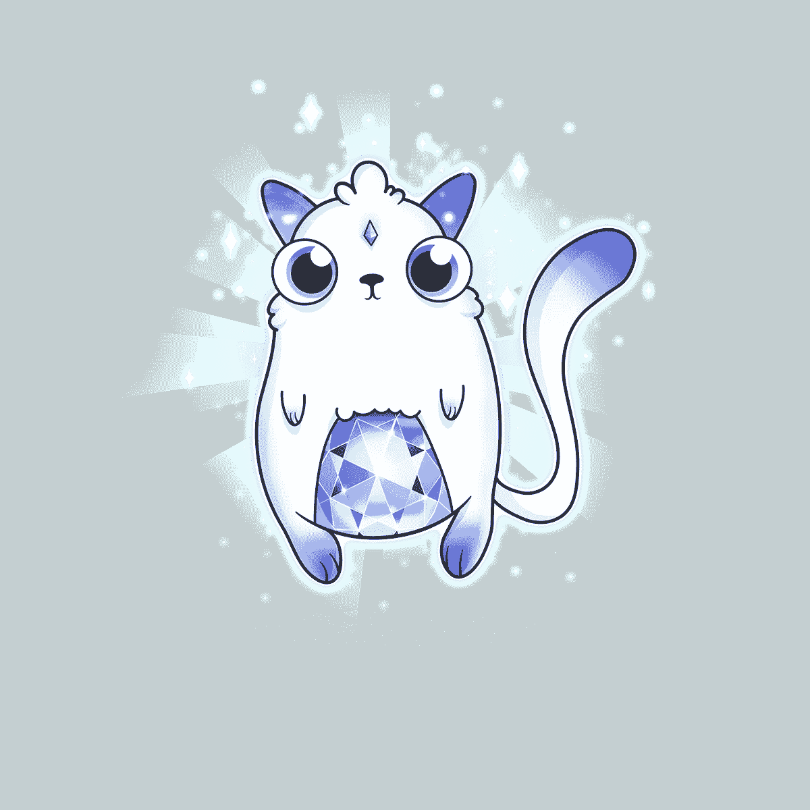
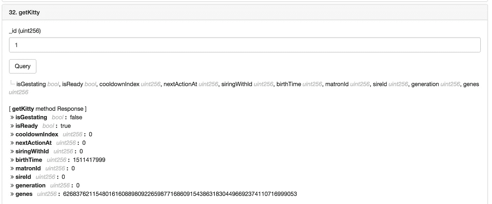
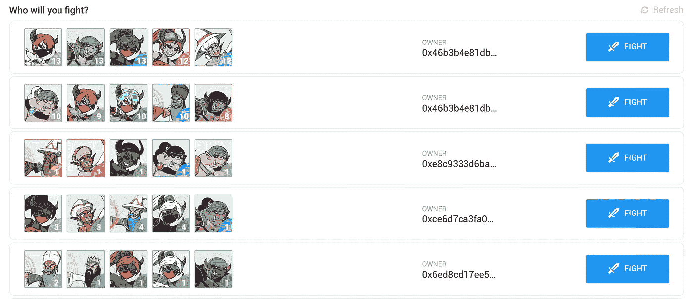
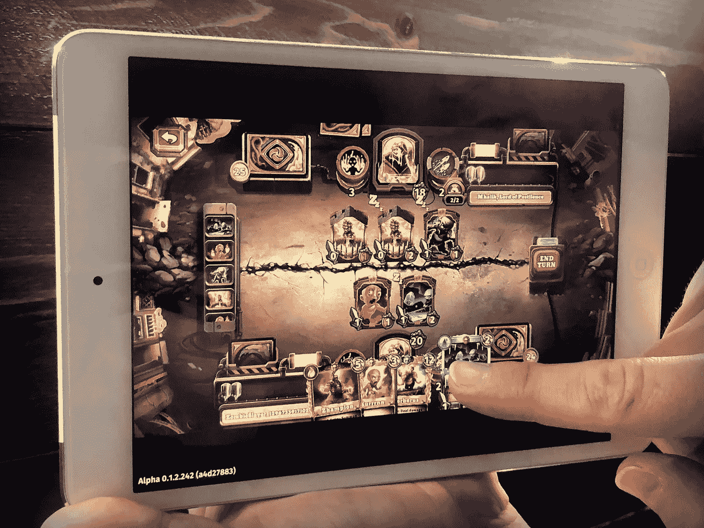
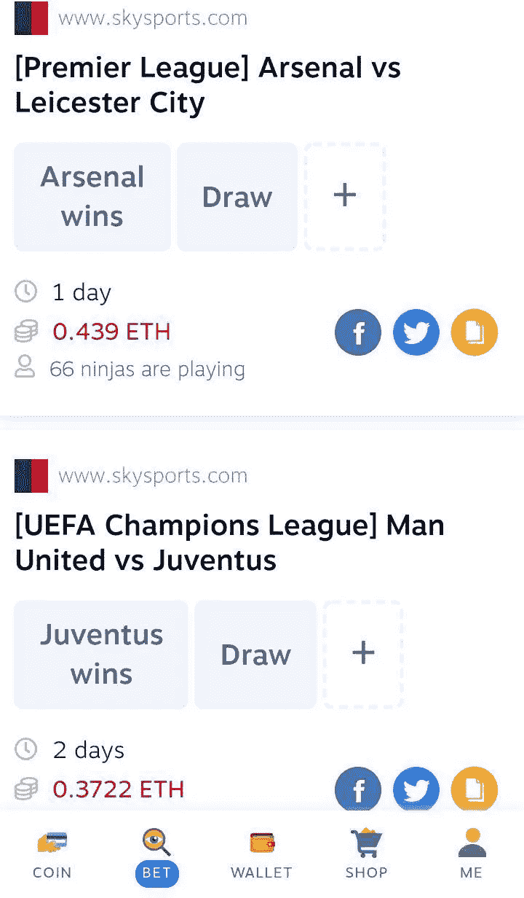

# Dapp 发展状况—区块链 2018 年夏季

> 原文：<https://medium.com/hackernoon/the-state-of-dapp-development-blockchain-summer-2018-a1f5b99b67db>

去中心化应用(dapp)在过去的一年里稳步增长。最近 EOS 的推出和以太坊规模的持续工作是开发者在未来一年感到兴奋的原因。

这篇文章将涵盖 dapp 开发的当前状态，以及我们可以期待在明年看到的一些改进。它将主要集中在以太坊和基于 EOS 的 dapps 上，因为这两个区块链是当今最流行的构建平台。

最受欢迎的 dapps 分为以下几类:

*   游戏/收藏品
*   交换
*   投机
*   其他的

值得注意的是，我们最近运行了一个 dappsathon(去中心化应用程序黑客马拉松),没有一个创建的 dapp 属于上述类别。我可能会在将来写一篇文章，介绍在黑客马拉松中开发的 dapps。

# 游戏/收藏品

过去一年的加密游戏包括 CryptoKitties、Etheremon 和 CryptoFighters。如果你不知道什么是加密收藏品，它是一种所有权在区块链得到证明的数字收藏品。同样，你可以拥有 5 个以太币或 5 个蝙蝠代币，你也可以拥有 5 个密码猫。这些数码小猫或战斗机是你的，可以在区块链自由交易。最大的区别是，每个蝙蝠令牌都是一样的，但每个加密猫都有一个唯一的 ID 和可证明是唯一的基因。CryptoKitties 在 2017 年底很大，一些猫的售价高达 14 万美元。

这是第一只密码猫 [Genesis](https://www.cryptokitties.co/kitty/1) 的样子:

Genesis, CryptoKitty 1

这是创世纪在区块链的样子:

Genesis on the blockchain

Genesis 的基因是:“62683762115480161608898092265987716860915438631830449692374110716999053”，我们最终依赖于 CryptoKitties 的创造者根据某种内部算法告诉我们每只猫长什么样。

CryptoKitties 的一个很酷的特点是繁殖:如果你有两只猫，你可以把它们繁殖在一起，创造一只新的。这种新的猫的基因是其父母基因的混血儿——它继承了两者的特征。你有能力以接近零的价格培育新的猫，然后卖掉它们获利。这是它问世时大肆宣传的一大部分。

在最初的几个月里，CryptoKitties 创造了数千万美元的收入，并从 Andreesen Horowitz 和 Union Square Ventures 等公司筹集了 1200 万美元的资金。如今，这款游戏拥有约 450 名每日活跃用户和 15 万美元的周成交量。

CrytoKitties 教了很多人区块链的基础知识，并使用了 MetaMask 等工具。

其他游戏的概念略有不同。在 CryptoFighters 中，用户与战士战斗。这场战斗发生在区块链，获胜者将获得一架新的数字战斗机作为奖励。每一次战斗，你也增加了你的战士的属性。一旦你赢了，你就可以在[排行榜上上升](https://cryptofighters.io/leaderboard)。

CryptoFighters arena

人们出于不同的原因收集和玩密码猫和密码战斗机。一些早期的玩家只是为了赚钱。其他人喜欢收集物品，就像一个人可能收集口袋妖怪卡片、棒球卡(甚至有官方的[加密版](https://www.mlbcryptobaseball.com/))、邮票或稀有艺术品一样。其他人是为了游戏的乐趣。

去年其他流行的游戏都是庞氏骗局/金字塔骗局类型的。在这些游戏中，购买物品的主要原因是希望别人从你这里买走。例子包括 Crypto namespaces 和 Crypto All Stars(在完成 10 万美元的销售后一天就关闭了)。在这些游戏中，最后拿着袋子的人会输很多钱。

其他流行的这类游戏还有 Team Just 的 FOMO3D 和 POWH3D。关于流行的 FOMO3D 游戏，几个月前有一个 10，500 以太赢家(约 250 万美元):

> Fomo3D 是对加密货币 ICO 空间的讽刺性抨击，将每个玩家置于可怕而又诱人的位置，以退出 Scam everything 并带着大量改变生活的真实以太坊逃跑。你应该接受。由团队制作，就像一个 100%不可信的智能合同库。这个游戏完全是基于人类的贪婪，对每个玩家都有利。(达普拉达)

FOMO3D 有一些运气成分，在一些主要的 dapp 网站上被认为是赌博 dapp。我们将在后面的章节中讨论其他赌博 dapps。

# 密码游戏的下一步是什么？

当代的密码游戏向我们展示了什么是可能的。到目前为止，已经有成千上万的人玩过密码游戏，但是这个数字是如何达到数百万的呢？

dapps 目前面临的最大问题之一是它们很难使用。例如，要开始玩加密战斗机，你必须购买一些以太网，安装 MetaMask Chrome 扩展或下载 Trust Wallet，将以太网发送到你的 MetaMask 或 Trust Wallet，找到你想购买的战斗机，使用一个看起来很吓人的弹出窗口完成区块链交易，询问汽油价格和限制(新用户不知道这些是什么)，等待几分钟或几小时交易完成。然后每一个游戏中的动作，比如战斗或者出售一个战士，都需要你使用相同的元蒙版弹出窗口来确认你的动作。

当以太坊网络拥塞时，有人支付 5 美元的以太来进行一场简单的战斗。

缓慢的交易、昂贵的交易和工具仍然需要改进，以将区块链游戏和 dapps 提升到下一个水平。

这是当前 dapps 的一个问题，但也是创新和改进的一个潜在领域。人们正致力于用诸如分片和利害关系证明的想法来扩展以太坊区块链，以及致力于第 2 层解决方案，如等离子体和状态通道。

一家致力于通过等离子体侧链扩大规模的公司是 Loom。他们是工作等离子现金解决方案的首批实施者之一，并将很快推出他们的第一款游戏，僵尸战场:

Loom 在以太坊领域已经做了很多，我们很高兴看到他们在游戏和基础设施方面继续做些什么。如果你是一名开发者，你可以今天就开始使用他们的 SDK。它们支持 Javascript、Unity、Golang 和 Phaser。

Loom 团队已经发布了 [DelegateCall](https://delegatecall.com/) ，这是一个类似于 StackOverflow 的问答网站，ZombieBattlegrounds 预计将在今年年底推出。

Zombie Battlegrounds (no annoying MetaMask windows popping up)

引用最近一篇关于僵尸战场的[织机文章](/loom-network/games-will-be-the-catalyst-for-blockchain-mass-adoption-628f818c6c87):

我们的 alpha 用户可以将游戏从 app store 下载到他们的移动设备上，并且**它看起来和感觉上*与任何其他移动游戏完全一样。***

然而*没有中央服务器*并且*整个游戏*在区块链上运行。

但问题是，区块链上的游戏确实给最终用户带来了大多数人还没有意识到的好处。

**好处如:**

*   真正拥有游戏中的物品，玩家可以自由买卖，实现强大的游戏内经济。
*   可证明和可审计的项目稀缺性和公平的下降率。
*   无限的可调整性——游戏可以允许开发者构建并上传他们自己的替代游戏模式，供所有玩家使用。开发者实际上可以*修改和扩展服务器端逻辑*，允许完全由社区开发驱动的无限扩展的游戏世界。

看看会发生什么以及僵尸战场有多成功将会很有趣。如果他们实现了成为第一个百万人 dapp 的目标，这可能是这个领域的一大进步。考虑到只有大约 100 万个活跃的比特币钱包和类似数量的以太坊钱包，这是一个雄心勃勃的目标。另一方面，考虑到全球有数十亿游戏玩家，如果营销和游戏机制得当，100 万用户是完全可以实现的。观察最终游戏的分散程度也将是一件有趣的事情。对我来说，最大的问题是用户实际上会对 ZB 团队有多少信任。

说到可伸缩性，以太坊并不是唯一一个建立 dapps 的区块链。其他平台如 EOS 也存在。EOS 每秒可以处理比以太坊多得多的交易，dapp 开发者可以通过使用 EOS 令牌为他们的用户处理交易成本。所有这些确实有助于提供更好的用户体验。

此外，EOS 允许你用任何有 web 汇编编译器的语言来构建。C++是主要语言，因为 EOS 只为它实现了 WASM 编译器。

这听起来很棒，但是用户必须意识到一些缺点。EOS 设法提供更快、可以说更便宜的交易，因为它不使用股权证明，也不允许任何人成为大宗商品生产商(相当于以太坊矿工)。只有 21 家大宗商品生产商(BP)存在，这使得 EOS 比以太坊更加集中。这些块生产者由拥有每个令牌的令牌持有者投票选出，允许所有者投票选出 30 个不同的块生产者。Block.one 是 EOS 背后的公司，他们拥有 10%的 EOS 代币。他们目前有足够的代币自行选择所有 21 个区块生产商。此外，商业伙伴有能力审查交易，这已经发生了。这种审查的确切原因目前尚不清楚，但很可能是由于这些帐户持有骗子持有的被盗令牌。

我现在不打算讨论以太坊 vs EOS vs AWS 的争论，但是用一段话来说，EOS 在去中心化上的妥协改善了 UX。它不是一个完全集中的服务，不像在 AWS 上运行带有 PostgreSQL 数据库的 Node.js 应用程序。

正如生活中的所有事情一样，使用每种技术都有利弊。

实际上，如果 EOS 智能合同被用于非法活动，当局可能会敲门，BPs 可能会被迫审查涉及该合同的所有交易。如果你想建立政府抵制的 dapps，那么 EOS 可能不适合你。如果你只是想建立一个去中心化和透明的 Twitter，EOS 可能是一个不错的选择。

现在一个流行的 EOS dapp 是 CryptoKnights。它拥有 1600 名每日活跃用户，过去 7 天的交易量为 3 万美元。就游戏性而言，它比我见过的以太坊游戏更上一层楼:

 [## EOS 骑士

### 基于 EOS 的手机游戏

eosknights.io](http://eosknights.io/) 

# 基于国家频道的游戏

缩放是让游戏和 dapps 更成功的重要因素。

一些球队一直在通过国家频道来扩大他们的比赛规模。一个很好的例子是[以太飞船](https://etherships.co/)。这是一个战列舰游戏，使用国家频道进行实时玩家间的交流。只有在游戏开始和结束时才调用 MetaMask。他们还在智能合约中利用 Merkle 树来节省存储成本(通常是智能合约交易中最昂贵的部分)。你可以在这里阅读更多关于他们如何制作游戏和开源代码。国家频道并不是一个新概念，但目前很少有 dapps 使用国家频道工作。

# 隐私(zkSNARKs)

关于战列舰的话题，ETHBerlin 黑客马拉松的参赛者之一，[Snarks 游戏](https://devpost.com/software/gameofsnarks_contracts)，使用 zkSNARKs 创建了他们的游戏。

zkSNARKS 代表“知识的零知识简洁非交互论证”(好拗口)。

简而言之，zkSNARKs 是用来隐私的。区块链上的一切都是公开的(尽管是匿名的)。如果你给某人送去一些乙醚，它将永远公开给所有人看。一些区块链，如 Monero 和 ZCash，隐藏了每笔交易的细节(发送者、接收者和金额)。ZCash 使用 zkSNARKs 来完成这项工作。其他隐私区块链用其他方式做到这一点。

有了[zks marks](https://blog.ethereum.org/2016/12/05/zksnarks-in-a-nutshell/)你可以“不用执行计算就能验证计算的正确性，你甚至不会知道执行了什么——只知道它是正确完成的”。

大约一年前，以太坊拜占庭更新上线，这使得在链上验证 zkSNARK 证明变得非常高效。

zkSNARKs 的另一个简单例子是 [Miximus](https://github.com/barryWhiteHat/miximus) 智能合约。它允许你发送一封邮件给区块链上的某个人，而不暴露邮件是发给谁的。这是通过发送者将 1 ETH 存入智能合约而发生的，该智能合约只能由具有撤回它的 zkSNARK 证明的接收者来撤回。最酷的是，接收者没有透露是谁把这个以太发送给他们的，只是说他们被发送了以太，并且有权收回它。如果只有 1 个 ETH 发送到合同中，这就不起作用了，因为很明显是谁发送的。但是，如果你有 100 个不同的发送者发送到 100 个不同的地址，接收者将要求以太，而不会透露这 100 个发送者中的哪一个发送它。

Vitalik Buterin 最近还提出了一种方法，使用 zkSNARKs 将以太坊扩展到每秒 500 次交易。你可以在这里阅读更多关于提案[的内容。](https://ethresear.ch/t/on-chain-scaling-to-potentially-500-tx-sec-through-mass-tx-validation/3477)

值得一提的一个重要的 zkSNARKS 项目是[zok rates](https://github.com/JacobEberhardt/ZoKrates)——以太坊上的 zkSNARKs 工具箱。该项目正在积极开发中。

从上面可以清楚地看到，zkSNARKs 的工作不仅仅与游戏 dapps 相关。

# 分散式交易所

dapps 的另一个流行用例是分散式交换(也称为 dex)。一些流行的交易所包括 IDEX、ForkDelta (EtherDelta)、Bancor、Kyber、AirSwap 和基于 0x 的交易所。

分散式交易所允许用户交易代币，同时保持对其资产的完全控制。如果你把钱投在币安或比特币基地，你必须把你的资产托付给他们。在 DEX 上你保持完全控制。你永远不必把你的代币委托给第三方。当进行交易时，写入智能合约的规则规定了发生什么，例如允许你原子地用 BAT 交换 REP。

我们希望在这一领域看到的一些创新包括:

*   原子十字区块链交易——上面提到的所有指数只允许你交易以太币。这涵盖了大约 50%的前 100 种加密货币和 95%的顶级代币，但如果你想以不可信的方式用以太坊交易比特币或 EOS 呢？有一些解决方案，但目前没有一个太受欢迎。每隔几个月就会出现新的解决方案，但还没有一个真正成功。这个问题已经存在几年了，我们希望在这个领域看到持续的创新。
*   衍生品——分散空头、杠杆多头、保证金交易和期权都成为可能。dYdX 和 Variabl 等项目正在研究解决方案，但这里仍有很大的创新空间。想象一下，在 IDEX，你可以押注代币价格下跌，而不必相信任何人会得到偿付。我们认为，拥有智能合约和 dex 的去中心化 BitMEX 有巨大潜力，让这一切成为可能。(dYdX 去了[刚刚推出](https://twitter.com/dydxprotocol/status/1047251450689019905)他们的令牌做空 eth: sETH)。
*   对冲基金 CoTrader 和 MelonPort 等项目正致力于提供分散式对冲基金的解决方案，允许一方代表另一方进行投资。秘密对冲基金是存在的，但它们依赖于把你的钱托付给第三方。分散化的对冲基金将允许任何人代表你投资，并允许你随意退出。

# 投机

dapps 的另一个流行类别是赌博游戏。一个简单的例子是像 Satoshi Dice 这样的骰子游戏。其他游戏包括二十一点，轮盘赌或任何你真正想要的赌场游戏。

在区块链经营赌场游戏有两大好处。首先，游戏是可证明公平的。如果你被认为有 50%的胜算，你可以阅读智能合约代码，以检查这是不是真的。如果你在正规的网上赌场玩，你不知道你是否有 50%或 48%的机会赢。如果网站受到监管，那么会有人检查游戏是否公平，但你必须始终信任第三方。

第二个主要好处是抵制审查。在线赌博在许多国家要么是受管制的，要么是非法的。例如，在英国，你需要从英国赌博委员会获得经营赌博网站的许可证。在美国，这在很大程度上是非法的。如果你在其中一个国家经营非法在线赌博业务，你会被要求关闭你的网站并面临起诉，但如果它是在主权级审查抵制区块链如以太坊上运行，没有人能在不关闭以太坊区块链的情况下关闭它。

但是，对于上述内容，有一些注意事项:

*   仅仅因为您的服务器代码运行在区块链上，您的客户端代码就不是。如果你在一个网站上运行你的赌博 dapp，这可能会被删除。
*   即使区块链法典不会被废除，这也不会阻止你因此被起诉。
*   为了让游戏受欢迎，你可能不得不在广告上花费，并且很可能在这个过程中失去匿名性。

在确定性区块链中，随机性不是一个微不足道的问题。一些已经存在的游戏由于糟糕或错误的代码而被利用。

除了上面提到的所有问题之外，还有赌博的道德问题，但这要由读者来决定。

**预兆**

占卜可以说是区块链最大的赌博项目。在撰写本文时，其 token (REP)的市值为 1.5 亿美元。Augur 是一个分散的预测市场，允许你对任何事件下注。你可以打赌下一届世界杯，下一届美国大选，一年后比特币的价格，甚至今年日本会下多少雨。如果市场不存在，你可以创造它。

这个项目与上面列出的赌场游戏有些不同。模拟骰子滚动可以完全在 chain 上完成。将美国选举结果输入区块链需要一个集中的甲骨文来输入数据。

Augur 通过让用户使用 REP 令牌来解决这个问题。如果他们被发现说谎，他们会被罚款，这是代表令牌的一般社区决定争议。

Augur 是一个非常有趣的项目，是在过去几个月发布的。它还没有获得牵引力，目前只有可怜的 30-35 DAU。这主要是由于可怕的 UX。它看起来很漂亮，但用起来很糟糕。自发布以来，Augur dev 团队已经发布了许多更新，但 UX 仍需要一些重大工作才能获得成功。

一些有趣的项目已经涌现出来。最近增加的一项是 [Pdot 指数](http://pdotindex.com/)，它允许你购买名人的股票，这些名人的价格根据他们在现实世界中的表现而上下浮动。例如，爱莉安娜·格兰德目前有 17%的概率在 2019 年 12 月 31 日拥有超过 2 亿的 Instagram 粉丝？如果这个概率增加到 20%,她的 Pdot 指数价格增加。

如果你想查看当前市场上的预测，请查看[预测。全球](https://predictions.global/)或者下载奥格 app。

Ninja Predictions

一个比 Augur 做得更好的预测市场项目是忍者预测。智能合同代码可在 Etherscan 上找到，网址为:

[https://ethers can . io/address/0x 70 ab 487 EC 48 B4 b 9571d 346348 da 0f 10737d 48 a 54](https://etherscan.io/address/0x70ab487ec48b4b9571d346348da0f10737d48a54)

我还没有仔细阅读代码，但据我所知，它不是预示承诺的不可信的解决方案。[这是他们 GitHub 的代码](https://github.com/ninjadotorg/handshake-protocol/tree/master/contracts)，便于阅读他们的合同。

**扑克**

另一种有趣的游戏是扑克。这里的挑战是，你正在与其他用户实时对战。以太坊处理这个太慢了。EOS 可能有更好的机会。在以太坊上处理这种游戏的一个变通方法是使用[状态通道](/statechannels/counterfactual-generalized-state-channels-on-ethereum-d38a36d25fc6)。国家频道对所有类型的游戏都有用。不仅仅是赌博。

**EOS**

看看运行在 EOS 上的赌博 dapps 会发生什么将会很有趣。如果它们变得足够受欢迎，监管机构就会上门，告诉 21 家大宗商品生产商审查相关智能合约的交易。在这种情况下，砌块生产商很可能感到不得不服从。这就是当人们说 EOS 不像比特币和以太坊那样具有主权级抵抗力，而是具有平台级抵抗力时的意思。我在这里不是要抨击任何特定的区块链，但这是需要注意的事情。

# 其他的

dapps 还有很多其他可能的用例。上面我们提到了一些最受欢迎的 dapps。这里还有一些例子:

*   [git coin](https://gitcoin.co/)——利用开源社区来激励或货币化工作。
*   [ENS](https://ens.domains/) —以太坊名称服务。就像 DNS 一样，但是针对以太坊地址。
*   [Peepeth](https://peepeth.com/welcome) —基于以太坊的 Twitter。
*   [区块链投票](https://nulltx.com/4-blockchain-voting-projects-disrupting-the-world-one-step-at-a-time/)项目。
*   [Everipedia](https://everipedia.org/)——EOS 区块链上的维基百科。
*   [PIXEL FUN](https://pixelfun.io/)——基于 EOS 区块链的合作艺术品。

在构建 dapp 时，一个经常出现的问题是，是否真的需要让产品在区块链上运行。我不太了解 Everipedia 项目，但许多人会问，他们觉得需要建立一个基于 EOS 的版本，当前的维基百科有什么问题？

用他们自己的话说，简短的回答是:

> Everipedia 的 IQ Network 是世界上第一个百科全书，允许任何人成为系统中的利益相关者，并因管理内容而获得排名、奖励和令牌。

但是最终 Everipedia 和它的开发者决定如何花费他们的时间是由他们自己决定的。至于我是否投资他们的智商令牌，那就是另一回事了。(有趣的事实:维基百科联合创始人是该项目的首席信息官，RapGenius 联合创始人 Mahbod Moghadam 是首席信息官。马哈茂德也出现在萨莎·拜伦·科恩的*节目中。*最近😆).

# Dapp 浏览器

大多数以太坊 dapps 希望你在桌面上使用 MetaMask，在移动上使用 Trust Wallet 或比特币基地钱包。一个名为 [Scatter](https://get-scatter.com/) 的新项目支持 EOS 和以太坊，并采取了一种略有不同的方法。他们放弃了 Chrome 扩展钱包，现在提供了一个原生版本。你可以在这里阅读更多关于 Scatter 的新方法以及为什么他们改变了事情[。Scatter 是 EOS dapps 的首选签名提供商，从下一个版本开始，它将在所有浏览器上运行。](/getscatter/the-blockchain-isnt-just-for-web-applications-silly-rabbit-926a4ea5ccd1)

# 摘要

dapps 能提供的好处还没有定论。EOS 是该领域的一个主要新玩家，尽管它在去中心化方面做出了妥协，但我们正在看到一个迄今为止还不可能实现的 dapp 水平。改进的以太坊第 2 层扩展解决方案，如等离子体，以及最终预期的对底层基础设施的升级(包括分片和股份证明),在 dapp 领域还有很多事情要做。

我们还没有想到 dapps 的使用案例，我们期待看到这个领域在未来几年的发展。

如果你想看看现在最流行的 dapps，我们推荐你看看 DappRadar 和 Dapps 的状态。需要注意的一点是，利用洗盘交易来伪造这些数字是可能的。每天可能会有 500 个帐户玩一个游戏，这些帐户都属于同一个用户(唯一的目的是让游戏看起来更受欢迎)。

DappRadar 包括 Ethereum 和 EOS dapps，本文中的许多指标都来自于此:

 [## DappRadar -区块链 dapps 排名列表

### DappRadar 提供了关于所有现有 dapps 的信息和见解！手指轻轻一点，找到最…

dappradar.com](https://dappradar.com/)  [## Apps 状态-1，917 个基于以太坊的项目列表

### 分散应用程序的精选列表

www.stateofthedapps.com](https://www.stateofthedapps.com/) 

如果你喜欢这篇文章，一定要点击“喜欢”按钮🚀 🌕。

*免责声明:我拥有本文中提到的一些加密货币，并且是 CryptoFighters 的创始人。可能还有其他值得一提的技术，我也没有提到，因为我不知道它们，没有时间对它们进行适当的研究，或者只是没有时间写它们。如果你认为我遗漏了一个有趣的项目，值得一提，请随意发表评论。本文不应被视为投资或法律建议。*

关于我:我是一名自由开发者，专注于全栈 Javascript、Elixir 和区块链。欢迎在评论中或私信中联系我们。