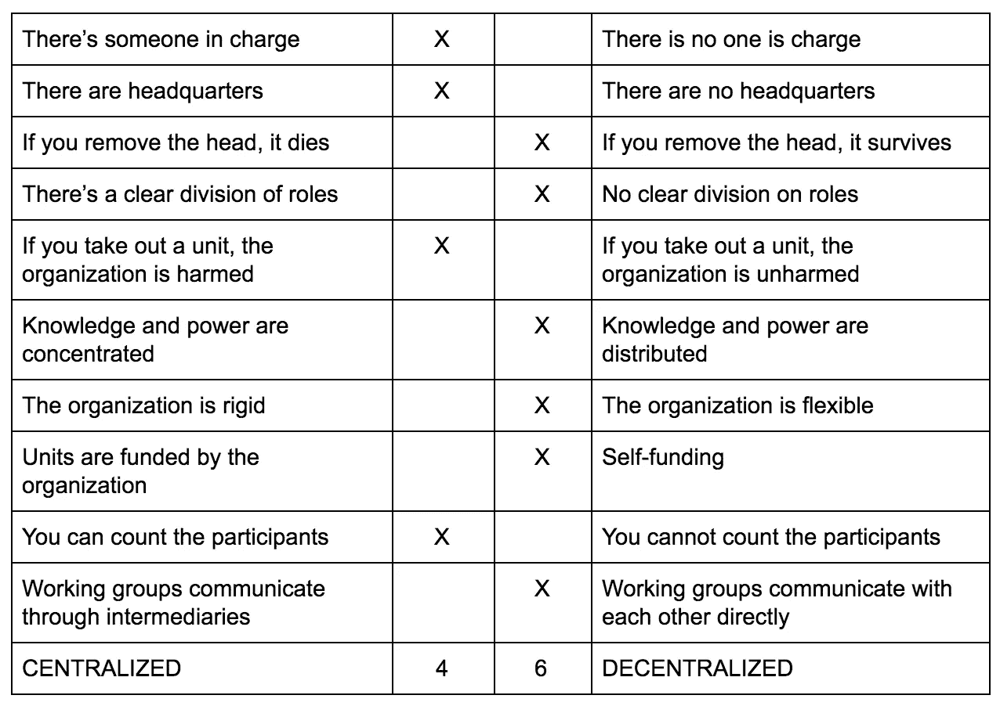

# EOS 的分权状态

> 原文：<https://medium.com/hackernoon/the-state-of-decentralization-in-eos-a1fde7b96217>

Credit: [http://www.cowboysindians.com/](http://www.cowboysindians.com/)

> **分权是将计划和决策从一个中央的、权威的地点或团体分散或委托出去的过程。**

*我和我在 HKEOS 的团队成员相信，去中心化是区块链和加密货币将给世界带来的最重要的变化。权力下放有可能从根本上改变行业和国家，赋予个人权力，更好地保护我们免受公司剥削和政府腐败。*

# ***分权原则***

*作为 Ori Brafman 的《[海星和蜘蛛](https://www.amazon.com/Starfish-Spider-Unstoppable-Leaderless-Organizations/dp/1591841836)》的粉丝，我将引用书中列举的 [8 项分权原则](https://en.wikipedia.org/wiki/The_Starfish_and_the_Spider#The_Major_Principles_of_Decentralization):*

> **1。当受到攻击时，一个分散的组织往往会变得更加开放和分散。**

*印加人和阿帕奇人面对着同一个敌人，西班牙军队。中央集权的印加帝国被打败并崩溃，分散的阿帕奇人幸存并战斗了几十年。令人惊讶的是，每次西班牙人进攻，阿帕奇人都变得越来越强大。*

> **2。很容易把海星(分散系统)误认为蜘蛛(集中系统)。**

*乍一看，亚利桑那州沙漠中的一个土著部落很容易被低估，他们的力量也被忽视了。西班牙军队期望毫不费力地征服他们。*

> **3。开放系统没有中央智能；智能在整个系统中传播。**

*分散系统并不总是更有效率，它们更被动。社区共享知识和使用能力。*

> **4。开放系统很容易变异**

*阿帕奇人没想到会有西班牙军队。一旦受到攻击，他们迅速做出反应，成为游牧民族，并相应地改变他们的组织。*

> **5。分散的组织悄悄靠近你。**

*一小群人通过创建点对点的分散网络，成功地改变了整个音乐产业。*

> **6。随着行业变得分散，整体利润下降。**

*由于 P2P 网络，四大音乐产业公司的收入下降了 1/4。那 25%没有到[电驴](https://en.wikipedia.org/wiki/EMule)或[纳普斯特](https://en.wikipedia.org/wiki/Napster)的创始人手里，只是消失了。*

> **7。把人们放在一个开放的系统中，他们会自然而然地想要做出贡献。**

*维基百科的贡献者提供准确一致的信息。同行评议制度使这个开放的系统更加客观，不受审查。*

> **8。当受到攻击时，集中的组织往往会变得更加集中。**

*面对逆境时，中央集权的系统倾向于用规则、流程和等级制度来应对。当国家陷入衰退和金融危机时，最常见的反应是民族主义和关闭边境。*

# ***EOS 呢？***

**

*Credit: [https://eos.io/resources](https://eos.io/resources)*

*既然我们已经为上下文设置了上述原则，我们可以问，EOS 有多分散？让我们注意一下，mainnet 还没有推出，EOS 将继续发展。*

*自从我从事 EOS 工作以来，我已经看到人们努力区分所涉及的实体。这很重要，因为他们每个人都有不同程度的分权，在我看来，这还不理想。*

**1。*[*block . one*](http://www.block.one)*—开发 EOSIO 软件的公司**

**

*Credit: [https://medium.com/block-one](https://medium.com/block-one)*

*Block.one 是一家在弗吉尼亚州布莱克斯堡和香港都有办公地点的公司，有[知名领导人](https://www.linkedin.com/search/results/people/?facetCurrentCompany=%5B%2218226126%22%5D)，如[布伦丹·布鲁默](https://twitter.com/brendanblumer?lang=en)(首席执行官)和[丹·拉里默](https://twitter.com/DanLarimer?lang=en)(首席技术官)。因此，它显然是集中的，如果受到某种方式的攻击，它将面临风险。*

*如果一个国家或公司出于某种原因决定对某个团队穷追不舍，他们就要寻找这个团队的名字和地址。我不认为整个项目会烧成灰烬，但它使网络变得脆弱。这种情况将持续到 6 月 2 日 mainnet 发布。*

**2。***(软件)***

**EOSIO 是一款免费的[开源软件](https://en.wikipedia.org/wiki/Open-source_software)，有着明确的承诺。适用于分散式应用程序的可扩展且无错误的基础设施。换句话说，EOSIO 应该作为 Dapps 的[操作系统](https://en.wikipedia.org/wiki/Operating_system)工作。**

**此外，EOSIO 软件应确保“公平透明的区块生产商(BP)选举过程，利用民主的[授权利益证明](https://bitshares.org/technology/delegated-proof-of-stake-consensus/) (DPoS)共识。”这就引出了我们的第三点。**

***3。EOS(区块链/协议)***

**EOS 作为一个区块链/协议，一旦在 6 月 2 日启动，理论上将真正去中心化。但是，为了保证这一点，需要记住几个方面:**

*   **砌块生产商的多样性**

**如果大多数大宗商品生产商都是同一行业的大型实体(如加密货币交易所)，它们可能会相互勾结，朝着同一个方向行动，以实现自身利益最大化，这将反映出一个更加集中化的组织。**

*   **象征性登记率/投票参与率**

**如果象征性登记的比例在 6 月 2 日之前一直很低(目前约为 20%)，这将意味着只有英国石油公司的候选人将在他们之间投票，选票交易可能会在第一次结果出来后发生(即使违反宪法)。**

*   **块生产者角色**

**[砌块生产商](https://www.youtube.com/watch?v=jut-lpYTZlY)对 EOS 网络及其成功至关重要。BP 应该是代表 EOS 令牌持有者运行和管理区块链**的分散团体。****

**这就是为什么他们应该捍卫社区的利益，而不是自己的利益。在我看来，这只能通过社区教育、奖励再分配和用户群增长来实现。**

## ****权力下放的现状****

**以下是我对 EOS 整体去中心化现状的看法:**

****

**Credit: HKEOS**

****结论****

**罗马不是一天建成的**

**EOS 有可能彻底改变我们制造、使用和支付产品的方式。**

**EOS 作为一个真正分散的组织，目前的状态很难分析，可能也不理想，但我希望并相信，随着我们从一个概念项目转向一个全面运作的网络，它将在接下来的几周和几个月内得到极大的改善。**

**作为一个社区，我们有责任传播这个词，并最大限度地提高代币注册。**

**作为代币持有者，你有责任注册代币并投票，因为这将决定你作为社区一员的未来。**

**真正的权力下放只有通过平衡和多文化的砌块生产者群体才有可能实现。**

**让我们忘记蓝宝迷因，建立一些有意义的东西。**

**我希望这将有助于 EOS 社区的成长和繁荣。如果我遗漏了什么，请不吝赐教。**

*   **如果你想联系我，请在推特或电报(@hgkam)上给我发 PM。**
*   **以下是我的 ETH 地址，如果你认为这有帮助的话:
    0x 7658295 a0a 4 BCA 80013 b9f 809 fa 7 dbcb 3c 64 f 788**
*   **在推特上关注 [HKEOS](https://twitter.com/eos_hk) 了解最新消息。**