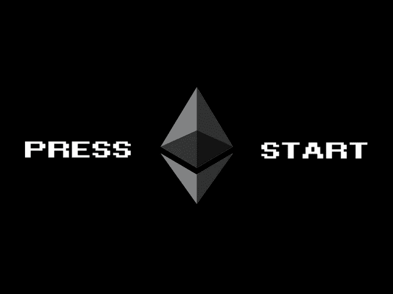
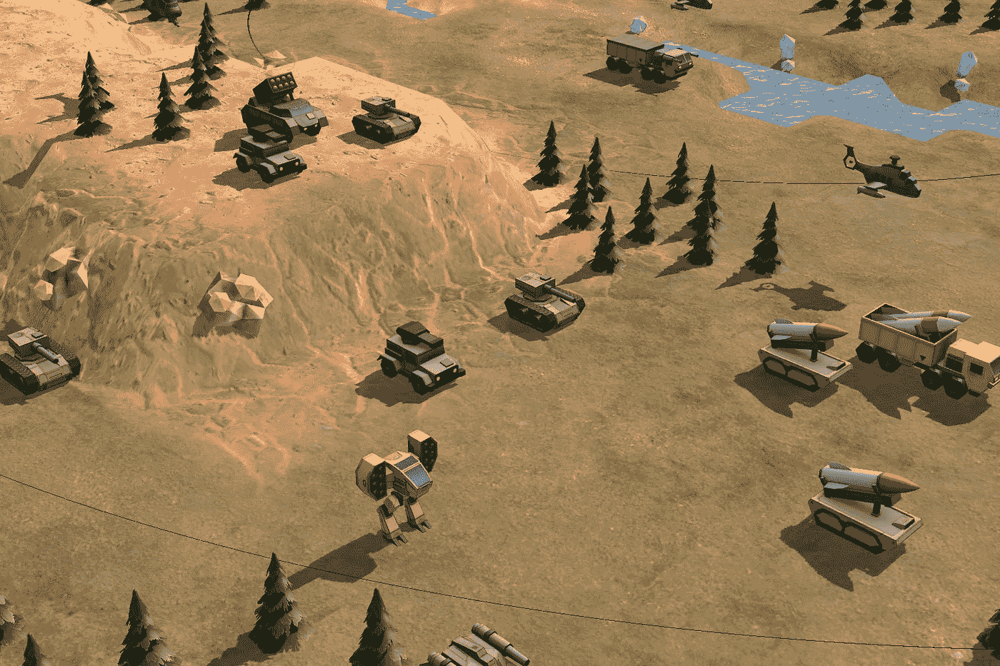

# 以太坊电子游戏的现状

> 原文：<https://medium.com/hackernoon/the-state-of-ethereum-based-video-games-46fd12b9cd50>

越来越多的有影响力的人认为[游戏将有助于促进区块链](/loom-network/games-will-be-the-catalyst-for-blockchain-mass-adoption-628f818c6c87)的大规模采用，区块链将极大地扰乱游戏行业。

目前在以太坊的区块链上开发的游戏数量最多，所以我决定看一看一些最有趣的基于以太坊的项目，不再大肆宣传，简单回顾一下实际上正在开发的内容。

# 公司、工作室和游戏

## [工作室:清晰的视线](https://www.lucidsight.com/)

[***密码空间指挥官***](https://www.csc-game.com/)

[Crypto Space Commander](/crypto-space-commander/crypto-space-commander-a-blockchain-game-the-journey-begins-dbfad98bd650) 是一款大型多人在线游戏(MMO ),玩家在游戏中建造一支宇宙飞船舰队，收集资源、工艺物品，并在星际旅行中与海盗和其他玩家战斗。

大多数游戏发生在链外，所有的经济活动都发生在链上。基于 [ERC-721 标准](http://erc721.org/)，所有有价值的资产都作为不可替代的代币(NFT)进行创建、跟踪和交易。

游戏引擎:Unity

平台:个人电脑、网络、移动设备

要求:网页播放的元蒙版，以太

开发状态:2018 年冬季内测

[***隐晦的变戏法***](https://www.crypticconjure.com/)

《神秘魔法》是一款多人奇幻动作 RPG 游戏，背景设定在基拉世界。该游戏以区块链为基础的经济为特色，充满了基于 ERC-721 和 ERC-20 标准的增强版本的游戏项目。玩家将收集资源和战利品来创造可以卖给其他玩家的独特法术。

开发团队由游戏行业的资深人士组成，但他们在开发游戏时将采用协作方式，在整个开发过程中与玩家合作，以指导和塑造在线体验。

游戏引擎:虚幻

平台:网络、移动

要求:[金属屏蔽](https://metamask.io/)，乙醚

开发状态:PVE 游戏预计将于 2019 年在 Q1 推出，PVP 将于 2019 年晚些时候推出

[***MLB***](https://mlbcryptobaseball.com/)

MLB 密码棒球是一种值得收藏的纸牌游戏，每个 MLB 密码都是一个具有独特视觉特征/属性的 NFT，由 MLB 官方球员或事件的 3D 模型代表。

一旦被购买，所有者就可以完全控制 NFT。玩家制作一张充满 MLB 密码的“游戏卡”，然后[通过竞争赢得奖励](/mlb-crypto-baseball/mlb-crypto-baseball-pre-sale-and-gameplay-strategy-952b59cdd32c)。

区块链仅用于创建和存储数字资产。一个定制的[离线解决方案](/mlb-crypto-baseball/mlb-crypto-baseball-an-nft-game-built-on-the-ethereum-blockchain-69b940ca9295)被用来处理大部分游戏功能。

平台:网络、移动

需求: [Metamask](https://metamask.io/) 或手机 DAPP 浏览器(即:[信任](https://trustwallet.com/)、[比特币基地钱包](https://wallet.coinbase.com/)、[状态](https://dev.status.im/get/))、以太

开发状态:已发布

## [工作室:Dapper Labs](http://dapperlabs.com)

*CryptoKitties 是一个用户收集和繁殖数字猫的游戏，它在很大程度上是目前围绕区块链游戏的炒作的开始。*

*每个 Cryptokitty 都是一个[链外资产](/@odtorson/that-thing-about-cryptokitties-2c8664f806e2)使用其 256 位遗传密码在链上识别。所有的资产交易，包括后代的生产都发生在供应链上。*

*平台:网络、移动*

*要求:Metamask 或移动 DAPP 浏览器，以太*

*开发状态:已发布*

## *[工作室:燃料游戏](https://www.fuelgames.io/)*

*[***上帝的被解放***](https://godsunchained.com/)*

*《上帝的解放》是一款具有收藏价值的纸牌游戏，灵感来源于炉石和万智牌等热门游戏。*

*玩家一旦购买了卡，就拥有完全的所有权，区块链被用来证明个人资产的独特历史。[所有卡牌都存储在链上](http://faq)，玩家只有在要购买和转让卡牌时才与以太坊互动。所有其他游戏发生在链外。*

*在 0x 协议的基础上，[正在开发一个用于点对点卡片交易的分散市场。](https://venturebeat.com/2018/09/24/0x-leads-the-way-for-tokenization-of-the-world-and-collectible-game-items-are-next/)*

*平台:Web*

*[需求](https://godsunchained.com/faq):元面具(与游戏的在线商店互动，购买/查看资产)，以太*

*开发状态:2018 年第四季度测试版，2019 年 Q1 全游戏版*

*[***以太机器人***](https://etherbots.io/)*

*在以太机器人中，玩家用收集的零件组装机器人，与对手战斗，并在市场上交易他们的机器人。*

*以太机器人 2:世界竞技场正在开发中，它将把以太机器人中的代币带入一个多人平台格斗游戏中，该游戏具有完全可破坏的地形。*

*平台:网络、移动*

*要求:Metamask 或移动 DAPP 浏览器，以太*

*开发状态:已发布*

## *[工作室:B2 展开](http://b2expand.com/)*

*[***超越虚空***](https://beyond-the-void.net/)*

*《虚空之外》是一部混合战略/ [MOBA](https://en.wikipedia.org/wiki/Multiplayer_online_battle_arena) 设定在太空中，玩家在 1v1 战斗中对抗，竞争统治银河系。这是首批在 Steam 上发布的基于区块链的游戏之一。*

*玩家在比赛开始时为他们的母舰起草技能，收获资源以建造他们的舰队，战斗以摧毁对手的舰队，最后征服敌人的母星。游戏发生在链外，而资产生活和交易的区块链。*

*B2expand 是参与第一轮[育碧和 F 站游戏娱乐计划](https://www.ubisoft.com/en-US/company/start-ups/station-f.aspx)的五家创业公司之一。*

*游戏引擎:Unity*

*平台:Windows、MacOS*

*需求:蒸汽，超能面具(进入[在线市场](https://shop.beyond-the-void.net/home))，乙醚(购买资产)*

*开发状态:已发布*

## *[工作室:VZ 游戏](https://hashrush.com/vz-team/)*

*[***哈希什***](https://hashrush.com/)*

*HashRush 是一款在线科幻/奇幻即时战略(RTS)游戏。玩家种植和管理采矿殖民地，与怪物战斗，交易物品和资源。成功积累“隐晶”的玩家可以从 VZ 游戏公司经营的矿场获得乙醚。*

*游戏道具[由 NFTs](https://hashrush.com/2018/10/15/hash-rush-dev-update/) 驱动， [Rushcoin](https://hashrush.com/2018/09/13/the-rush-coin-token-sale-is-live/) (一种 ERC-20 代币)是专用的游戏内货币。HashRush 在 Gamescom 2018 上获得了[最佳创新奖。](https://markets.businessinsider.com/news/stocks/hash-rush-wins-best-innovation-award-at-gamescom-2018-1027537180)*

*游戏引擎:Unity*

*平台:PC、Mac*

*要求:计算机*

*开发状态:封闭测试版*

## *[公司:织机](https://loomx.io/)*

*[***僵尸战场***](https://loom.games/)*

*僵尸战场是一个交易卡战斗游戏。所有游戏活动要么直接在区块链上进行，要么在游戏链上进行，游戏链是一个基于 Loom 侧链技术的[专用 DAPPchain](/loom-network/dappchains-scaling-ethereum-dapps-through-sidechains-f99e51fff447) 。*

*区块链允许认证稀有的卡片、玩家拥有的资产、安全的 P2P 交易和高质量的市场。*

*平台:iOS、Android、PC、macOS*

*要求:计算机、电话、以太网*

*开发状态:Alpha*

## *[工作室:分散的土地](https://decentraland.org/)*

*[***分权***](https://decentraland.org/)*

*分散的土地是一个分散的公共虚拟世界，玩家可以在那里购买土地，建造建筑和探索。*

*以太坊区块链用于存储有关土地所有权及其内容的信息。内容通过 IPFS 网络分发，而数据散列存储在区块链。土地市场已经启动并运行。*

*[CryptoBeasties](https://decentraland.org/blog/announcements/introducing-cryptobeasties-on-decentraland) 、 [CryptoCarz](https://decentraland.org/blog/announcements/introducing-cryptocarz-on-decentraland) 和 [Chainbreakers](https://decentraland.org/blog/announcements/chainbreakers-joins-decentraland-partners) 是为分散之地的宇宙打造的游戏。*

*游戏引擎:Unity*

*平台:PC、Mac*

*要求:计算机*

*发展现状:[铁器时代](/decentraland/the-decentraland-development-roadmap-51bf7903ff16)*

## *[工作室:地平线游戏](https://horizongames.net/)*

*[***SkyWeaver***](https://skyweaver.net/)*

*SkyWeaver 是一款交易卡牌游戏，玩家在一个名为 Sky 的领域中的秩序与混乱之间的战斗中选择阵营。游戏中战斗的结果直接影响到卡的总供应量。*

*我们还没有很多关于 SkyWeaver 的详细信息，但是他们已经得到了来自 [PolyChain](https://polychain.capital/) 、[数字货币集团](https://dcg.co/)和[比特币基地](https://www.coinbase.com/)的支持。*

*平台:PC、Mac*

*要求:计算机*

*开发状态:开发中*

## *工作室:育碧*

*[***哈希夫***](https://www.finder.com.au/hashcraft-ubisoft-blockchain-game)*

*Hashcraft 是一个原型，其游戏设计的灵感来自《我的世界》、堡垒之夜和无人区。这是育碧努力探索区块链技术能力的一部分。*

*当游戏开始时，会为玩家创建一个岛并存储在区块链上。然后，游戏玩家可以开始制作保存在区块链上的岛屿的所有变化。当玩家决定上传他们的岛屿以便社区探索时，他们会获得游戏内加密货币的奖励。*

*整个体验是分散的，因为服务器是由玩家电脑的联合力量支持的，并且不能被关闭。*

*平台:未知*

*要求:未知*

*开发状态:未知*

## *[工作室:0x 游戏](https://0x.games/)*

*[***0x 宇宙***](https://0xuniverse.com/)*

*0x Universe 是一款太空战略游戏，玩家建造飞船，探索银河系，殖民星球。玩家收集资源，进行研究，并在探索宇宙的过程中共同为故事做出贡献。*

*这个游戏是一个分散的应用程序，完全运行在以太坊网络上，不依赖于开发者控制的任何集中的游戏服务器。这保证了玩家对星球的安全所有权。*

*0x 战舰将允许玩家作为战舰工程师探索宇宙，并计划于 2018 年第四季度发布。*

*游戏引擎:Unity*

*平台:PC、MacOS*

*要求:元掩码*

*开发状态:已发布*

## *[工作室:封锁游戏](http://blockade.games/)*

*[***霓虹区***](https://neondistrict.io/)*

*《霓虹区》是一款赛博朋克在线多人 RPG 游戏，背景设定在一个世界中，反叛者正在为保持独立于被称为*主流*的独裁政府而战。*

*霓虹区的角色、装备和其他资产都是 NFT，随着你的游戏变得越来越有价值，它们的[历史被记录到织机 DAppchain](/loom-network/loom-sdk-projects-neon-district-a-blockchain-based-cyberpunk-rpg-46da277461a0) 中，直到它们被移动到以太坊的 mainnet。*

*游戏引擎:Unity*

*平台:PC*

*要求:计算机*

*开发状态:开发中*

## *[工作室:Axie Infinity](https://axieinfinity.com/#)*

*[***轴协无穷大***](https://axieinfinity.com/#)*

*Axie Infinity 是一款游戏，用户可以收集、训练和对抗名为 Axies 的虚拟宠物。战斗目前在链外进行，但该团队计划将它们移植到织机网络等离子链上，并利用等离子现金。*

*Axie 可以在[市场](https://axieinfinity.com/marketplace)上交易，该团队最近与分散的土地建立了[合作伙伴关系，将 Axie 体验带到分散的虚拟世界。](https://decentraland.org/blog/announcements/introducing-axie-infinity-on-decentraland)*

*平台:Web*

*要求:Metamask，乙醚*

*开发状态:测试版*

## *[工作室:太空海盗游戏](https://www.ageofrust.games/)*

*[铁锈时代](https://www.ageofrust.games/)*

*《铁锈时代》是一款设定在 4244 年的科幻冒险游戏。人工智能机器已经转向人类，掠夺任何他们可以生存的技术。你将在一个科技、科学和文化发展停滞的时代探索空间站、洞穴和废墟。*

*随着玩家的探索，他们会遇到密码难题，为解决这些难题的人提供加密货币奖励(比特币、以太、[、拉斯比特](https://www.ageofrust.games/rustbits/)、金恩)。*

*Space Pirate games 将发布含有高奖励谜题数字签名的证明，以验证奖品的存在，以及解决方案的哈希，以确保工作室没有作弊。这个游戏的首要密码谜题将用 20 个比特币编码。*

*游戏引擎:Unity*

*平台:PC*

*要求:未知*

*开发状态:开发中*

## *[工作室:骨折实验室](https://www.decimated.net/)*

*[大量减少](https://www.decimated.net/)*

*Decimated 是一款第三人称在线多人沙盒游戏，玩家在游戏中收获资源和交易，同时为在世界末日的环境中生存而战斗。玩家分为两派:人类公民和机器人警察。所有玩家开始都是公民，如果他们遵守规则并通过训练，就可以获得扮演警察的权利。*

*游戏由打捞技术、修理车辆、寻找加密货币、建造基地、加固庇护所和交易组成。游戏的加密货币 DIO 可以通过完成各种任务来获得。*

*该游戏还将提供用户生成的内容，为合作任务的其他玩家提供象征性奖励的能力，以及可以用来标记领土的涂鸦。*

*Decimated 将使用为在线多人游戏设计的以太坊[叉子。他们的区块链将利用父子链架构，允许用户在子链上进行快速交易，同时依赖主链提供的安全性。](https://www.dropbox.com/s/jm14tc36q91m6uy/DECIMATED%20MMO%20whitepaper%20WIP%20unformatted.pdf?dl=0)*

*游戏引擎:虚幻，空间操作系统*

*平台:PC*

*要求:未知*

*开发状态:开发中*

## *[工作室:卡地亚](https://cartified.com/)*

*[战争骑士](https://warriders.com/)*

*《战争骑士》是一款 MMO 游戏，玩家在游戏中制造和战斗汽车，同时比赛收集苯，这是世界末日废墟中唯一幸存的货币。你可以建造一队汽车来增加你的权力和影响力，扩大你的车库位置，并通过保护其他玩家来获得 ETH。*

*该团队已经开发了一个专用的侧链，用户可以在这里存放游戏中的物品和货币，以便在玩游戏时享受快速的交易速度。*

*游戏引擎:虚幻 4，空间 OS*

*平台:PC、Mac*

*要求:计算机*

*开发状态:2018 年底面向高端车主的测试版，2019 年全面发布*

## *[工作室:流氓国家](https://cryptoassault.io/)*

*[***密码突击***](https://cryptoassault.io/)*

**

*加密攻击是一个[战略 MMO](/cryptoassault/wtf-is-cryptoassault-30788bd30e01) 在这里玩家将开采资源，部署军队，组成联盟，并在一个饱受战争蹂躏的世界争夺领土。坦克、卡车、机甲、喷气机和直升机是你指挥的单位。*

*玩家将拥有他们基于 ERC-721 的游戏资产，并有机会对攻击、研究技术、选举工会领袖和建立贸易协议的协调决策进行投票。*

*这款游戏的特色是每日竞争以太奖励，奖励可以通过三种不同的方式获得:发现每日随机的卫星掉落，抓住地面瓷砖，并推荐其他玩家参与游戏。*

*游戏引擎:Unity*

*平台:Web*

*要求:元掩码*

*开发状态:开发中*

## *[工作室:以太世界](https://worldofether.com)*

*[以太的世界](https://worldofether.com)*

*以太世界是一个分散的可收藏决斗游戏，位于以太坊的区块链，所有核心游戏逻辑都由智能合约处理。玩家可以收集、繁殖和对抗储存在合约中的数字怪物。一旦购买，怪物完全属于玩家，可以在游戏市场上自由交易。*

*有五种类型的怪物，分为四种不同的稀有等级。该游戏目前有 200 个怪物，但新物种可以通过繁殖过程添加到名册中。随着玩家通过赢得战斗升级，他们增加了繁殖稀有怪物的机会。*

*平台:Web*

*要求:Metamask，比特币基地钱包*

*开发状态:已发布*

## *[工作室:8 个巡回工作室](https://8circuitstudios.com/)*

*****免责声明我目前是 8 个巡回工作室的顾问*****

*[***项目成因***](https://www.projectgenesis.com/)*

*Project Genesis 是一款第一人称射击游戏，第三人称太空战斗。在上述预告片的游戏部分，你所看到的人物、精选船只、工业设施和某些星球反映了 ERC-721 代币在游戏中的表现方式。*

*玩家拥有的资产将存储在以太坊的区块链上，而所有的游戏功能都是通过 8 个巡回工作室的[定制开发和资产管理框架](https://8circuitstudios.io/whitepaper.pdf)来处理的。*

*游戏引擎:虚幻*

*平台:PC、PS4、Xbox One*

*要求:电脑，游戏机*

*开发状态:阿尔法 Q2 2019，完整游戏 2019 年第四季度*

## *[工作室:远界工作室](https://mankindreborn.com)*

*[***人类重生***](https://mankindreborn.com/)*

*《人类重生》是一款赛博朋克 MMO 射击游戏，背景设定在不久的将来，八个玩家组成的阵营争夺经济、政治和战场的主导权。*

*游戏是离线处理的，Frontier Studios 已经和 8 个 Circuit Studios 建立了合作关系，使用他们的技术来构建跨游戏的数字财产。*

*《重生的人类》和《创世纪》项目之间共享的资产将代表着 8 个巡回工作室所设想的建立互联游戏元宇宙的第一个重要步骤。*

*游戏引擎:虚幻*

*平台:PC*

*要求:计算机*

*开发状态:封闭测试版*

# *技术和基础设施*

## *[织机](https://loomx.io/)*

*Loom Network 是以太坊的第二层扩展解决方案，以太坊是一个由[DPOS dapp chains/side chains](/loom-network/everything-you-need-to-know-about-loom-network-all-in-one-place-updated-regularly-64742bd839fe)组成的网络。Loom 还开发了一个[等离子现金](/loom-network/plasma-cash-initial-release-plasma-backed-nfts-now-available-on-loom-network-sidechains-37976d0cfccd)和一个 [SDK](https://loomx.io/developers/) 的实现。该团队目前有[三个侧链(PlasmaChain、GameChain、SocialChain)在生产中运行](/loom-network/plasmachain-gamechain-socialchain-the-loom-network-universe-expounded-5c672617a333)。*

*他们的 [CryptoZombies](https://cryptozombies.io/) 代码学校通过构建一个游戏来教用户编写以太坊 DAPPS 代码。*

## *[OpenSea](https://opensea.io/)*

*OpenSea 是一个密码收藏品市场。他们已经创建了[开发者工具](https://docs.opensea.io/)来帮助项目轻松构建他们自己的定制市场。*

## *[比特公会](https://bitguild.io/)*

*BitGuild 是一个分散的区块链游戏平台，旨在重新定义玩家和开发者之间的关系。*

*他们提供一个市场、一个游戏孵化器、一个钱包和一个 ERC-20 代币(PLAT ),用于玩游戏、在市场上交易和支持孵化器中的项目。*

*Bitizens 是一个正在内部开发的虚拟世界，玩家可以在其中定制自己的角色，挖掘虚拟物品，探索比特罗波利斯城。*

## *Dmarket*

*Dmarket 是一个游戏中物品的市场，已经与 Unity Technologies 和潘迪拉资本建立了合作关系。*

## *[0x 项目](https://0xproject.com/)*

*0x 是用于分散交换的协议。他们最近发布了协议的第二版，增加了对 ERC-721 令牌的支持，并且[团队对他们的](https://blog.0xproject.com/relayer-report-11-gods-unchained-56c45d204239)[技术如何用于数字资产](https://venturebeat.com/2018/09/24/0x-leads-the-way-for-tokenization-of-the-world-and-collectible-game-items-are-next/)感到兴奋。*

## *[Emoon](https://www.emoon.io/)*

*Emoon 是一个基于 0x 协议和[开源智能合约](/@emoonmarket/introducing-emoon-market-ec4c3c296266)的 ERC-20 令牌和 ERC-721 资产的点对点市场。*

## *[游戏币](https://gamertoken.io/)*

*Gamertoken 正在区块链上创建一个买卖游戏内物品的全球市场。他们还制作了钱包和演示版 MMO。*

## *[最终实验室](https://finalitylabs.io/)*

*Finality Labs 正在进行区块链的研发工作。他们目前正致力于[支付通道枢纽](https://finalitylabs.io/static/media/SetPaymentChannels.8a29d449.pdf)，以及[应用于支付、交换和游戏的国家通道和等离子体](https://docs.google.com/document/d/15LdH-YL3syBHdHlwCfUHou6XFvg5lXBKtrAFp5bG1Pc)。他们已经[开源了一个 javascript 库](https://github.com/layer2lib/js-layer2lib)用于构建状态通道和等离子应用。*

*他们目前正在开发永恒时间英雄，一个回合制国家频道游戏，研究可能位于等离子链上的 RPGS，并与分散土地和其他 NFT 土地系统合作。*

*Finality Labs 最近从以太坊基金会获得了 25 万美元的资助，用于研究远期锁定合约。*

## *[燃料游戏](https://www.fuelgames.io/)*

*Fuel Games 正在开发“世界级游戏的可扩展区块链基础设施”他们的阿波罗平台将允许游戏发行商轻松整合分散的资产。Ansible 通道是它们为专门为高吞吐量游戏设计的通用状态通道定制的框架。*

## *[片段](https://fragmenthq.com/)*

*Fragment 是由[众筹/游戏发行网站 Fig](https://www.fig.co/) 开发的区块链游戏平台。*

*具体细节尚不清楚，但该平台旨在提供"[一种独特的基于社区的游戏融资、参与和交叉推广方式。](https://www.blockchaingamer.biz/news/3335/fig-announces-shard/)“这将是一个开放的、去中心化的平台，可以由游戏玩家、发行商和开发者独立修改。*

*该项目的初始资金由 NeoPets 的创建者提供，Fig 在宣布平台的同时宣布收购总部位于区块链的资产平台 [Ownage](/@Alex_Amsel/ownage-an-ethereum-based-ownership-and-trading-platform-for-digital-game-content-5ffa92350edf) (由 [Colony 的](https://colony.io/) [Jack Du Rose](https://twitter.com/jackdurose?lang=en) 共同创建)。*

## *[金恩](https://enjincoin.io/)*

*金恩正在建立一个互联游戏世界的多元宇宙，以及帮助开发者创造数字资产的工具。金恩生态系统由:[金恩网](https://www.enjin.com/)，[金恩钱包](https://enjinwallet.io/)，[金恩币](https://blog.enjincoin.io/enjin-coin-manifesto-8caae08b50a1)， [Efinity 框架](https://blog.enjincoin.io/enjin-coin-announcing-efinity-and-our-new-updated-roadmap-c7616cc7ab79)， [SDKs](https://www.youtube.com/watch?v=MMOvDG33nlM&feature=youtu.be) 。*

*金恩最近发布了一些工具，允许开发者基于他们定制的 ERC -1155 框架轻松打造定制的数字资产 T21。他们还创造了一个注入了超过 100 万 ENJ 的游戏物品——独石，这是完成他们主要的多元宇宙任务的奖励。*

# *主题、趋势和预测*

*今天，游戏玩家投入大量的金钱和时间来收集和开发最终归出版商所有的数字资产。*

****存储在公共区块链*** 上的玩家拥有的数字资产可以改变这种动态，允许游戏玩家保持对其宝贵财产的所有权。一旦玩家意识到这是可能的，他们就会要求对他们的物品拥有更高程度的所有权。*

*这些玩家拥有的资产可以作为 ***角色和物品的基础，这些角色和物品可以在不同的游戏世界之间转移。*** 建造这个元宇宙并确保它提供高质量的游戏体验将是困难的，但我们有来自流行小说的例子(即: [Ready Player One 的绿洲](http://readyplayerone.wikia.com/wiki/OASIS))展示了这可能看起来像什么，以及它如何能够创造有价值的游戏体验。*

* [## 在准备好的一号玩家中创造绿洲需要什么

### 几年前读过这本书，并被欧内斯特·克莱恩创造的迷人的虚拟世界所吸引，我最初…

hackernoon.com](https://hackernoon.com/what-it-would-actually-take-to-create-the-oasis-in-ready-player-one-79604007c94) 

在一个高质量的视频游戏中，并不是所有的东西都可以或者应该直接放在一个公共的区块链上。 这个列表中最复杂的游戏都不是分散的应用程序，如果不依赖于虚幻引擎 4、 [AWS 的游戏开发工具套件](https://aws.amazon.com/gaming/)以及促进在线多人游戏所需的游戏服务器等重要的集中基础设施，运行它们在技术上是不可行的。

虽然完全去中心化游戏的概念很吸引人，可以满足某些体验，但当创建一个全功能的 RPG、FPS 或 MMO 时，开发者和发行商需要保留一定程度的控制，以便打造一个平衡和愉快的体验。

***第二层解决方案有着令人难以置信的前景*** 它允许我们增加由公共区块链保护的信息量和数据量。想象一下游戏发行商、工作室和玩家组成的联盟合作维护基于[国家渠道的支付中心](/blockchannel/state-channels-for-dummies-part-3-10b25f6c08b)、[等离子合同](https://media.consensys.net/the-state-of-plasma-1-6b48c1e4b295)或[侧链](/loom-network/million-user-dapps-on-ethereum-an-introduction-to-application-specific-sidechains-c0fdc288c5e5)的共享基础设施。像 [StorJ](https://storj.io/) 、 [IPFS](https://ipfs.io/) 和 [Swarm](https://swarm-guide.readthedocs.io/en/latest/introduction.html) 这样的分散化技术可以作为对公共区块链的赞美。

***大玩家已经开始尝试区块链*** ，并可能对这项新兴技术如何影响游戏行业产生重大影响。育碧和 [Epic Games(堡垒之夜的发行商)](https://www.prnewswire.com/news-releases/magnachain-announces-investor-and-business-partnerships-to-launch-new-public-blockchain-300677555.html)是第一批到来的。

对于基于区块链的游戏来说，现在还是早期，我们应该仔细研究正在进行的实验，注意哪些可行，哪些不可行。

我对区块链的视频游戏如何在未来 5-10 年开始改变社会有一些预测。

1.  随着玩家在公开市场上买卖数字资产变得更加容易，我们将看到职业游戏作为收入来源的可行性增加。
2.  我们将看到越来越多的基础设施和工具的可用性，允许独立开发者有效地与主要出版商和工作室竞争。
3.  游戏玩家将有一些流行的元诗句可供选择。随着人们在这些越来越真实的世界中花费更多的时间，虚拟世界和现实世界之间的界限将继续模糊。社会将被迫应对这一发展带来的意想不到的后果，就像我们仍然受到社交网络对公共话语和治理的破坏性影响一样。
4.  加密货币成功融入流行的视频游戏将有助于减少围绕该技术的污名，并在促进区块链技术的大规模采用方面发挥重要作用。

# 结论

显然，这里发生的不仅仅是炒作，还需要一些时间，我们才能大规模测试区块链如何改善普通玩家的游戏体验。

作为一个长期的密码货币发烧友，我已经漫不经心地观察了一年多的密码游戏，并在过去的几个月里深入挖掘，我乐观地认为，将基于区块链的技术融入视频游戏将最终为游戏玩家和开发者带来巨大的价值。

我当然不是一个人。

# 加密游戏推荐阅读

 [## 密码的下一个催化剂:游戏——第 1 部分

### 博彩业目前在全球创造了超过 1300 亿美元的收入，是电影(406 亿美元)和音乐(173 亿美元)的两倍……

hackernoon.com](https://hackernoon.com/cryptos-next-catalyst-gaming-part-1-e4b26676fbc7)  [## 思考太小:当数字稀缺损害了方块链游戏的未来

### 数字稀缺本身永远不会是区块链奥运会成功的原因。作为一个社区，我们也在思考…

medium.com](/@mentapurpura/thinking-too-small-when-digital-scarcity-hurts-the-future-of-blockchain-games-850be208417e)  [## 如果游戏推动了密码的大量采用，那么它们将会是草根

### 有一个迷因，游戏将推动密码的大规模采用。弗雷德·威尔逊和克里斯·迪克森说过。人们来了…

www.tonysheng.com](https://www.tonysheng.com/crypto-adoption-games)  [## 一次建造一个街区的元宇宙

### “就像你可能不会住在没有水泥地基的房子里一样，你可能也不会想……

www.ethnews.com](https://www.ethnews.com/building-the-metaverse-one-block-at-a-time)*