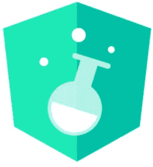

# JavaScript 库和框架的现状:2018 年及以后。

> 原文：<https://medium.com/hackernoon/the-status-of-javascript-libraries-frameworks-2018-beyond-3a5a7cae7513>

库和[框架](https://hackernoon.com/tagged/frameworks)是前端开发上的激烈竞争之一。

如今，FE dev 的含义是关于库或框架在使用什么。

每年都有新的不同项目以各自的特点出现，但现在我们可以大致同意 Angular，React 或 Vue.js 是这个世界的先驱。

调查结果证明了这一点。


[State of JS 2017: Libraries](https://stateofjs.com/2017/front-end/results/)

现在的生活可以被解释为苦恼什么是最好的选择，看看现在和未来的状态将是你考虑的一个好的起点。

# 反应

毫无疑问，React 是其中的佼佼者。去年面临一个困难的时刻——[牌照问题](https://wptavern.com/react-users-petition-facebook-to-re-license-react-js-after-apache-software-foundation-bans-bsdpatents-license-in-dependencies)——可能导致实际位置松动，但[处理得不错](https://code.facebook.com/posts/300798627056246/relicensing-react-jest-flow-and-immutable-js/)。

此外，React 是就业市场上最受欢迎的公司。这一结果清楚地表明，React 正在超越其他公司。


[indeed.com: Job Trends](https://www.indeed.com/jobtrends/q-react-q-vue.js-q-angularJS-q-angular.html)

在 2018 年 1 月，create-react-app(帮助创建 React app 的 CLI 工具)已从孵化阶段转移到 facebook 官方存储库。


[https://twitter.com/i/web/status/955513652261482496](https://twitter.com/i/web/status/955513652261482496)

2017 年 9 月公布的[版本 16](https://github.com/facebook/react/releases/tag/v16.0.0) (代号‘纤程’)，改进了 SSR(服务器渲染器的重写)，增加了对自定义 DOM prop 和 fragment 的支持。此外，render 方法已更新为返回多个元素。

片段看起来像是一个空的 JSX 标签。它允许在不添加新节点的情况下摸索子节点，并且在 v16.2 上已经[改进了可用性。](https://reactjs.org/blog/2017/11/28/react-v16.2.0-fragment-support.html)

```
// fragments
render() {
  return (
   <React.Fragment>  // or Short Syntax: '<>'
      <ChildA />
      <ChildB />
      <ChildC />
    <React.Fragment>  // or Short Syntax: '</>'
  );
}
```

自 2017 年 12 月以来，React 启动了一项新流程，通过受 [Rust RFC](https://github.com/rust-lang/rfcs) 启发的 [RFC(征求意见)](https://github.com/reactjs/rfcs)处理新功能和建议。

## **新的上下文 API**

如果您有使用 React 的经验，很可能会有这样的烦恼:将 React 树结构中顶部组件的状态值传递给较低的组件，称为' [prop drilling](https://www.reddit.com/r/reactjs/comments/4v3mcb/passing_down_too_many_props_to_child_components/) '。

这也是 [Redux](https://github.com/reactjs/redux) 或者 [MobX](https://github.com/mobxjs/mobx) 等状态管理库来玩的原因之一。

你知道吗？有一种方法可以在不使用 React 的 API 的情况下解决这个问题。“上下文 API”。

但是当你想尝试使用它时，你会从官方文档中找到“[为什么不使用上下文](https://reactjs.org/docs/context.html#why-not-to-use-context)”甚至更多，它建议不要使用。

> 如果你还在学习反应，不要使用上下文

为了解决这个问题，我提出了一个新的实验性的“上下文 API”作为第一个 RFC 问题。新的 API 包含在新的 [v16.3 版本](https://reactjs.org/blog/2018/03/29/react-v-16-3.html)中。

```
Checkout more details:
- [React’s ⚛️ new Context API](/dailyjs/reacts-️-new-context-api-70c9fe01596b)
- [Replacing Redux with the new React context API](https://medium.freecodecamp.org/replacing-redux-with-the-new-react-context-api-8f5d01a00e8c)
```

## 异步渲染

“异步渲染”是从“如何在计算机能力和网络延迟的差异中提供最佳用户体验”这个基本问题中提出来的。

在 v16 的开发过程中，有一个关于它的考虑，但由于潜在的向后兼容性而无法继续，但支持将在未来的版本中添加。

Dan abra mov(React dev 团队成员)做了两个演示，分别名为“时间切片”和“悬念”，摘自他去年三月在冰岛 JSConf[上的演讲。](https://2018.jsconf.is/)


The factors to be improved from the CPU and IO perspective.

在 CPU 方面做改进，是为了填补计算机能力差异的空白。和来自 IO 的网络侧。

*   [超越 React 16 作者丹·阿布拉莫夫— JSConf 冰岛⚛](https://www.youtube.com/watch?time_continue=1&v=v6iR3Zk4oDY)

**时间分片(CPU)**

时间片为高优先级更新提供了一种通用方法，使低优先级更新不会被阻塞。


此外，它还通过调度复杂/困难的 CPU 作业来提高低性能设备的响应能力，而无需开发人员的任何干预。

**悬念(IO)**

暂挂提供了一种通用的方法来从异步数据加载中暂停和推迟组件呈现。


它有助于获得流畅的用户体验(加载和渲染)，而不会受到异步任务(如 REST、GraphQL API 调用等)的影响。

# vue . j

2017 年对 Vue.js 来说是令人印象深刻和有影响力的一年，与 React 和 Angular 的定位类似。

也成为最受欢迎的前端 GitHub 项目，去年获得了 4 万颗星。


[2017 JavaScript Rising Stars](https://risingstars.js.org/2017/en/#section-framework)

由于与 AngularJS 相似，Vue.js 对 AngularJS 用户来说是一个很有吸引力的选择。

这是多么有说服力的考虑:

*   迁移到 Angular 并不容易。
*   知道官方对 AngularJS 的支持会结束。

创作者尤雨溪谈到了与安古拉杰的相似之处。

> 我想，如果我能提取出我真正喜欢的棱角的部分，造出真正轻量级的东西，而不涉及所有额外的概念，会怎么样？我也很好奇它的内部实现是如何工作的。我开始这个实验只是想复制这个最小的特性集，比如声明性数据绑定。基本上 Vue 就是这样开始的。
> 
> —[https://betweenthewires.org/2016/11/03/evan-you/](https://betweenthewires.org/2016/11/03/evan-you/)

## Vue.js 和其他的有什么不同？

Vue.js 将自己描述为“进步的 [JavaScript](https://hackernoon.com/tagged/javascript) 框架”。

核心部分集中在数据绑定和组件上，对于了解 HTML、JS 和 CSS 等基本 web 技术的人来说，这变得更容易。

但是当应用程序变得复杂时，不可避免地需要一些辅助工具，如路由、状态管理、组件间的通信等。

像 Ember 和 Angular approach 这样的框架本身就包含了所有这些助手。像 React 让这些到社区生态系统。

Vue.js 取为中。核心提供最少的功能。当然，他们也提供官方维护的制作精良的工具和文档。

## 生态系统正在成长

[Nuxt.js](https://nuxtjs.org/) 灵感来源于基于 React 的 SSR 通用 webapp 框架[next . js](https://zeit.co/blog/next)(2016 年首次亮相)，于 2018 年 1 月达到 [v1.0](https://github.com/nuxt/nuxt.js/releases/tag/v1.0.0) 。

帮助构建材料设计 UI 组件的 [vuetify](https://vuetifyjs.com/en/) 也在 2018 年 2 月达到了 [v1.0](https://github.com/vuetifyjs/vuetify/releases/tag/v1.0.0) 。


来自 MS 的流行 VSCode，也开始[支持 Vue.js 的调试](https://github.com/Microsoft/vscode-recipes/tree/master/vuejs-cli)功能。

这些变化使得 Vue.js 的氛围越来越有吸引力。

## 前景

强大的 CLI 工具 [vue-cli](https://github.com/vuejs/vue-cli) ，可以配置开发环境，将很快发布新版本。

在 3.0 版中，将添加新的目标构建选项。它将允许使用三个(应用程序、库和 Web 组件——并计划添加更多的社区协作)目标轻松创建。还将支持“零配置”。

当前最新的内核是 2.5.x。下一个次要版本(v2.6)将支持原生 ESM 导入、改进的异步错误处理、“v-for”指令上的[迭代器](https://developer.mozilla.org/en-US/docs/Web/JavaScript/Reference/Iteration_protocols)等等。

从 2.6 的下一个版本(2.6-next 或 3.0)开始，将不再支持 IE，只支持 evergreen 浏览器。

> Vue 3 不会是那些“大变化版本”之一——主要区别将是 Vue 3 只针对现代的“常青树”浏览器(即 IE11 及以下版本已过时)。‐哈什诺德:AMA 与 Vue.js 团队


[State of VueJS 2018](https://www.youtube.com/watch?v=TRJMT9yjONQ)

基本上，下一个版本的开发将与 v2.6 dev 并行向后兼容。代码库也将拥有最新的 ES 规范。

毫无疑问，预计 Vue.js 将在 2018 年迎来又一个伟大的一年。许多开发人员以前常说“Angular vs React”，但现在大多数人都会同意“ **Vue.js vs React** ”。

```
Take a look "[Why we moved from Angular 2 to Vue.js (and why we didn’t choose React](/reverdev/why-we-moved-from-angular-2-to-vue-js-and-why-we-didnt-choose-react-ef807d9f4163)" article for reference.
```

# 有角的

按照每 6 个月发布一次的计划，v5.0 于 2017 年 11 月发布。即将到来的 6.0，达到了 RC 状态，如果按照时间表，它预计将于 4 月发布。

去年 Angular 重点关注的是[性能提升](https://blog.angular.io/version-5-0-0-of-angular-now-available-37e414935ced)居多。预计今年将会增加新的功能和新的不同方法。

## 对 v6.0 变化的展望

## **常春藤渲染器**

新的向后兼容的实验渲染器被称为“常春藤渲染器”，将被添加。它的目标是提供小尺寸，简单的调试和更快的编译。


[Trip report from ngAtlanta: Angular’s Roadmap, Inclusion, and more](https://blog.angular.io/trip-report-from-ngatlanta-angulars-roadmap-inclusion-and-more-b6c8bae85417)

这不会是一个“突破性的改变”。它将自动启用更新到新版本。

## **角元件**

角度元素允许角度元件发布为自定义元素。简单地把它想象成一个包装成定制元素的角形组件。

这意味着角度分量的扩展更加自由。作为自定义元素，它可以用在 vanillaJS 或不同的框架上，比如 React！

*   [角度元素—Rob worm ALD—Angular connect 2017](https://www.youtube.com/watch?v=vHI5C-9vH-E)
*   [使用“角度元素”将角度组件导出为自定义元素](/vincent-ogloblinsky/export-angular-components-as-custom-elements-with-angular-elements-a2a0bfcd7f8a)

## **Angular Labs**

Angular Labs 是 2017 年 10 月在' [AngularMix](https://angularmix.com/) '会议上宣布的想法。主要目标是提供与以前版本的清晰和平衡的交流，关于新的特性和研究。



Angular Labs Logo

已经设定了以下最初的三个目标。

**1。Shematic**

Angular DevKit / CLI 团队努力构建用于转换代码的通用工具，如搭建、查询后端 API 等。

**2。组件开发套件**

Angular Material 团队正在努力提取一些常见组件开发问题的核心解决方案，并通过 CDK 公开它们。

CDK 还包括可扩展的工具，带来不同的机制来帮助组件开发。

**3。**[**ABC**](http://g.co/ng/abc)(Angular build tools Convergence:Angular+Bazel+Closure)

努力将 Google 内部使用的构建 Angular 应用程序的工具链与外部工具链融合起来。它们包括:

*   bazel:Google 几乎所有软件都使用的构建系统。
*   闭包编译器:用于为几乎所有 Google web 应用程序创建 JavaScript 工件的优化器。

## **实例迁移**

结合 [StackBlitz](https://stackblitz.com/) ，将 [Plunker](https://plnkr.co/) 上的示例代码[移动到](https://github.com/angular/angular/issues/20045)stack blitz。

如果你熟悉 VSCode，它可以给你更舒适的使用方式。

## AngularJS (v1.x)的未来如何？

众所周知，AngularJS 是 v1.x(Angular 是 v2.x+)。有多少用户仍在使用它？

答案可以从开发商的调查结果中找到，根据调查结果，仍然有大量的 AngularJS 用户。


[State Of JavaScript 2017: Library](https://stateofjs.com/2017/front-end/results/) (Left) / [StackOverflow: Developer Survey Results 2017](https://insights.stackoverflow.com/survey/2017#technology-frameworks-libraries-and-other-technologies) (Right)

由此我们可以推断，对 AngularJS 用户来说，升级到 Angular 并不意味着简单的‘升级’。

这不仅仅是 Angular 与之前 1.x 版本的兼容性问题。还有新的学习曲线，打字稿。

很久以前，核心团队[承诺支持多种语言](https://youtu.be/aHGmj_fqPLE?t=1510)，但是没有实现。这对于那些不能放弃开发应用程序的舒适方式的人(例如使用 CoffeeScript 等的人。).

安古拉吉斯的支持会持续到什么时候？

新的次要版本 1.7 将于 2018 年 7 月之前发布。之后，从 7 月 1 日开始，v1.2.x 和 v1.7.x 将进入为期 3 年的[长期支持](https://docs.angularjs.org/misc/version-support-status#long-term-support)期。

# Web 组件和聚合物

2017 年对于 Web 组件来说是一个令人印象深刻的大**，因为浏览器的支持得到了扩展。**

Safari 官方增加了自定义元素和 ShadowDOM 支持，Firefox(目前标志:[*DOM . web components . enabled*，*DOM . web components . shadow DOM . enabled*](https://developer.mozilla.org/en-US/Firefox/Experimental_features#APIs)需要启用)将有望在 60/61 版本跟进。Edge 是唯一一个没有支持的人。


[webcomponents.org](http://webcomponents.org/): Browser Support

新增的 ***<脚本 type="module" >*** 是作为 Web 组件替代 HTML 导入的一部分新增的。缺乏兴趣和浏览器的缓慢采用是原因。

```
Check out more details: [https://github.com/w3c/webcomponents/issues/645](https://github.com/w3c/webcomponents/issues/645)
```

此后， [Polymer 3.0 宣布了](https://www.polymer-project.org/blog/2017-08-22-npm-modules.html)使用 ES6 模块代替 HTML 导入的过渡计划。

所有现代浏览器都支持 ESM，因此从技术上来说，浏览器缺乏支持的问题已经解决了！

## 最近和 2017 年的变化

## **聚合物**

随着 v 2.0(2017 年 5 月)的[发布，已经改进了与其他库/框架的互操作性。还删除了对使用 Polymer.dom 进行 dom 处理的限制，并且](https://www.polymer-project.org/blog/2017-05-15-time-for-two.html)[shady DOM](https://github.com/webcomponents/shadydom)(shadow DOM shim)被拆分为独立的 polyfill。

通过工厂方法定义元素的方式，通过 ES6 类语法和自定义元素改变为更多地使用标准方式。

*   [2.0 的新功能](https://www.polymer-project.org/2.0/docs/about_20)

最近的版本 v 2.4(2018 年 1 月)增加了对 TypeScript 的支持，并在 2 月宣布了[聚合物装饰](https://github.com/Polymer/polymer-decorators)。

在服务采用方面， [YouTube 的更新设计是使用聚合物](https://youtube.googleblog.com/2017/05/a-sneak-peek-at-youtubes-new-look-and.html)开发的。谷歌采用他们的旗舰服务对许多其他人来说意义重大。

## **网络组件生态系统**

Apple 提出的新规范“[模板实例化](http://w3c.github.io/webcomponents/proposals/Template-Instantiation)”通过模板语法的使用、条件和循环的使用，带来了不同的模板实例化方式。


[Template Instantiation](https://youtu.be/edXRi6z7zrE?t=7747)

CSS 阴影部分提案看起来也很有趣。使用*:【part()】*和*:【theme()】*函数，从外部制作可能的样式阴影 DOM 元素。

```
<my-slider>
    #shadow-root
    <div part="track"></div>
    <div part="thumb"></div>
</my-slider>

// defined outside of <my-slider>
my-slider::part(thumb) {
    color: red;
}
```

## 聚合物 3.0 版

3.0 版将从 2.0 版自动转换，并将过渡到前面提到的 ESM。


[Changes for v3.0](https://youtu.be/edXRi6z7zrE?t=8077)

名为' [lit-html](https://github.com/Polymer/lit-html) '的新库(仍处于实验阶段)将用于创建自定义元素。创建的元素将被称为' [lit-element](https://github.com/PolymerLabs/lit-element) '。

lit-html 是在 Polymer Summit(2017)上宣布的，它专注于通过 ES6 标记的模板文字实现 DOM 渲染。与 React 的 JSX 类似，但它不需要构建过程，因为是标准的。

它是可扩展的，提供指令和定制的语法。

```
Similar Tagged Template Literals libraries are: [hyperHTML](https://github.com/WebReflection/hyperHTML), [hyperx](https://github.com/choojs/hyperx), [t7.js](https://github.com/trueadm/t7)
```


lit-html and lit-lement

> 前缀 lit 代表 literals 和 little

# 静态类型系统

JavaScript 是一种动态类型语言，它的变量类型是由解释器在运行时定义的。由于这种性质，许多传统语言开发者认为这是一个弱点。

没有类型的一个问题是 bug 增加的可能性。为了克服，许多尝试都是以非标准的方式进行的。

代表性的工具和语言有:微软的 [TypeScript](https://www.typescriptlang.org/) ，脸书的 [Flow](https://flow.org/) 和 [ReasonML](https://reasonml.github.io/) ，后面是 [PureScript](https://github.com/purescript/purescript) 。


使用它的最大优势是什么？

一份研究报告称，采用静态类型系统可以降低 15%的错误率。

> 静态类型系统发现公共 bug 的重要百分比:Flow 0.30 和 TypeScript 2.0 都成功检测了 15%！
> 
> — [输入还是不输入:量化 JavaScript 中可检测的错误](http://earlbarr.com/publications/typestudy.pdf)

## 选哪个？

TypeScript 引导现在跟随流和原因。


[State of JavaScript 2017: JavaScript Flavors](https://stateofjs.com/2017/flavors/results/)

TypeScript(JavaScript 的超集)、ReasonML(OCaml)和 PureScript(Haskell)作为新的编程语言，作为工具流动。这是如何描述自己的。

> - **TypeScript:** TypeScript 是 JavaScript 的一个超集，通过编译来清理 JavaScript 输出。
> - **Flow:** Flow 是 JavaScript 的静态类型检查器。
> - **原因 ML:** 简单、快速&利用 Javascript 的类型安全代码& OCaml 生态系统
> - **PureScript:** 一种编译成 JavaScript 的强类型语言，由 Haskell 编写并受其启发

看看下面这个简单的例子。代码抛出一个错误，但是直到运行时才显示出来。

```
function square(n) {
  return n * n;
}

square("oops");
```

作为 JavaScript 的超集，TypeScript 具有我们已知的相同语法。只需在上面添加数据类型，就可以在编译时发现错误。

```
function square(n: number): number { ... }
```

流，不需要定义类型就可以完成。一切都可以*推断*。

这个特征提供了类型检查的采用，而不需要代码改变和成本。

```
Checkout more on:
- [Adopting Flow & TypeScript](https://jamie.build/adopting-flow-and-typescript.html)
- [JavaScript vs. TypeScript vs. ReasonML](http://2ality.com/2018/03/javascript-typescript-reasonml.html)
```

## 前景

TypeScript 的增长将是一致的。许多著名的项目都在使用它。

> [Angular](https://techcrunch.com/2015/03/05/microsoft-and-google-collaborate-on-typescript-hell-has-not-frozen-over-yet/) ， [Vue.js](/the-vue-point/upcoming-typescript-changes-in-vue-2-5-e9bd7e2ecf08) ， [Polymer](https://www.polymer-project.org/blog/2018-01-25-polymer-2-4) 和 [GitHub Desktop](https://github.com/desktop/desktop) 都在使用 TypeScript

而脸书在[上构建和使用的 Flow 和 reason ml React](https://github.com/facebook/react/blob/master/scripts/tasks/flow.js)和 [Facebook Messenger](https://reasonml.github.io/blog/2017/09/08/messenger-50-reason.html) ，没有像 TypeScript 那样明确的参照物。

降低 bug 率是乐观的，但是额外配置(编译)的需求和学习曲线可能是一个障碍。

这些基本上都是帮助编写高质量代码的额外的“支持性”工具，它们不是“标准的”。

# jQuery

## 仍然活得好好的

当你考虑开始一个项目时，jQuery 不再是首选，但是每天有 30 万次下载。与 2017 年初相比，这几乎是 300%的增长。


[npm-stat.com: jquery](https://npm-stat.com/charts.html?package=jquery&from=2017-01-01&to=2018-03-31)

不仅仅是下载。500K 网站中的 90%仍然使用 jQuery。


[http archive: JavaScript Library Detection](https://discuss.httparchive.org/t/javascript-library-detection/955/2)

对于那些认为 jQuery 是过时的、被遗忘的古代图书馆的人来说，这可能是一个令人惊讶的结果。

## 前景

jQuery 团队去年发布了两个版本( [3.2.0](https://blog.jquery.com/2017/03/16/jquery-3-2-0-is-out/) 和 [3.2.1](https://blog.jquery.com/2017/03/20/jquery-3-2-1-now-available/) )。看到这个，看起来变化很慢。

Timmy Willison(核心成员)解释说:

> 该团队不久前决定以缓慢但稳定的速度发布，我们翻译成一年大约 2 个版本
> 
> —[2018 年的 jQuery 前景如何？](https://github.com/jquery/jquery/issues/3886#issuecomment-350880747)

计划中的 4.0 版将有以下变化。

*   使用下一代 JavaScript 的完全重写
*   重写我们的速度框架
*   全新的[事件模块设计](https://github.com/jquery/jquery/wiki/jQuery-4.0-Event-Design)

```
For more details about future plans, check out:
- [v4.0 Milestone](https://github.com/jquery/jquery/milestone/7) and [Future Milestone](https://github.com/jquery/jquery/milestone/3) as well.
```

使用最新的库和框架不是正确的答案。我们不知道 jQuery 的未来会怎样，但它做得很好，没有失去它的影响力。

# 关闭

前端开发相当有活力，令人印象深刻。

跟踪堆栈的每个角落似乎是不可能的，但是了解和理解它的一部分，可以让我们对前端开发有所了解。

我们应该知道多少库/框架？了解它们是你技能的证明？

当然，总比不知道好，但是他们每个人都有不同的哲学，说他们都是好的和最好的。

> ***没有正确的事。***