# JavaScript 在浏览器之外的地位:2018 &超越。

> 原文：<https://medium.com/hackernoon/the-status-of-javascript-outside-of-the-browser-2018-beyond-ee0b79ee059f>

JavaScript 并不像许多人想的那样仅仅停留在浏览器内部。它在各个领域显示出强大的力量，有时它在浏览器之外更有潜力。

> **请记住:**本文内容截止到 2018 年 5 月，不太可能反映最新更新，可能包含一些个人观点。

# 节点. js

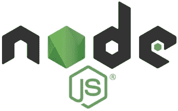

作为 2017 年，继续展示了闪亮的进步。去年有 2.5 亿次下载，相当于每天 70 万次下载！

它每年都在惊人地增长，2017 年的月下载量比 2016 年增加了 7 ~ 8 万次。

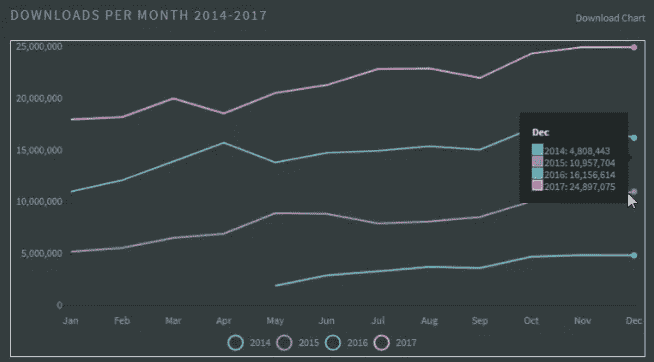

[node by numbers](https://nodesource.com/node-by-numbers)

许多公司去年采用了 Node.js。对于那些需要在短时间内为客户提供新的数字体验的人来说，选择 [Node.js](https://hackernoon.com/tagged/nodejs) 在某种程度上看起来非常合理。因为有了 Node.js，可以从快速开发过程和丰富的生态系统中获益。

“公司”不仅仅指小型科技初创公司。Node.js 的领域也扩展到了那些传统的大公司。

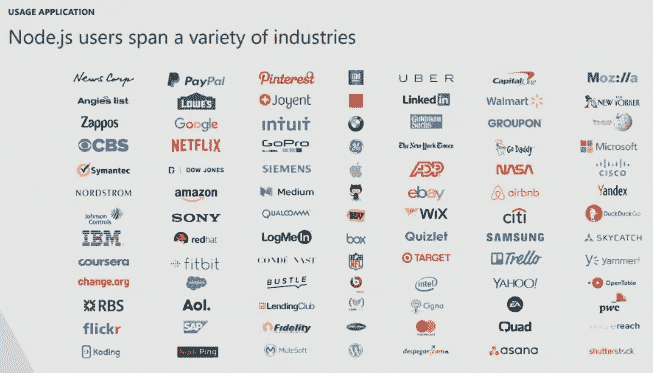

A list of companies using Node.js in a variety of industries

> 查看不同行业公司分享的采用经验。
> - **沃尔玛:** [将大型企业迁移到 NodeJS](/walmartlabs/migrating-large-enterprise-to-nodejs-6c38523d2b33)
> - **劳氏:** [实施 Node.js 以获得数字化体验](https://www.youtube.com/watch?v=vBtEb_wn2r0)
> - **网飞:** [将他们的边缘服务层](https://www.youtube.com/watch?v=p74282nDMX8&feature=youtu.be&t=12m11s)
> -**NASA:**[node . js 帮助 NASA 保证宇航员的安全和数据可访问](https://foundation.nodejs.org/wp-content/uploads/sites/50/2017/09/Node_CaseStudy_Nasa_FNL.pdf)

Node.js 在 2017 年期间是如何使用和演变的？你可以从调查结果中得到一个简明的例子。

*   [Node.js: 2017 年用户调查执行摘要](https://foundation.nodejs.org/wp-content/uploads/sites/50/2017/11/Nodejs_2017_User_Survey_Exec_Sum.pdf)

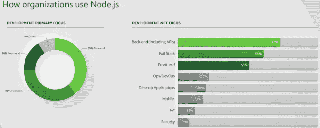

One of the survey result: How organizations use Node.js

## 美国石油学会

[N-API](https://nodejs.org/api/n-api.html#n_api_n_api) (Node.js API)是一个构建[原生插件](https://nodejs.org/api/addons.html)的 API。它独立于 JavaScript 运行时，作为 Node.js 的一部分进行维护。

它是在 [Node.js 8.0](https://nodejs.org/en/blog/release/v8.0.0/#say-hello-to-the-node-js-api-n-api) 上作为实验性特性添加的，然后[移除了‘实验性’](https://github.com/nodejs/node/commit/cd7d7b15c1)成为 v10.0.0 版本以来的正式特性。

它提供了使用 C/C++构建插件的方法，即使对运行时没有深入的了解。它可以定义为运行时和 Node.js 之间的抽象层。

与旧的本机抽象 API[NAN](https://github.com/nodejs/nan)(node . js 的本机抽象)相比，新的 N-API 改进了很多，提供了 ABI(应用程序二进制接口)兼容性。这使得插件可以在不同的 Node.js 版本中工作，而无需重新编译过程。

*   [N-API 和开始编写 Node.js 的 C 插件](https://hackernoon.com/n-api-and-getting-started-with-writing-c-addons-for-node-js-cf061b3eae75)
*   [N-API:用于本机模块的下一代 node . js API](/the-node-js-collection/n-api-next-generation-node-js-apis-for-native-modules-169af5235b06)([摘要幻灯片](https://www.slideshare.net/michaeldawson3572846/n-api-node-interactive-2017))

## 还有哪些变化？

从 7.6 版开始，增加了本机异步/等待支持。这允许制作标准化的异步代码。从 8.0 版开始，增加了 WebAssembly 支持。

## **v10.0.0**

4 月 24 日发布了第七个主要版本 v10.0.0。随着这个版本的发布，N-API 成为了一个官方特性。N-API 也被添加到基于 Node.js 的实验性脉轮(MS' runtime)中，即 [Node-ChakraCore](https://github.com/nodejs/node-chakracore) 。

> 在 Node-ChakraCore 10.0.0 版本中，alse 为 VSCode 添加了时间旅行调试扩展，并支持生成器和异步函数。
> 
> -node . js with ChakraCore(node-ChakraCore-v 10 . 0 . 0)

从 V8 运行时引擎更新(v6.6)，Node.js 也将从中获得许多有益的变化。

完善 ESM 支持的努力仍在进行，但仍在努力解决一些遗留问题。

即使现在所有现代浏览器都支持原生 ESM，Node.js 在与 Node.js 使用的默认模块系统 CJS(CommonJS)环境集成方面仍然面临一些困难。

*   NodeJS 中的本地 ES 模块:现状和未来方向，第一部分

## 未来发布时间表

根据 LTS，v10.x 将于 2018 年 10 月进入活跃的 LTS 阶段。

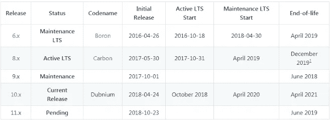

[Node.js release schedule](https://github.com/nodejs/Release#release-schedule)

所有 Node.js 主要版本都将按照 LTS 计划进行维护。

每个主要版本都将从进入 LTS 保险之日起进行为期 18 个月的积极维护。之后，它将在另外 12 个月的时间内过渡到“ ***”维护*** ”模式。

# 包管理器

npm 和 Bower 这两位杰出人物在 2017 年有什么变化？

在 2017 年 5 月至 2018 年 5 月期间，大约。npm 上注册了 20 万个新包，巩固了强大的领先地位。

Bower 仍在提供持续的更新版本，每周有 5 万次下载。但是 Bower 团队正式推荐使用纱线代替。

> ..嘶！在维护 Bower 的同时，推荐[纱](https://yarnpkg.com/)和 [webpack](https://webpack.js.org/) 或者[包裹](https://parceljs.org/)用于新的前端项目！——鲍尔项目自述中的一个注释

根据建议，维护存在不确定性。根据 Bower 团队的建议，有必要不考虑在新项目中使用 Bower。

> 鲍尔团队一直建议不要使用。
> - [如何远离凉亭迁徙？](https://bower.io/blog/2017/how-to-migrate-away-from-bower/)
> - [如何降 bower 支持？](https://bower.io/blog/2017/how-to-drop-bower-support/)

# npm


截至 2018 年 5 月，共有 65 万个包注册。这个数字相当于平均每天有 500 个新包裹。

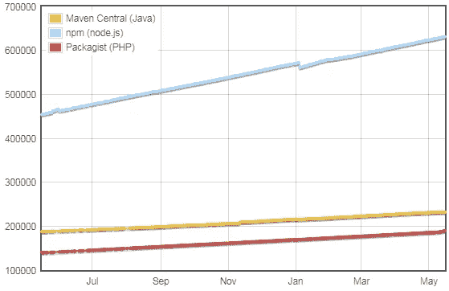

Number of modules registered by May 2018 (from [Module Counts](http://www.modulecounts.com/))

不管在何种语言和环境下，这种增长都是最快的。从上面的图表可以看出，npm 位于顶部，其次是 Maven(Java) — 230K 和 Packagist(PHP) 180K。

## 前一版本的显著特点

到 2017 年和 2018 年，每年分别有一个主要版本。

[v 5 . 0 . 0](https://blog.npmjs.org/post/161081169345/v500)(2017 年 5 月)增加了锁文件( [package-lock.json](https://docs.npmjs.com/files/package-lock.json) )支持(as like yarn)。到 5.7.0 更新时，npm 可能会面临由[文件系统权限变更](https://github.com/npm/npm/issues/19883)问题引起的噩梦。但是他们很好地解决了这个问题。

上一次主要版本更新 [v6.0](https://blog.npmjs.org/post/173260195980/announcing-npm6) ，发布于去年 4 月。

## npx

名为' **npx** 的新工具是从 5.2.0 版本开始引入的。

npx 是一个"*package runner*"，允许运行包，不需要注册为依赖项，也不需要安装它。对于那些需要一次性包装的人来说已经足够了。

```
# example of creating a new React project with 'create-react-app'
$ npx creat-react-app myApp
```

> 查看更多详细信息:[介绍 npx:一个 npm 包运行器](/@maybekatz/introducing-npx-an-npm-package-runner-55f7d4bd282b)

## 审计

从 v6.0(包括 5.10.0)开始添加，它允许检查所用模块的安全漏洞，并给出解决问题的建议。

```
$ npm audit

# Run `npm install webpack-cli@2.1.3` to resolve 2 vulnerabilities
  low             Cryptographically Weak PRNG
  Package         randomatic
  Dependency of   webpack-cli [dev]
  Path            webpack-cli > jscodeshift > micromatch > braces >
                  expand-range > fill-range > randomatic
  More info       https://nodesecurity.io/advisories/157
  ...
```

> 有关更多详细信息，请查看:[“NPM 审计”:识别并修复不安全的依赖关系](https://blog.npmjs.org/post/173719309445/npm-audit-identify-and-fix-insecure)

## 前景

下一个主要的版本 7.0，预计将在今年年底发布，可能会将别名支持作为主要特性之一。查看以下链接了解更多详情。

*   [超越国家预防机制@6:国家预防机制 cli 的未来](https://github.com/npm/npm/wiki/Roadmap#beyond-npm6-the-future-of-the-npm-cli)

# 故事

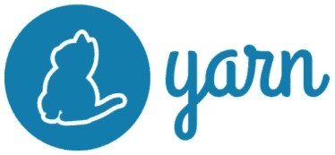

自 2016 年首次亮相以来，它已经发展成为一个包管理器，每周有 40 万个包下载。

随着鲍尔影响的减弱，该地区已经形成了“npm vs yarn ”。

到 2018 年 5 月，大约 [45 万 GitHub 项目](https://github.com/search?utf8=%E2%9C%93&q=filename%3Ayarn.lock+path%3A%2F&type=Code)在使用 yarn。每天使用纱线安装的[300 米包装数量](https://stats.yarnpkg.com/)。

2017 年 9 月发布的 1.0 版增加了以下功能。

*   **工作空间**

工作区允许在 monorepo 结构化项目中更有效地管理包。这就避免了安装重复的软件包，并提供了共享和更新软件包的方法。

> 检查用于管理 monorepo 结构风格的多包的 Lerna 项目。 [Lerna 可以和纱线](https://yarnpkg.com/blog/2017/08/02/introducing-workspaces/#lerna)一起使用。

*   **选择性版本分辨率**

通过在 package.json 文件中添加新的“resolution”键，提供了一种管理子包版本的方法。

# npm vs 纱线

如上所述，现在已经形成了“ **npm vs 纱**”。与凉亭不同，它们使用相同的注册表。这一特点使得两者的比较以客户端的性能为目标。

从 v6 版本开始，npm 宣布速度比一年前快 17 倍。而这个公告基于每日更新的基准看起来是真理。

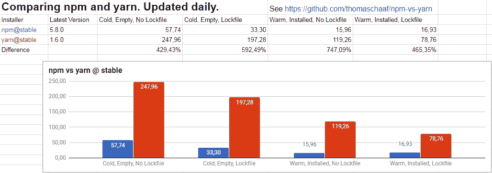

[Daily updated comparison of npm and yarn](https://docs.google.com/spreadsheets/d/1ZE5B4qJw1kNGMzjgslcWTuPYrpatzQJXSYMGNOhZ2ys/edit#gid=263077280)

这些结果不是固定的，而是灵活的，取决于新的更新和功能。但这会让人想起纱线首次亮相时的语录。据说 yarn 比 npm 更有性能。

现在这种优势似乎变得模糊了。

# 其他选择

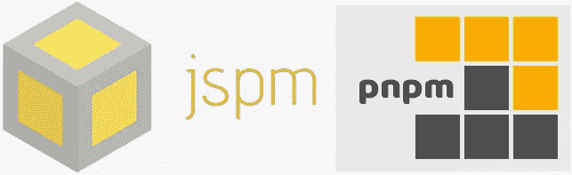

除了 npm 和 yarn 之外，还有许多其他的选择可以考虑。其中比较著名的有' [jspm](https://jspm.org/) '和' [pnpm](https://github.com/pnpm/pnpm) '。

## jspm

jspm，也用作包管理器的名称和工具链及其生态系统的名称。

**1。** [**jspm 注册表**](https://jspm.io/)

这是一个“**原生 ES 模块 CDN** ”。允许将 npm 软件包作为本机 ESM 加载。

```
<script type=module>
    import React from 'https://dev.jspm.io/react';

    // or as dynamic import(chrome)
    import('https://dev.jspm.io/react')
        .then(({ default: React }) => console.log(React));
</script>
```

**2。** [**系统**](https://github.com/systemjs/systemjs)

一个模块加载器，它允许加载模块而不管[不同的模块格式](https://github.com/systemjs/systemjs/blob/master/docs/module-formats.md)。

```
<!-- Load SystemJS first -->
<script src="systemjs/dist/system.js"></script>
<script>
    // it doesn't matter what module format main.js is written
    SystemJS.import("/js/main.js");
</script>
```

## pnpm

于 2016 年公布，具有与其他人相似的特征。最显著和与众不同的特性是' ***磁盘空间使用效率'*** 。

大多数包管理器会安装依赖包及其依赖包，即使它们是重复的。这可能会导致磁盘空间使用效率低下。

pnpm 设法安装一个相同版本的唯一包(通过硬链接或符号链接)。对于那些在磁盘空间管理方面苦苦挣扎的人来说，这可能是一个很有吸引力的特性。

## **前景**

软件包管理器不是一个经常变化的领域。如果什么都不发生，目前的状态将会继续。

npm(杰出的，没有替代品)正在超越其他竞争对手。而且这种状态还会持续一段时间。

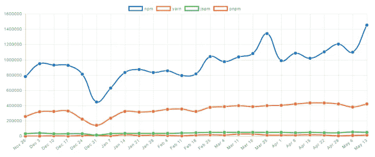

[Recent 6 months downloads comparison of npm, yarn, jspm and pnpm](http://www.npmtrends.com/npm-vs-yarn-vs-jspm-vs-pnpm)

# 建筑工人

在这一点上，如果你没有具体的理由，没有理由不使用 webpack。

正如你可以从下面的图表中看到的，webpack 的下载量是每天 300 万次，而其他的没有达到 100 万次。

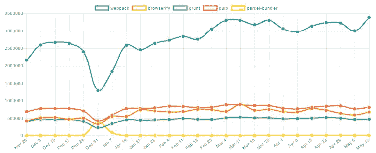

[Recent 6 months downloads comparison of webpack, browserify, grunt, gulp and parcel](http://www.npmtrends.com/webpack-vs-browserify-vs-grunt-vs-gulp-vs-parcel-bundler)

# 网络包

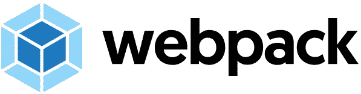

去年 2 月 20 日，发布了具有以下显著特征的主要 4.0 版本。

*   **性能:**在构建时间上取得了 60 ~ 98%的显著提升。
*   web pack-CLI:CLI 功能已被拆分为单独的软件包。需要与 webpack 一起单独安装。

```
1\. The new CLI tool, 'webpack-command' was announced by 30th Apr.
   - Checkout: [Differences With webpack-cli](https://github.com/webpack-contrib/webpack-command#differences-with-webpack-cli)2\. The webpack-dev-server, went to in 'maintenance' mode.
   - Use [webpack-serve](https://github.com/webpack-contrib/webpack-serve) instead
```

*   **‘模式’选项:**指向精确束类型的必需选项。`development`和`production(default)`是允许的值，这为每一个值提供了充分的优化捆绑。

```
1\. When '**production**' mode is set, all outputs are minified. If you're using minify plugin(like UglifyJS) as a separate task, you can disable this behavior by setting '**none**' for mode option. This will make to remain same behavior as before.2\. Checkout [webpack 4: mode and optimization](/webpack/webpack-4-mode-and-optimization-5423a6bc597a) for more details.
```

如果你正在使用 webpack，可能会面临处理大量 webpack 选项的困难。此外，如果有插件/加载器，这将增加复杂性和一些麻烦。

为了解决这个问题，出现了术语“零配置 JavaScript”(0CJS)。使用新的 wepack 的`mode`选项可以减轻这种复杂性。

到了 [v4.6](https://github.com/webpack/webpack/releases/tag/v4.6.0) ，引入了对预取/预加载资源的支持。这将允许在浏览器空闲时应用“资源提示”功能。

*   [<web pack](/webpack/link-rel-prefetch-preload-in-webpack-51a52358f84c)中的 link rel="prefetch/preload" >

```
// Generate a chunk for On-Demand-Loading, when parent chunk load finishes.
import(/* webpackPrefetch: true */ "SOME-MODULE-NAME");

// Load the module with parent in parallel
import(/* webpackPreload: true */ "SOME-MODULE-NAME");
```

## 一些警告

到 2018 年 6 月，最新版本是 [v4.12.1](https://github.com/webpack/webpack/releases/tag/v4.12.1) 。看起来 webpack 没有遵循预定的发布计划。但是团队正在展示他们在短期内为新版本所做的努力。

在大多数情况下，强烈建议使用最新版本。但是上一个 4.0 的主要版本，包括了一个[插件/加载器](https://github.com/webpack/webpack/wiki/Changelog-WIP#breaking-changes-for-pluginsloaders)的突破性变化，这带来了那些插件/加载器不与 webpack 的变化保持同步的不兼容问题。

这个问题似乎很自然。因为许多插件/加载器是由第三方开发者维护的。但是由于具有这种性质，一些战略计划可能被认为不会在主要版本发布后立即更新。

# 包裹


新的捆绑工具“包裹”于 2017 年 12 月首次亮相。自问世以来，受到了广泛关注，在发布的第一个月就获得了 13K 颗 GitHub 星星(到 2018 年 6 月，获得了 23K 颗星星)。

*   [宣布包裹](/@devongovett/announcing-parcel-a-blazing-fast-zero-configuration-web-application-bundler-feac43aac0f1)

> 这种反应有几个原因。其中一个原因可能是对 webpack 复杂配置的“反感”。如果您曾经体验过 webpack，那么与 webpack 相比，该包的配置会简单得多。
> 
> 结帐也:[如果你曾经配置过 Webpack，包裹会让你大吃一惊！](/@ibrahimbutt/if-youve-ever-configured-webpack-parcel-will-blow-your-mind-b615468cee78)

创作者 Davon Govett 说 Parcel 的开发有两个主要目标。

**1。性能**

通过工作进程的并行编译和缓存的使用(将编译结果保存在缓存中以供下一次构建使用)，可以将性能提高 10 倍。

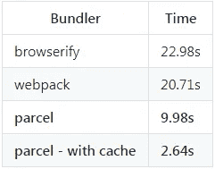

[Benchmark based on a app, containing 1726 modules with 4 physical CPUs](https://github.com/parcel-bundler/parcel#benchmarks)

**2。对配置体验进行改进**

*   所有资产(JS，HTML，CSS 和图像)自动分析，并包括在输出包文件中，不需要单独的插件。
*   支持自动转换。当它找到配置文件时，会自动使用 Babel、PostCSS 和 PostHTML。
*   支持开箱即用的“代码分割”。当它找到一个动态导入语法时，代码将被拆分并按需加载。
*   内置 HMR 支持(热模块更换)

## 最近的变化和前景

在 1.7 版中，添加了对 Vue.js 的 0CJS 支持。1.8 版(2018 年 5 月)，添加了对多入口点和 UMD(通用模块定义)的支持。在 1.9 版本中，增加了摇树，更快的手表和许多改进。

> 1.9.0 变更的检出:[📦包裹 v 1 . 9 . 0-树摇动，2 倍快守望者，和更多！🚀](/@devongovett/parcel-v1-9-0-tree-shaking-2x-faster-watcher-and-more-87f2e1a70f79)

对于未来的实现，看看 GitHub 的 [RFC 标签问题](https://github.com/parcel-bundler/parcel/labels/%3Aspeech_balloon%3A%20RFC)。

很难估计确切的时间表和要实现的功能。但是从它的第一次出现到现在已经有 23 个版本了，这些增强将以非常快的速度实现。

# 移动应用程序

使用 JavaScript 进行移动应用程序开发的工具，已经缩小到反应本地和 NativeScript。这个结果与它们基于库的流行度成比例—React(React Native)/Angular(Native script)。

> 将不在本文中考虑，但是 [Fuse](https://www.fusetools.com/) 是另一个在图形处理方面具有优势的工具，它基于 XML 风格代码进行简单的 UI 开发。2018 年 5 月，他们宣布开源他们所有的平台工具。但似乎很难给目前的现状带来一些影响。

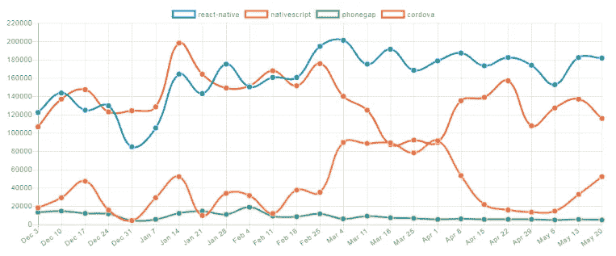

[Recent 6 months downloads comparison of Cordova, PhoneGap, ReactNative and NativeScript](http://www.npmtrends.com/react-native-vs-nativescript)

# 原生脚本

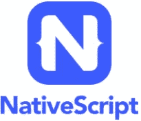

该工具于 2015 年发布，用于使用 JavaScript 开发跨平台移动应用。稳步更新和管理。最后一个主要版本， [v4.0.0](https://github.com/NativeScript/NativeScript/releases/tag/4.0.0) 于去年四月发布。

*   [NativeScript 4.0 出来了！](https://www.nativescript.org/blog/nativescript-4.0-is-out)

基本上，应用程序可以使用普通的 JavaScript 或 TypeScript 来开发，但是它会给[更多的效率和与 Angular](https://www.nativescript.org/nativescript-is-how-you-build-native-mobile-apps-with-angular) 的集成。

为了方便开发，NativeScript 提供了多种工具。

*   [**NativeScript UI**](https://www.nativescript.org/ui-for-nativescript)

这是一组不同的 UI 组件，如日历、图表、数据表单和自动完成。从 [NativeScript 开发者日 2017](http://developerday.nativescript.org/) 开始，这些组件[宣布免费](https://www.nativescript.org/blog/nativescript-ui-is-now-free-here-s-how-to-get-started)。它们中的每一个都可以通过 npm 单独安装。

*   [**原生脚本跟班**](https://www.nativescript.org/nativescript-sidekick)

带有一组工具的桌面应用程序。2017 年 7 月公布，方便简单繁琐的作品(例如脚手架、建筑等。).

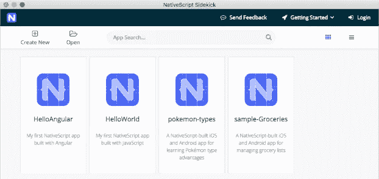

这个桌面应用程序是使用 Vue.js 和 Electron 开发的。分层定位在 [NativeScript CLI](https://github.com/NativeScript/nativescript-cli) 的顶部。这意味着所有 CLI 功能都可以在中使用。

## 生态系统的扩张


[NativeScript-Vue](https://nativescript-vue.org/)

从去年二月举办的 [Vue.js Amsterdam](https://www.vuejs.amsterdam/) 大会活动，宣布 [Vue.js 对 NativeScript](https://www.nativescript.org/blog/announcing-nativescript-vue-1.0) 的支持。与 NativeScript 开发团队提供的角度支持不同，Vue.js 支持是由社区努力推动的。对 Vue.js 的支持可以进一步扩展 NativeScript 的可用性。

除此之外，还有许多不同的社区驱动的插件。 [nativescript-ar](https://github.com/eddyverbruggen/nativescript-ar) 为 ar 支持，是特色插件之一。它使用苹果的 [ARKit](https://developer.apple.com/arkit/) (iOS 11)和谷歌的 [ARCore](https://developers.google.com/ar/) (Oreo) API 进行 AR 应用开发。

*   [增强现实在 NativeScript 中的预览](https://www.nativescript.org/blog/preview-of-augmented-reality-in-nativescript)

## 前景

NativeScript 的下一步会是什么？看一看路线图就能对它有一个大概的了解。

*   [路线图&发行说明](https://www.nativescript.org/roadmap-and-releases)

将加强对多平台的支持。目前社区驱动的 Vue.js 支持将被接管，正式支持。

并将打破仅仅作为移动应用工具的外壳，扩展其作为多平台开发工具的领域。

为了证明这一点，已经有 [AndroidTV PoC 插件](https://www.nativescript.org/blog/building-an-android-tv-app-with-nativescript)用于电视应用程序开发，并且可能还会添加对 [Android Auto](https://www.android.com/auto/) 和 [Apple CarPlay](https://www.apple.com/ios/carplay/) 的支持。

> 如果您对 NativeScript 感兴趣，请查看:
> 
> [**native script market place**](https://market.nativescript.org/)
> 你会发现各种各样的插件和模板
> 
> [**NativeScript 游乐场**](https://play.nativescript.org/)
> 通过在线编辑器体验 NativeScript 开发
> 
> [**NativeScript 书**](https://www.nativescript.org/get-the-nativescript-book)
> 免费 450 页 native script 开发书。

# 反应自然


自 2015 年 3 月[首次亮相](https://code.facebook.com/posts/1014532261909640/react-native-bringing-modern-web-techniques-to-mobile/)以来，它随着 React 受欢迎程度的增长而成比例增长。React Native 如今站在了原生移动 app 开发的领先地位。

每月定期发布新版本。此时(2018 年 6 月)最新的是 [v0.56](https://github.com/react-native-community/react-native-releases/blob/master/CHANGELOG.md#0560) 。

从这个版本开始，更新了许多相关的最低要求(巴别塔 7，节点 8，iOS9，Xcode 9)。还加强了流的类型检查。

关于与流行的 CLI [create-react-app](https://github.com/facebook/create-react-app) 工具的相似性，2017 年 3 月宣布[create-react-native-app](https://github.com/react-community/create-react-native-app)。

## 生态系统

许多第三方开发了各种插件。其中，代表来自下面的储存库。小组成员来自官方 React 团队和第三方团队。

*   [React 原生社区](https://github.com/react-community)
*   [React 社区](https://github.com/react-native-community)

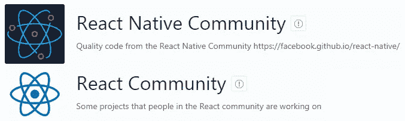

上面提到的 create-react-native-app 是与 [Expo](https://expo.io/) 和 react 团队合作的[项目之一。](http://facebook.github.io/react-native/blog/2017/03/13/introducing-create-react-native-app.html)

Expo 正在开发各种 React Native [开源工具链](https://expo.io/tools)。最有特色的是[XDE 世博会](https://github.com/expo/xde/releases)(世博开发环境)，提供了一个桌面开发和测试的环境。


Expo’s toolchain

> 有关 React Native development 的更多信息，请参见:
> 
> - [牛逼 React 原生](http://www.awesome-react-native.com/)
> - [原生目录](https://www.native.directory/)
> - [如何在 2018 年成为 React 原生开发者](https://hackernoon.com/how-to-become-a-react-native-developer-in-2018-d9bc85e1d91f)

## 前景

很可能会继续成功。由于缺乏详细的路线图和里程碑，很难预测会添加或更改什么。

但是，一个巨大的变化即将到来。在官方博客最近(6 月 14 日)的一篇文章中，宣布了 React Native 的重新架构计划。

> 我们正在对 React Native 进行大规模的重新架构，以使框架更加灵活，并在混合 JavaScript/原生应用中与原生基础设施更好地集成。—[React Native 2018 的状态](https://facebook.github.io/react-native/blog/2018/06/14/state-of-react-native-2018)

还没有达到主要版本发布。当工具足够成熟时，可能会像 React 一样改变它的[主要版本(从 v0.14.7 到 v15.0.0)。](https://reactjs.org/blog/2016/02/19/new-versioning-scheme.html)

# 一个代码库开发的尝试

现在的趋势是不要只在一个平台上使用一种语言(JavaScript)。社区生态系统试图为本地应用和网络应用使用相同的代码库。

[React Native for Web](https://github.com/necolas/react-native-web) 项目就是一个很好的例子，它尝试将 React Native 应用程序呈现在 Web 上。

对于 Angular，[Angular NativeScript Seed](https://github.com/TeamMaestro/angular-native-seed)项目提供了一种通过 Angular CLI 在一个代码库上开发 web 应用和 native script 应用的方法。

企业将会对此表示欢迎，因为他们可以通过这种方法节省大量成本。但这是一个相当新的方法，需要各种各样的成功经验才能被广泛采用。

# 桌面应用程序

这不是一个变化频繁的地区。每个项目都有自己的方向和目标，但似乎有一个明确的赢家。

> 也许最近从微软收购 GitHub 可以在这方面有所改变。
> 
> 电子开始是作为[原子](https://atom.io/)的桌面壳层。基于电子的 MS [VSCode](https://code.visualstudio.com/) 与 Atom 属于同一类别。对于此次收购，MS 现在很可能拥有两款类似的产品，这可能会给未来带来一些变化。

# 电子


近年来，电子产品呈现出稳步增长的趋势。2017 年 5 月，月下载量 37 万。到 2018 年 4 月，这一数字增加了约。47%，下载量达到 54 万次。

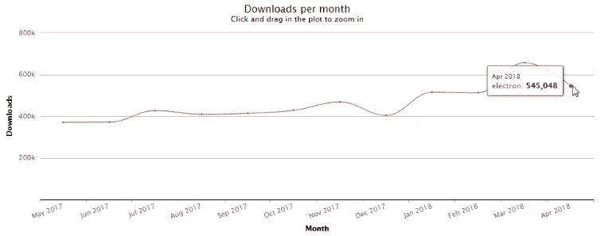

[Electron downloads: May 2017 to Apr 2018](https://npm-stat.com/charts.html?package=electron&from=2017-05-01&to=2018-04-30)

从 2018 年 5 月 2 日的 [v2.0 版本](https://electronjs.org/releases#2.0.0)开始，增加了对 Chrome 61、Node 8.9.3、V8 6.1.534.41 和 Linux [GTK+ 3](https://developer.gnome.org/gtk3/stable/) 的支持。

一堆新的 API([文件加载](https://github.com/electron/electron/pull/11565)、[区域设置](https://github.com/electron/electron/pull/11469)、[启用/禁用窗口](https://github.com/electron/electron/pull/11832)等。)和对 MacOS 的[应用内购买的支持](https://electronjs.org/blog/in-app-purchases)(Windows 商店也即将推出)。

5 月初，宣布支持[开源应用](https://electronjs.org/blog/autoupdating-electron-apps) [托管服务](https://github.com/electron/update.electronjs.org)的自动更新。使用提供的[update-electronic-app](https://github.com/electron/update-electron-app)模块，可以非常容易地实现*自动更新*功能。

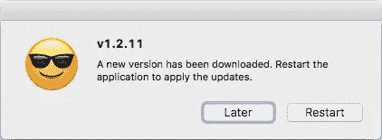

由于 [v1.6.9](https://electronjs.org/releases#1.6.9) 增加了[包含的类型脚本定义](https://electronjs.org/blog/typescript)文件，这使得通过代码辅助编写代码变得更加容易，减少了编写错误代码的可能性。

## 前景

将应用新的版本控制策略，提供比以前更频繁的更新。

> 这一变化意味着你将会更频繁地看到主要版本的变动，而且它通常是 Chromium 的一个主要更新。补丁版本也将更加稳定，因为它们现在只包含错误修复，没有新功能。— [电子 2.0 及以后——语义版本化](https://electronjs.org/blog/electron-2-semantic-boogaloo)

# 西北大学


自从 2011 年由 Roger Wang 创建以来，NW.js(以前称为 node-webkit)获得了巨大的关注。后来，确立了电子的诞生。

电子的核心成员，[赵程](https://github.com/zcbenz)参加了 node-webkit 项目的实习项目。由此带来了基于 node-webkit v0.3.6 的电子开发。

> 阅读更多幕后故事来自:[从 node-webkit 到 Electron 1.0](http://cheng.guru/blog/2016/05/13/from-node-webkit-to-electron-1-0.html)

没有提供下载统计数据，很难与电子版直接比较。但是间接的，可以用 [nw](https://www.npmjs.com/package/nw) 包(一个 NW.js 安装程序)的下载数量来做比较。

到 2018 年 4 月，差距很大- 54 万/电子，而 NW.js 为 19 万/电子。电子的下载量是 NW.js 的 25 倍(不准确，请查看下面的注释)

> **注**— [Safari 11.1](https://medium.com/u/c73505bf9fae#//apple_ref/doc/uid/TP40014305-CH14-SW2) (MacOS 10.13.4)版本，正式采用。
> 
> 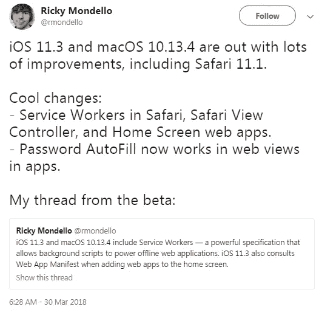
> 
> [A tweet from Ricky Mondello, member of Safari dev team](https://twitter.com/rmondello/status/979470498714103808)
> 
> 与其他供应商不同，WebKit 在缓存策略上采用了不同的方法。未使用的缓存将在几周后被删除。
> 
> > 服务工作者和缓存 API 存储的信息将随着用户浏览内容而增长。为了只保留对用户有用的存储信息， **WebKit 将在几周之后删除未使用的服务人员注册。几周后仍未打开的缓存也将被移除。** Web 应用必须对任何被移除的单个缓存、缓存条目或服务工作者具有弹性。— [为您服务的工人](https://webkit.org/blog/8090/workers-at-your-service/)
> > 
> > 更多技术问题，请查看:[iOS 上的渐进式网络应用在这里](/@firt/progressive-web-apps-on-ios-are-here-d00430dee3a7)
> 
> 在 Edge 的情况下，已经从[窗口内部版本](https://blogs.windows.com/blog/tag/windows-insider-program/)中添加了[服务人员支持](https://blogs.windows.com/msedgedev/2017/12/19/service-workers-going-beyond-page/)(2017 年 12 月)。后来，从 [EdgeHTML 17 版本](https://docs.microsoft.com/en-us/microsoft-edge/dev-guide#progressive-web-apps)开始，默认启用 ServiceWorkers 和推送通知。
> 
> 这些更新的意义是什么？意思是，PWA 的[基础支持在所有现代浏览器上都做好了，随时可以使用！](https://jakearchibald.github.io/isserviceworkerready/)
> 
> # PWA 生态系统
> 
> ## 工具箱
> 
> 
> 
> Google powered workbox 可以让网络应用增加离线功能。
> 
> [SO PWA](https://github.com/GoogleChromeLabs/so-pwa)(stack overflow PWA app)是一个使用 workbox 创建的示例 app。
> 
> 类似的旧工具， [sw-toolbox](https://github.com/GoogleChromeLabs/sw-toolbox) 和 [sw-precache](https://github.com/GoogleChromeLabs/sw-precache) ，[将被弃用，取而代之的是 workbox](https://github.com/GoogleChromeLabs/sw-toolbox#should-you-switch-to-workbox)。
> 
> ## HNPWA
> 
> 
> 
> HNPWA 是 PWA 应用程序的精选示例。这些应用程序实现了著名的黑客新闻网站，使用不同的框架。
> 
> HNPWA 与著名的 [TodoMVC](http://todomvc.com/) 有相似之处，为框架选择提供了参考范例。
> 
> ## PWA 入门套件
> 
> [PWA 初学者工具包](https://github.com/Polymer/pwa-starter-kit)包含一个示例项目，旨在帮助 PWA 应用程序的开发，从构建配置到页面样式结构，如负责任的设计布局。
> 
> > 查看 Google I/O’18 会议:
> > [PWA 初学者工具包:使用 Web 组件构建快速、可扩展的现代应用](https://www.youtube.com/watch?v=we3lLo-UFtk)
> 
> ## pwa-帮助者
> 
> [pwa-helpers](https://github.com/Polymer/pwa-helpers) 是 Polymer 团队开发的一套小型辅助工具。这些是路由器、网络、元数据和媒体查询相关的实用程序。
> 
> 它还包括测试助手和 Redux。
> 
> # 前景
> 
> 最近的谷歌 I/O’18(2018 年 5 月)，包括了 PWA 的各种会议。这可以对谷歌将如何推进 PWA 给出一个积极的预测。
> 
> > Google I/O’18 PWA 相关会议:
> > 
> > -[PWA:搭建通往移动、桌面和本机的桥梁](https://www.youtube.com/watch?v=NITk4kXMQD)
> > - [PWA 入门套件:使用 web 组件构建快速、可伸缩的现代应用](https://www.youtube.com/watch?v=we3lLo-UFtk)
> > - [超越单页应用:PWA 的替代架构](https://www.youtube.com/watch?v=X6yof_vIQnk)
> > - [使用 AMP、PWA 等构建现代 Web 的电子商务站点](https://www.youtube.com/watch?v=QCoQs9NO9q0)
> 
> 微软通过增加对 Edge 的支持，可能会在 PWA 上投入更多的资金。
> 
> 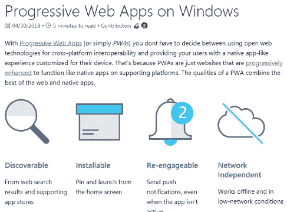
> 
> [Progressive Web Apps on Windows](https://docs.microsoft.com/en-us/microsoft-edge/progressive-web-apps)
> 
> 他们在自己的网站上发布相关的技术文档，比如关于如何在 MS Store 上部署 PWA 应用程序的文档(微软商店中的[Progressive Web Apps](https://docs.microsoft.com/en-us/microsoft-edge/progressive-web-apps/microsoft-store))。
> 
> PWA 作为原生移动应用的替代选项而受到关注，因为它具有像原生移动应用一样被安装和使用的能力。
> 
> > 查看移动应用开发的不同选项:
> > [在渐进式网络应用之间选择，2018 年 React Native&Native script](https://www.telerik.com/blogs/choose-between-progressive-web-apps-react-native-nativescript-2018)
> 
> 现在收养环境已经成熟。PWA 会在应用程序开发中占据重要位置吗？这将是一个非常有趣的地方。
> 
> # 增强现实和虚拟现实
> 
> AR/VR 是很有前途的未来技术，备受关注。但与关注不同的是，使用经历的比预期的要多。这个领域没有明确的领先工具，停留在几年的过渡期。
> 
> 但是使用率可能会增加，也可能不会。这将促使许多竞争争夺领先地位。
> 
> # WebVR API
> 
> WebVR API 于 2016 年 3 月发布，是在网络上实现虚拟现实的标准规范。2017 年 4 月发布的最新 [WebVR 1.1](https://immersive-web.github.io/webvr/spec/1.1/) 。
> 
> *   [介绍 WebVR 1.0 API 提案](https://hacks.mozilla.org/2016/03/introducing-the-webvr-1-0-api-proposal/)
> 
> 
> 
> 在 2017 年期间，WebVR 的支持被广泛采用，并出现了许多相关的工具和库。
> 
> **广泛的浏览器采用**
> 
> *   [火狐 55.0](https://www.mozilla.org/en-US/firefox/55.0/releasenotes/)(2017 年 8 月)
> *   [微软 Edge](https://blogs.windows.com/msedgedev/2017/04/11/introducing-edgehtml-15/)(2017 年 4 月)
> *   [三星 gear VR](https://www.engadget.com/2016/12/26/samsungs-gear-vr-browser-gets-improved-webvr-content-support/)(2016 年 12 月)
> 
> **各种工具和库**
> 
> *   Mozilla 的 [A 帧](https://aframe.io/)
> *   [React 360](https://facebook.github.io/react-360/):React 上的 360 观看和 VR 内容
> *   [PlayCanvas](https://playcanvas.com/) (一款网页游戏引擎) [Vizor](https://vizor.io/) (制作和分享 VR 内容)[Ottifox](https://ottifox.com/)(AR/VR 的工具) [Sketchfab 的 VR 编辑器](https://help.sketchfab.com/hc/en-us/articles/211640363-VR-Editor/)， [AR.js](https://github.com/jeromeetienne/ar.js) 等。
> 
> 除了这些兴趣的增长，由于 WebVR API 对应用开发支持的不足，已经出现了新 API 设计的必要性。
> 
> > 根据从网络开发者、硬件制造商和其他实施者那里收到的反馈，WebVR API 一直在经历重大的重构— [我们是 Chrome 团队，在这里回答关于构建更好的网络的问题。问我们任何事情(9 月 14 日)！](https://www.reddit.com/r/webdev/comments/6zpgu1/were_the_chrome_team_here_to_answer_questions/dn0iisg/)
> 
> # 新的 WebXR 设备 API
> 
> 
> 
> 2017 年 10 月，新的 WebXR 设备 API 已被提出，取代了现有的 WebVR API，以克服其局限性。
> 
> *   [将混合现实带入网络](https://blog.mozilla.org/blog/2017/10/20/bringing-mixed-reality-web/)
> 
> 除了共存的 VR(虚拟现实)之外，新提案还包括 AR(增强现实)支持。它倡导的“**沉浸式网络**”术语也是如此。
> 
> > **什么是‘沉浸式网络’？**
> > 
> > 沉浸式网络被定义为**新的和即将到来的技术**的集合，使网络为沉浸式计算的所有领域做好准备。
> > 
> > 沉浸式网络意味着通过浏览器托管的虚拟世界体验**。这涵盖了在浏览器或支持虚拟现实的耳机中呈现的整个虚拟现实(VR)体验。**
> 
> **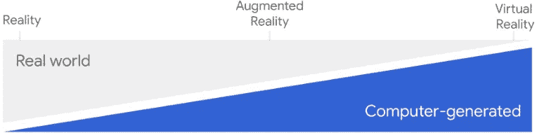**
> 
> **[Welcome to the immersive web](https://developers.google.com/web/updates/2018/05/welcome-to-immersive): Staged spectrum from Reality to Virtual Reality**
> 
> **“WebXR 设备 API”标准是由谷歌、微软和 Mozilla 的开发者组成的沉浸式网络社区组织领导的。这个标准也是对 WebVR 2.0 的[替代。](https://www.androidpolice.com/2018/02/04/webvr-now-webxr-device-api-supports-augmented-reality/)**
> 
> **目前只能在 Chrome 67 上运行(暂时只支持 VR。AR 将打开 68 ),并设置`chrome://flags/#webxr`标志。**
> 
> **支持的环境包括:**
> 
> *   **耳机( [Daydream VR](https://vr.google.com/daydream/) ， [Cardboard](https://vr.google.com/cardboard/) )**
> *   **桌面 VR 系统([HTC Vive](https://www.vive.com/)/[Oculus Rift](https://www.oculus.com/rift/))**
> *   **通过'[魔法窗口](https://developers.google.com/vr/develop/unity/guides/magic-window)'，对于那些没有 VR 支持的设备**
> 
> **“*魔法窗口*”是一种在拥有方位传感器的移动设备上查看“沉浸式网络”内容的技术，基于单视图应用渲染器。**
> 
> > **有关更多详细信息:**
> > 
> > **1)魔法之窗:
> > - [网络的未来是沉浸式的(Google I/O '18)](https://youtu.be/1t1gBVykneA?t=849)**
> > 
> > **2) WebXR 设备 API:
> > -[web 的未来是沉浸式的](https://www.youtube.com/watch?v=1t1gBVykneA)
> > - [设计 AR 应用的最佳实践](https://www.youtube.com/watch?v=bNJJCREZgVM)**
> 
> ## **前景**
> 
> **看到从 WebVR API 到 WebXR 设备 API 的演进路径，以及主要操作系统上相关 API 的支持(苹果的 ARKit API 和谷歌的 ARCore API)，可以明显预测新的相关 AR/VR 服务和应用的出现。**
> 
> **新的 WebXR 设备 API 为在网络上制作 AR/VR 体验提供了新的可能性。在此之前，通常的方式是由原生移动应用程序开发。**
> 
> **由于在标准化方面还不够成熟，许多人只是出于概念验证的目的才使用这项技术。但大多数人会同意这些是“下一个尖端技术”。**
> 
> **如果标准化过程如预期的那样顺利进行，我们可能会在不久的将来看到在 web 上的广泛采用。**
> 
> > **这里有一些有用的工具和例子，你可以看看。**
> > 
> > **-[WebXR Polyfill](https://github.com/immersive-web/webxr-polyfill):WebXR 设备 API Polyfill
> > -[three . ar . js](https://github.com/google-ar/three.ar.js):实现 AR 的 Three.js 助手库
> > -[WebXR Viewer](https://itunes.apple.com/us/app/webxr-viewer/id1295998056?mt=8):Mozilla 面向 iOS 的 WebXR Viewer
> > -[WebXR-samples](https://immersive-web.github.io/webxr-samples/):各种 WebXR API 示例
> > -[Mozilla VR](https://mixedreality.mozilla.org/):Mozilla 的 VR 网站**
> 
> # **关闭**
> 
> **自 1995 年 12 月 4 日 JavaScript 诞生以来，没有人能想象它今天是什么样子。**
> 
> **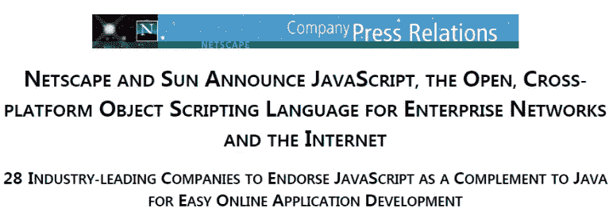**
> 
> **The press release of Netscape, announcing JavaScript (source: [weybackmachine](https://web.archive.org/web/20070916144913/http:/wp.netscape.com/newsref/pr/newsrelease67.html))**
> 
> **如果你是开发人员，可能知道马丁·福勒写的畅销书，名为“[重构——改进现有代码的设计](https://martinfowler.com/books/refactoring.html)”(1999)。当时，他使用 JAVA 编写示例代码。**
> 
> **去年三月，他宣布了写第二版的计划，可能会在 2018 年年底出版。这一次，将使用 JavaScript 代替 JAVA 作为示例代码。**
> 
> > **…但是选择它而不是 Java 的令人信服的原因是它并不完全以类为中心。存在顶级函数，并且使用一级函数是常见的。这使得在类的上下文之外展示重构变得更加容易。— [宣布《重构》第二版](https://martinfowler.com/articles/201803-refactoring-2nd-ed.html)**
> 
> **我们不知道 JavaScript 的末日会是什么，但我们正在见证它的伟大旅程。我很确定，没有人会反对这件事。**
> 
> **是的，“ ***JavaScript 还在吃世界****”*。**