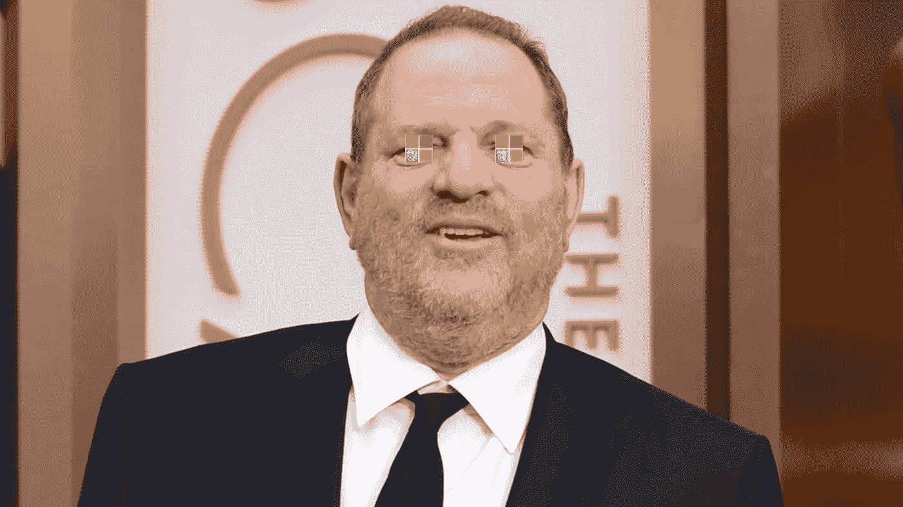
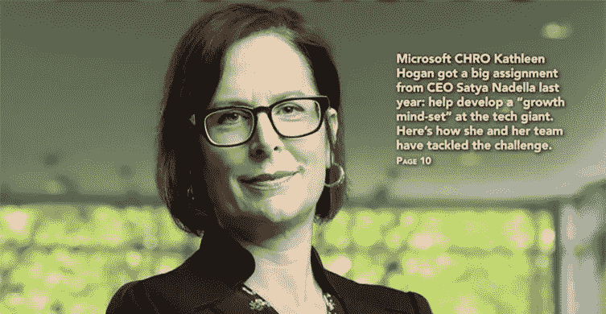
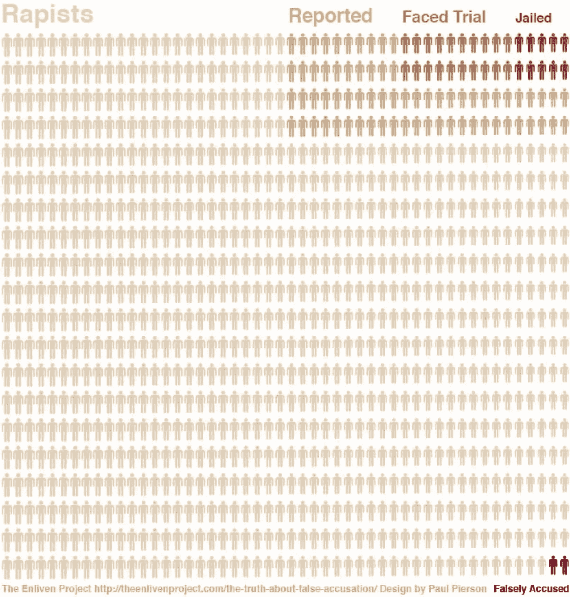
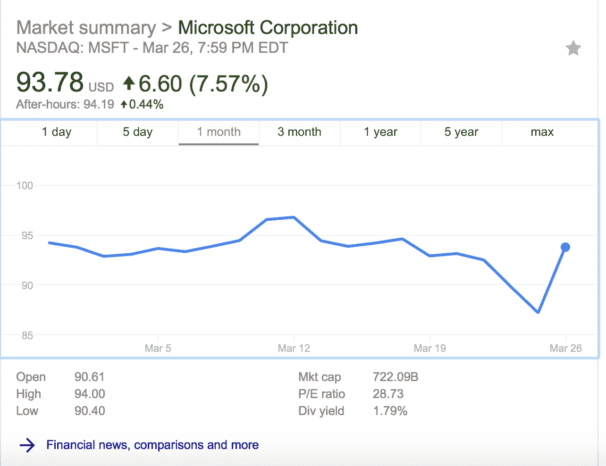

# 微软的前妻们

> 原文：<https://medium.com/hackernoon/the-stepford-wives-of-microsoft-1454888f94ef>

当被问及对女性提出加薪的建议时，塞特亚·纳德拉有一个著名的失言时刻，他在格蕾丝·赫柏的一次会议上告诉女性“*要相信系统会给你正确的加薪*。虽然他理所当然地为这些言论感到愤怒，并为这些言论道歉，就好像这只是一个错误一样，但据最近[路透社](https://www.reuters.com/article/us-microsoft-women/microsoft-women-filed-238-discrimination-and-harassment-complaints-idUSKCN1GP077)和[各种](https://www.theverge.com/2018/3/13/17113868/microsoft-gender-discrimination-lawsuit-pay-gap)其他媒体报道，微软正在被[起诉](https://microsoftgendercase.com)，因为他们的人力资源和员工关系调查团队(ERIT)有 99%以上的时间都会犯性别歧视的错误，特别是当管理或领导成员是煽动者时。然而，在做出数据驱动的职业决策时，就他的公司而言，他似乎是准确的。对于女性和其他任何想在微软维持职业生涯的人来说，相信因果报应，不要节外生枝似乎是很好的职业建议。

作为对这些指控的回应，并试图将其与他们仅在美国的 65，000 名员工相提并论，自称为女权主义倡导者的微软人力资源副总裁[向所有员工发送了一封电子邮件](https://news.microsoft.com/2018/03/15/evp-kathleen-hogan-email-to-employees-making-sure-every-voice-is-heard/)，向他们兜售令人尴尬的 10%的性别歧视指控和 50%的骚扰指控，这两项指控去年都有近 90 起左右的案例，被几乎完全由微软员工组成的团队认为是值得的。尽管 Kathleen 本人拥有哈佛大学的应用数学和经济学学位，但在这样做的时候，她似乎在暗示，微软女性员工提出的歧视和骚扰指控比[全国平均水平](https://www.nsvrc.org/publications/articles/false-reports-moving-beyond-issue-successfully-investigate-and-prosecute-non-s)高出 5-9 倍(保守估计)，全国平均水平为 8%。然而，像这样的发现是如此之多的统计大脚野人目击，他们通常需要大量的证据支持，以便在所有站得住脚，特别是当凯瑟琳和她的组织的道德和伦理受到质疑。

For comparison

但作为一名坚定的女权主义者，凯瑟琳没有提到这样一个事实，即如此低的有尊严的索赔率也可以作为一个不鼓励人们站出来提出虐待索赔的环境的相关因素，因为它可能是一个掠夺、腐败和压迫的环境的结果，正如任何经济学家都可以证实的那样，[RAINN](https://www.rainn.org/statistics/criminal-justice-system)也可以。虽然这不是 1:1 的比较，但同样的动态也存在于较轻的犯罪中，尤其是当教唆者很强大或处于主导地位时。压迫应该是这样运作的。

此外，Kathleen 忽略了报告在事件发生后，有多少索赔没有根据的人仍然留在公司，以及有多少人对他们提出索赔，这是一个可以验证他们对其他政策(如反报复政策)的承诺的指标，以便进行比较。她还顺便忘了提到，与个人贡献者相比，处于管理和领导地位的人是否更有可能被判败诉，这将支持或反驳他们的厄立特里亚学院团队的公正性和/或种姓制度的存在。尽管 Kathleen 精通经济学和数学，但应该指出的是，她也应该比大多数人更清楚，遗漏是歪曲统计数据真相的唯一最佳方式，而且这不是她第一次在这样的问题上被点名。

尽管不考虑这方面的统计问题，但考虑到这些女性中许多人都是拥有高级 STEM 学位和 6 位数收入的行业老手，就像[凯瑟琳·霍根](https://news.microsoft.com/exec/kathleen-hogan/)一样，这种古老的歇斯底里和妄想方法有点像水泥羽毛的鸟。他们中的大多数人只是在职业生涯中投入了太多，不会因为错误的指控而冒险，就像他们职业生涯中这个层次的任何人一样。考虑到 Kathleen 报告的糟糕的接受率以及她们提出这样的指控会失去什么，没有任何合理的理由让女性提出这样的指控，除非她们真诚地相信发生了冒犯。但是凯瑟琳甚至懒得承认这些索赔者的技能水平，也没有提供证据支持来证实她的疯狂统计索赔。凯瑟琳·霍根甚至还没有形成一种趋势，允许任何人在面对她处于中心的这种指控时理性地相信她的话；因此，她是这件事的中心。然而，不要对她太生气，因为她似乎从另一位坚定的女权主义者[丽莎·布鲁梅尔](https://en.wikipedia.org/wiki/Lisa_Brummel)那里继承了这个问题，因为这似乎不是什么新鲜事。

但说真的，你对一个人力资源部门或一个完全由律师组成的团队有什么期待呢？比如在雇主微软的授意下工作的 ERIT？根据合同，律师有义务在利益冲突的情况下工作，这并不是什么秘密，因为利益冲突有利于付钱给他们的人。传统上，律师的工作是抑制客户的真相和疑虑，同时防止他们在法庭上露面；就业协议很难改变这种动态。

如果他们真的公正行事，那么他们可能会建议员工聘请一位律师，你知道，这位律师不在对撤销你的索赔有既得利益的实体的工资单上；如果他们以这种方式行事，所有这些人都可能被“替换”，甚至可能被取消律师资格。公正是律师和法官的一个主要区别。因此，如果你考虑一下，ERIT 只是一种控制损失的手段，那么为什么一个律师团队有 90%的抑制率(成功？)关于性别歧视的索赔。你不会雇佣律师来意外地在损害控制方面做一个大师级的工作，就像某种克里斯·法雷律师电影，如果它存在的话，我会完全看的。

解释微软的企业道德或行为准则也不一定需要律师。然而，这可能需要一名律师来摆脱他们，这可能是为什么微软仍然在他们的 ERIT 团队中专门雇用律师来调查这些指控，同时将他们定位为公正的。然而，鉴于当今世界几乎完全由律师掌控，显然是为了少数人的利益而以多数人的利益为代价，指望律师在较小范围内不轻视公正性是幼稚的。和其他任何人一样，人们和公司都倾向于雇佣律师代表他们带着极端的偏见行事，你最好假设人力资源部门的员工也是如此。

除了人力资源的叙述，考虑到这对他们股价的影响，暂时下跌了近 10%，很明显，微软在压制与他们宣称的价值观和公司 kumbaya 背道而驰的主张方面有既得利益；很像哈维·韦恩斯坦。根据他们的人力资源部门自己的统计数据，似乎这是人力资源和厄立特里亚的工作方式，作为一种现状的损害控制手段，使其能够占上风，就像刑事律师使犯罪行为成为可能一样。

几乎不用说，但如果 Harveysoft 真的想找到这些说法的根源，他们可以很容易地雇用他们的许多工程师和数据科学家来解决它们，这就是为什么亚马逊与同行小组匿名进行这些审查。然而，如果他们真的想让他们消失，这将是非常合理的立场，在这中间的律师团队，以压制这些索赔，因为他们目前这样做；尤其是考虑到微软是由西雅图一位杰出律师的儿子创立的。但是，如果有任何人力资源或法律部门，无论是微软还是其他公司，像公司里的守财奴妻子或老年妇女联谊会那样运作，会有人感到震惊吗？据我所知，这几乎是你工作的所有地方的事实假设。

只是为了好玩，这里有一些微软员工可以向人力资源部门要求的指标，这些指标可以很容易地匿名和生成，以支持微软的道德主张，致力于公平对待女性，同时帮助推动整个行业的性别平等。

1.  比较具有相同学位和/或教育水平的男性和女性的晋升速度；对于那些受过高中教育的人和那些拥有与他们的角色无关的学位的人来说，这也很有趣。
2.  进行与上面相同的比较，但是将它与那些对希腊/兄弟会忠诚的男人和女人进行比较。
3.  比较针对领导和管理层以及个人贡献者的骚扰和歧视指控的概率
4.  比较为领导和管理层而非个人贡献者提出索赔的可能性
5.  作为他们对反报复政策承诺的关联，展示在事件发生后，有多少有根据和无根据的索赔人仍留在公司
6.  如果女性愿意自我报告体重，那么她们也可以看看体重和/或可感知的外表和薪酬/晋升速度之间是否有关联
7.  在过去和现在的年度评估中，ERIT 调查人员必须遵守的指标，以明确他们在公司中的真实角色