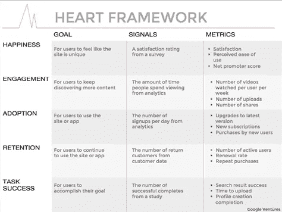

# 衡量标准讲述的故事

> 原文：<https://medium.com/hackernoon/the-stories-metrics-tell-af29111f772>

很容易设置几个顶线指标，过一会儿就忘记为什么把它们放在那里了。也很容易讲一个鼓舞人心的故事，但很快就失去动力。

许多公司已经认识到定义指标的重要性，而许多其他公司也认同拥有强有力的叙述的重要性。对于产品经理来说，讲故事也是一项越来越重要的技能——但是什么是好的衡量标准，什么是好的故事呢？

我们发现好的指标讲述一个故事，好的故事由指标引导。

# 1.将故事和指标结合起来

> 一个指标可以用一个公式来表示，这个公式确定了杠杆，讲述了我们将如何达到最终目标的故事。

A rough example storyline

你的故事可以追溯到用户获取，也可以追溯到商业领域的纯收益。有多种方法可以构建该公式，以最好地突出您在实现顶线目标的过程中的杠杆或基准。

如果最小化漏斗下降不是你叙述的主要部分，你可以很容易地浓缩故事情节，省略掉`Funnel Starts`中的`Funnel Completions`，简单地看一下`Active Users`中的`Funnel Completions`。

> 如果公式不适合你，那么[目标-信号-度量](https://library.gv.com/how-to-choose-the-right-ux-metrics-for-your-product-5f46359ab5be)过程可以帮助你清楚地展示你的度量如何来自面向用户的目标和行为。

在某些情况下，公式方法可能不是你的故事的最自然的表达。在 GOGOVAN 的设计冲刺中，我们使用 HEART 框架和目标-信号-度量流程来帮助每个人清楚我们是如何将用户价值转化为进度度量的。

Example of Goals-Signals-Metrics + HEART framework

虽然我们主要是将该过程与 HEART 结合使用，但是它可以应用于您选择的任何度量定义框架。关键的想法是，目标和信号有助于展现“数字”背后的人和故事。

> 伟大的故事描绘了旅程，而不仅仅是幸福的结局。

如果是你纠结的故事结构，考虑从你最喜欢的书中抽出一页。人们发现，在小说中行之有效的方法在推销和演讲中同样有效。当谈到产品故事时，一些与产品开发通常如何进展很好的结构是[线性、反向和史诗叙事](https://penandthepad.com/types-narrative-structures-8329065.html)。

另一方面，有时故事来得很容易。你精心制作了一个易于理解的轶事，描述了一个强有力的愿景，每个人都在离开动员会时感到鼓舞。然而，随着团队的发展，你会发现这个故事不再有意义，或者曾经的灵感现在已经消失了。

最好的产品叙述不仅仅传达现在和最终结果，它们描绘了到达那里的路径。总的来说，这是一个令人信服的计划，整个团队都围绕着它执行。这些路径是您的衡量标准，进度标记是针对它们的关键结果。当这些标记被设定下来，它们会激发下一个大的计划。没有明确的路线，马拉松很难继续下去，如果没有可以衡量进步的标准，那就更难忍受了。

# 2.传福音

一个没有角色的故事根本就不是故事，一个没有认同的产品叙事也没有角色。虽然产品经理在精心构思故事，但他们并不是这场表演的主角。你需要你的整个产品开发团队，商业利益相关者，以及所有其他参与其中的角色在故事中看到他们自己。

一个常见的陷阱，无论是宣传产品还是简单地做一个演示，就是忘记听众。故事的价值是相对于它的观众而言的——讲故事时，项目经理理解这一点是至关重要的。你的故事，不管第一次写得多好，都需要适应不同的听众。

有几种方法可以找出你的叙述需要更新的地方。一种方法是在你说话的时候观察你的听众，注意他们什么时候显得不太投入。或者，与代表不同利益相关者背景的个人进行测试。如果你有时间，深入了解他们的背景如何影响他们的思维方式。

然而，适应并不意味着重新发明。故事本身，你叙述的核心，需要前后一致。LinkedIn 的首席执行官杰夫·韦纳曾经在[的一次采访中分享了](https://www.businessinsider.com/linkedin-ceo-jeff-weiner-on-leadership-2014-9)关于领导力和让人们加入的话题:

> 在决定什么样的公司[或产品]时，你投资非常大，而且考虑得非常周到！]你想成为。然后你重复它，一遍又一遍，一遍又一遍……]如果你想让自己的观点被理解，尤其是对更广泛的听众，你需要如此频繁地重复自己，以至于听腻了自己说的话。只有这样，人们才会开始理解你所说的话。

# 那么，你怎么知道你已经精心制作了一个有效的叙事，并成功地传播了它呢？

*   向任何人询问仪表板上的任何指标，您都会得到相同的原因。
*   向任何人询问产品表现如何，你都可以得到一个清晰、有分寸的答案。
*   在你上次分享后很久还记得故事情节的人。
*   原声片段融入了人们讨论产品的方式。
*   整个团队的动力和士气都很高。
*   **你不再是唯一一个传播消息的人。**

*这项工作是 GOGOVAN 产品团队的集体成果。请给 product-team@gogotech.hk 发电子邮件，提出问题、意见和其他反馈。*

*最初发表于* [*GOGOVAN 科技*](https://medium.com/gogovan-technology) *。*