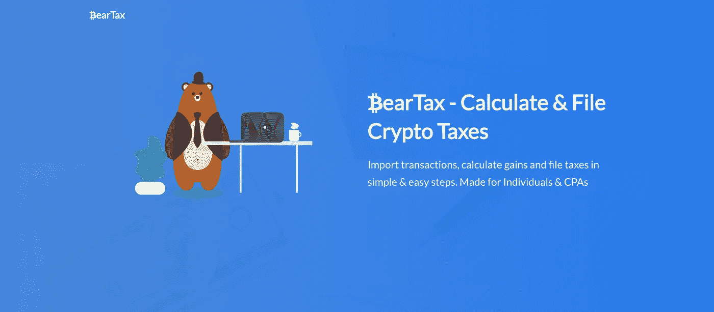
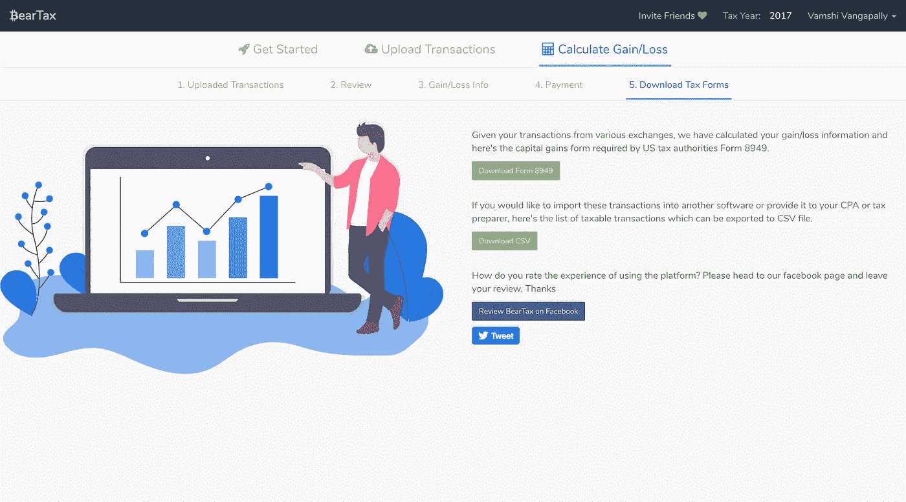

# BearTax 背后的故事

> 原文：<https://medium.com/hackernoon/the-story-behind-beartax-8b197e37a84>

## 加密货币是技术、经济和货币交易的新浪潮，它给我们思考、交易和制定战略的方式带来了巨大的转变。我从没想过交易这样的数字资产会为我们在 SaaS 的新创业公司 BearTax 铺平道路。这里有一个小故事，我们如何开始与最用户友好的加密税务助理 BearTax。

每次你阅读一个 T2 创业公司背后的故事，大卫·芬奇的《社交网络》都会对你产生巨大的影响。这表明马克是一个混蛋，如果你在这里期待同样的事情，我很抱歉我们这里没有这样的创始人。把这个放在一边，我会用你最喜欢的技术词汇来保证叙述的趣味性。

加密税收背后的概念仍然不确定，相当新。鉴于当时的情况，我们的联合创始人在可用的税务[工具](https://hackernoon.com/tagged/tools)方面面临的问题表明，会计专业人士、临时交易者以及专业交易者显然需要更好的税务工具和会计套件。

解决方案的慈善方式正是 BearTax 向每个人推广其令人惊叹的客户服务、令人兴奋的定价计划和出色的用户体验的原因。

与该领域的其他公司相比，BearTax 的增长似乎更加平稳。这是真的，在 **$0 营销策略**的背后没有任何夸张。
BearTax 没有在营销上花一分钱，我们相信在走大众营销的道路之前，首先要全心全意地关注我们认识的人。我们几乎每天都在改善用户体验，并解决我们在过程中遇到的大多数问题。

> 口碑宣传是一个巨大的胜利，我们喜欢用户喜欢我们的客户服务的方式。

# 问题陈述

在对现有应用程序进行初步查看后，我们的团队对它们进行了审查，并提出了一个主要的问题集。下面列出了一些值得解决的问题。

1.  大量交易失败
2.  无法处理机器人进行的交易
3.  极高的定价计划和
4.  提款/存款不匹配

在尝试了市场上的一切之后，我们决定在 2018 年 1 月底左右建立自己的解决方案，并推出了 [BearTax](https://bear.tax) 。

# 解决办法

[BearTax](https://bear.tax) 提供与各种交易所的无缝集成、跨交易所交易的智能匹配、每枚硬币的精选历史数据、在避免强制出售/负余额的同时审查交易的能力，并为您提供所需的税务文件。

> “制造人们想要的东西”——保罗·格拉厄姆

这就是我们所相信并为我们工作的。我们已经向个人推出了 0.99 美元起的适中价格，每个人都可以进行实时聊天，在价格上没有歧视。我们的主要目的是让用户了解加密货币税、交易所集成的使用，让他们觉得使用 API 密钥连接交易所是安全的，并且只有读取权限。

与此同时，我们的业务开发团队专注于与注册会计师建立合作伙伴关系，以接触到更广泛的受众，并将 BearTax 构建为一个加密税务套件。

# 一切为了客户

在写这篇文章的时候，我们的平台上有超过 800 个满意的客户，并且还在成倍增长。有一些独特的情况，我们将永远不会面对，除非这些特殊的前来尝试我们的应用程序。这些特殊案例揭示了 Exchanges API 响应、空案例的问题，有些甚至帮助我们解决了一个 bug。

> **感谢所有人**

# BearTax 的下一步是什么？

作为一个团队，我们一直认为解决报税问题是首要解决的问题。我们已经完成了，我们正在寻找更多

*   更多交换集成，商户 POS 支持

Already integrated Exchanges

*   推广到接下来的 20 个国家
*   帮助高交易量的交易者记录他们的税收

对于一个庞大的社区来说，交易所的整合似乎是扩大 BearTax 的合理步骤。

这就是我们的故事，我们非常乐意为所有遇到我们从未想到的问题的客户提供服务。没有他们，我们就不会有现在的样子。我们是一家自力更生的初创公司，今年的收入足以支付运营费用。感谢您阅读并试用该平台

 [## BearTax —您的加密税务助手

### 密码交易员、会计专业人员、注册会计师连接交易所、进口交易的简单可信的平台…

熊税](https://bear.tax) 

关注 [***BearTax 刊物***](http://medium.com/beartax) 了解更多各国对加密货币征税的信息，我们平台的更新，有趣的工程花絮等等。,

网址: [www.bear.tax](http://www.bear.tax) |推特: [@bear_tax](http://twitter.com/bear_tax) |脸书: [@beartaxapp](http://facebook.com/beartaxapp)