# 一个公开的、合作的数学马拉松的故事

> 原文：<https://medium.com/hackernoon/the-story-of-a-public-cooperative-mathathon-29ea5f4ff538>

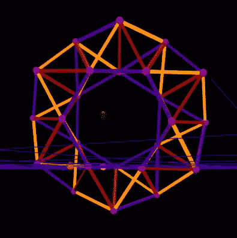

A hexagonal-centered toroidal 1.053-bounded regular tetrahedral simplex chain, discovered at the Mathathon by Nathan Gilbert.

两个周末前，一件罕见的事情发生了。来自印度、中东、英国、加拿大和美国的 13 个人对数学有着共同的兴趣，他们一起解决真正的数学问题。正如所料，他们中的大多数人在第一个 Mathathon 周末结束前就退出了。尽管如此，四个积极的参与者，在两三个不太积极的观察者的帮助下，解决了一些非常现实的问题。

也许从来没有一个完全虚拟的数学黑客马拉松致力于解决事先精心准备的问题，这些问题不是练习题，而是“真实”的问题，其解决方案只是作者的梦想。事实上，这是一个很高的门槛，许多参与者可能会因为问题的狭隘性或难度而却步。然而，[公共发明](https://pubinv.github.io/PubInv/)的原则之一，非盈利性的主机，是保持真实——绝不做“假”问题。

由于我们的座右铭是“在公众中发明，为公众服务”，我们所有的代码和数学都在开放许可下免费共享在一个免费可用的 [GitHub repo](https://github.com/PubInv/Mathathon-2018-Simplex-Chains) 中。我感谢所有在周末支持这一想法的人，无论多么短暂。我们使用 Slack 和 Zoom 作为我们的基本合作工具。当我们再次这样做时，我们将更好地计划处理时区差异。

焦点是边对边或面对面粘在一起的三角形和四面体链——单链。虽然很窄，但这个研究领域受到了结构工程和机器人学的很好的激励。工程师对这种物体天生就感兴趣，原因有二。首先，就其重量而言，它们天生坚硬结实。其次，用有限数量的零件制造东西很容易，如果框架中的每个构件长度相同，制造就相对容易。20 年前，受太空探索应用的启发，伦斯勒理工学院的桑德森教授和他的学生提出完全用四面体制造机器人。我试图在周五晚上介绍所有这些，但是任何学数学的学生都知道，理解任何真正的问题都需要一点点努力。

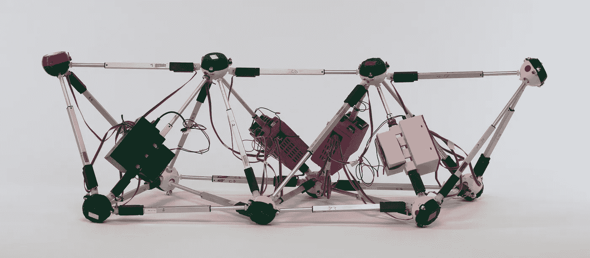

The author’s research Tetrobot

我和我的共同主持人大卫·杰施克准备了一个二维互动[网页](https://pubinv.github.io/Mathathon-2018-Simplex-Chains/platforms/index.html)，一个“游乐场”，让任何对 JavaScript 略知一二的人都可以调查某些问题，第一个问题是在周六早上由内森、桑奇和我合作完成的。

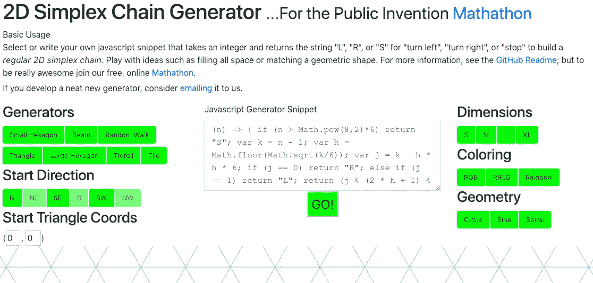

Control panel of the 2D Playground

操场允许通过图形化绘制来测试代码片段。在桑吉的鼓动和内森的主要贡献下，我们找到了一种简单的方法来平铺飞机。桑吉后来独自解决了其他问题，即螺旋的产生。

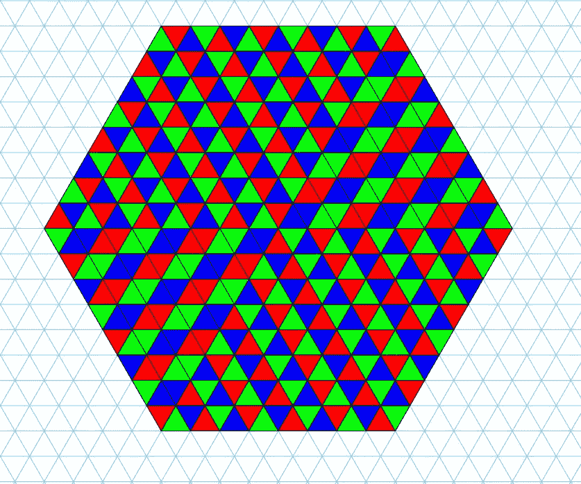

Sanchi’s tiling snippet tiles the whole plane via successively larger hexagons

与此同时，大卫致力于一个我后来扩展到 3D 的解决方案:他建立了一个算法，用一串等边三角形来跟随 2D 的任何参数曲线。因此，他一举建造了一个桶形拱顶和一个哥特式拱门，理论上只能用完全相同长度的杆来建造。与此同时，这为我称为“Bresenham 问题”的问题提供了一个可行的解决方案，即从直线上的任何一点到另一点有效地构建桁架。显然，这允许设计几乎任意的规则桁架。

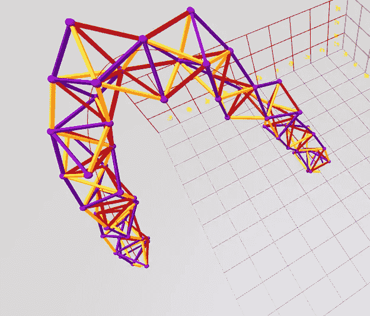

A parametrically-generated sinusoidal arch constructed only of perfect regular tetrahedra

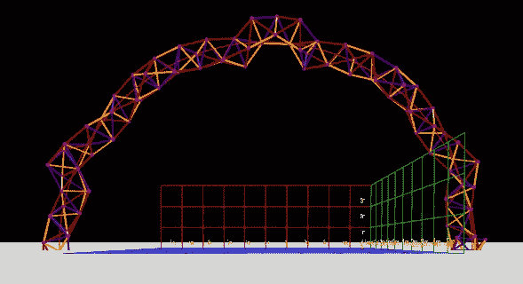

A Circular arch as seen from the ground, generated parametrically

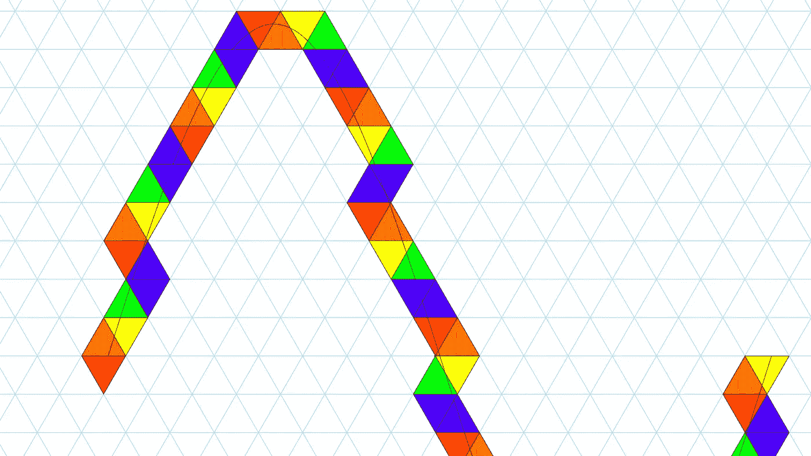

David’s original 2D parametric Sine Wave (A form of a truss.)

内森和我同时在一个类似的 [3D 游乐场](https://pubinv.github.io/Mathathon-2018-Simplex-Chains/3Dplayground/index.html)工作。我们获得了类似的能力，从简单的代码片段中构建四面体链。周六晚上。我很惊讶地看到这个工作。令我更感兴趣的是，每个周期性的“发电机”都会产生一个螺旋，这一点我至今仍感到吃惊。(环和线都是螺旋线的退化形式。)我永远也不会预测到这一点，尽管后来我创造了一个证明，并在数学马拉松之后花了 10 天时间研究这一现象的数学。首先，我根据短链周期性堆叠的特性，寻找螺旋的解析公式；我现在有了一个数值的，但不是封闭形式的解析解(感谢 Mathematica)！当然，数学令人兴奋的一点是，我可能是错的——可能我错了，也可能欧拉在 250 年前就解决了这个问题。或者，仅仅是可能，数学马拉松发现了一个真正新的可发表的观察结果。

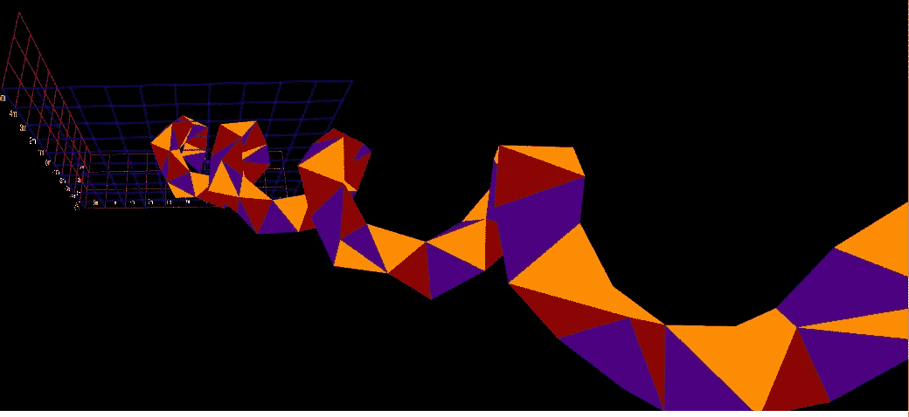

Any periodic face-to-face stacking generates a helix, here is a gentle one.

操场允许并允许引人注目的简短片段的视觉呈现。事实上，我们用简单的代码创造了一个复杂形状的动物园。我入侵了操场，一次渲染 100 条链，以测试生成器的不同参数化。那是一段有趣的时光。

但是有许多问题需要解决，这些问题的严重性和难度各不相同。我通过采用大卫的基本 2D 作品并将其扩展到 3D，推进了 3D 游乐场，在数学马拉松正式结束后的一天，这使我能够建立一个紧密的“圆锥体”，这是我没有想到的对象。(3D 游乐场目前并不完全用户友好；如果你想使用它，请联系我寻求帮助。)

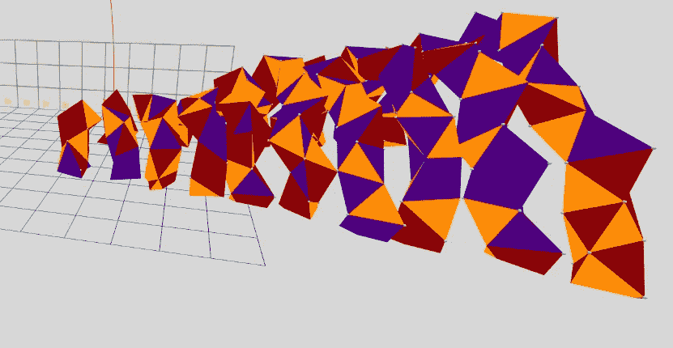

A “Tight” parametric cone build from perfectly regular tetrahedra

与此同时，内森、桑奇和戈兹从数学马拉松之前的问题集中寻找对象，内森发现了构建几个重要问题的模式。这些包括一个“几乎平的”锯齿，一个惊人的紧密(虽然有点自相交)的方形“花瓶”容器，最重要的是，一个环面。

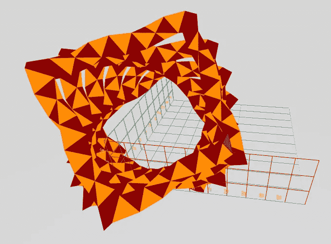

A tight, squarish vase-like container

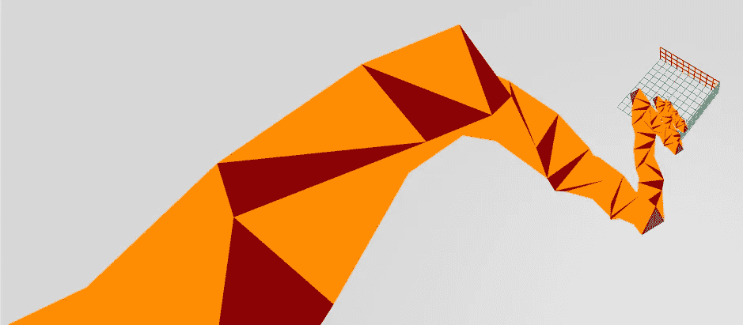

A nearly (but not quite) “flat sawtooth” structure made of perfectly regular tetrahedra

下面是用于创建螺旋的 JavaScript Sanchi 的片段:

(n) => { if (n > 94)返回“S”；
var k = n+1；
var h = math . floor(math . sqrt(k/3))；
var j = k—h * h * 3；
if (j == 0)返回“R”；
else if (j == 1)返回“L”；
return (j % (2 * h + 1) % 2 == 0)？“L”:“R”；}

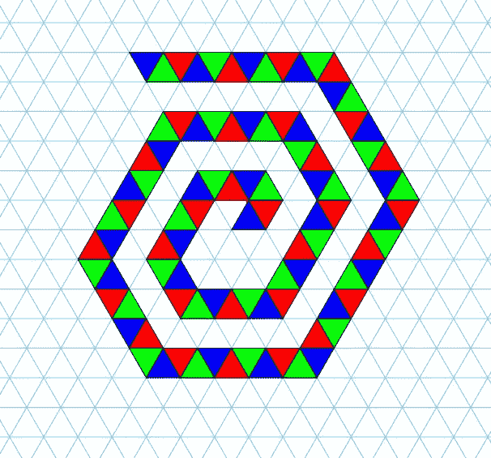

Spiral generated by the snippet of JavaScript above.

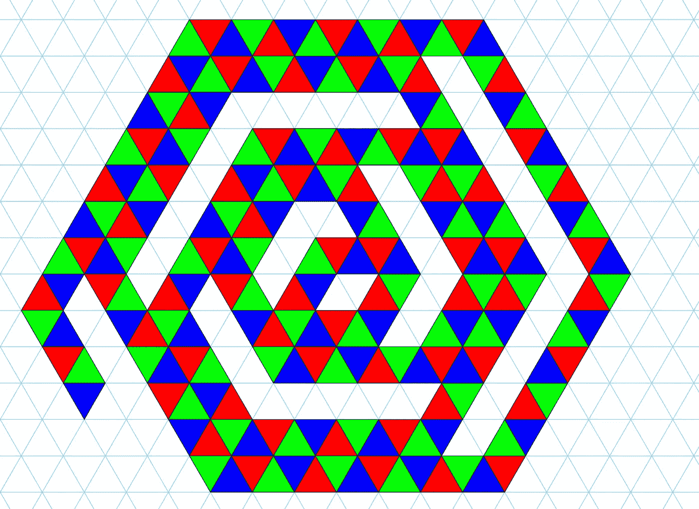

An interesting variation on the Spiral with regularly occuring “gaps”.

我特别问了几个关于环面的问题，例如什么是最小的可能仅仅是偶然的，我发现了一个“几乎”完美的规则环面，因为它几乎在一个环中完美地相遇。内森，凭着我永远无法理解的直觉，观察到允许每隔一个四面体中的一个长度交替，允许环面是完美的圆形，并完美地满足自己，形成一个六角形的中心孔。为了方便起见，使用规则边长度的长度 1，环面的第 6 条边(形成两个新四面体的 6 条边中的)的长度是 0.95，或 19/20。我错误地得出结论，我们已经找到了一个简单的环面长度，这将是非常令人惊讶的。虽然惊人地接近 19/20，但这可能是不合理的，内森后来证明了这一点。原来，内森实际上已经找到了一种方法，可以制造任何直径的圆环，有三角形、正方形、五边形等等的孔。从某种意义上说，这些是“新”的形状，以前可能从未被构建或识别过。

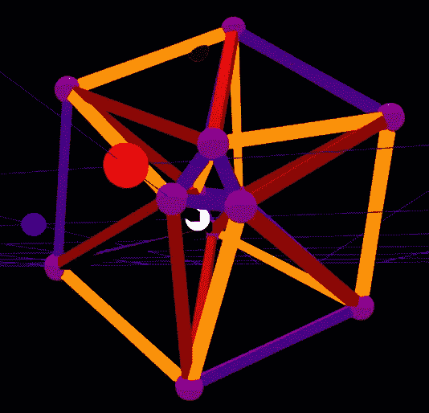

A Triangular-centered (thought highly irregular) tetrahedral simplex chain.

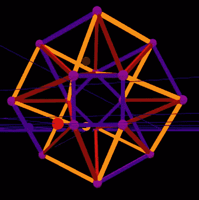

A square-centered tetrahedral torus

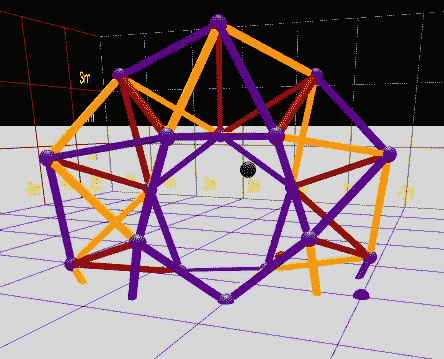

A pentagonal tetrahedral torus (1.2-bounded)

结合参数化生成链的能力，我们，数学马拉松的参与者，事实上已经回答了许多最初提出的问题。一如既往地在数学中，提出有趣的问题与回答它们同等重要，我在我们所学的基础上，在我们不断发展的技术论文[中增加了许多新问题。我个人继续在光线下研究由一堆相似物体构成的螺旋的数学。](https://github.com/PubInv/Mathathon-2018-Simplex-Chains/blob/master/SimplexChains.pdf)

最终，数学马拉松取得了巨大的成功，但参加人数却令人大失所望。我们试图给尽可能多的学生提供积极的合作学习和解决实际数学问题的经验。事实上，我想，我们有两个。

在初夏，我开始考虑继续举办这个活动，围绕学到的知识和发现的新问题重新组织问题。感谢所有帮助推广这项活动的人，特别是大卫·杰施克、推特用户@MathGarden (Sunil Singh)和@ James Grime(James Grime 博士)以及斯蒂芬妮·刘。