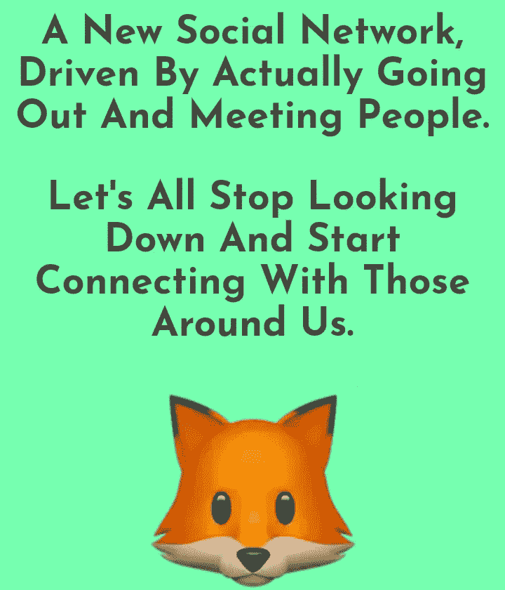

# 狐狸的故事

> 原文：<https://medium.com/hackernoon/the-story-of-foxie-ef0aeb303bc5>

普通成年人每周花 7 个小时在社交网络上。像焦虑和孤独这样的问题很常见，因为数百万人都粘在他们的屏幕前。社交网络帮助你与朋友联系，并发现有共同兴趣的人。然而，将你的网上联系(超越你的朋友)转移到现实世界的问题仍然没有解决。

当我从奥兰多搬到迈阿密时，我在寻找可以一起踢足球的人。我需要一个工具来帮助我找到附近踢足球的人，并且知道他们何时何地踢足球。

我尝试了外面的世界。Meetup，EventBrite，FB 组。似乎没有人能解决这个问题。快速发布一个活动，看看谁可以加入。或者看看我周围发生了什么。

所以我想，让我们做一个应用程序来解决所有这些问题，甚至更多。

> “随着想法的发展，我意识到这真的可以用于任何事情。不仅仅是为了足球，也是为了在现实生活中结识有共同兴趣和活动的人。”

我想建立一个平台，帮助我发现与我有共同兴趣的人，并在现实生活中通过活动或自发外出与他们联系。刚到一个城市和大学也可以变得更简单。雇佣一个团队太过昂贵，而且寻找一个有技术专长的联合创始人也没有结果。因此，我承担起学习 Swift(苹果为 iOS 设备设计的编程语言)的责任。用我在 3 个月内获得的编码知识武装自己，我开始建立一种新的社交网络。 [Foxie](https://hackernoon.com/tagged/startup) 是我的全职项目；大多数时候，我白天写代码，晚上处理业务，制定发展计划。我通过 Slack 上的在线社区，主要是在一次技术会议上，找到了对他想法的认可，在那里人们对 Foxie 表现出了极大的兴趣。即使现在我们处于公测阶段，人们还是很喜欢它。

> “很快我会开始在大学校园里推广它。为什么是大学校园？Foxie 需要像学校这样的社区来有机发展，并让人们信任它，看到它的价值。”

iOS [Testflight](https://testflight.apple.com/join/E5l94av3) 上有测试版，点击链接下载即可。

> “我对 Foxie 有一个长期的愿景，那就是当谈到我们如何使用技术与朋友和家人之外的人联系时，这将在时代精神中带来急需的变化。特别是其他公司是如何考虑让虚拟现实中的社交网络进一步孤立我们的。”

看看[狐狸](http://foxie.cool)