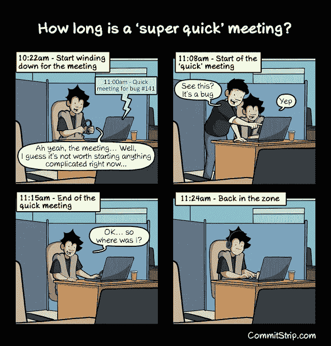
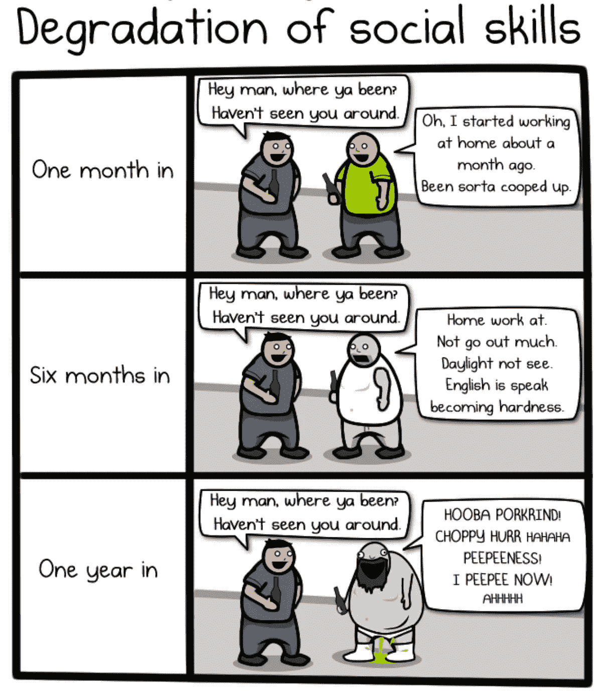
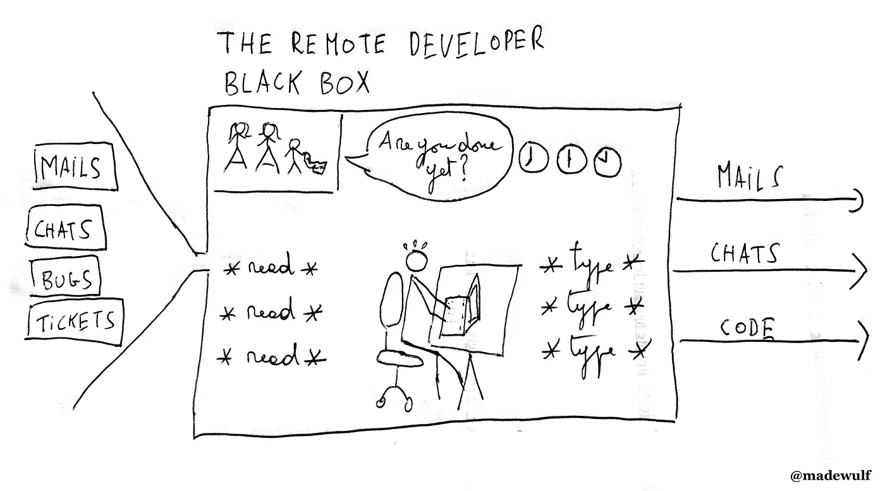

# 远程工作的压力

> 原文：<https://medium.com/hackernoon/the-stress-of-remote-working-38be5bdcf4da>

在软件工程中，远程工作很有意义，因为大多数时候，你只需要一台电脑和一个互联网连接来完成你的工作。因此，迫使人们每天坐在预先设定好的办公室里的理由更少了。因此，它已经成为许多 it 工作的一个重要特征，甚至在比利时，尽管它肯定不是最有前瞻性的就业市场。也就是说，大多数情况下，远程工作服务仅适用于一周的一部分时间(在这里，一周 1 天或 2 天似乎是最常见的服务)。尽管如此，它确实在大多数公司得到了应用。

远程工作有很多优点，我也看到了很多对这种做法的激烈辩护。我同意它的大部分。也就是说，我已经远程工作了 5 年多一点，现在我必须承认这并不是没有压力的。这可能会让一些人感到惊讶，但最终，我认为远程工作在过去两年中对我产生了一些影响，特别是当我从 2016 年 6 月到 2017 年 6 月几乎完全远程工作了一年的时候。

那么，是什么让远程工作充满压力呢？

## **去人性化**

如果你在远程工作，沟通往往会坚持结构化的渠道:聊天、每日站立、也许每隔一周的几次全球会议(回顾、公司状况)、吉拉的任务和错误报告以及许许多多的电子邮件。这对于完成结构化的任务很有效，但有时你肯定会感觉与公司脱节。事实上，这种交流大多以书面形式进行，或者在群体面前进行，这使得他们不适合闲聊或更多的非正式信息。这可能会妨碍你的工作，因为仅仅聊一聊工作中的气氛就能传递出关于项目顺利进展的非常重要的信息，但最重要的是，这可能会让你感觉不到自己是社区的一部分。

此外，书面交流更容易被误解，即使是和你非常熟悉的人。更不用说，如果你已经花了一天时间在键盘上打字来完成你的技术编程任务，那么用书面形式进行交流也可能变得令人讨厌:你可能最终感觉自己像一台文本处理机器。

因此，在远程工作一段时间后，我多次错过了咖啡聊天，以前觉得这是徒劳的时间浪费。我感到与团队脱节，尤其是当我工作的团队由多人组成，在同一个办公室/地方工作，并且看起来很开心的时候。

## **中断和多任务**

当作为开发人员远程工作时，聊天(通常是 Slack 或 Hipchat)很快成为你在公司的生命线:这是大多数人试图联系你的方式。对我来说，在聊天中反应迅速和在办公室准时工作是一样的:它给人一种可靠的印象。这还意味着，如果你真的不想给人留下你休息时间太长的印象，你可能会发现自己在吃午饭时会频繁查看通知，而如果人们看到你整个上午都在工作，或者如果你当时只是在和同事聊天，你就不会觉得有必要如此积极地回应。事实上，我经常意识到，其他远程工作的同事受到批评，因为他们在聊天时回答得不是很快。

问题的一部分在于，在聊天时，人们看不到你的身体，所以他们无法真正判断你是否适合被打断。所以，你经常被打断，如果你有点像我，你会觉得被迫快速回答。所以，你经常打断你的工作。如果你不知道的话:程序员讨厌打断，因为这会分散他们的注意力，对他们的生产力非常不利。

这种远程聊天设置的另一个问题是，人们不知道你是否已经在和别人聊天了。我数不清有多少次我同时应付三个不同的对话，对我来说，这可能会变得很有压力，尤其是当我在一天结束前有任务要完成的时候。

此外，我必须提到，也经常有“休闲”聊天，创建这些聊天是为了主持非工作内容(通常是许多模因)，这些内容可能变得非常非常闲聊。至少，我觉得大部分时间将这些聊天静音是很明智的，但当你回来时，抓住所有说过的话可能是一项艰巨的任务，而这可能是你拥有一些“办公室精神”的唯一机会，而这正是你作为一名远程工作者所缺少的。

**过度劳累**

当你接受一份工作时，你有两种义务:

*结果的义务*，你承诺在给定的日期给出某个结果。通常，对于开发人员来说，完成一个 sprint 需要开发一组给定的 bugs 特性。

*手段的义务*你主要承诺每天花一些时间在你的工作上，你只是给出你在这段时间内设法产生的结果。

我并不天真，我知道最终，在软件工程中，大多数工作都是关于结果的(如果你什么都不做，你最终会被解雇)，而不是手段，但是在远程工作中，由于人们没有看到你工作，你可能会觉得更有必要每天展示结果，即使这迫使你每天工作超过 8 小时。举个例子，我数不清有多少次配置问题或客户来电占用了我一天中的几个小时，但我仍然感觉被迫完成当天承诺要做的任务，这样就没有人会认为我在偷懒而不是在工作。我觉得如果人们看到我整天坐在电脑前，我会对决定第二天完成任务感到更放松。

对我来说，这导致了两件事:因为我的输出的可靠性而受到真正的赞赏，以及…严重的过度工作。根据 Basecamp 的 Jason Fried 的说法，这是管理远程员工的真正挑战:[那些工作太努力的人](https://www.inc.com/jason-fried/excerpt-true-challenge-of-remote-workers.html)。

最后，对我来说，这一切都是信任的问题:你的雇主非常信任你，允许你按照自己的方式工作，作为交换，我总是觉得自己不得不比在办公室里工作更多。

# 做一个全职爸爸

当你大部分时间呆在家里时，你的家人会觉得你比他们应该的更有空。即使你有禁止你的孩子进入的工作场所，你还是很想去问你“只是一点小事”。特别是对孩子来说，很难比较他们的家。事实上，这对我来说也很难…

这可能会使视频通话有点紧张，例如，当你与客户交谈时，你的孩子最终只是出现在你身后的视频中。这是最广为人知的例子:

我也知道有些人难以抗拒做家务的需要，比如打扫厨房。这对我来说从来都不是什么大问题，但另一方面，这不时会让我和妻子关系紧张，因为她很难理解我怎么会把一个脏盘子放在餐桌上一整天，而我实际上是在家。回答:我在工作，避免被打扰…

## 孤独。

在家工作意味着很多孤独。我确实很喜欢独处，但即使对我来说，在两周只能通过我的屏幕看到同事，然后在晚上看到家人后，我最终也会感到很难过。我怀念融入一个双人社区的感觉。

社交网络可能会帮助你战胜一点孤独感，但另一方面，只在社交网络上暂停和在电脑上工作在身体上并没有太大的不同。此外，众所周知，花更多的时间在社交网络上会让你比相反的人更不快乐。

最后，我真的开始讨厌大部分时间独自一人，并觉得这对我的精神健康和心情都很不好。这是一个[有据可查的](https://www.sciencealert.com/widespread-loneliness-is-killing-people-and-we-need-to-start-taking-this-seriously)现象。

最值得推荐的解决方法之一是在*的共同工作空间*工作。对我来说，他们是一个大杂烩:他们花了一些钱(你的雇主可能同意支付，也可能不支付)，并经常要求承诺(你通常需要注册至少一个月)。他们可以创造社会联系(对我来说，他们创造了很多工作机会，尤其是 B [etacowork](http://www.betacowork.com/) )，但冒着感觉有点太像度假营的风险，每天都有活动(烹饪、按摩、聚会等等)，强迫人们社交。

请注意，我去过没有社交的共同工作空间，很快就放弃了，因为去某个地方躲避孤独，然后一整天不和任何人说话，似乎毫无意义。因此，我对强制社会化这个话题模棱两可。

共同工作空间的另一个问题是，你可能会再次在生活中引入长时间的通勤时间，然后整天戴着耳机工作以避免分心，几乎不休息，因为你失去了通勤时间，并且因为没有和任何人说话而感到尴尬。更不用说视频通话在这些环境下更难进行，因为你通常缺乏一个独处的地方，总会有一点噪音，人们可能会被你的电话打扰。此外，有时候，有些事情你不想在陌生人面前说…

压力决定你每天在哪里工作。

这可能只是我，但不知道我每天将在哪里工作，并且必须考虑我需要随身携带哪些硬件(例如:键盘、DVI 适配器、充电器)已经导致了许多问题，因为它消除了一直在同一办公室工作的可预测性。

另外，请注意，我认为在咖啡店工作是一个坏主意，至少对全天来说是这样。通常有太多的噪音，我不喜欢每小时都有义务吃点东西/喝点东西(你的里程可能会有所不同)，椅子对你的背部有害…

**你从不离开“工作”**。

当您远程工作时，您不会在晚上离开工作地点。最重要的是，如果你与不同时区的人一起工作，你可能会在一天结束后与人交流很多(当我与纽约或旧金山的人一起工作时，我这样做了几个月)。这通常很有意义，因为否则，你可能很少有时间与你的团队交流，这真的会阻碍项目的进展，但这意味着一天中没有时间摆脱工作上的担忧，从长远来看，这对你的心理健康也是有害的。

此外，在家工作不会让你下班回家后有时间冷静下来。对我来说，理想的通勤时间是 15 到 20 分钟。这给了你一些时间去散步，所以，至少做一点体育锻炼，改变一下你的想法。有很多个晚上，我在 30 秒内从视频会议结束到家庭晚餐，我必须说，在这种情况下，给我的孩子一个好的注意并不总是容易的。

**职业风险**

远程工作会让你在公司不那么显眼。如果你打算在工作中承担更多的责任，这会成为一个问题。例如，我在一家公司工作，在那里，我觉得“办公室”里的人更容易获得晋升。所以，远程工作时你也必须考虑到这一点。

一个更幽默的说法是，你必须考虑到，不要穿着运动裤工作多年，不刮胡子和没有太多时间限制可能会让你不适合回到办公室工作。你的社交能力可能会下降:

See the whole comic about working at home here: [http://theoatmeal.com/comics/working_home](http://theoatmeal.com/comics/working_home)

**结论**

在过去的几年里，从全球范围来看，我很喜欢远程工作，在我的孩子还小的时候，这对我的家人和妻子来说是一个福音。我确实认为，这让我和我的妻子能够在没有太多麻烦的情况下追求我们的事业，因为当孩子们生病时，我更有时间照顾他们，这在婴儿时期经常发生。这种灵活性对我来说是以晚上和周末赶工作为代价的，但它仍然非常值得赞赏。

远程工作还让我加入了在本地就业市场上找不到的优秀团队，并参与雄心勃勃的项目。所以，总而言之，我还是一个很棒的粉丝。

另一方面，在 5 年多的远程工作后，我不得不说，有时这确实对我的精神安慰产生了影响，对我的家庭关系产生了一些不良影响，主要是我这边的易怒。在你体验它之前，它可能看起来是你生活的完美解决方案，但正如我试图解释的那样，它会以许多不可预见的方式产生压力。

总而言之，对我来说，主要问题是感觉自己像一台文本处理机器，接收邮件、吉拉门票和聊天信息作为输入，编写代码作为输出，没有必要的人类交互来使它变得更有意义。我不喜欢成为一种远程开发者黑匣子。

