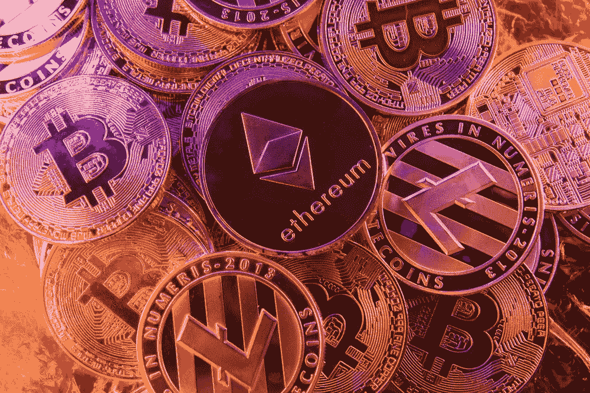

# 流动性的顽固风险

> 原文：<https://medium.com/hackernoon/the-stubborn-risk-of-liquidity-ad6787b2fd01>

几千年来，人类社会购买、销售和交易商品的方式的某些方面一直保持相对稳定，包括中央集权和象征化的概念。

自从国王开始铸造正面印有他们头像的硬币以来，具有可赎回价值的代币就一直存在。这些硬币——就像今天美联储流通的硬币——可以交易并具有价值，原因只有一个:因为中央集权的发行机构这么说。代币本身没有任何价值。它们只是衍生工具。然而我们每天都在使用它们。

> **为什么？因为我们可以用它们兑换一定数量的东西，这些东西对 T4 来说是有内在价值的。**

在交易所交易的股票和投资基金也是如此。交易所交易基金(ETF)实际上是一种象征，代表着标准普尔 500 指数中 500 只股票的所有权。

事实上，今天的人类根据古罗马时代的基本概念进行商品交易。

# 然而，一些人预测数字货币和分散账本的兴起将会改变这一切。

简而言之，这些人是错的。

虽然我们确实不再需要依赖银行或交易所来验证或进行交易——我们可以直接在点对点账户上与另一个人进行交易——但我们交易的物品——无论是比特币、股票还是铜币——都必须是流动的。肯定还有买家愿意接受我们的数字代币，以换取具有内在价值的商品，就像目前现金这种高流动性资产的情况一样。

此外，流动性的实现——例如，通过一个新的、去中心化的交易环境，或者去中心化的数字代币的产生——本身并不创造流动性。

# **市场就是市场，不管它的结构如何。**

换句话说，流动性问题不会因为我们开发了一种新技术而消失，这种新技术使交易变得更加容易和方便。事实上，其存在的必要性只会变得更加明显。买方和卖方必须*仍然*重视他们的对手所拥有的足以承担交易风险的东西。

现在，数字货币的去中心化机制以前所未有的方式创造了潜在的流动性，这是正确的。在过去，我们必须依赖银行和交易所来实现这种支持。今天，有了区块链，我们根本不需要依赖那些东西。

但是，为了让个人和公司以有效管理风险的方式明智地参与商业活动，流动性仍然必须存在。

> 这永远不会奇迹般地发生；这是资产聚集和可交易性的函数。

我现在就可以去创建我自己的交易所，试着向人们出售我的数字代币。但我的代币仍需要发挥传统衍生工具的功能。它们需要能够兑换成具有内在价值的东西。

是的，我仍然需要买家。

# 底线是:尽管我们的数字结构正在发生变化，但流动性的风险和重要性仍然存在。

最终，这是当今比特币狂热者必须考虑的事实。

分散账本上的数字对象不过是我们口袋里的代币。除非某些永恒的市场条件继续存在，否则它们将毫无用处。