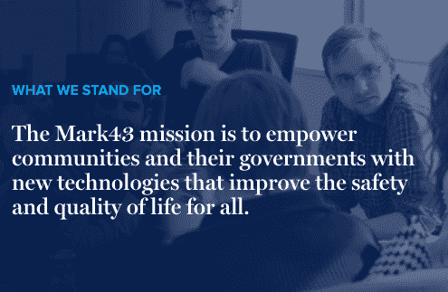
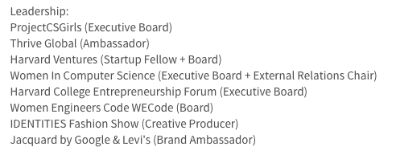
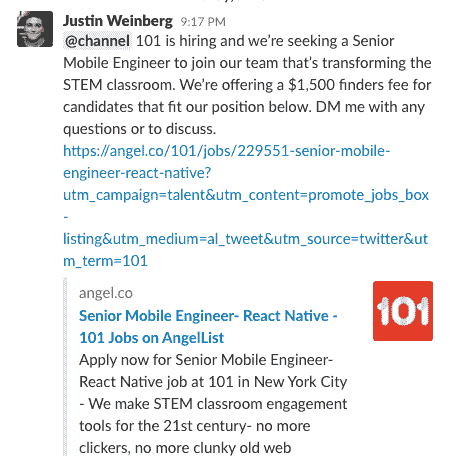
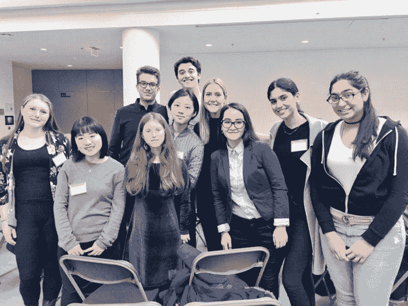

# 学生创始人指南，让你的第一个关键雇用

> 原文：<https://medium.com/hackernoon/the-student-founder-guide-to-making-your-first-key-hires-ce467aee06c1>

## 我们已经支持了超过 120 个团队参与选秀活动。随着这些创业公司从大学生态系统中脱离出来，开始集体雇佣数百名员工，我们已经看到最初的几名员工有多么重要。下面，我们收集了 RDV 创始人的最佳实践，以帮助你在招聘过程中游刃有余。

**从你的愿景和使命开始。与来自亚马逊或[谷歌](https://hackernoon.com/tagged/google)等公司的高薪、丰厚的福利以及每年秋季来到校园的招聘大军竞争，似乎令人望而生畏。但是作为一家初创公司，你有一个巨大的优势，任何大公司都无法与之抗衡:新员工有能力产生更大的影响。如果你能找到与你公司的使命产生共鸣的人才，你就能更好地吸引和留住员工。事实上，最近的一项研究表明，大约三分之二的员工更关心组织的使命，而不是组织能给他们多少报酬。作为一名创始人，你能够将导师、团队成员和投资者团结在你的使命周围。在招募和壮大你的团队时也是如此。确定在网上招聘和面对面交流中传达你的愿景的最佳方式。确保你的整个团队与任何潜在的雇员一致分享这种叙述。**

RDV company Mark43’s mission statement

**评估创始团队专业知识的空白，并雇佣一组补充技能来弥补差距。**

从评估你和你的联合创始人花费大部分时间的领域开始。列出你的每项能力，以及新项目和优先事项。确定这些计划所需的额外技能和资格。会见具备你所需要的大部分能力的候选人，并准备好填补你所能填补的空白。

如果你正在招聘一个人来补充你的技能(例如，一个营销大师来配合你的技术能力)，你可能不是这个人才的最佳人选。利用你的导师和顾问网络推荐候选人，并帮助完成最终筛选。

**寻找具有企业家精神和责任感的人。**

对于早期创业来说，最容易被忽视的技能是亲自动手和承担风险的能力。那些在校期间从事过兼职项目或全职工作、创办或领导过新组织、或白手起家的人，很可能拥有更多这种 DNA。此外，与校园创业团队或创业社区有关联的候选人很可能属于这一类。确保候选人通过学术、职业道德或爱好表现出承诺。了解他们为什么有兴趣加入你的创业公司，为什么他们相信你的使命，他们如何看待自己对你公司成功的贡献，以及他们如何看待公司在未来 4-5 年的发展。确定他们的职业抱负和个人目标。找出他们的动机。

An example of some of the clubs and organizations that may demonstrate a student’s commitment to and involvement with entrepreneurship on and off campus

利用你的人际网络。无论你是即将毕业还是刚刚获得学位，你的大学网络都是迄今为止为公司寻找顶尖候选人的最大网络。RDV 不断壮大的学生创业者和风险研究员网络遍布 22 所大学，为浏览校园创业场景提供了巨大的资源。每个 RDV 创业研究员和创始人都与这些校园里的重要组织和俱乐部有联系，他们的同龄人和朋友会很乐意加入像你们这样快速增长的初创公司。他们可以推荐候选人，通过他们的渠道分享机会，并让你参加创业招聘会和活动，以帮助你建立自己的企业。他们还可以帮助你组织活动，结识校园里的顶尖工程师。

**去你的观众所在的地方。**画出 10-20 个你知道你的理想候选人会去的地方。这可以是在线论坛，比如脸书的[黑客马拉松黑客小组](https://www.facebook.com/groups/hackathonhackers/)，你所在的各种 Slack 团队，或者亲自参加行业会议。此外，建立一份未来几个月在校园举行的所有[招聘会的清单，尤其是在你团队的母校，在那里你认识可以帮你介绍最佳候选人的人。](/general-catalyst-amplified/how-3-startups-took-over-nyc-with-out-of-home-marketing-25405c06334)

RDV Founder Justin Weinberg posting a job description in the RDV Slack Team

**多样性是关键。**数据一再表明，更加多元化的[公司财务表现更佳。](https://www.mckinsey.com/business-functions/organization/our-insights/why-diversity-matters)更多元化的团队带来了新的视角，提高了员工满意度和保留率，更具创造力和生产力。在招聘第一批团队成员时，多元化应该是重中之重，因为他们将决定你的团队今后的发展方向。开始与各个校区的主要多元化和包容性团体合作，参与各种计划和活动。首先，我们来看看[我们编制的开源清单。](https://github.com/roughdraftvc/resources)

Mentor lunch at Harvard’s Women’s Coding Conference, WECode

关于雇佣你的第一批团队成员作为学生创始人，我们想听听你的其他建议。如果你是一名希望将自己的初创公司、公司或项目推向新高度的学生，可以给我们写信，让我们一起探索一下可以构建什么样的公司。

有关[Draft Ventures](http://roughdraft.vc)的更多信息，请访问我们的[网站](http://roughdraft.vc)或[在 twitter 上关注我们](https://twitter.com/roughdraftvc/)！