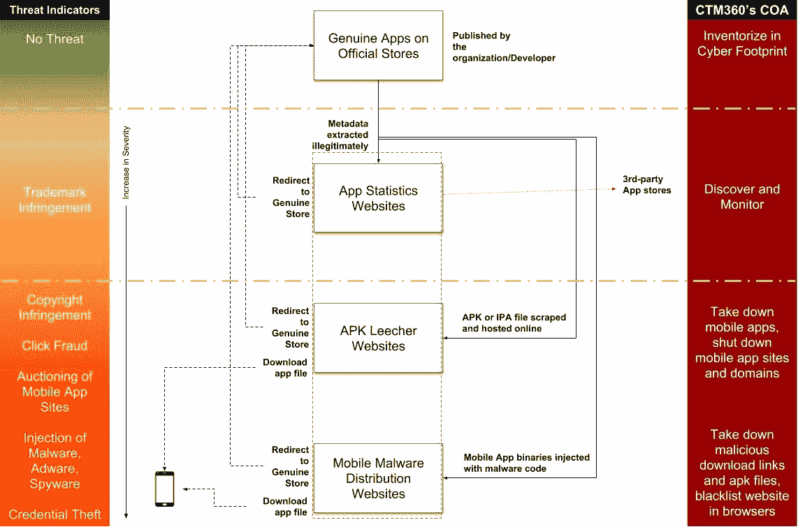

# 移动应用欺诈和威胁的激增

> 原文：<https://medium.com/hackernoon/the-surge-in-mobile-app-fraud-threat-landscape-9e0205805c12>

移动应用程序是任何组织在线存在不可或缺的一部分，但它们也是网络犯罪分子容易攻击的目标。他们利用那些对其网络资产知之甚少的组织，通过可疑/恶意的移动应用程序来锁定其用户和客户，这些应用程序正在第三方应用程序商店上积极发布。并非所有发布在第三方应用商店的合法品牌的移动应用都一定是恶意的/重新包装的。网络犯罪分子还可以在植入广告或隶属于其他各种点击付费网站的可疑第三方应用商店上进行点击欺诈，误导用户。他们经常瞄准拥有庞大用户群的品牌，最终目的是收集或窃取敏感信息。

可疑移动应用程序事件的数量稳步增长。CTM360 的检测系统可以识别所有在官方应用商店之外托管的应用，如 Google Play、iTunes、BlackBerry World 等。在过去的 12 个月中，仅可疑移动应用程序就被检测到 15，000 多起事件，与医疗保健、航空公司、企业集团等其他行业相比，银行和金融行业最容易成为攻击目标。

图:银行、金融与其他行业“可疑手机应用事件”对比数据

此外，在每天发布合法品牌移动应用的商店中发现了 1000 多个可疑的第三方应用。在此类第三方商店发布的移动应用方面，可以观察到稳步上升的趋势，我们相信这一趋势将在未来几年继续增长。

**威胁景观**

CTM360 根据相关威胁指标、严重性和所需的后续行动将移动应用欺诈分为不同级别。(见下图)

组织在官方应用商店上发布的移动应用不会构成威胁，除非它们以不同的组织/开发人员名称发布。CTM360 确保在其移动应用网络足迹下为组织盘点正版移动应用。

寻求广告收入的个人也非法从官方应用商店提取元数据，这些商店发布与组织的应用使用和统计数据相关的信息。此类统计网站对组织构成的风险较低，因为它们没有从商店下载的实际应用程序文件，而是包含重定向回官方商店的链接。许多此类网站已被识别，建议监控此类网站的潜在欺诈活动。

网络犯罪分子还窃取官方移动应用商店(主要是 android Google Play)，从应用商店获取应用文件和元数据，以托管他们自己版本的移动应用网站。此类 APK 吸血鬼网站对组织构成高度威胁，因为组织的应用程序用户很容易从这类商店下载应用程序。在某些情况下，网络犯罪分子确实会在此类 APK 吸血鬼网站中嵌入广告/附属关系，从而实施点击欺诈。

网络犯罪分子通常根据收到的流量拍卖这些网站。建议采取的行动是从这些 APK 水蛭网站下载移动应用程序，在某些情况下，最终关闭整个 APK 水蛭网站域名。

网络犯罪分子针对目标用户使用的一种更具创造性的技术是重新打包移动应用程序，即通过插入或删除文件来更改/修改正版移动应用程序的 APK 文件。许多恶意软件分发网站已被发现和分析，揭示了各种 APK 文件从这些网站下载被重新包装与恶意软件，广告软件和间谍软件。立即关闭恶意下载链接并将此类恶意软件分发网站列入黑名单将阻止未来的活动，保护用户和组织的利益。

**结论**

而针对移动应用行业的欺诈正在上升；网络犯罪分子正在发现新的技术来引诱用户并延续这种欺诈行为。当用户最终使用这些第三方网站时，组织也会受到间接影响；点击弹出广告或安装恶意版本的移动应用程序；从而影响他们的品牌声誉。

积极地关闭它们可以阻止网络犯罪分子重新包装应用程序并将应用程序发布在可疑的第三方网站上，这反过来将减少移动应用程序行业的欺诈行为。组织还需要让最终用户意识到不要从第三方应用商店下载，并始终将正版应用商店作为他们的唯一选择。用户从任何商店下载新应用程序时都必须小心，确保验证发布者，并密切关注每个应用程序请求的权限。