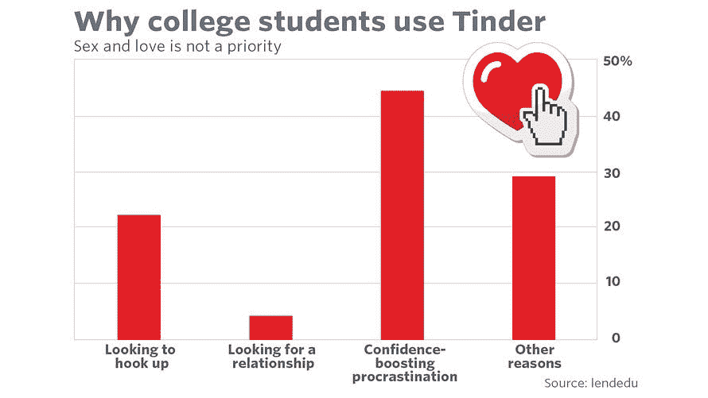
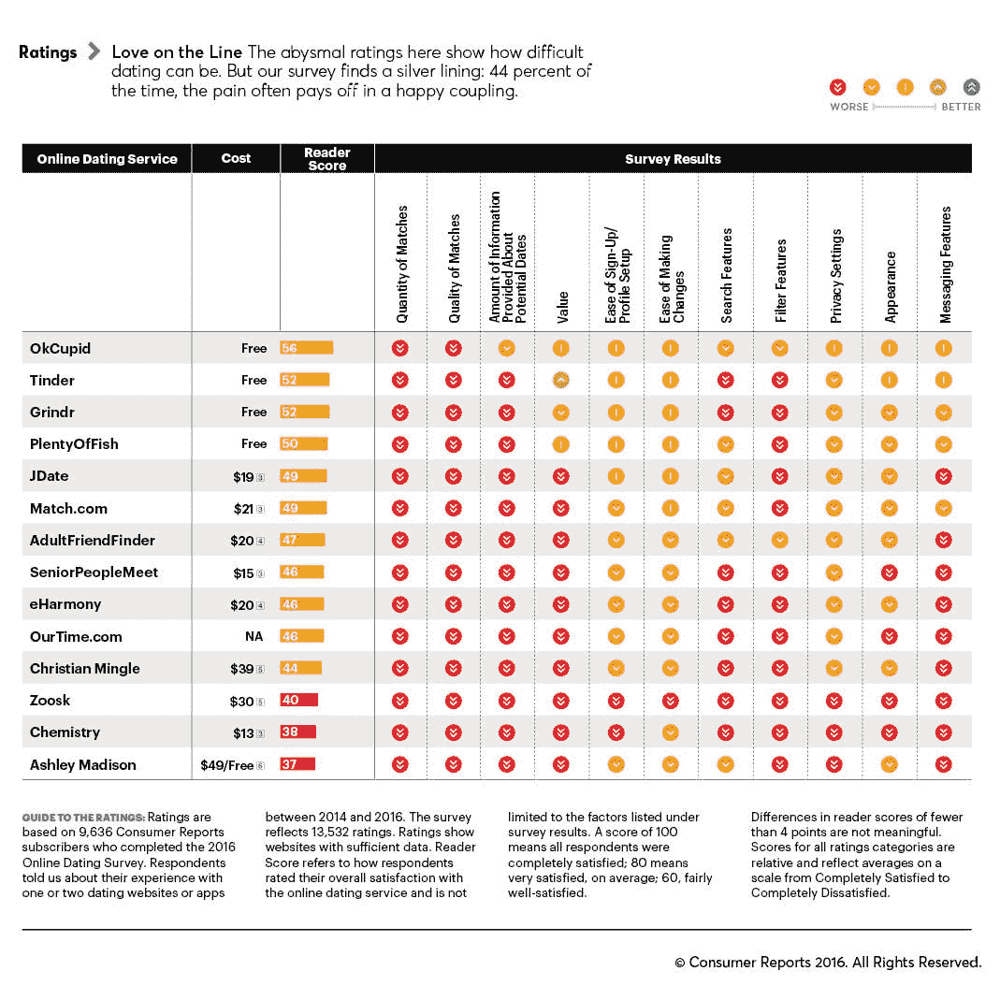

# 启动了一千个应用的滑动

> 原文：<https://medium.com/hackernoon/the-swipe-that-launched-a-thousand-apps-3c614a9bbb8e>

Tinder 于 2012 年首次为 iPhone 5 推出，并首次将单身人士的照片放在游戏化的“购物界面”中。

鉴于当时 iPhone 屏幕只有 [**4 英寸**](https://en.wikipedia.org/wiki/IPhone_5) ，Tinder 的这种极其简单的“照片滑动”设计非常有意义。这个过程也非常简单，让人们在不到 30 秒的时间内获得多巴胺:

> 第一步:通过脸书登录，快速创建基于照片的个人资料
> 
> 第二步:通过非常有限的标准(性别，地点，也许是共同的朋友)来匹配约会对象
> 
> 第三步:提供过多可选择的方案来提升自我和修复多巴胺

你猜怎么着？**这是一个巨大的成功。**

下载量超过 1 亿次后，Tinder 凭借自己的力量将网上约会带入主流，摆脱了整个行业的负面名声。约会应用现在很酷，是日常生活的一部分。

> 以前是“如果”你在做网恋，现在是“你目前在用什么”交友 app？

# 模仿是最真诚的奉承。

在 Tinder 爆发后，一堆其他约会应用程序也试图挤进来，如 Hinge、Coffee Meets Bagel、Happn、Bumble 和其他一千个应用程序。

但有趣的是，尽管许多应用声称有[微小的差异](https://www-digitaltrends-com.cdn.ampproject.org/c/s/www.digitaltrends.com/social-media/tinder-most-popular-dating-app/amp/)(即“通过朋友见面”或“女士选择”)——它们真的是这样吗？

# 自 2012 年的 Tinder 以来，今天的约会应用的基本公式没有太大变化。

> 第一步:通过脸书登录，快速创建基于照片的个人资料
> 
> 第二步:通过非常有限的标准(性别，地点，也许是共同的朋友)来匹配约会对象
> 
> 第三步:提供过多可选择的方案来提升自我和修复多巴胺

压倒性的焦点是外观、数量和便利性，而不是质量和兼容性。

# 结果显示这对网上约会者不起作用。

根据皮尤研究中心(Pew Research)的调查，整整三分之一使用过网上约会的人实际上从未和他们在这些网站上认识的人约会过。真的吗？

鉴于最近的一项调查询问千禧一代“你为什么使用 Tinder”，以上可能是有道理的。令人吃惊的是，44.44%的人说他们用它来“增强自信拖延症”。

此外，皮尤报告中另一个令人震惊的数据是，在美国，网上约会只占所有长期关系的极小的 5%。

# 而且他们也不开心。

当[消费者报告](https://www.consumerreports.org/dating-relationships/online-dating-guide-match-me-if-you-can/)在 2016 年调查 11.5 万订户时，结果显示**在线约会网站获得了《消费者报告》有史以来最低的服务满意度评分。**

# 事情是这样的:

是的，Tinder 走在了时代的前面，当它在 2012 年首次推出时，它彻底改变了移动约会游戏。事实上，它非常受欢迎，以至于启发了整整一代约会应用程序，这些应用程序同样围绕外观、容量和便利性进行设计。虽然这些刷卡应用程序非常适合勾搭和其他短期类型的关系，但很明显它们不适合长期关系。这是为什么呢？

> 对不起，是你，不是我。

哈佛商学院的一篇文章建议在网上约会时:

> 人是体验品，不是搜索品

这意味着，尽管如今在 Tinder 风格的“购物界面”应用上搜索单身人士非常方便——人不像清洁剂、狗粮或维生素——但这些产品可以在客观、有形的属性中进行“购买”前评估。

人是“体验品”——他们需要亲身体验，极其复杂，因此很难预先评估。

# 所以我们决定为网上约会建立一个人性化的层面。

遇见 [**M8**](https://meetm8.com/) 。

> **首先，它不是一款约会应用。**

就是我们所说的以人为动力的关系撮合平台。

我们建立 M8 的简单前提是，最好的匹配来自最了解你的人。

在 M8，我们招募并奖励你的朋友成为你的“虚拟僚机”，他们通过书面个人背书为你担保，然后将你介绍给他们朋友网络中符合条件的单身人士。

我们相信，来自现实生活中朋友的认可和介绍为我们的平台提供了重要的人文层面，让您和您的伴侣更好地了解潜在的兼容性，以及建立共同基础的“热情介绍”。你的朋友可以比你更好地吹嘘你，这也没有什么坏处。

最终结果？一个实际上做它应该做的事情的应用程序。

也是免费入门！报名成为[约会者](https://medium.meetm8.com/how-does-dater-work-on-m8-40e40747a151)或[媒人](https://medium.meetm8.com/how-does-matchmaker-work-on-m8-12990f8ae511)今天在:[https://meetm8.com/](https://meetm8.com/)

[**这里下载 M8 IOS app**](https://m8.app.link/24bhCzcbwQ)**。**

*PS——确保给这篇文章* ***50 次鼓掌*** *(只要按住鼓掌键)如果你喜欢这篇文章并想看更多，请关注我们的博客！*