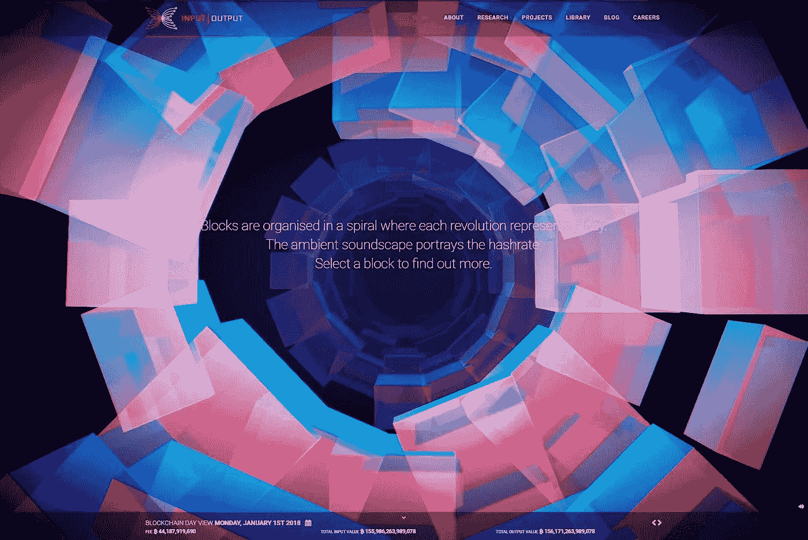

# 区块链的交响乐会让你着迷

> 原文：<https://medium.com/hackernoon/the-symphony-of-blockchains-will-mesmerize-you-abe594c49a84>

Credit: IOHK

告诉他们你眼中的泪水是因为目睹了比特币作为艺术品的美丽，而不是因为 10K 股市的下跌让你蜷缩在角落里哭泣。

[区块链交响曲](https://iohk.io/)是一个令人着迷的现场 3D 可视化和音频体验，不仅华丽，而且信息量惊人。卡达诺的创作者 IOHK 和数字艺术工作室 Kuva 共同努力，创造了一些你只要看到就会相信的东西。

邀请 [IOHK.io](https://iohk.io/) 网站的用户通过以图像、文本和音乐为特色的互动艺术来探索比特币的概念。比特币块以一个按时间顺序排列的漏斗表示，当相互作用时，它会移动和扩展。每个区块点击后，打开，引出舒缓的音调和详细的信息。

根据 IOHK 首席执行官 Charles Hoskinson 的说法:

> *IOHK 致力于教育和设计，这种迷人而复杂的数据可视化是两者的完美结合。它既漂亮又实用，我们希望它能让全新的观众真正理解区块链。*

为了创作这件作品，设计师们研究了自然界中的晶体和密码学中的[默克尔树](https://en.wikipedia.org/wiki/Merkle_tree)来寻找灵感。一旦开发人员决定了一个基本结构，他们就构建了一个迷人的区块链交响乐，作为一种教育工具，可以说是一件活生生的艺术品。

Kuva 的创意合伙人 Mark Lundin 说:

> *最棒的是，这只是开始，我们将继续与 IOHK 合作，推出更多区块链视觉效果，捕捉这一复杂技术的独特本质。*

区块链可能是科技界最具变革性和颠覆性的力量之一，但众所周知，这是一个很难理解的概念。

这个项目让理解比特币变得容易了一点，事实上，它足够漂亮，可以在面前沉思，不会有什么坏处。现在深呼吸。

*本故事由* [*特里斯坦格林*](https://thenextweb.com/author/tristangreen/) *撰写，最初发表于* [*The Next Web。*](https://thenextweb.com/distract/2018/01/17/bitcoin-as-art-this-breath-taking-visualization-might-distract-you-from-the-dip/)